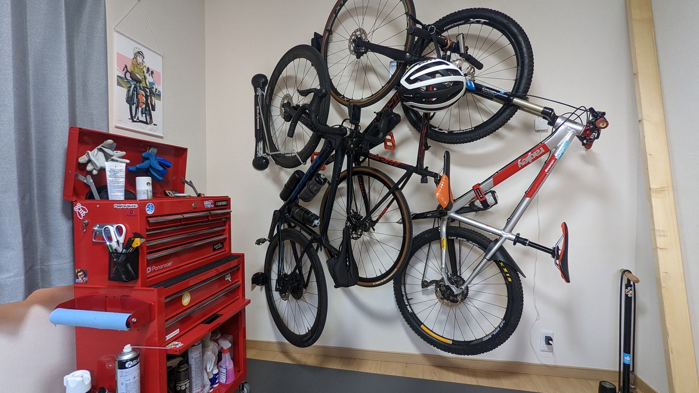
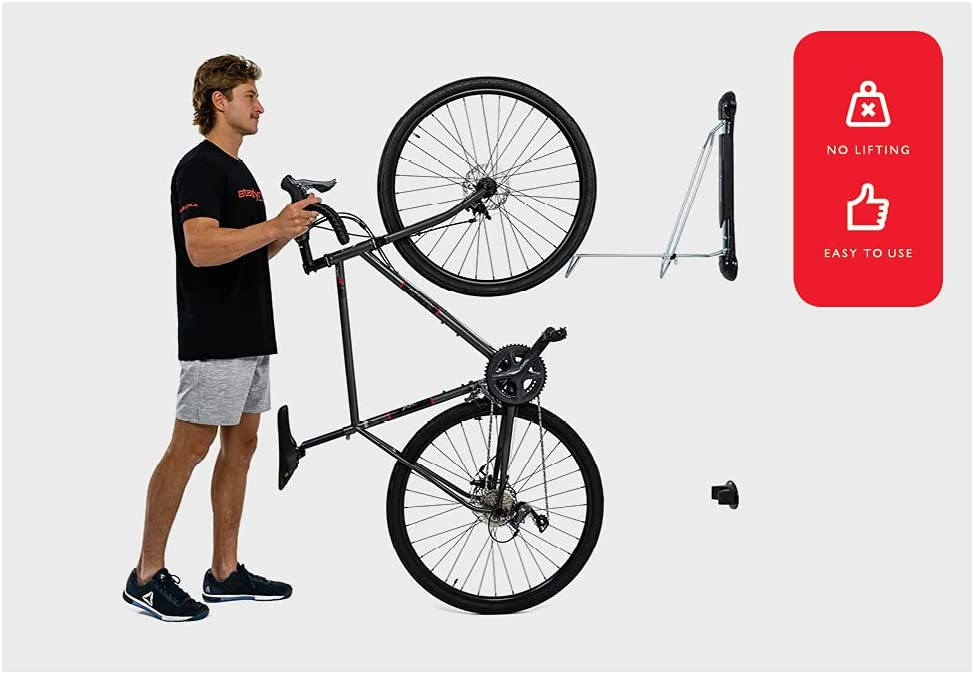
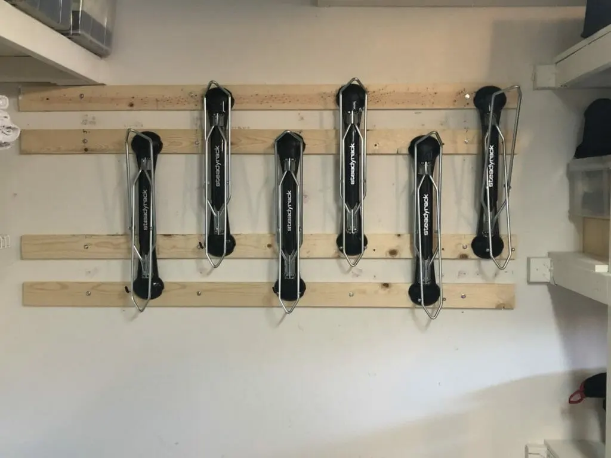
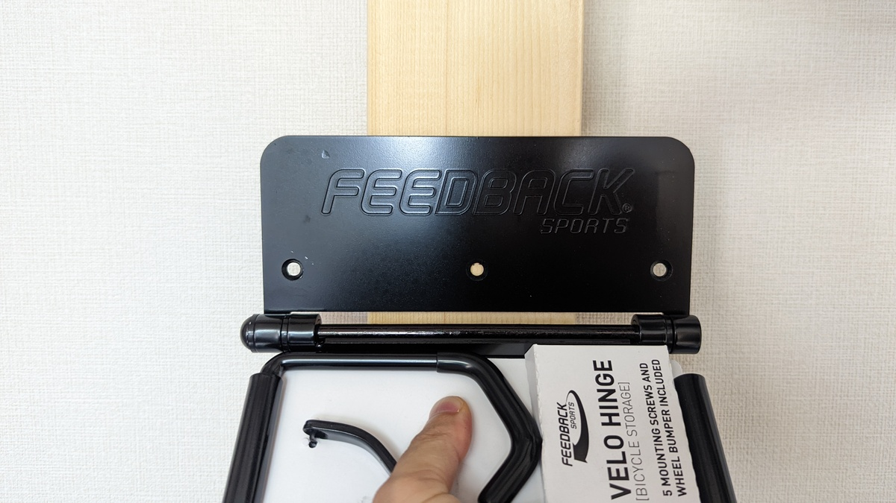
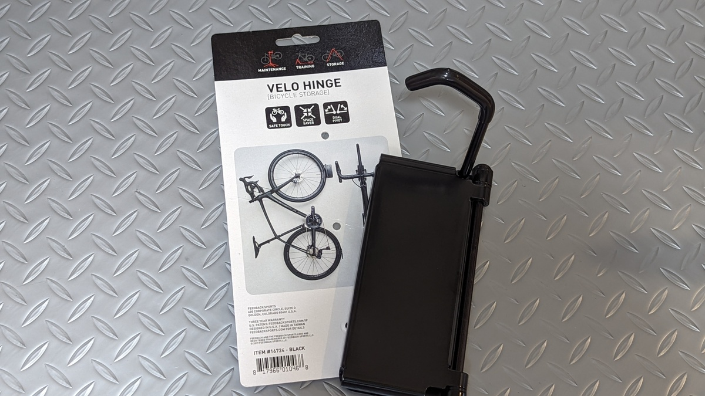
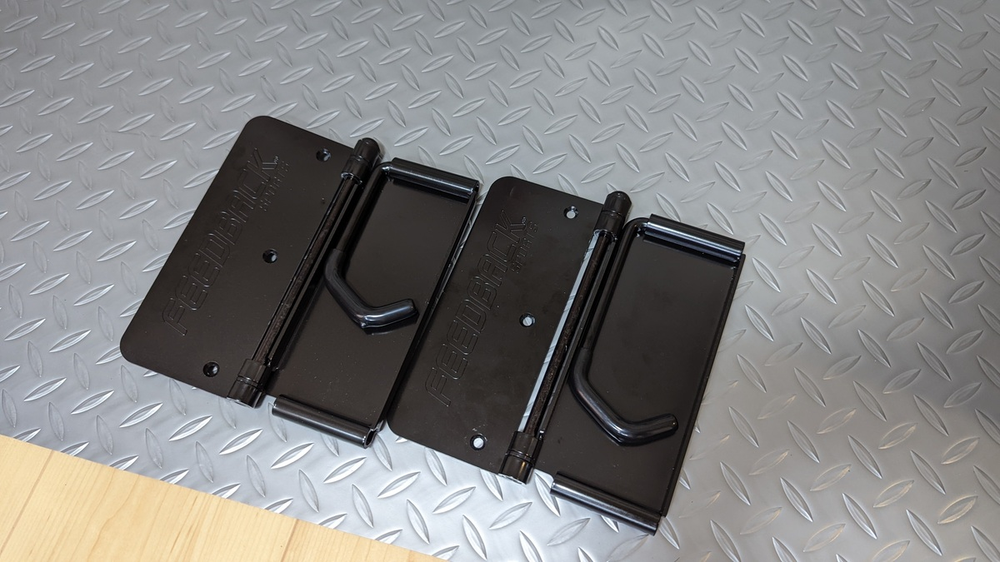

戸建て購入・転居に伴い、自転車の保管戦略を見直す必要が出てきた。

当初は、前の部屋から持ち出した2x4材に、[ミノウラの2x4専用ハンガー](https://amzn.to/3OJmNgO)を使って保管していたのだが、ハンガーの幅が狭く、420mmの微フレアハンドルでは壁に干渉するという課題が発生していた。

使える面積も広くなり、これまでの横向き壁掛けラックは上に配置した自転車の取り出しやすさに難があったため、縦置きラックへの変更を決意。

あらためて、最新の縦置きラック事情を調査してDIYすることにした。

## 計画編

Z軸を用いた横置き保管に比べ、縦置き保管は空間の利用効率が悪い。

取り出し部の空間を考慮しなければならない他、ハンドル幅分の横スペースの確保が必要になるためだ。

それに加え重要なのは**ルンバビリティの確保**だ。[ルンバ](https://amzn.to/3a947rS)を使う我が家では、全ての破損可能性のある家財とコードは浮かせるか保護しなくてはならない。

しかし、**今日の縦置き事情では、左右にスイングするバイクハンガーを使う**ことで、この2つの問題を共に解決できることがわかった。

今回利用するのは、[Feedback sportsのVelo hinge](https://amzn.to/3ybW9pS)と、[SteadyRack](https://amzn.to/3bJFGl4)だ。共にスイングして壁に寄せるように保管できる。

<LinkBox url="https://www.amazon.co.jp/dp/B00H96DA00/" isAmazonLink />

<LinkBox url="https://www.amazon.co.jp/dp/B004N9BUEY/" isAmazonLink />

加えて考える必要があるのは、壁掛けにする3台をどのように保管し、どのハンガーを使うか。

[SteadyRack](https://amzn.to/3bJFGl4)は[Velo hinge](https://amzn.to/3ybW9pS)の2倍以上のコストがする。その代わり、リムではなくタイヤを引っ掛ける方式なので、**引っ掛けやすいしホイールへの負担もない。**

手持ちの4台のうち、1台はローラー上が定位置、MTB・街乗りCX・グラベルロード（ディープリム）が縦置きになるとすると、**[ZIPP303S](https://paypaymall.yahoo.co.jp/store/qbei/item/pc-810594/)を履いているグラベルロードだけは[SteadyRack](https://amzn.to/3bJFGl4)を利用したい。**

持ち上げるのが大変なMTBにも[SteadyRack](https://amzn.to/3bJFGl4)を奢りたいところだが、いかんせん大きくて高いので、今回はコストを重視。

### 1x4材を使った強化骨組み

次に考えるのは壁への取り付け方法。

一般的な日本家屋の石膏ボードは自転車を支えることはできないため、[LABRICO のアジャスター](https://amzn.to/32LE9Et)を使って2x4材と組み合わせるか、下地を探して直接ネジ留めする方法のどちらかとなる。

<LinkBox isAmazonLink url="https://www.amazon.co.jp/dp/B01HTRVZ0A/" />

この点は、SteadyRack輸入代理店で、「石膏ボードに複数台のラックを取り付ける方法」が解説されており非常に参考になった。

<LinkBox url="https://adventure-aid.store/pages/steadyrack-plasterboard" />

画像のように、横向きの骨組みを作ることで、最小幅でのラック取り付けができる。

ただ、自分の場合はVelo hingeと組み合わせる都合上、この案は採用できず。**Velo hingeを使う場合は1x4の横幅とマッチしないため、何枚も1x4を使う必要性があった。**

そのため、もう1つの手段である**間柱に合わせて設置する案を採用**。

### 下地に直接ネジ留めする

間柱を活用することで、**間隔が固定される代わりに木材を計測・切断・購入しなくていいというメリットを得られる。**

賃貸では選択できない手段だが、持ち家のメリットを存分に活かさせてもらった。

下地の場所を事前にチェックする必要があるので、ホームセンターで下地チェッカーを購入。針を刺して下地の有無を事前に確認してからネジ留めする。

<LinkBox url="https://www.amazon.co.jp/dp/B07X5L138Y/" isAmazonLink />

## Feedbak Velo Hinge & Long Hook

<PositiveBox>

- 比較的安価
- シンプルな構造

</PositiveBox>

<NegativeBox>

- 幅広タイヤ・ディープリムに追加部品が必要

</NegativeBox>

縦置き用のバイクフックにヒンジ機構を持たせた、その名の通りのバイクフック。

この機構により、**バイクをかけた後で横に倒し、占有スペースを一時的に減らすことができる。**

<LinkBox url="https://www.amazon.co.jp/dp/B00H96DA00/" isAmazonLink />

ヒンジは片側にしか傾けることができないが、六角レンチとプラハンさえあれば、**簡単にヒンジの向きを変更可能。**部屋の都合に合わせて収納方向を設定できる。

公式の作業解説動画がある点も非常に助かる。

<iframe
  width="560"
  height="315"
  src="https://www.youtube.com/embed/NMnC2VwlYCs"
  title="YouTube video player"
  frameborder="0"
  allow="accelerometer; autoplay; clipboard-write; encrypted-media; gyroscope; picture-in-picture"
  allowfullscreen
></iframe>

### Long Hook

今回は、[Velo hinge](https://amzn.to/3ybW9pS)本体に加え、このLong hookを利用した。

実は標準のvelo hingeは2.4インチまでのタイヤしか装着できず、タイヤを含めたリムハイトは74mm以内である必要がある。

実際に試したところ、ワイドリムに2.3インチのMTBタイヤは既に装着が難しい。MTBではほぼ必須だ。

<LinkBox
  url="https://paypaymall.yahoo.co.jp/store/qbei/item/pi-921319/"
  linkUrl="http://ck.jp.ap.valuecommerce.com/servlet/referral?sid=3171302&pid=887657037&vc_url=https%3A%2F%2Fpaypaymall.yahoo.co.jp%2Fstore%2Fqbei%2Fitem%2Fpi-921319%2F"
/>

こちらも、取り付けの案内動画が出ている

<iframe
  width="560"
  height="315"
  src="https://www.youtube.com/embed/1n1toj0710U"
  title="YouTube video player"
  frameborder="0"
  allow="accelerometer; autoplay; clipboard-write; encrypted-media; gyroscope; picture-in-picture"
  allowfullscreen
></iframe>

### Velo Hinge使用感

比較的、取り付けが簡単だった。この手のフック全体に言えることだが、**付属のネジが電動工具に耐えきれない**ので、別途ホームセンターで硬いネジを購入する必要がある点に注意。

構造もシンプルなので、調整や故障対応が簡単そうなのも良い。

## SteadyRack

<PositiveBox>

- 他の追随を許さない収納しやすさ
- 壁を汚さない後輪置き場

</PositiveBox>

<NegativeBox>

- タイヤ幅ごとの製品ラインナップ
- 高価

</NegativeBox>

[SteadyRack](https://amzn.to/3bJFGl4)は届いたときそのゴツさに圧倒された。Velo hingeはAmazonの最小箱に入るサイズ感だったのに対し、値段なりの複雑性がある構造。

### 取り付け

住宅建材はホームセンターの2x4材と違い、硬い木材を利用している。**下穴無しでの施工はほぼ不可能と思った方がよい。**

電動工具と、改めての適正ネジを購入するのは必須なので注意。ネジ径に応じた木工用ドリルもちゃんと購入しよう。

[Velo hinge](https://amzn.to/3ybW9pS)でもそうだが、下部のストッパー取り付けは重要だ。これがないと、自転車を傾けた際に後輪がどこまでも床を滑ってしまう。

### SteadyRack使用感

フックでと違い、収納時に**三次元的な動きを要求されないため、ラックに乗せる力がとても少なく済む。**

言葉では伝わりづらいが、Velo hingeに比べて収納の簡単さは圧倒的だ。

ホイールに一切負荷がかからない構造も素晴らしく、デリケートな強度のリムも問題なく収納できる。（ZIPP303Sが頑丈ではないという意味ではない、念のため）

値段なりの価値があり、お金を出せるのであれば全てこのラックに置き換えたいほどだ。

欠点としては、**対応するタイヤ幅毎に製品が異なり、アップグレードや部品交換で対応幅を変更できない点。**

太いものが細いものを兼ねるかもしれないが、見た目や複数台収納時の干渉は考慮する必要があるだろう。

<LinkBox url="https://www.amazon.co.jp/dp/B004N9BUEY/" isAmazonLink />

## まとめ

日々の出し入れを可能な限り楽なものにしたいのであれば、SteadyRackは十分に価格に見合った性能を提供してくれる。

ただ、個人宅では全ての自転車を毎日出し入れすることは無いというのが現実。適度にコストダウンしていくことで、総合的な満足度を上げられると思われる。
