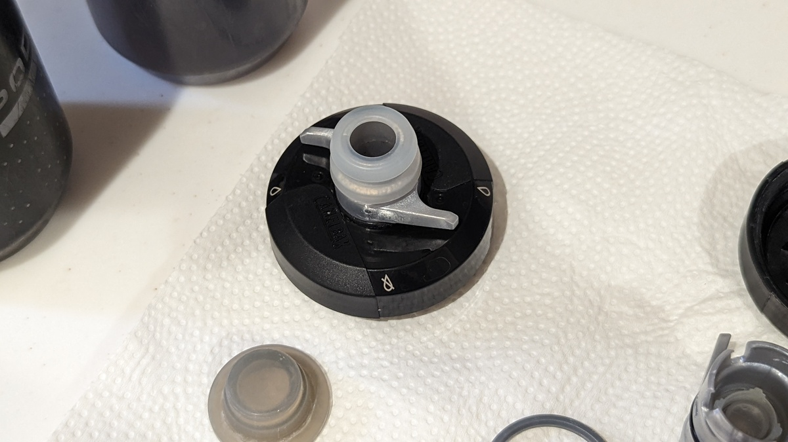

## Camelbak Podiumボトル

<Amzn asin="B07HGTKSXC" />

現行モデルにモデルチェンジされる前から愛用していた[Camelbak Podiumボトル](https://amzn.to/3zxAJ7d)。

優秀な保冷ボトルとして同社の[Podium Ice](https://amzn.to/3SnDAIo)が有名だが、ノーマルのボトルも非常に使いやすい。

その**特徴は、柔らかい本体と逆流防止弁を備えるキャップ。**うっかり中身が飛び出るということもなく、輪行時はキャップをロックできるのであらゆるシチュエーションで安心して使える点がメリット。ドライブ中にもよい。

保冷モデルも握りやすいことで有名だが、断熱素材のないノーマルボトルの絞りやすさはその上を行く。飲み物を吸い込む必要はないし、体に水をかけるときにも量を調節できて便利。

## キャップの分解清掃

このボトル、便利な反面、キャップ周りの構造は複雑になっている。

過去のモデルはここが一体型でカビやすかったが、現行モデルは分解して洗うことができ、漬け置き一択だった前モデルに比べ大幅に進化した。

日常では帽子型のキャップを外してゆすぐだけでも良いが、夏場にスポーツドリンクを入れたときなど、雑菌が繁殖しやすい場合。さらに細かく分解して掃除できる。

**キャップを外した後、内部のリングをはずすと、全パーツを分解できる。**

自分は、**ここまで分解した後に、食洗機の小物エリアを使ってボトル本体と合わせて一気に洗ってしまっている**。

### ボトルを洗うタイミング

カビた状態のボトルや水筒を使い続けると、どうにもお腹の緩い状態が続くので、思い当たる人はしっかりボトルを洗おう…

自分はボトルのメンテナンスが面倒なので、真水を入れて塩分はタブレットで補給することも多い。しかし、たまに**スポーツドリンクを飲むと水分吸収効率の良さを感じる**こともまた事実。

今年は特に暑いので、こうした洗いやすいボトルの特性をしっかり活かして、水分補給に適した飲み物を飲もう。

<Amzn asin="B07HGTKSXC" />

### 詳細手順

詳細手順は、代理店であるライトウェイのウェブサイトでも紹介されている。

銀色のバルブパーツをもう1段階細かく分解できるが、デリケートなシリコンバルブを壊す可能性があるので推奨はされていない。

<LinkCard url="https://www.riteway-jp.com/itemblog/%E3%83%96%E3%83%A9%E3%83%B3%E3%83%89-23631/2019/05/_kamata" />

## 宣伝

8/13に行われるコミックマーケット100の1日目で、同人誌「サイクリング・デジタルトランスフォーメーション」を頒布予定。

<LinkCard url="https://www.gensobunya.net/c100/" />

デジタル機器でサイクリングライフを変革！アクションカメラ5機種のレビューと、マウント8種類を撮影イメージと共に徹底解説！

後半は、サイクルコンピューター・スマートウォッチの使いこなし・WEBサービスの連携設定をして、自分のコンディションを徹底的に可視化して、自分だけのデジタルトレーナー化する現代のサイクリングログ活用について。ライド動画とライドログはもちろん、ライフログも合わせてあなたもサイクリングをDX！\
**本文70ページ**。

会場価格1000円

[メロンブックスさんでも委託販売](https://www.melonbooks.co.jp/detail/detail.php?product_id=1579831)、[Kindle](https://amzn.to/3Q9oepq)で8/14より電子版を配信予定。

<LinkCard url="https://www.melonbooks.co.jp/detail/detail.php?product_id=1579831" />

<LinkCard url="https://www.amazon.co.jp/dp/B0B8VVTTSJ" isAmazonLink />
