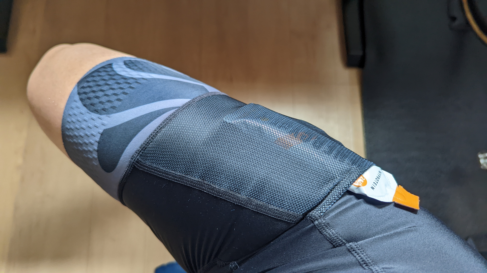
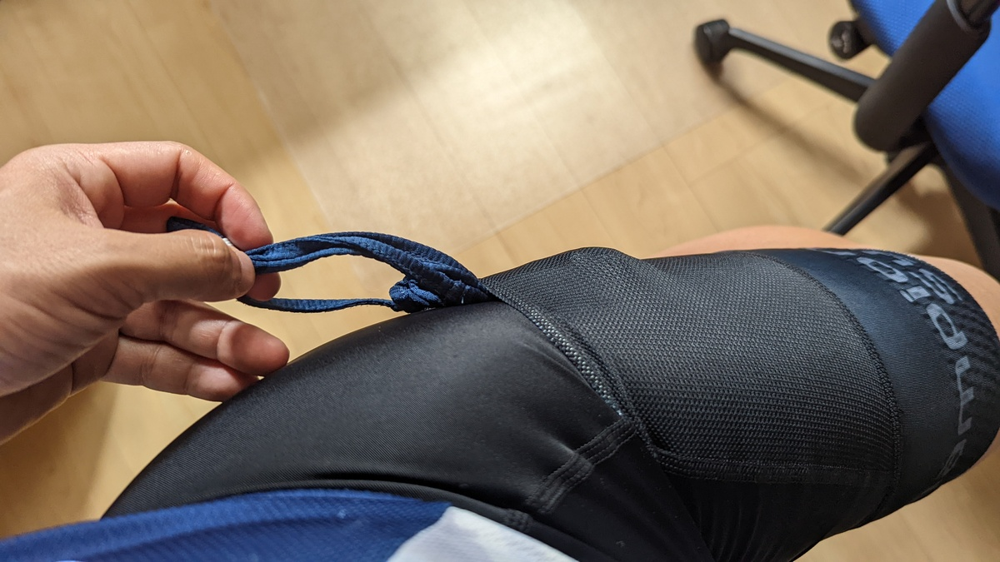

## グラベルライド文化の一端

荷物を多く持つ必要性のあるグラベルライド。ライド途中での補給は望むべくもない環境のため、自活するための補給食を多く持つ必要があった。

そんな背景から、バイクパッキング用具で荷物を積むよりも、もっとスマートな持ち方（もしくは、それに追加するため）生まれたのがカーゴビブショーツ。

**太腿のサイドや、バック部分にポケットが追加されており、小さい補給食**などを入れることができる

## ニセコグラベル

これを買おうと思ったきっかけ、ニセコグラベルへのエントリー。

<LinkBox url="https://skmzlog.com/220515-niseko-gravel/" />

知り合いのすくみずさんが春のイベントに急遽参加しており、その前の2021年秋の参加者ライドレポートを読んでも、全て楽しそうだったのでエントリーした。

**TCRをRevoltに買い換えようと決心したのもこの時**。

<LinkBox url="https://blog.gensobunya.net/post/2022/04/revolot_adv22_review/" />

当初はオールロードとして[30cのAGILIST](https://amzn.to/3PZKpyk)を履かせていたが、今は普段用の[GravelKing SS 38c](https://amzn.to/3oRbzvd)や、ニセコ用の[SK 43c](https://amzn.to/3QlIrb5)を購入して徐々に準備を進めているところ。

長距離グラベルで補給食を持っていくにあたり、自転車へのバッグ搭載は最小限に納めたかったので、白羽の矢を立てたのがカーゴビブショーツというわけだ。

## PERFORMANCEエンデュランス ビブショーツ

オーダージャージで有名なチャンピオンシステムだが、既製品もオンラインショップで注文できる。

<LinkBox url="https://champsys.shop/collections/mens-shorts-bibshorts/products/performance-endurance-bibshorts-unison-mens" />

比較候補として検討したのは、[Rapha](https://www.rapha.cc/jp/ja/shop/%E3%83%A1%E3%83%B3%E3%82%BA-%E3%82%B3%E3%82%A2-%E3%82%AB%E3%83%BC%E3%82%B4-%E3%83%93%E3%83%96%E3%82%B7%E3%83%A7%E3%83%BC%E3%83%84/product/CCB02XXDNW), [SAUCE](https://movement-cycle.com/collections/apparel/products/cargo-bib-shorts-bk-wh)だが、サイズ感を知っていることや在庫状況からチャンピオンシステムを選んだ。今は[ファンキアー Piana](https://store.shopping.yahoo.co.jp/worldcycle-wh/FKR-Q-PIANA-BK.html)も選択肢に入りそうだ。

### 装着感

PerformanceラインのチャンピオンシステムビブショーツはいつもロードライドやCXで使っているお馴染みのサイズ感。

ただ、サイドのポケットの伸縮性がビブそのものの生地に比べてしっかりしており、固めなのでやや締め付けを感じた。

ロードライドで使う際には、補給食もそうだがマスクを入れるにもポケットが便利だ。背中だと汗に濡れてすぐビチョビチョになってしまうが、ここだと使っていないうちに乾いてくれる。

### ロングレングスオプション

自分は短足なので、必要ないと思っていた…が、脚の長さに拘わらず、サイドが固くなるカーゴビブショーツではロングレングスオプションを追加した方がよさそうだ。

そもそも、公式でも太腿の太い人にお勧めされていたので、自分は常に追加するべきオプションだったのかもしれない…

> 裾のグリッパーの位置も膝の近くまで下がるため、圧迫感が軽減される傾向にあります。とくに太腿の大きいライダーは、快適性が向上します。

**オンラインショップでも受注制作なので、オプションは自由だ。**

## まとめ

<PositiveBox>

- いつものジャージと同じサイズ感。値段もまぁまぁ手頃

</PositiveBox>

<NegativeBox>

- ポケットのあるサイドだけ固い。ロングレングスオプションを入れよう

</NegativeBox>

## 宣伝

8/13に行われるコミックマーケット100の1日目で、同人誌「サイクリング・デジタルトランスフォーメーション」を頒布予定。

<LinkBox url="https://www.gensobunya.net/c100/" />

デジタル機器でサイクリングライフを変革！アクションカメラ5機種のレビューと、マウント8種類を撮影イメージと共に徹底解説！

後半は、サイクルコンピューター・スマートウォッチの使いこなし・WEBサービスの連携設定をして、自分のコンディションを徹底的に可視化して、自分だけのデジタルトレーナー化する現代のサイクリングログ活用について。ライド動画とライドログはもちろん、ライフログも合わせてあなたもサイクリングをDX！\
**本文70ページ**。

会場価格1000円

[メロンブックスさんでも委託販売](https://www.melonbooks.co.jp/detail/detail.php?product_id=1579831)、[Kindle](https://amzn.to/3Q9oepq)で8/14より電子版を配信予定。

<LinkBox url="https://www.melonbooks.co.jp/detail/detail.php?product_id=1579831" />

<LinkBox url="https://www.amazon.co.jp/dp/B0B8VVTTSJ" isAmazonLink />
