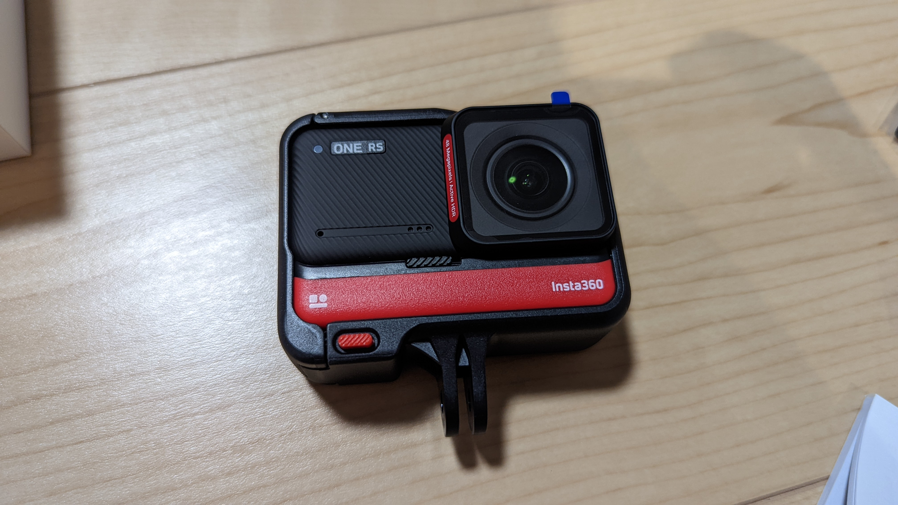
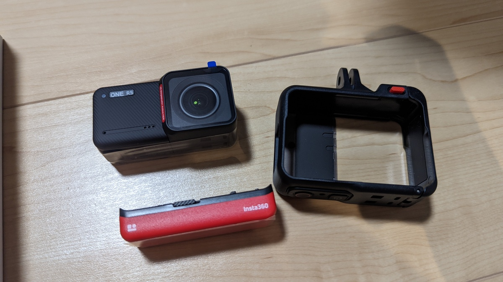
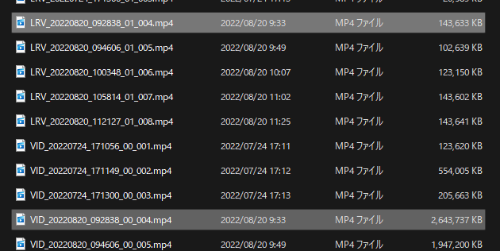
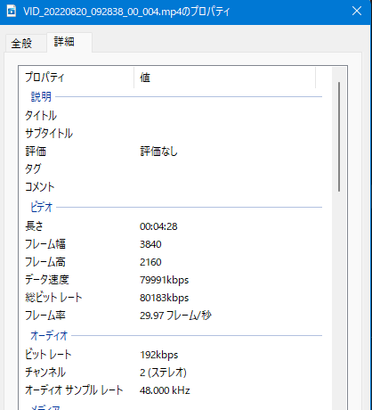
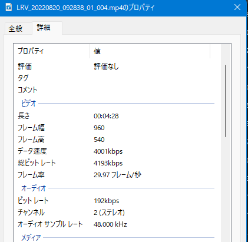

## Overview

360度カメラを主力に、最近勢力を伸ばしているアクションカメラブランドの[Insta360](https://amzn.to/3PDob43)。

そのラインナップのうちトラディショナルな形状をしたモデルの最新版が[Insta360 ONE RS](https://amzn.to/3whWXcx)だ。

4K撮影や1時間前後の撮影時間という**基本的なスペックは抑えつつ、カメラレンズがモジュール式になっており大型の1インチセンサーレンズや360度レンズに交換可能**というのが大きな特徴。

GoProでは、いわゆる「GoProマウント」への装着部分が折り畳み式となっているのに対し、Insta360 ONE RSではモジュールをまとめるハウジングに一体成型されている。

いい加減古くなってきたGoPro Hero8の後継にプライムデーて購入したものをようやく開封して実戦投入した。

Insta360のカメララインナップは豊富だが、マウンテンバイクやシクロクロスレースの動画が主となるため、GoProマウントに装着しつつ簡易防水という条件で今回はONE RSを選択した。

<Amzn asin="B083KC1V36" />

### Go2, X2などのモデルラインナップ

Insta360には、マグネットで色々なところにマウントできる[Insta360 Go2](https://amzn.to/3K8uGuA)や、360度カメラの[Insta360 X2](https://amzn.to/3K8uGuA)などのモデルがあり、それらでも面白いライド動画を撮ることができる。

こういったトラディショナルなアクションカメラ以外で撮影できる動画のサンプル画像や特性は、コミックマーケット100で頒布した[『サイクリング・デジタルトランスフォーメーション』](https://amzn.to/3K7Wijo)に詳しく記載している。

物理本は[メロンブックス](https://www.melonbooks.co.jp/detail/detail.php?product_id=1579831)での委託販売、電子版は[Kindle](https://amzn.to/3Q9oepq)で配信しているので、興味のある方はぜひ手に取って読んでいただければと思う。

<LinkCard url="https://www.melonbooks.co.jp/detail/detail.php?product_id=1579831" />

<LinkCard url="https://www.amazon.co.jp/dp/B0B8VVTTSJ" isAmazonLink />

## GoProとの違い

アクションカメラ代表選手であるGoProとの違いについては、同人誌で共著者のすくみずさんが書いたことの通りで、書かれていたことを追体験している。

一言で言うと、**ハードウェアについてはGoProが考え抜かれており、ソフトウェアに関してはInsta360の圧勝だ。**

サイズ感はInsta360のほうがひと回り大きく、**GoProマウント兼用のハウジングを付けるとHero8比でかなり大きく感じる。**

重さも、GoPro Hero8の126gに対して**ハウジング込みで実測161g**となっている。一応、重量が重くなったHero9以降とは同じレベルの重量ではある。

長時間撮影の際に予備バッテリーが必要になる点は2社とも変わらないが、GoProは（推奨されていないものの）互換バッテリーも販売されているので若干の有利がある。

本体非装着時に専用バッテリーチャージャーが必要になる点は共通だ。

### ボタン配置

両者とも電源ボタン・録画ボタンという2つの物理ボタンを備えている。

GoProのボタンが1面につき1つ（上部に撮影ボタン、側部に電源ボタン）となっているのに対し、Insta360 ONE RSは上部に両方のボタンを備えている。

端的に言うと、**操作ボタンが1面に集まっていると誤操作の原因になるのでInsta360は少し気を使う必要がある**。バイクマウントもボディマウントも、アクションカメラというものは録画ボタンを押すときにバック液晶をいちいち確認しないし、録画状態に移行したか確認できない場面も多い。

そういう時のために **「録画ボタンを押せば電源が入って録画を開始する」機能が実装されているのがお約束** ではあるが、肝心のボタンを間違ってしまってはどうしようもない。

GoProはさらにに念を入れて、電源ボタンはフラットで固くうっかり押さないようになっており、録画ボタンは飛び出している。こうした細かい点でまだまだInsta360はブラッシュアップの余地がある。

### 手振れ補正

これはサンプル動画を見比べると、明らかにGoProの方がよい

<iframe
  width="560"
  height="315"
  src="https://www.youtube.com/embed/O_RhS0oWeVU"
  title="YouTube video player"
  frameborder="0"
  allow="accelerometer; autoplay; clipboard-write; encrypted-media; gyroscope; picture-in-picture"
  allowfullscreen
></iframe>

<iframe
  width="560"
  height="315"
  src="https://www.youtube.com/embed/dk_-FuRMuxU"
  title="YouTube video player"
  frameborder="0"
  allow="accelerometer; autoplay; clipboard-write; encrypted-media; gyroscope; picture-in-picture"
  allowfullscreen
></iframe>

### 優秀なモバイルアプリ

Insta360のカメラ全般における**最大の長所がモバイルアプリの性能と機能。**

アクションカメラ界において、ハードウェア面では圧倒的な信頼と性能を誇る[GoProシリーズ](https://amzn.to/3CjVje5)だが、ソフトウェアはお粗末でモバイルアプリ・PCアプリ共に残念な出来と言わざるを得ない。

純正アプリのGoPro Quikは動画転送にとんでもない時間がかかり、編集もできるが動作は重く、レンダリング時に落ちたりフリーズするのは日常茶飯事。端的に言って酷かった。1分の動画を転送するのに5分待って、編集の1アクションごとに10秒以上は待つといった具合だ。

**Insta360のモバイルアプリはスマートフォンでのプレビュー・編集共にほぼ待ち時間なしで開始できる**。もちろん**編集もほぼ待ち時間なく作業可能**。BluetoothとWifiでカメラと同期する点はGoProと同一のはずなのだが、なぜこうも差が出るのか…

見たところ、Insta360のカメラは、オリジナルとは別にモバイル転送用のファイルを同時に生成するという動作をしているようだ。

SDカードの中を除くと、**同一の動画が二つのファイルになっており、片方はFullHDサイズの軽量版**になっている。これで転送量を落として、モバイルアプリの操作レスポンスを上げているようだ。

スマートフォンで編集・プレビューするモチベーションは、撮った動画をすぐSNSへ上げるような速報性にあるので、このような仕様でも問題はないと思われる。

ただ、**不思議なのは編集のレスポンス**。GoProもInsta360も、ローカルに持った動画ファイルに対して編集しているはずなのだが、なぜこうも作業レスポンスに差が出るのか…この辺りはInsta360のノウハウが効いているのだろうか。

#### AI編集

トリミングなどの編集を手動で行ってもよいが、Insta360アプリにはAI編集というトップシーンを自動的に認識して切り貼りしてくれる機能がある。

<blockquote class="twitter-tweet">
  

    insta360
    RSの転送と書き出しサクサクに感動してる。AI編集は切り出しがビミョーだけど{" "}
    <a href="https://t.co/pXorZUfy6A">pic.twitter.com/pXorZUfy6A</a>
  

  &mdash; ゲン@C100委託はメロンブックスとKindle (@gen_sobunya) <a href="https://twitter.com/gen_sobunya/status/1560898551198392327?ref_src=twsrc%5Etfw">August 20, 2022</a>
</blockquote>

自動という点は良いのだが、欠点が2つほどある。

1つ目は「処理に動画の時間と同等程度の時間が必要」という点。5分ちょっとの動画から切り出したのだが、処理に5分ほどかかった。

2つ目は、「ライド動画とトップシーン認識の相性が悪い」点。ツイートを見ての通り、自転車が止まったところや人の声がしているポイントを自動的に切り出しているのだが、前者はライド動画ではあまり面白くないことが多い。後者も必ず見せたい場面かというと打率低めだろう。

サイクリストは素直に手動カットを使った方がよさそうだ。

## まとめ

対比をすると、ハードウェアのGoProとソフトウェアのInsta360という構図になってしまうが、Insta360 ONE RSの撮影動画も決して酷いわけではなく、むしろ白飛びの少なさなどGoPro(Hero8)に勝っている部分もある。

定期的にセールで安くなっているので、折りを見て買ってみても後悔はしないだろう。特に、ハードウェアは慣れの要素があるが**ソフトウェアは録画後毎回行う編集作業の生産性に関わってくる**ので、こちらが優れている方が個人的にはありがたい。

<PositiveBox>

- モバイルアプリによるプレビュー・編集・書き出しが超高速

</PositiveBox>

<NegativeBox>

- ハウジング必須でサイズ・重量が大きい
- 手ブレの物理補正ではGoProに劣る

</NegativeBox>

<Amzn asin="B083KC1V36" />
