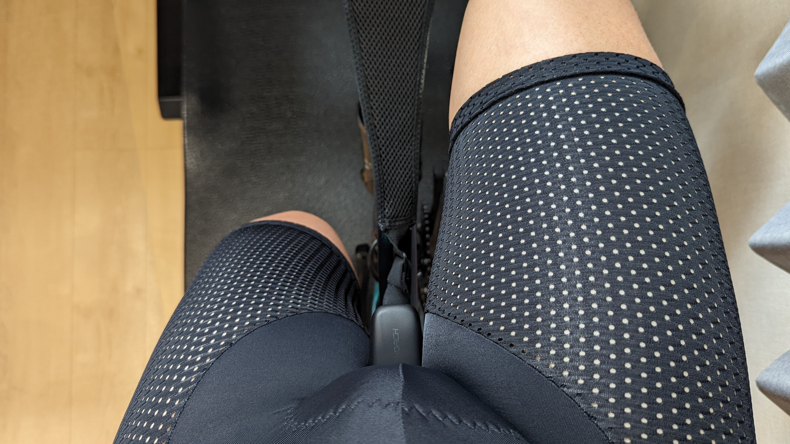
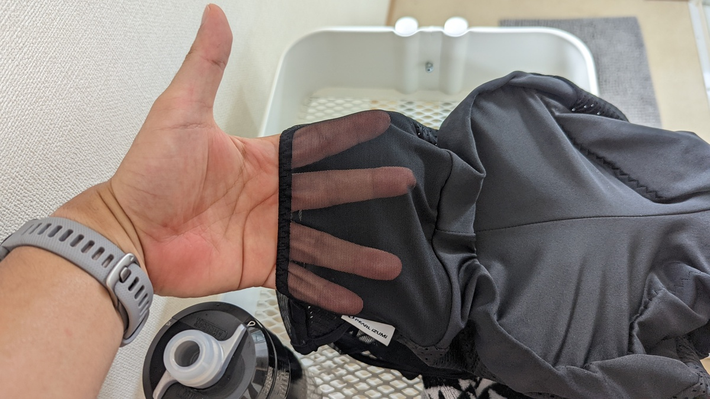

## インドア専用ウェアという概念の誕生

コロナ禍でバブルに沸いたインドアサイクリング業界。

インドアサイクリングでは、屋外でのライドと違い、何もしない状態では風を受けることが無いので汗の処理が重要になってくる。

何もしないでいると、乾燥しなかった汗がヘッド周りやレバー回りに垂れ、錆びを呼んで固着してしまう。こうした汗の垂れに対しては[スウェットガード](https://amzn.to/3zAHncW)と[工業扇](https://amzn.to/3Q6hg4t)が長らく対策の定番だった。

そして、今回の2年に及ぶバブルで新たに**インドア用サイクリングウェア**という新しいジャンルが誕生した。

**長時間のシッティング・大量の汗・世間の目の無さ**といった特性に合わせたカッティングや装備のウェアになっている。専門ブランドもいくつか誕生していた（潰れたようだが…）

UVカットの代わりに更なるベンチレーションを求めてメッシュ素材が粗くなり、ポケットを排し、シッティングに対応できるようパッドは厚くなっている。

シマノも、インドアサイクリング用のシューズを発売している。例にもれずベンチレーションを重視した製品だ。

<LinkBox url="https://shop-jp.shimano.com/item-detail/950910" />

## Perl Izmi ベンチレーション ビブ パンツ

<LinkBox url="https://www.amazon.co.jp/dp/B099Z31JKL/" isAmazonLink />

入手性と価格から、パールイズミのインドア専用ビブパンツである[ベンチレーション ビブ パンツ](https://amzn.to/3Af3uXU)をチョイスした。

自分の場合、ローラートレーニングの際の上半身は、何も着ないか保水を目的に綿Tシャツを着るので今回は考慮から外した。

### 通気性は最高レベル・シリコングリッパー無しの快適さ

ベンチレーションの名の通り、**サドルと擦れる部分を除いて殆どがメッシュ素材**になっている。

肩紐もスケスケでサラサラした素材。いかにも涼しげであるとともに、メッシュ素材がウェアの表面積を増やしてくれるため、**ロードライド用のパンツより明らかに速乾性が高く、体温を下げてくれる効果も感じる。**

話が飛ぶが、自分はいわゆるシリコンに弱い肌質で、夏ライドの時はシリコン部がよく赤くかぶれてしまう（なんならインナーの擦れでも赤くなってしまうので困る）

このベンチレーションビブパンツは**裾の部分のシリコングリッパーは排されていて、ストレスフリー**なペダリングを行うことができて非常に気に入った。

シリコンが無くなったことで、**太腿の締め付け感も緩和されており、厚いパッドと相まって長時間のローラートレーニングにも耐えてくれそう**だ

### 背面ポケット

カーゴビブパンツの一部にも採用されている背面ポケット。

トレーニング用でありながら、この製品はバックポケットを装備している。何のためかというと、**ノンストップが前提のローラートレーニングで補給食やボトルを入れておいて、休憩を減らすことが目的だろう**。

せっかくストレスフリーな太腿周りなので、外出時のように裾に挟むのも気が引けるし、自分の部屋だからといって補給食のゴミなどを部屋に転がすのも後で掃除が面倒だ。背面ポケットを使えばトレーニング後にゴミをそのままウェアを洗濯すればいい。

利用する人は一握りかもしれないが、Zwiftの長距離バッジを狙うときなどはこのスペースを有効活用してはどうだろうか

## まとめ

<PositiveBox>

- 室内トレーニングに特化して、涼しさに的を絞っている
- 長時間ローラー時に欲しいバックポケット
- シリコングリッパー無し！

</PositiveBox>

<NegativeBox>

- 乾燥機禁止表示
- そもそも論だが、インドア用のウェアに必要性を感じる人がどれほどいるか…

</NegativeBox>

<LinkBox url="https://www.amazon.co.jp/dp/B099Z31JKL/" isAmazonLink />

## 宣伝

8/13に行われるコミックマーケット100の1日目で、同人誌「サイクリング・デジタルトランスフォーメーション」を頒布予定。

<LinkBox url="https://www.gensobunya.net/c100/" />

サイクリング＋デジタルガジェットでサイクリングライフを変革！

前半は**アクションカメラ5機種のレビューと、マウント8種類を撮影イメージと共に徹底解説！**特集「自転車YouTuberになってみた」では、ゼロからYouTube収益化するまでの軌跡を紹介。

後半は、サイクルコンピューター・スマートウォッチの使いこなし、**専門知識の獲得無しでログデータの活用**をする方法を解説。WEBサービスの連携設定をして、自分のコンディションを徹底的に可視化して、自分だけのデジタルトレーナー化するガジェットの使いこなし案を掲載。

ライド動画とライドログはもちろん、ライフログも合わせてあなたもサイクリングをDX！

**本文70ページ**。

会場価格1000円

[メロンブックスさんでも委託販売](https://www.melonbooks.co.jp/detail/detail.php?product_id=1579831)、[Kindle](https://amzn.to/3Q9oepq)で8/14より電子版を配信予定。

<LinkBox url="https://www.melonbooks.co.jp/detail/detail.php?product_id=1579831" />

<LinkBox url="https://www.amazon.co.jp/dp/B0B8VVTTSJ" isAmazonLink />
