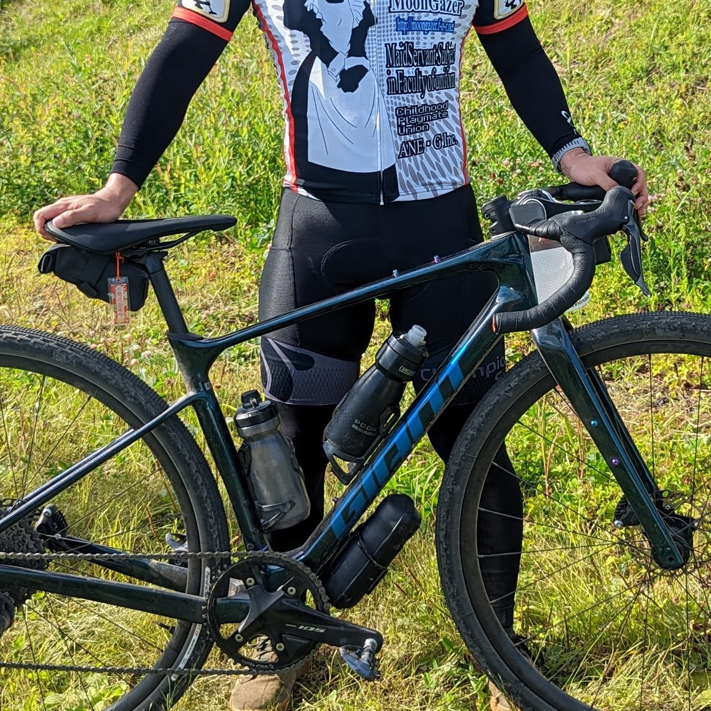

日焼け対策はしているだろうか？

学生時代や20代前半はノーガードでなんとかなっていた肌の防御も、アラサーになってから日焼け止めが手放せなくなってきた。

[ワコーズの強力な日焼け止め](https://amzn.to/3xLJB9d)まではいかず、簡単に落とせる[アネッサ金](https://amzn.to/3CasAbu)を長年愛用している。

しかし、**日焼け止めは出る前に塗り忘れることもあるし、汗をかいた後擦ると落ちるし、長時間自転車に乗っていても落ちてくる**。[ワコーズ日焼け止め](https://amzn.to/3xLJB9d)なら、塗り忘れ以外は解決できるが今度は帰った後クレンジングが必要だ。

そんなわけで、最近は根本的な解決に至るアームカバーやレッグカバー、夏用長袖ジャージを使ってみている。

ニセコグラベルでは、草かぶれ防止の意味も込めて脚も腕も完全ガード体勢を取った。

<LinkCard url="https://blog.gensobunya.net/post/2022/09/nisekogravel22_3/" />

## RxLソックス アームカバー

特に特徴的で気に入ったのが、[RxLソックスのアームカバー](https://amzn.to/3xo7Tpm)。

完全シームレス構造で締め付け感がほぼなく、縫い目の痕が肌に付かないことに加え、**カットしてサイズを調整可能**、洗濯後の**端の丸まりを抑える加工**がされているという特徴がある。

<LinkCard url="https://www.amazon.co.jp/gp/product/B01MXTBQ8U/" isAmazonLink />

こうしたシームレス構造のウォーマーは洗濯して乾かすと、クシャクシャに端が丸まってしまうことが多い（例：薄手ネックウォーマー）が、処理を上手く行うことで解消しているようだ。

実際に、**洗濯・乾燥機に突っ込んでも全く丸まりはなかった**。

商品紹介には「防寒対策」が記載されているが、**裏起毛だったりウィンドブレーク素材だったりということはなく**、汗をうまく蒸発させてくれる薄手の素材なので自転車としては夏にも使える商品になっている。

ニセコグラベル2022では、日中25度を越える気温で直射日光が常に当たるという暑さを感じやすい環境だったが、ブラックカラーでも暑さを感じることはなかった。

しかも**これだけの機能を備えながら、Amazonでの価格は2500円～3000円**という、サイクルウェア的には非常にお安い価格となっている。

### カット手順

自分は腕が太くて短いので、こうしたアームウォーマーがピッタリ合うということはほぼ無く、サイズの問題を抱えていたが、**カットして長さを決めるという性質**が見事にこれを解決してくれた。

しかし、靴下タイプのシューズカバーを使った人には分かっていただけると思うが、**伸びる素材で出来た製品を思った通りの形にカットするという行為は難しい**。

色々考えながら、下記の手順でカットしたところ綺麗な長さに揃えることができた。

スマートウォッチの上から着てもなんの問題もないしなやかさで、しかもずり落ちてこない。

#### 1

まずは、長さを決めるためにそのままで装着する。余った部分は腕の側で**表側に折り返して**おく。

#### 2

そして、折り返したまま場所がズレないよう慎重に取り外す。

そして、**何らかのマーキングをここで付けておく**。カラーペンなどを使ってもいいが、自分の場合は床のマークでどこを切ればいいのか覚えておくという手法を取った。

#### 3

あとはマーキングに沿って一気に切っていく**。2度切りしてしまうと断面が汚くなる**ので、一息で切るのがコツだ。

## まとめ

コスト的にもそこまで高くなく、シームレスで着心地がよく、文句が無いように思える。

カラーバリエーションは蛍光色がいくつかある程度だが、アームカバーにそれを求める人は極一部だろう…

ランナーは冬場に毎日使うことを想定しているのか、「耐久性が…」というレビューが目立っていたことが気になる。確かに薄いので、擦れには弱いのかもしれない。

ただ、元々の価格が安いので、**春夏秋の3シーズン使い倒して交換になったと仮定しても、十分に元は取れているように感じる**。

<PositiveBox>

- 比較的安価
- 長さ調整が可能
- シームレス構造で締め付けが少ない

</PositiveBox>

<NegativeBox>

- 耐久性が不明（レビューではあまりよくない）

</NegativeBox>

<LinkCard url="https://www.amazon.co.jp/gp/product/B01MXTBQ8U/" isAmazonLink />
