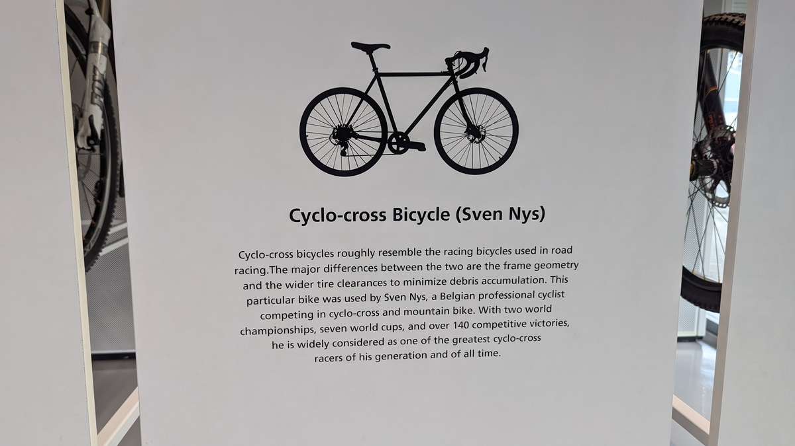
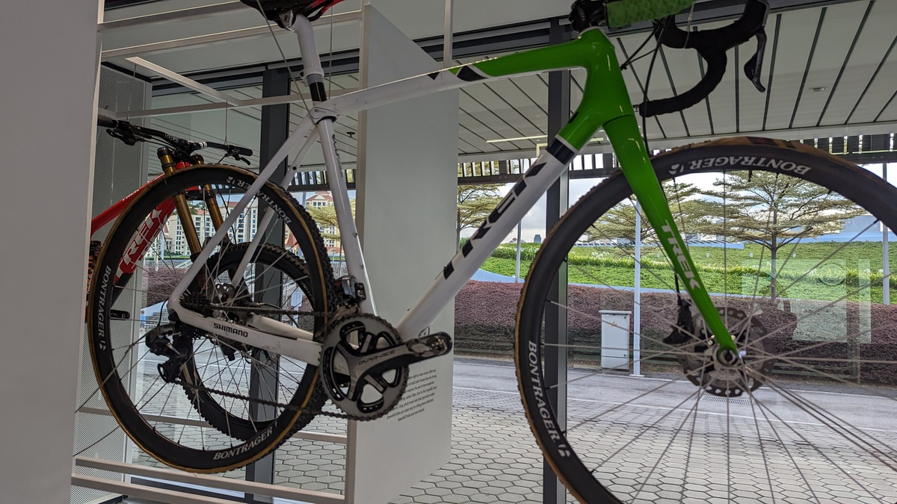
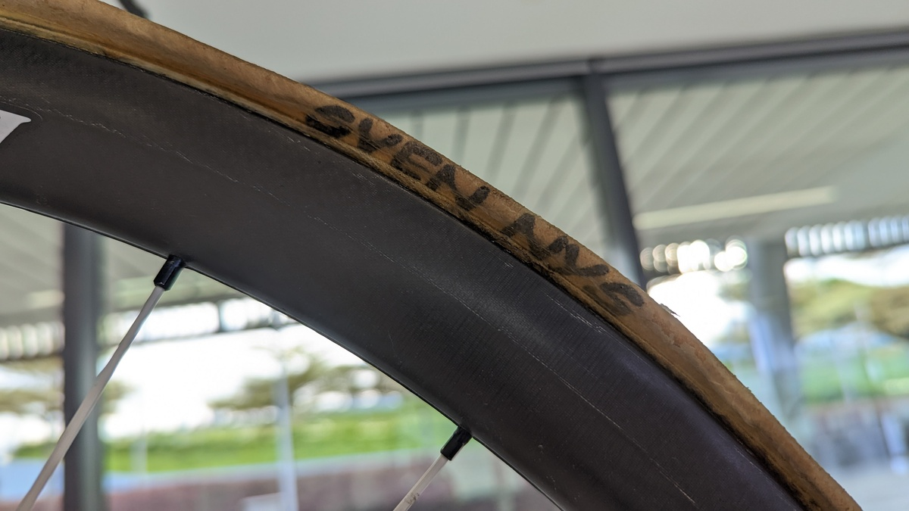

ニセコグラベルの余韻を楽しむ間もなく仕事でシンガポールへ。

しかし当然、頭の中はニセコグラベルの思い出がぐるぐるしているし、Twitterのタイムラインは「ニセコグラベルがああだったこうだった…」

ホテルのジムや周辺のランニングで運動はしているものの、自転車欲の高まった状態では満足とはいかない。

この欲求を解消すべく、隙間時間を見つけて、シマノシンガポール謹製施設の[シマノ・サイクリングワールド](https://www.shimano.com/jp/100th/history/cultural_activities/facility02.php)へ行ってきた。

## SHIMANO CYCLING WORLDとは

SHIMANO CYCLING WORLDはシンガポールのSports Hubなる複合スポーツ施設内に開設されている体験型展示施設。

**Sports Hubはシンガポールの中心地にある、シンガポール国立競技場を中心としたスポーツ施設**で、およそ思いつくほとんどのメジャースポーツを実施できる設備を持つ。

アジア最大級の大きさを誇るとのことで、本格的な競技場以外にもスポーツブランドの入るショッピングモールが併設されているほか、スポーツ教室のような子供向けの施設も多く入っていた。

**MRT（地下鉄）直結なので、観光客でも簡単に訪れることができる**。

シマノサイクリングワールドは施設の南西隅でひっそりと運営されていた。

## いざ入場

施設に入ると、歴代ホイールとクランク（と、シマノ製ではなさそうなホイール）で作ったオブジェが壁面に飾られている。

**一部は実際にチェーンを通じて駆動して**おり、いかにも自転車の施設ですといった趣。

<iframe
  width="560"
  height="315"
  src="https://www.youtube.com/embed/HPGnLNb2Qio"
  title="YouTube video player"
  frameborder="0"
  allow="accelerometer; autoplay; clipboard-write; encrypted-media; gyroscope; picture-in-picture"
  allowfullscreen
></iframe>

**動画を見ての通り、面積はあるものの展示品としてはそれほど多くない**。

展示だけ、というよりも実際に**触ることのできる展示物が多い**点は良かった。

1時間も2時間も居られる施設といったわけではないが、面白かったものをいくつかピックアップする。

### 変速機の進歩体験エリア

まずは電動変速体験エリア。

初期のワイヤー引き変速…ロードならダブルレバーのインデックスシステム、MTBならサムシフターとの操作を比べて、いかに**変速のための操作が軽くなったか、速くなったかを体験するための物**のようだ。

**展示用に、ワイヤーは変則的かつ長い取り回しになっている**のでとんでもなく重い変速になっていた。ちょっとずるい気がする…

なお、名称は **「Di2」ではなくそれぞれのシステム名である「SEIS（SHIMANO ELECTRONIC INTELLIGENT SYSTEM）」「FIREBOLT」が記載されていた**。

耳慣れない名称ではあるが、一応シマノのWEBサイトにも記載されていた、れっきとした正式名称だったようだ。

<LinkCard url="https://bike.shimano.com/ja-JP/technologies/component/details/seis.html" />

<LinkCard url="https://bike.shimano.com/ja-JP/technologies/component/details/firebolt.html" />

### 展示エリア：25周年デュラエース

25周年記念の限定デュラエースが展示されていた。

青XTはなかったのがちょっと残念。そのほか、LAZERのヘルメットシリーズや、PROの最新パーツ類も展示されていた。

### フィッティングシステム体験

シマノの選手用フィッティングシステムを体験できる。

いわゆる**初めて乗る人のための物ではなく、パワーを最も効率よく引き出せるポジションを探す**ことがメインの目的だ。

3次元のペダリングベクトル解析に加え、ペダル軸の中心で踏めているかという点も可視化できる。

当然、考えられるフィッティングの個所は全て動くようになっている。**手で調整できるので楽ちんかつ、画面で今の設定を確認できる**。

当日はサンダルだったので機能確認程度しか出来なかったことが悔やまれる。

目で見ているだけでもなんとなく今の効率の良さはわかるのだが、実際には「n分〇〇W走をしたときに効率がX%になるポジション」などと決めていく必要があるだろう。

英語力が足らなくて記録や分析については聞くことが叶わなかった。

### 歴代バイク

施設の端に、実際にバイクをラックごと引き出し、実車を見ながら歴史上の自転車の歩みを知ることのできるエリアがある。

**左端が元祖自転車、右側が最新のDHバイク**となっており、順を追って自転車の歴史を追うことのできる構成だ。

バイクは引き出して、細部まで観ることができる。

#### スヴェン・ネイス実車

この歴代バイクの展示場所に、**我らシクロクロッサーにとって非常に興味深いスヴェン・ネイスの実車**が保管されていた。

このバイクだけでたっぷり10分以上は時間を潰した気がする。スポンサードされていた時期のものなので、TREKのBOONEだ。

[2014年ごろのモデル](https://www.bikeradar.com/features/pro-bike/pro-bike-sven-nys-trek-boones/)だろうか。

強者の証である9000デュラエースのプロ専用チェーンリング。49-39T

タイヤはA.DugastのRhinoを履いていた。古いタイヤなのでサイドノコットンケーシングが変色しているが、名前は間違いない。

### まとめ

そのほか、市場用と思しきシマノカラーのバイクや、お馴染みのアルテグラ、デュラエース宣材用のバイクも展示されていた。

平日だったのでイベント類は行っていなかったのだが、通常は各種イベントもやっているようだ。

施設としては、グランフロント大阪にある[SHIMANO SQUARE](https://www.shimanosquare.com/)のようなものだ。

**ボリュームとしては1回行けば十分だが、1回なら面白く過ごせる**だろう。
