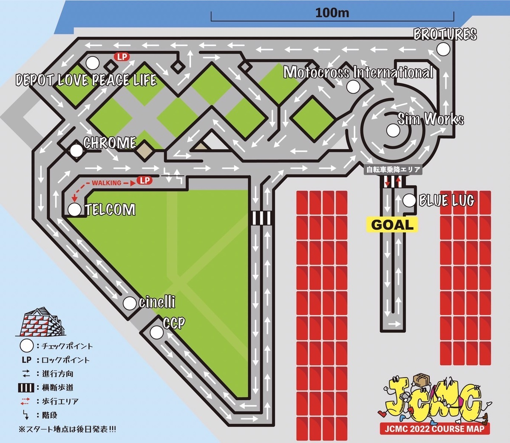

過去にバイクロア大阪で観戦して以来のピストクリテリウムを観戦しに赤レンガ倉庫へ。

この日は[JCMC 2022 Yokohama](https://jcmc2022.jpbma.org/)というメッセンジャーのチャンピオンシップが行われ、その夜イベントとして**sfiDARE presents YOKOHAMA CRIT**が開催されるという位置付けだ。

## Japan Cycle Messenger Chanpionship

レースは夜からなので、日中は出店をチェックしがてら、メッセンジャーチャンピオンシップを観戦する。

メッセンジャー文化には疎いので、ルールを確認しながらの観戦になった。

大まかに言うと、Blue Lugブースで**ミッションを受け、ミッションシートに書かれているコース内のスポットを回りサインをもらったりデリバリーをしたりして、完了したらBlue Lugブースに戻りポイントを手に入れる**という仕組み。

規定時間内の累積ポイントで順位が決まる。**コースを街に見立てたメッセンジャーとしての能力を競うレース**という趣のレースだ。

ざっとコースを眺めると、**一方通行や行き止まり、路面の悪い個所、横断歩道**など実際の公道を模した仕組みとなっており、**瞬時に効率的なルートを算出して回る**能力を問われることがわかる。

友人の[ほとと](https://twitter.com/hototo_)さんが参戦しているのを見ながら、**ルールの表記**や**リアルタイムの順位掲示**があると、通りがかった人にも何をやっているかわかりやすいと感じた。

特に知り合いがいる場合にリアルタイム掲示は盛り上がりそうだ。

## ピストクリテリウム(sfiDARE presents YOKOHAMA Crit)

陽が落ちれば今回最大のお目当てであるピストクリテリウムの時間。

設営と試走の間、どこが面白いかコース周辺を念入りにウォーキングして、最もポジション争いが激しそうなバックストレートの終盤を観戦場所にチョイス。

<blockquote class="twitter-tweet">
ここの細くなるところのポジション争いは熱そう <a href="https://t.co/rirTQv8cVe">pic.twitter.com/rirTQv8cVe</a>
&mdash; ゲン@C101 12/31東3 Z-15b (@gen_sobunya) <a href="https://twitter.com/gen_sobunya/status/1593890103491194880?ref_src=twsrc%5Etfw">November 19, 2022</a></blockquote>

コーナーにかけてコースが絞られている（出口は大きい）ので、いかに良いポジションで飛び込むかどうかが鍵となる…はず。

そして落車も多く盛り上がる場所だと踏んだ。

まったく打ち合わせしていないのに知り合い数名もここを観戦場所にチョイスしていたのは笑った。みんな~~デンジャラスゾーン~~わくわくゾーンが好き。

レースの進行が予想通り押した結果、結果を見ることは叶わなかったのだが、橋本英也選手のような**アジアトップレベルの選手の走りを見ることができる**という非常に貴重な機会だった。

<blockquote class="twitter-tweet">
<a href="https://t.co/3nj5DcH9HG">pic.twitter.com/3nj5DcH9HG</a>
&mdash; ゲン@C101 12/31東3 Z-15b (@gen_sobunya) <a href="https://twitter.com/gen_sobunya/status/1593905528153202689?ref_src=twsrc%5Etfw">November 19, 2022</a></blockquote>

JCLでも赤レンガクリテが行われるなど、神奈川県内の中心部で行われるレースが徐々に出てきており、このまま横浜国際トライアスロンのような定番イベントとして定着してくれることを願うばかりだ。
