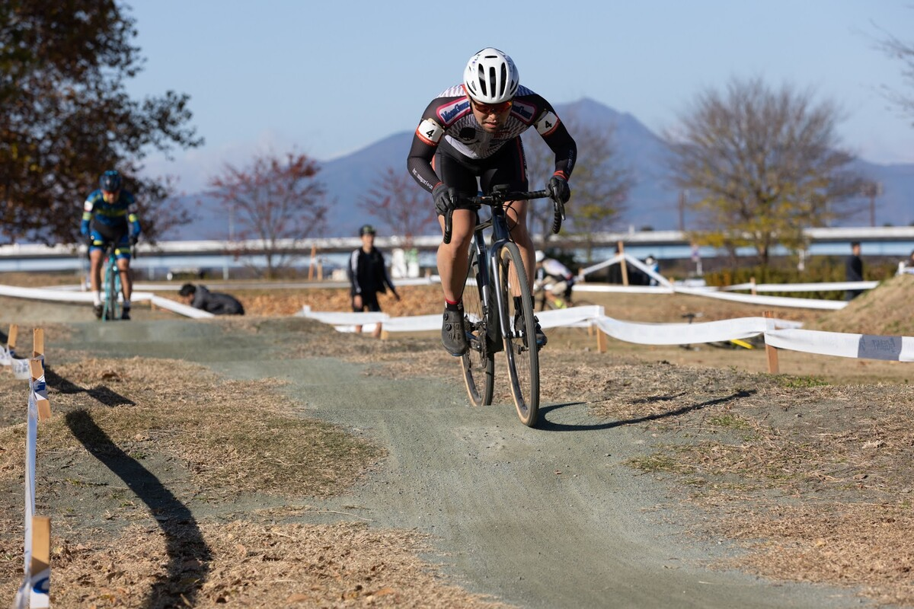
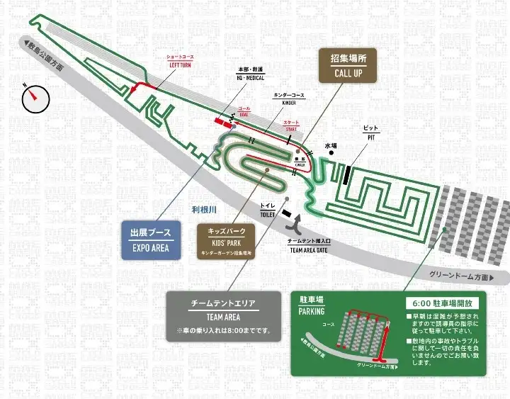

## Summary

- 世代交代という言葉が刺さる

## リザルト

13/19位（+ 4:07)

### 機材

- メインバイク
  - GIANT TCX ADVANCED PRO
  - Farsports CX TU + A.Dugast Smallbird 33mm (F: 1.65bar, R: 1.70Bar)

## コースレビュー

BMXコースに加え、グリップのいい芝と、砂利で転びやすい駐車場側の広場も特徴的だが、このコース最大の特徴は**群馬特有のからっ風**。

山から吹きつける風はホームストレートを完全な向かい風で地獄に陥れる。そして陸地の温度が高くなりやすい昼過ぎに最も強く吹く…つまり**昼1のC1レース時間はその日で一番強い風に曝されることとなる**。

階段と向かい風でペースを保てるか、そしてテクニカルなコーナーと細かいキャンバー、BMXコースのプッシュプルをいかに素早くこなせるかが問われるコース。

## レース

この日のC1は20名かつ、主力はWNPの全日本選手権前哨戦へ遠征しているためか、普段は順位30％台以降を賑わせている選手だけで構成された。

自分のスタートゼッケンは4番だが、今年のレースリザルトを眺めると今日も60％程度が御の字というメンツでもある。

それはそれとして、スタート位置の恩恵を得るべく**スタートスプリントと階段での位置取りはしっかりと**する。その後はひたすら抜かれて順位を安定させる作業……順位1つを争うレベルならまだしも、中盤であれば1時間を通してペースを安定させた方がトータルで速くなりやすい。

また、自分はストレートの脚よりテクニカル区間で詰めていくのが得意なので、相対的に休みながらタイム差を縮めて後半にアドバンテージを活かして追い上げる方ことができるというのもある。

徐々に前を捕まえつつある（つもり）であったものの、中盤ホームストレート後の階段で大腿四頭筋が攣りかけ、以後ペースアップや踏みなおしができなくなってしまった。

その後は幽鬼のようになりながら無意識のままコースをクリアしながら、1時間走り切ってゴールした。

**「C1も世代交代が～～～」というMCの言葉がやけに耳に残った。**

## Photo

Cover photo by @hiroyo_okubo
