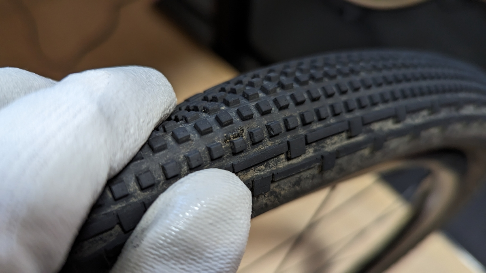
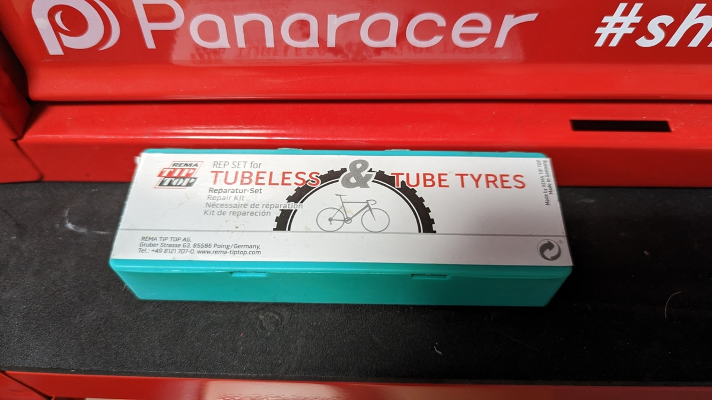
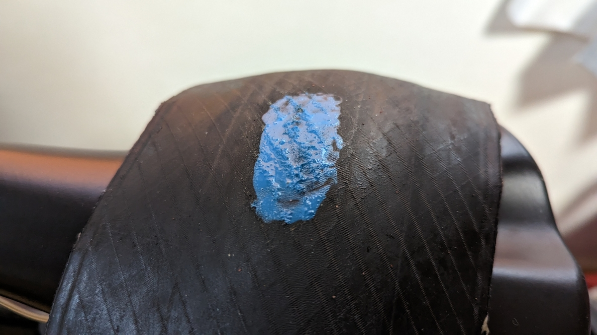
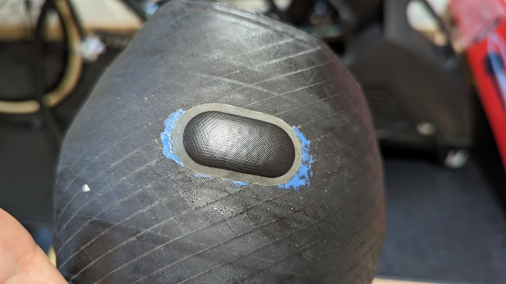

以前、[チューブレスタイヤでパンクしたらその場はチューブを入れて凌げ](https://blog.gensobunya.net/post/2022/06/tubeless_repair/)という記事を書いた。

<LinkBox url="https://blog.gensobunya.net/post/2022/06/tubeless_repair/" />

野辺山グラベルチャレンジでは、シーラントで修理できない突き刺しパンク(5mm程度のカット)を経験したので、この記事の通りにチューブを入れてその後のライドに復帰、帰宅できた。

さて、今回パンクしたタイヤは**まだニセコと野辺山でしか使っていない。**当然捨てたくないので修理していく。

これからも信用して使っていきたいタイヤなので、**シーラント頼りにならない信頼性の高い修理をする**。

## チューブレスタイヤパッチ

今回利用するのはTIPTOPのチューブレスタイヤ用パッチ。

パッチ側に糊がついているイージーパッチではなく、**ゴム糊で貼り付ける昔ながらの手法を使うパッチゴム**だ。

<LinkBox url="https://store.shopping.yahoo.co.jp/cycle-yoshida/00640458.html" />

タイヤ用に設計されており、**チューブ用のものと比べて肉圧で伸びにくい。**

パンクした穴からチューブが伸びて膨らみ、こんにちはすることはクリンチャーでありがちな修理失敗例。同様にチューブレスタイヤでパッチを当てたが内圧で伸びてくるということを避けられる。

## 修理

修理方法は**普通に裏からパッチを当てればよい**。

説明するほどのものでもないが、**シーラントは予めぬぐい落として、周辺を脱脂**することをお勧めする。

あとは、付属のヤスリで表面を荒らして、ゴム糊を塗り、**乾くのを待って**、パッチを押し付けて融着させる。

イージーパッチが普及して、ゴム糊を使ったことの無い方もいるかもしれない。**ゴム糊は薄く塗って、乾くまで待たないと効果が無い**ので普通の接着剤の感覚とは違う点に留意してほしい。

ゴム糊によって貼り付けたパッチは、単純に接着されているわけではなく化学的に加硫反応でくっついているので剥がれる可能性が低い。

**ロードチューブレスタイヤもこの方法で復活させ、寿命まで持たせた実績がある**。大穴が開いてしまっても捨てる必要はない。

イージーパッチに比べ、若干重くなる点はデメリットだが、チューブレスタイヤはチューブと違い交換するにはコストが高いので、やや重くなってもなるべく長く使いたいところだ。

<LinkBox url="https://store.shopping.yahoo.co.jp/cycle-yoshida/00640458.html" />
