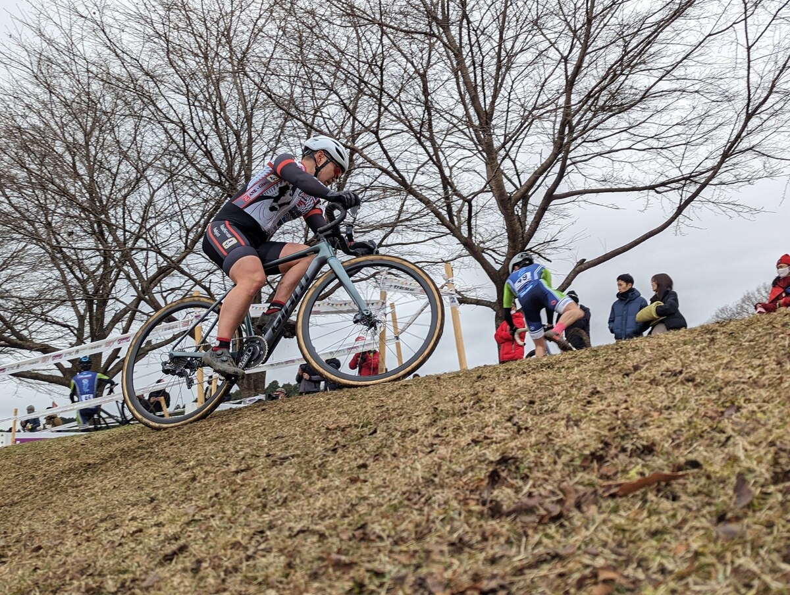

## Summary

前週からしっかり体を休めて、当日のウォームアップを念入りにしたこともあり自分比で踏めており、コースのリズムに乗って走ることができた。

コンディションがよかっただけに、昨年に比べて減少した練習量が浮き彫りになり課題がわかりやすかったレースとなった。

## リザルト

47/75位（-3 lap)

### 機材

- メインバイク
  - GIANT TCX ADVANCED PRO
  - Farsports CX TU + A.Dugast Smallbird 33mm (F: 1.70bar, R: 1.75Bar)

## 試走レビュー

全体的にスピードに乗せて流れるようにクリアできるコース。ポイントは最奥泥キャンバーのクリア方法で上に登るか、斜面の草の残った部分を行くかどうかといったところ。

三段坂はスムーズに乗れたら速いが、今年の体力を考えると安定化は難しそうだったので降りてスピードを追及することにした。

## レース

<iframe
  width="560"
  height="315"
  src="https://www.youtube.com/embed/24VJmQE8fKU"
  title="YouTube video player"
  frameborder="0"
  allow="accelerometer; autoplay; clipboard-write; encrypted-media; gyroscope; picture-in-picture"
  allowfullscreen
></iframe>

ゼッケンは中ほどの48。

UCIレースということもあって最初のコーナーはゆるやかなのだが、その後の細い道のエリアで後方は完全にサイクリング化した。あまりに低速なので将棋倒しも発生していたが、そうした大きなトラブルには巻き込まれずに砂場から林間へ。

とうぜんここでもワチャワチャするのだが、乗り降りを上手く使ってポジションアップに成功。海外選手枠としてオーストラリアの選手も来ていたが、満員電車で鍛えた渋滞スキルは日本人の方が上だった。

泥キャンバーは、当初草の斜面でリマウントする予定だったが最上部が思ったより踏み固められていたのでレース中に予定変更。試走の時よりスピードを載せられる場所になっていた。

砂エリアは短く気にするほどでもないので、あとは長い直線とコーナーの立ち上がりで踏み倒すだけ。しかし、今年ウェイトトレーニングを行っていなかった影響で思ったほどのトルクが出ない。

要反省だなーと思いながら走っていると、思っていたより足切りまで余裕がある。なんとかもう1周増やすべく力を振り絞るが、踏みなおせない影響でパックから徐々に落ちてしまい-3lap勢最初のラップアウトを喫してゴール。

野田や前橋で感じていた体調不良感もなく、主観的には気持ちよくレースができたので、来年への課題が見えたという点では良いレースだった。
