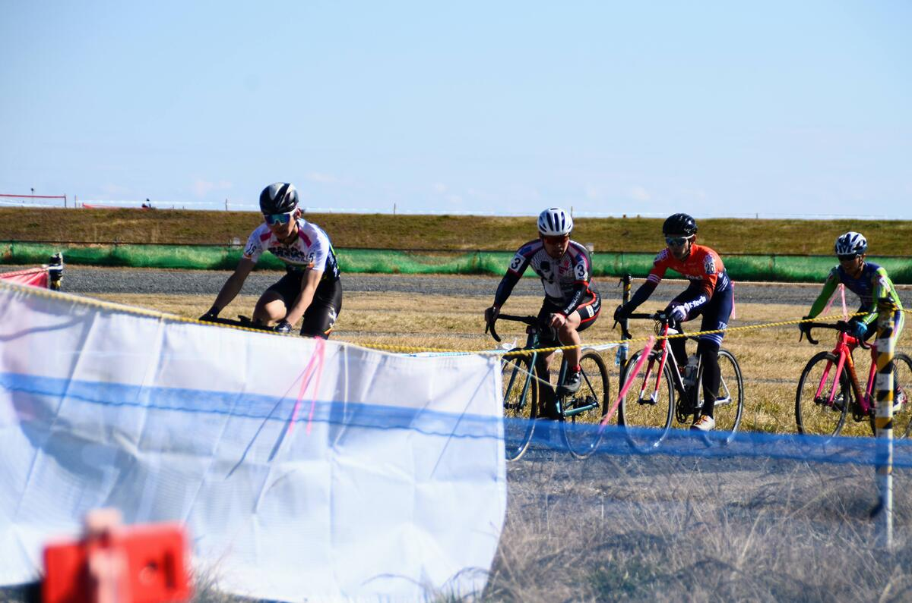
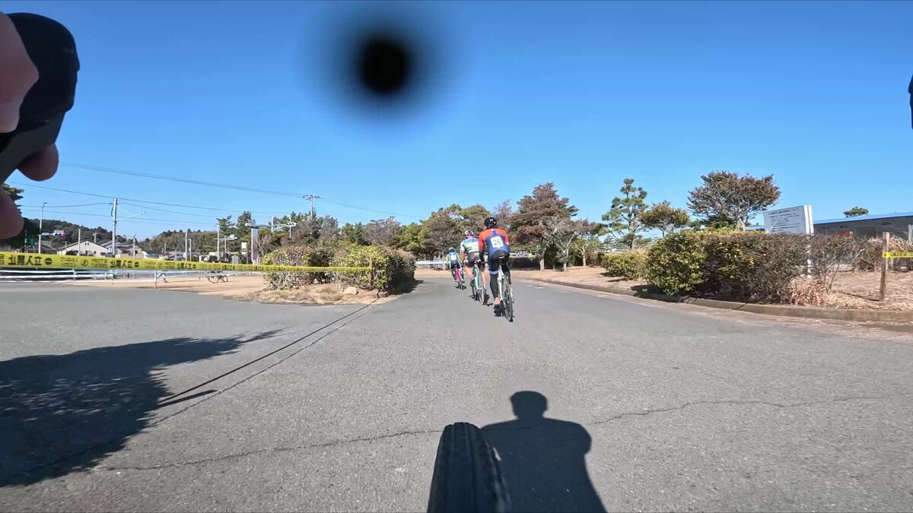

## Summary

主力選手が愛知牧場でJCXポイント争いをする中、中盤選手による表彰台争い。

カテゴリー1（現ME1）に昇格して以降、初となるバチバチのレース展開を経験して3位争いをした末、最後粘り切れずにパック内最下位の6位。

## リザルト

6/23位 (+3:40)

### 機材

- メインバイク
  - GIANT TCX ADVANCED PRO
  - Farsports CX TU + Dusgat Smallbird(F:1.6Bar, R:1.65Bar)

## 試走レビュー

砂レースを標榜しているものの、砂区間は短く、難易度も低い。

タイム差がつくことは間違いない海岸の砂区間だが、それ以外のバンピーな平坦エリアとコンクリ段差のある舗装路・芝・林間・グラベル区間でも差を十分に取り返せるレイアウト。フロントアップだけでなく、後輪も上げることができないとホイールへのダメージが気になるコースだ。

天候は晴れだが、前日までの雪や凍結が溶けて、ウェット路面になっている場所があった。とはいえ全体的にグリップはよく、砂区間ではやや非効率なオーバーペースでも、平坦の転がりが軽ければ体力的アドバンテージが作れるコースだとと判断したので空気圧は高めに設定。

## レース

普段の茨城シクロクロスとは違い、10時台と早めの昼試走の直後にME1レースが始まる

自宅から200km近く離れているため、朝試走は端から諦め、試走からそのまま招集場所へ。本日のゼッケンは3番、緊張する…

<iframe
  width="560"
  height="315"
  src="https://www.youtube.com/embed/yFjwGLGxjU4"
  title="YouTube video player"
  frameborder="0"
  allow="accelerometer; autoplay; clipboard-write; encrypted-media; gyroscope; picture-in-picture; web-share"
  allowfullscreen
></iframe>

スタートはそこそこの駆け出しを見せたものの、自身のスリップと巻き込まれ事故で序盤にポジションを落としてしまう。

とはいえ、スピードが下がるところは下がり切るので、慌てずにテンポで踏み続け前を追い、良い感じに風よけに出るメンツを探す。

今回の裏テーマとして、「SSCXの不思議な速さをギアードでも再現できないか？」という試みを行った。具体的には、可能な限り重いギアでコーナーを含む様々なセクションをクリアしていき、トルクで押し切っていく。砂などの明らかに軽いギアを使った方がいい場面のみギアを軽くしていく。

予測される効果としては、ケイデンスの低下による心肺への負担軽減と、コーナーの踏み出し改善。ギアチェンジによるロスは意外と大きいので、ギアを調整しているうちに踏むという考え方。（もちろんギアが重すぎるとロスになる）

平坦コーナーの多い大洗のコースはこれが上手くハマり、トルクによる筋肉の疲労はたまるものの、心拍数の上昇を抑えて冷静さを保てたことで、砂だけ強度を上げて淡々と踏むという戦略をキッチリ実行できた。

ミスしたロスは砂で挽回しつつ、前をキャッチしながら数周回を繰り返すといつのまにか3位パックが4人に。

各々が砂や舗装路などの得意セクションでアタックするものの、半周ほどするとパックに戻るということを数回繰り返した後に安定。

よしたくさんと、TS TECHの阿部さんは平坦のパワーは強そうだ。宮崎さんはタイヤの空気圧が低そうで、砂が露骨に速い上に難易度の高い最速ラインを走ることができる。自分は、砂で全力を出せば宮崎さんについていけるが、平坦では他の2名に分がある。砂の前のシングルトラックエリアでは明らかに自分が1番速いな…という力関係。

勝ちパターンは砂で遅れずに後半のバンピーな路面と砂利道を踏み倒して宮崎さんを抜かしつつアドバンテージを守りきることか？などと考える。

残り4周で、唯一砂を降車していたイナーメの[よしたくさん](https://twitter.com/yoshitaku1234)が火ぶたを切るアタック。鈍重な**自分のみ**アタックに反応できず数秒差を作られる。

とはいえ、残り4周での仕掛けは早すぎるので、また牽制になるだろうと予想して焦らずじわじわと詰めていく。しかし、前も主によしたくさんが平坦ペースを上げて追いつかせまいとしているのが見える。

こちらも基本のペースを上げながら、砂も全速力近くまでだして残り2周の砂を過ぎたところで再び集団をキャッチ。勝負どころだが、疲労でバイクコントロールの精度が落ちているのが分かる。

残り1周は一番後ろで風よけさせてもらい、砂まで連れて行ってもらうが踏み切れずにスローダウン。フラついてラインを乱し、最も肝心な出口スロープへの入りをミスってしまい勝負あり。

パック最下位の6位でゴールした。今期もっとも上位でゴールしたのだが、悔しさの滲むレースだった。

## Photo

Cover photo by [@nyan_nyan_noah](https://twitter.com/nyan_nyan_Noah/)
