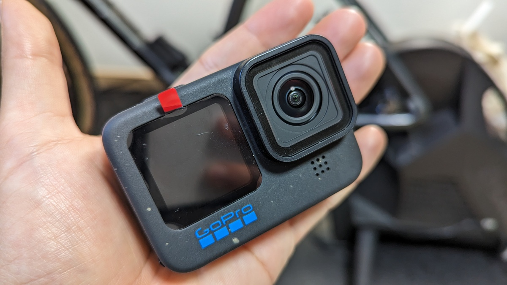
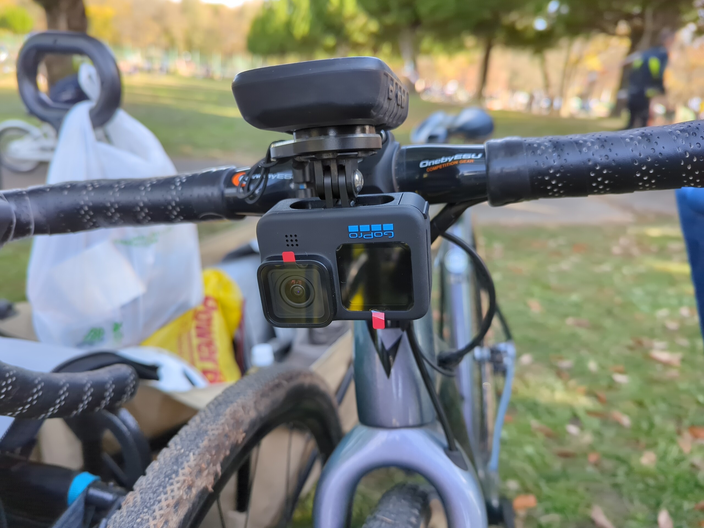

車載用カメラとして、[Insta360 ONE RS](https://amzn.to/3whWXcx)を利用していたが、ブラックフライデーのセールに魅かれてまたGoProに戻ってきた。

先代であるGoPro Hero8はそこそこ長い期間利用しており、軽量かつ性能のいい手ブレ補正・Rawデータとして十分な画質を提供してくれる機種だったが、[Quikやソフトウェア面がポンコツすぎてInsta360に移行](https://blog.gensobunya.net/post/2022/08/instaone_rs_review/)。Instaはそうしたソフトウェア面への欲求は満たしてくれるメーカーであった。

とはいえ、[ONE RS](https://amzn.to/3whWXcx)のハウジングを含めた一式は中々に巨大で、荷物の中や自転車に取り付けた際の取りまわしがスマートではない他、ボタン配置などでノールック操作を間違えやすいという欠点もあった。

複数メーカーで自転車のオンボード動画を撮影してみて、自分の使い方の範囲内でハードウェアに求めるもの、ソフトウェアに求めるものが明確になってきたため、「GoProでいいか」と判断するに至った。

## GoPro Hero11

アクションカメラに興味がある方はGoPro Hero11の基本スペックはもう何度も見ているだろうが一応おさらい。

- **Enduroバッテリー**標準装備
- 8:7イメージセンサー
- 最大5.3K60fps
- **(サブスク)本体交換補償**
- (サブスク)無制限クラウドバックアップ・自動アップロード・自動ハイライト作成

ポイントはEnduroバッテリーで、**シクロクロスのような冬季でも撮影時間が大幅に（公称38%）伸びた**のがうれしい。

公式サイトは1年サブスク加入で大幅割引というシステムを採用しているため、本体交換補償も1年ついてくる。理由を問わない交換が可能なので、処分前に交換して新品同様品にすることも（おそらく）可能だ。

マウンテンバイクなどの破損リスクが高い環境で使うことに対する備えができるのは、流石アクションカメラの老舗といったところ。

<LinkBox url="https://www.amazon.co.jp/dp/B0B9H67NYT/" isAmazonLink />

### どういう使い方なら「GoProでいいか」と思えるか

まず、自分のアクションカメラの用途は99%が車体か人体にマウントしたオンボード動画。そして**1回の連続撮影は30～60分ほど**。

カメラの運用は**バッテリーを1回で使い切るまで撮影**して、その後は**家に帰ってからPCでチェックと編集・修正してアップロード**。スマホローカルで扱うにはデータが重すぎるので出先での編集やアップロードはなし。

つまり、スマートフォンとの連携機能はさほど重要でなく、**元素材としてのクオリティが担保されていることだけが要件**。SDカードにデータがあればいいので、GoProの弱点であるソフトウェアや周辺WEBサービスの貧弱さは運用上のデメリットにはなりづらい。逆に言えば、その場でアップロードするならInsta360やDJIの製品を使った方がいいと思われる。[Insta360 Go2](https://amzn.to/3Vp14xa)なんかはそのためにできているカメラなので、こういったものをサブに持ち歩くのはよさそう。360度カメラも（今となっては）GoProではカバーできない分野だ。

### Quik・サブスクリプションのクラウドサービスは相変わらずひどい

3世代経って、1回アプリをリニューアルしたらしいのでQuikもマシになっているだろうと思ったのだが…甘かった。

まず初期設定だが、**Android OSの仕様を知らずに作ったとしか思えない**。インターネット接続のないWifiは自動的に無効になる機能がOSにあるのだが、マニュアルやアプリ画面ではその解説が一切なく、画面に従っていては永久にペアリングできず初期設定すら終わらない。モバイル通信Offか、Wifi最適化の設定をOffに思い当たるのはかなりのガジェオタだけだと思われる。**ちなみにInsta360は初期設定時に注意をしっかり挿入していた**。ちゃんと競合研究してくれ。

また、サブスクリプションでストレージは無制限だが、カメラからクラウドへのオートアップロードは**1時間の動画アップロードに4～5時間かかる。しかも本体バッテリーが50％以上必要**なので、レースから帰った夜にSDカードから動画を抜いて充電した後、ようやくアップロードがスタートして翌朝に終わっていることを確認というスケジュールになる。自宅Wifiのインターネット接続は300Mbpsを安定的に超えているはずなのでクラウドサービス側の帯域が足りていないことは明らか。1日遊んで撮り倒した後、オート編集された動画に出会えるのはいったいいつなのだろうか。

<blockquote class="twitter-tweet">
GoProくんさぁ…家に帰ってきた段階でバッテリーが50%もあるはずないだろ…？ <a href="https://t.co/Oj5hJvHgA7">pic.twitter.com/Oj5hJvHgA7</a>
&mdash; ゲン@C101 12/31東3 Z-15b (@gen_sobunya) <a href="https://twitter.com/gen_sobunya/status/1599368364719501312?ref_src=twsrc%5Etfw">December 4, 2022</a></blockquote>

ひとまずサブスクリプションには容量無制限という性質を活かしたウォームバックアップとしての機能を期待して、それ以外はオマケと思うのが良いだろう。

### オート編集はレース動画で機能しない

さて、GoPro Hero11には様々な売り文句があるが、その中には自転車のオンボード動画撮影では活きないものも多々存在する。

その1つがQuikに**自動アップロードした動画で生成される（らしい）オートハイライト動画**。

レース動画というものは、長編動画で1日1～2本というのが関の山だと思われるが、どうやら素材が少ないとこのオートハイライト動画は生成されないらしく、我がQuikアプリに生成通知がきたことはない。シクロクロスレースをGoProのAIモデルがどう編集するかちょっとだけ楽しみだったのだが…

### 優秀なハードウェアとしてのGoPro

Enduroバッテリーでは、**76分間走らされた野田シクロクロスME1でも全編録画してバッテリーが残る**という快挙も達成。画質は2.7K60fpsだがこれだけ保てばいいだろう。

ちなみにバイクロアで4K6ofpsを合計65分に達せず途中でバッテリー落ちしたが、競合も4K60を1時間寒冷地で持たせるのは中々できていないので、これは明確に強い。

また、手ブレ補正については[以前の記事](https://blog.gensobunya.net/post/2022/08/instaone_rs_review/)では**ONE RSとHero8の手ブレ補正対決をしている。結果はHero8の勝利。**Hero11は更に手ブレ補正に関しては上を行っているはず。

<LinkBox url="https://blog.gensobunya.net/post/2022/08/instaone_rs_review/" />

GoProはボタン配置なども押し間違えの無いように各辺には1つしか操作系が無く、ノールックで操作しやすい特性は維持されている。

**前面パネルは車載時の画角調整に便利**だが、**無くても問題はない**ので正直コストダウン対象にしてほしかったところはある。（自撮り勢には必須なので仕方ないが）

## まとめ

GoProは、ショート動画を撮り集めて一部またはハイライトまとめをSNSにサッとアップロードするようなイマドキの使い方には合っていない。

それでも、手ブレ補正や画質・ハードウェアの作り込みはピカイチで、サブスクリプションの保険も相まってハードに使い倒す機械としては非常に優秀。SDカードを抜いてPCに直接転送すればクラウドアップロードや編集の弱さといった弱点は無関係だ。

レースの**オンボード動画は、基本的に長編かつ編集が必須**。結局PCで何らかの編集作業を行うことになるので、自転車にマウントする機材としてはGoProがいいという結論に至った。

あれだけ宣伝したQuikハイライト動画が使い物にならなく、リニューアルしたモバイルアプリでもAndoidの端末挙動知識が無いとペアリングすら困難という体たらくで、**ソフトウェアにはもう期待しない**方がよさそうだ。
