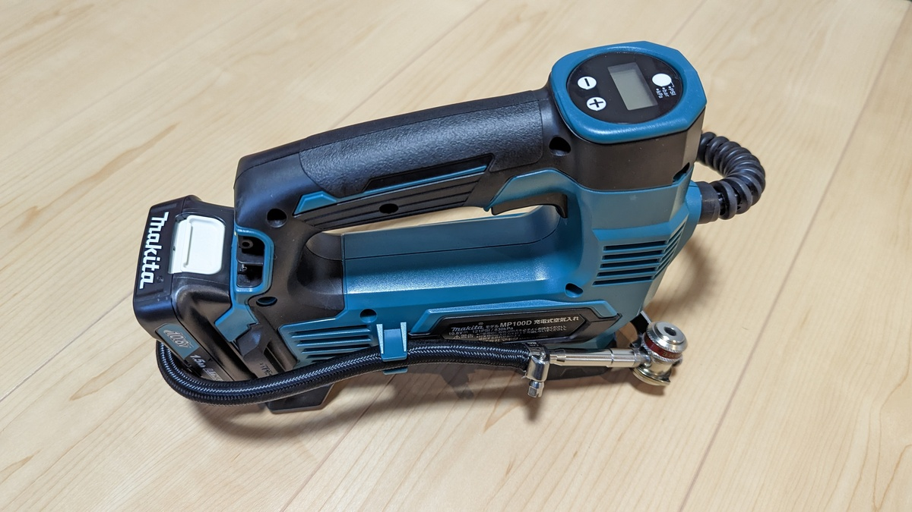
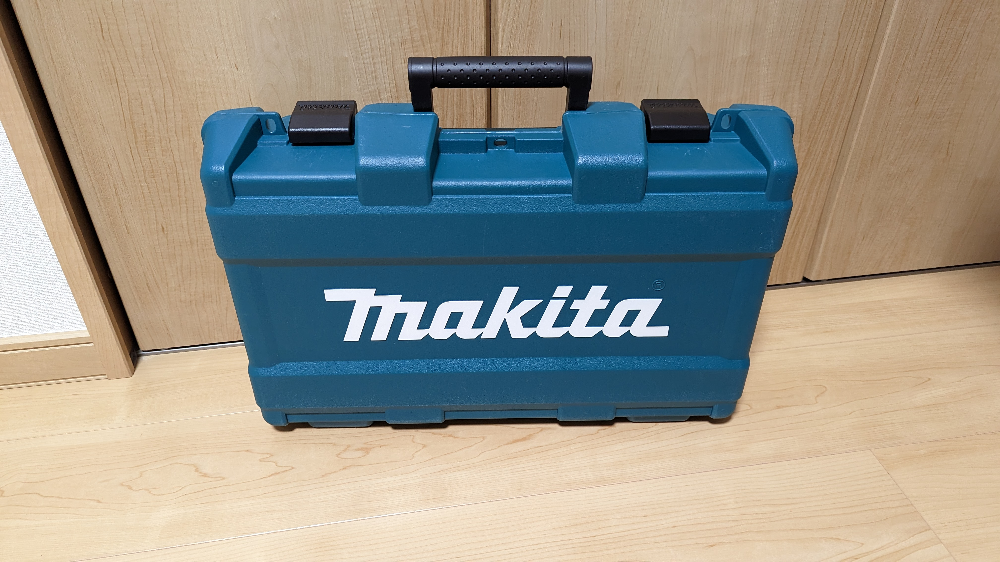
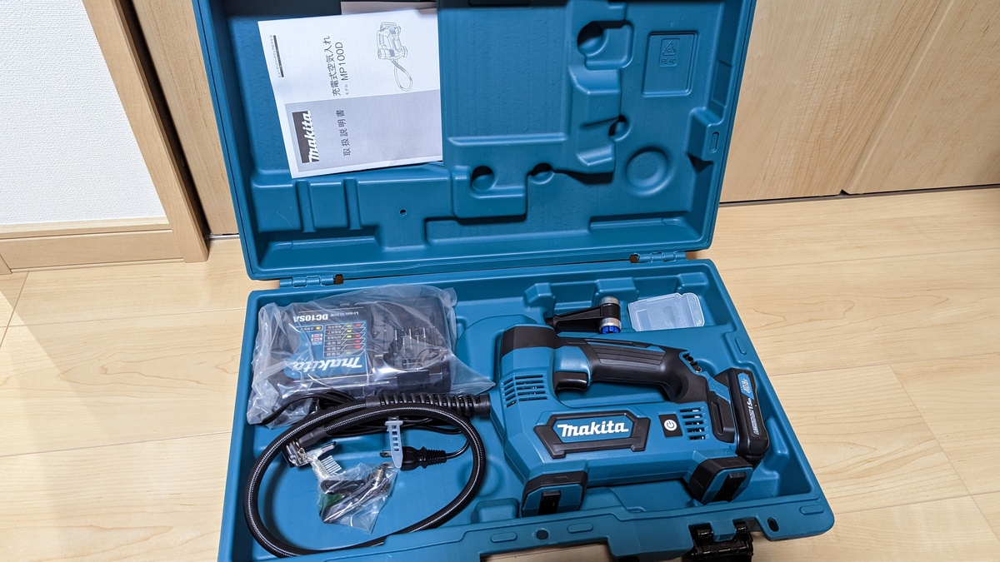
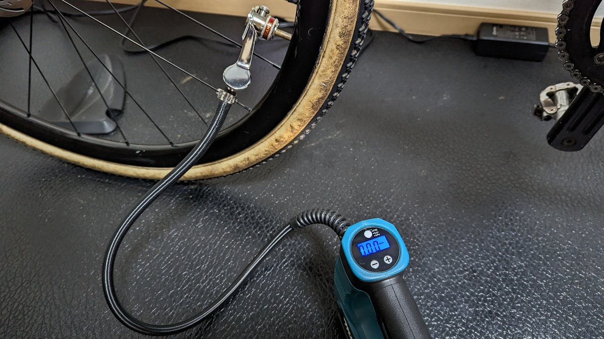
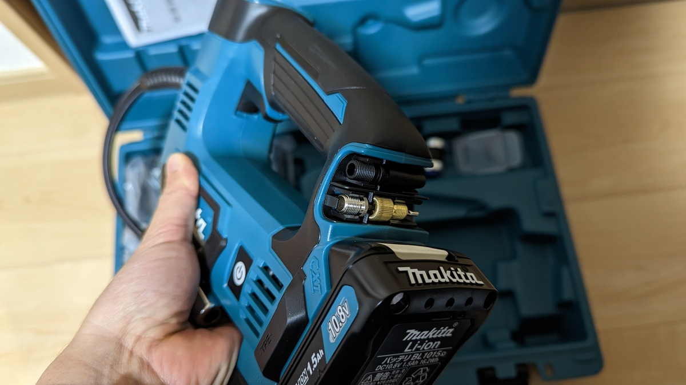
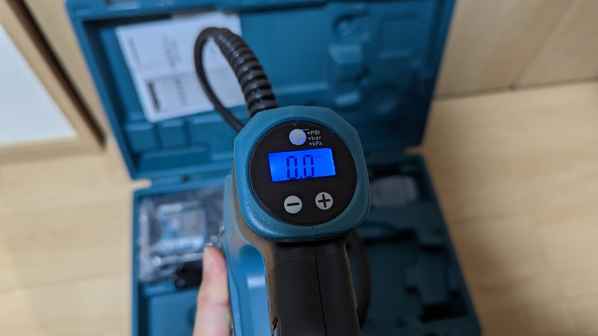
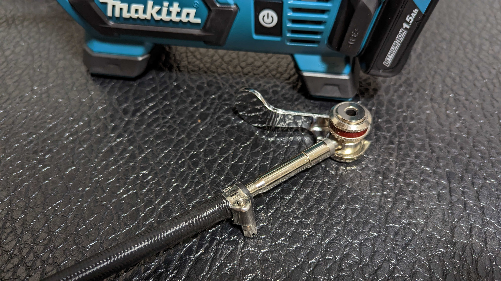
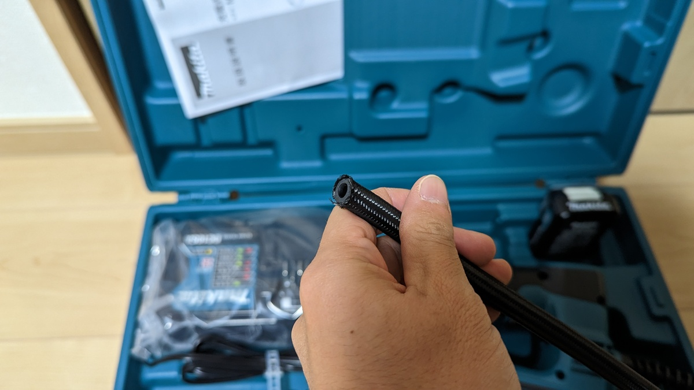

レース会場に気軽に持ち運べて空気圧管理も簡単にできる…シクロクロスレースのような空気圧にシビアな状態で役に立つのが電動ポンプ。

存在を知りつつも、マキタグッズを持っていない自分には導入コストが高かったのだが、遠征車のトランクに入れるものが増えてきてしまったので**遠征キットのコンパクト化のため**にも思い切って導入した。

## 概要

充電器・バッテリー・ケースまでセットになっているのが[MP100DSH](https://amzn.to/3vIgguO), バッテリー・充電器レスの型番が[MP100DZ](https://amzn.to/3XasoR1)となっている。

<Amzn asin="B07LBVRSY1">

## 使用感

動作音は大きい（住宅街でも深夜使用は躊躇う）が、グラベルロードやシクロクロス・MTBの**低圧域ならあっという間に充填が終わる**。

シクロクロスだと常に**同じゲージ基準値で比較するために、フロアポンプで多めに充填してからデジタルエアゲージで計測・調整**していたが、そのプロセスが一発で終わるのはとても大きい。なんでこれまで買ってこなかったのか、反省しているほどだ…

側面にホースを嵌める爪があり、ケースがなくても保管時にホースが遊ぶこともなくてトランク内もスッキリできる。

### マキタバッテリーと充電器

マキタのバッテリー工具シリーズは、**バッテリー規格が全て同じであり、複数工具間で使いまわせる**といった特徴がある。

ハイパワーなバッテリーは出力安定性・耐久性・安全性が重要なポイントになってくるが、マキタのバッテリーは高価なだけあり、これら全てを併せ持っていることが特徴。

純正バッテリーが高価ということもあって、互換バッテリーが市場に出回っているものの、大容量バッテリーとはすなわちそれ**相応のエネルギーを中に保持しているということ**。同容量の互換バッテリーが爆発したらモバイルバッテリーのそれとは比較にならない被害が出そうなので、純正バッテリーを使うことにした。

なお、マキタ10.8Vのバッテリーを既に持っていれば、[このポンプ単体](https://amzn.to/3XasoR1)は6割ほどの値段で導入できる。**異なる電圧のバッテリー間で互換性は無い**ので、手持ちのバッテリーがある人は仕様をよく確認しておこう。[18Vモデルの電動ポンプ](https://amzn.to/3Xe93P2)も販売されているのでバッテリー持ちのひとはお間違えなきよう。

### 同梱品と特徴

ポンプヘッドは米式なので、必要なアダプタが本体に同梱・マウントされている。基本的にはこれらを使うことで様々な規格に対応できる。自転車用途だとほぼ仏式なので、ヘッドそのものを交換している人も多い（自分は実際に交換した、後述）

長押し対応の空気圧設定画面。barで調整する場合は+-ボタンを一押しにつき0.05bar単位で調整できる。長押しで高速送りとなる。

単位を変える際はディスプレイ上部のボタンで切り替わる。バックライトと物理ボタンで、暗いところでも操作しやすいだろう。

作業野を照らすためのライトも装備されいて、電源がONの間は常時光るようになっている。電源ボタンは本体側面。

## ヘッド交換

さて、自分の環境下では仏式以外のバルブを利用することがほぼないため、ポンプヘッドを[ヒラメ横カム](https://amzn.to/3VRqALx)に交換した。このポンプヘッドの使いやすさについては今更論じるまでもない。

<Amzn asin="B09Y5NC795">

交換の方法は簡単。**ポンプヘッド部分のホースをカットして、ヒラメヘッドを捻じ込み、バンド留めするだけ**だ。

**ヒラメヘッドは別売りのキットで内部パーツを交換しないと米式ヘッドに対応できない**ため、単体では車のタイヤ空気圧に使えなくなるというデメリットがある。幸いにもチューブレスタンクが仏式→米式変換して出力できるので、手間をかければ車にも使える。タンクの分エアボリュームが必要になるが、幸い[現在使っているTOPEAKのタンク](https://amzn.to/3IsVkQb)は容量が多い方ではないし、タイヤそのものに比べれば誤差のようなものだろう。

さて、目ざとい人は先ほどのケースの中に[Panaracerのワンタッチポンプ口金](https://amzn.to/3ihju5B)が放り込まれていたことに気が付いたかもしれない。当初は車にも使おうとしていたため購入したのだが、**単体ではホースへ取り付け出来ない**ことに購入してから気が付いた。ホース側の部品が足りないのだ。

チューブレスタンクや、車の都合で米式にも電動ポンプを使うことが多い人は、同等品である[ブリジストンの交換ホースキット](https://amzn.to/3VNMW0t)を買って交換することをおすすめする。こちらなら交換に必要なパーツが一通りそろっている。

<Amzn asin="B01N0KHTKX">

## まとめ

初期投資はかかるものの、買ったことを後悔することはないであろう一品。

バッテリーと充電器が高価なので、マキタ製品を一度導入すると次々に導入したくなるのがネック。買って数週間だというのに、洗車後の処理で楽するために[ブロワー](https://amzn.to/3VSccCW)が欲しくなってきてしまっている自分がいる。

サイズが大きいのでライドのお供という訳にはいかないが、自宅とレース会場で活躍すること間違いなしだ。

<Amzn asin="B07LBVRSY1">
