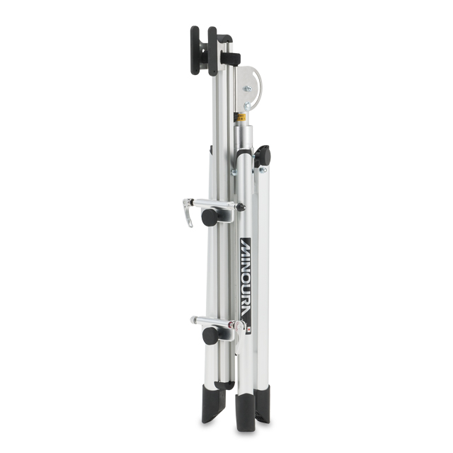
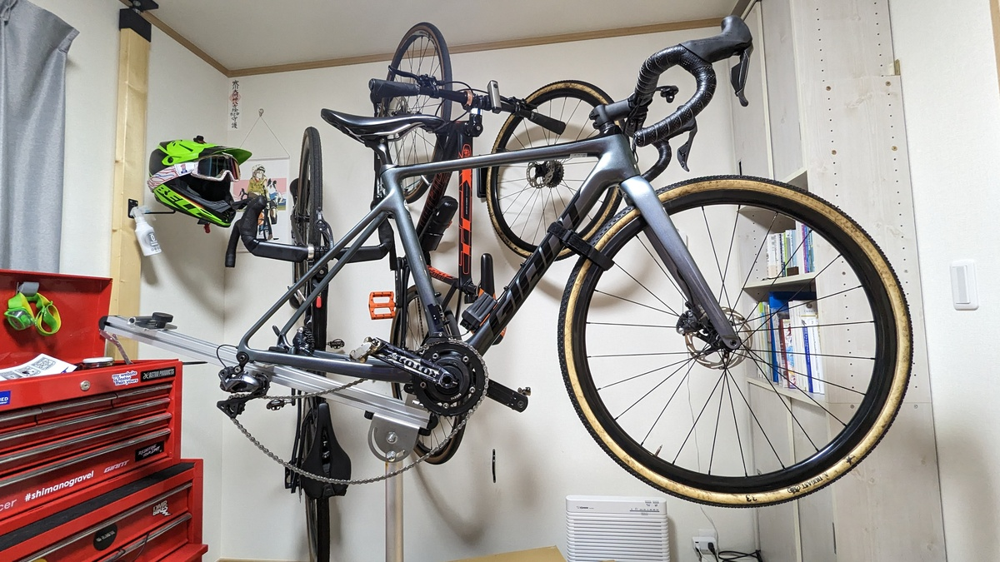
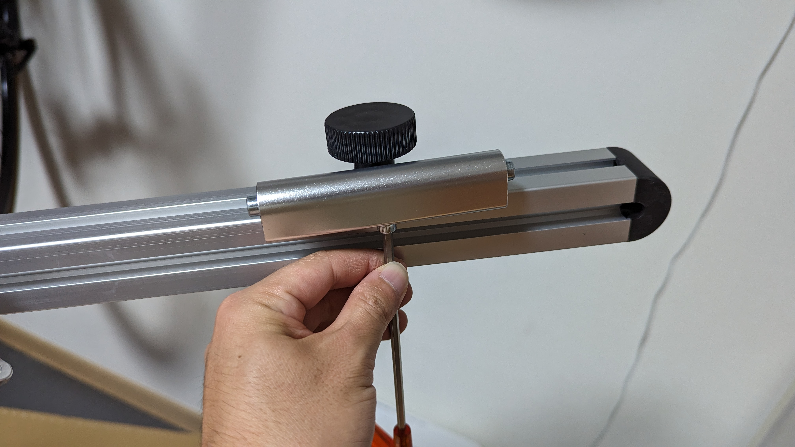
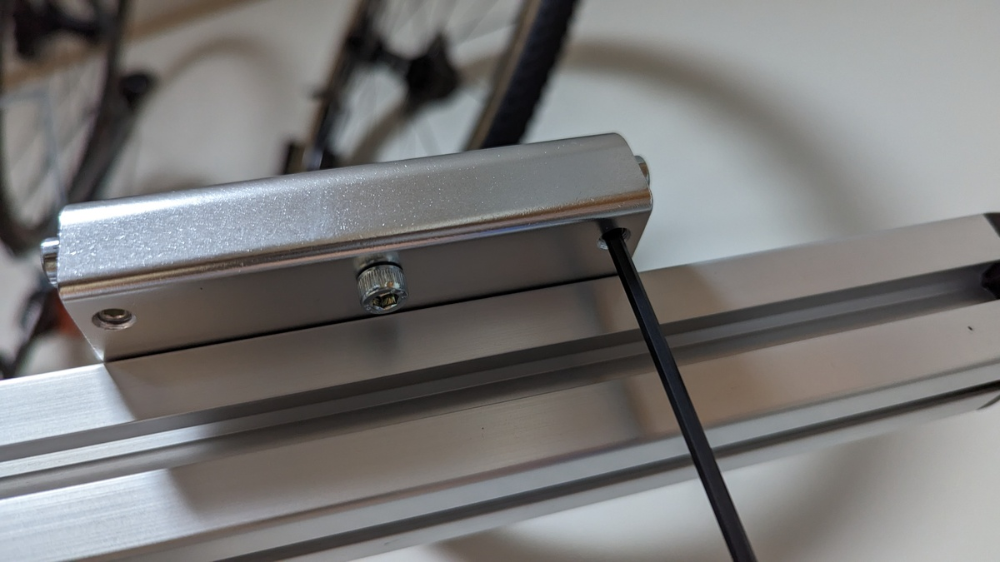
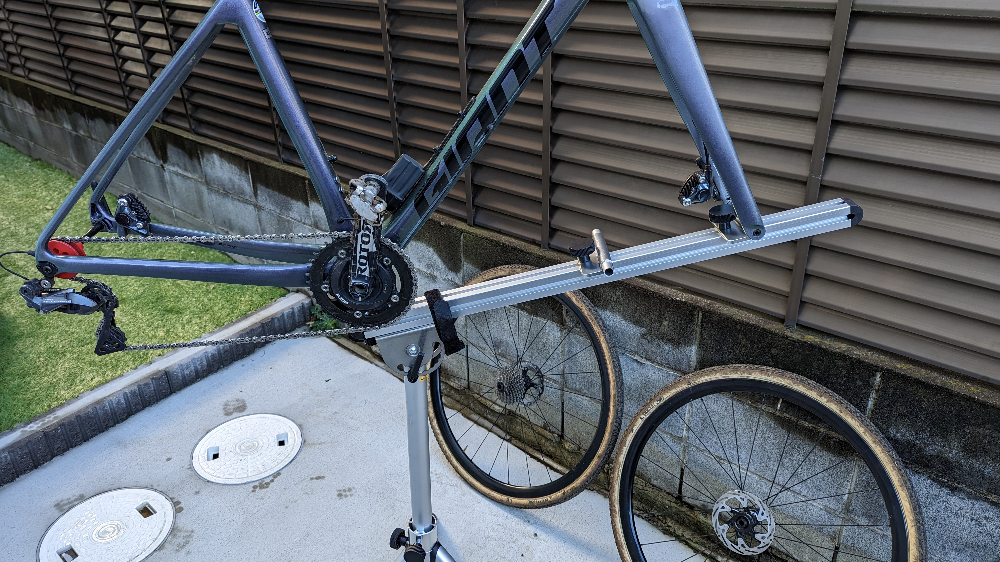

長らくアストロプロダクツのワークスタンドを自宅用のメンテナンス・洗車スタンドにしてきたが、いい加減錆びだらけのボロボロになってきたのでセールを機に[MINOURAのRS-1800 レーススタンド](https://amzn.to/3jDsGBD)を購入することにした。

## MINOURA RS-1800 レーススタンド

レース会場で洗車＆ケミカルサービスを提供してきたWAKO'S（和光ケミカル）とコラボして作成したワークスタンド。

上記写真の通り、以前はこのサービスをトップチューブをクランプするメンテナンススタンドを使って提供していた。しかし、このタイプのスタンドは手軽である反面、フレームの**左右を切り替える際に一度フレームを取り外し、フレームを回転させてまたスタンドにセットする**という手間が必要だった。また、**切り替えの際に汚れた手袋でフレームを汚してしまうし、クランプしている箇所は洗車しづらい**というデメリットもある。

[RS-1800](https://amzn.to/3jDsGBD)は、そうした手間を削減する **「BB部は置くだけ、フロントフォークマウント」** のワークスタンドだ。

**土台が回転させられる仕組み**になっており、フレームの左右を切り替えて洗う際の手間が大きく削減されていることもポイント。

また、部品の大半がアルミ素材で出来ているため、軽量かつ洗車時に水をバシャバシャとかけても錆びづらい。脚も折りたたんで自立するようになっており、**コンパクトに収納できるため持ち運びにも適している**。

とにかく**取り回しがしやすく、耐久性も兼ね備えた**スタンドとなっている。

ほぼずっと16000円台で販売されていたが、Amazonでセール時に14000円台へ値下げされることがあるので、その時が狙い。

<LinkCard url="https://www.amazon.co.jp/gp/product/B078GVS4CT/" isAmazonLink />

## セットアップ

まずは届いてすぐに室内で組み立ててみた。

**リアエンドでもフォークエンドでもマウントできる仕組み**だが、チェーンを洗うことを考えるとフォークエンドでマウントするのが主流になるだろう。

製品が届いた時点ではQR用のマウントがついていたので、これを我が家のスタンダードである12mmに取り替える。~~もうディスクロードが大半なので出荷時設定を変えてもいいと思うが…そういうところだぞ~~

QR↔12mmの交換は、マウント部のチューブ内部パーツを交換して行う。

MINOURA純正品だとブースト規格には対応していないという~~信じられない~~仕様だが、フカヤ産業から対応品が発売されているためこれを追加すればよい。

<LinkCard url="https://fukaya-nagoya.co.jp/product/rs-1800boost-fork/" />

マウント部品の中央ネジは脱落防止かつスライド溝に沿わせるためのもので、内部部品は左右のイモネジで固定されている。イモネジを緩めて内部のパーツを12mm用に交換すれば作業完了。これでCXとディスクロードが載せられるようになる。

## 実際に洗ってみた

両輪外してCX車体を載せると、ワコーズブースの気分になってくる。

スルーアクスル用のダミーハブは複数社からラインナップされているが、自分は[モーガンブルーのチェーンキーパー](https://amzn.to/3GnVtTr)がお気に入り。

<Amzn asin="B07FKGR3HX">

車体に付属しているアクスルを活用するタイプなので、**アクスルを失くす可能性がほぼゼロになる。**また、チェーンローラー部がうごいてくれるので、**洗車中にシフトチェンジして全ギアにディグリーザーを行き渡らせられる**点も良い。

話をレーススタンドに戻そう。

両輪を外してフロントフォークを固定することで、ハンドルもぶらつかずに安定した状態で洗車できる上に、**フレームのほぼ全ての面にウエスが届く**ようになる。

シクロクロスで汚れやすいサドル裏・シートチューブ裏・フォーク裏など、様々な「裏」の汚れを簡単に手を入れて落とすことができるため、いつも以上にピカピカになる。

チェーンもホイールを外している分、ディグリーザーが垂れてホイールやタイヤにかかったりしない安心感があるし、洗うそばからスプロケットの汚れを拾う無間地獄からも解放された。

そして、**フレームの反対側を洗うのに脚を回転させるだけ**というのは思っていた以上にメリットがある。

洗い残しがあったり、拭いている途中で反対側に汚れが飛んだりしてもクルンと回せばすぐに拭き取れる。革命的だ。

ホイールを外したりダミーハブを装着したりと、作業全体は増えているが、このスタンドは後輪をはめたままでも干渉しないため、簡易手順を取ることもできる。マルチな使い心地の1台だと感じた。

## まとめ

軽量で様々な作業に対応でき、折りたたんでコンパクトに保管できるワークスタンドの決定版。

洗車する頻度の多いオフロード系自転車乗りには是非ともおすすめしたい。

<LinkCard url="https://www.amazon.co.jp/gp/product/B078GVS4CT/" isAmazonLink />
