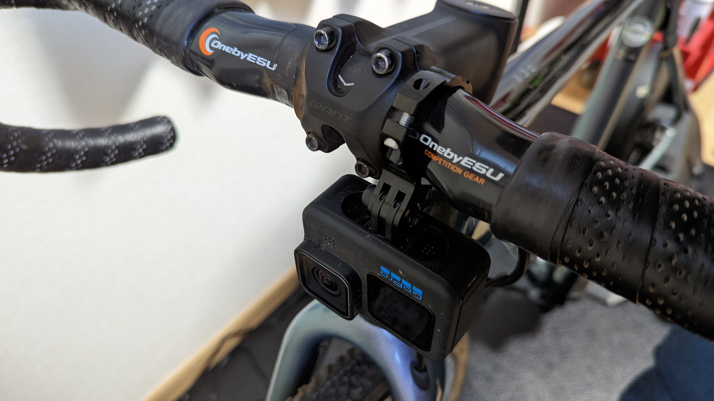
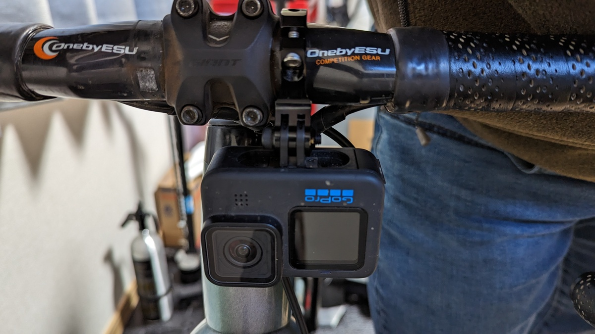
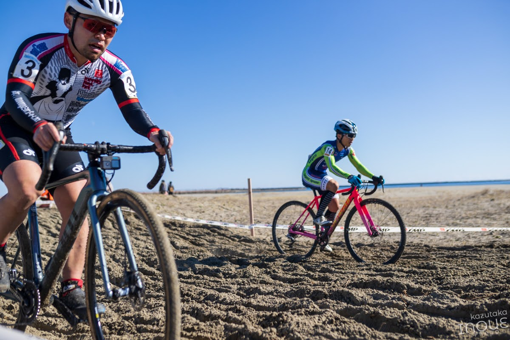

## ログは取りたい。バイクは替えたい。

シクロクロスレースとサイクルコンピューターによるログ計測は実は相性が悪い。

というのも、レース中にバイクを乗り換える可能性のあるシクロクロスでは、ハンドルにマウントするタイプのサイクルコンピューターだと、バイクを乗り換えた段階でログが途切れてしまうからだ。

欧州のワールドカップをはじめとするシクロクロスレースでも、プロはゴール後にスマートウォッチのログ記録を止めている光景を見ることができる。

もちろん、プロのみならず自分のようなデータ計測オタクにも、ログがない自転車など考えることもできない。

スマートウォッチを24時間装着している自分にとっては、**運動中にそのログを取っていないことは耐えがたい**。乗り降りを繰り返すシクロクロスのパワーデータはそんなに意味が無いかもしれないが、心拍データには意味がある。

（実を言うと今は2台体制ではないのだが）レース中、ついサイコンに目を落としてしまう癖もあるので、**悪癖の克服・ハンドル周りの軽量化・ログ取りの柔軟性という3点**を求めてサイクルコンピューターをシクロクロスから排除してみた。

## 必要条件

サイクルコンピューターで行っていたログ取得を全て肩代わりできるスマートウォッチを持っている必要がある。

必要条件となる項目は以下の通り。

- GPSスピード
- ANT+/BTパワーメーター
- 心拍計
- 自動位置ラップ

この中でネックとなるのはパワーメーターペアリングだが、昨年購入した[GARMIN Forerunner 255S](https://amzn.to/3IMI0Ec)はパワーメーターペアリングが可能だ。つまり機能的には全く問題なく移行できる。

これまでは、事前に**心拍転送モードを利用**してサイクルコンピューターに心拍をANT+で転送していたが、不要になる。サイコンとスマートウォッチをいじってスタートしていたが、スマートウォッチをいじるだけでログ取得を開始できるので、サイコンをいじる1アクションがスタート前に節約できることとなる。

[Forerunner 255S](https://amzn.to/3IMI0Ec)のレビューについては過去の記事を参照。手首心拍計が進化しており、過去モデルに比べて振動のある局面でも計測精度が向上している。

<LinkCard url="https://blog.gensobunya.net/post/2022/07/fr255s_review/" />

## ハンドル周りの改装

次は、不要になったサイクルコンピューターマウントを取り外す。

GoProを吊り下げていたパーツが無くなるので、代わりにレックマウントの[ハンドルバーマウント タイプ7](https://amzn.to/3DF7RwI)を利用してマウント部を確保した。

<Amzn asin="B00HU3LCOS" />

**ハンドルから飛び出している部分がなくなる**ので、乗車時の自分の視界はかなりすっきりする。~~これでレース中うなだれて首を落としてもヘルメットがサイコンと激突することもなくなるな~~

冗談はさておき、シクロクロスはとにかく予想できないことが起きるので、出っ張りを1つ排除して不確定要素が無くなるのはいいことだ（それがどんなに可能性の低いことだとしても）

担いだ時に誰かとぶつかったり、落車に巻き込まれた後でサイコンが明後日の方向を向いているのを見たことがないわけではないし、うっかりサイコンを脱落させることは原理上なくなった。

レース中の画像を見ると、あるべきものが無い気分になってくるが、一人称視点では視界が開けた気分で中々良いものだった。

## 実際にやってみた

先日の[茨城シクロクロス大洗サンビーチステージ](https://blog.gensobunya.net/post/2023/01/2023_oharai/)でこの装備を実戦投入してみた。

何回か落車をしたが、サイコンの心配をしなくていい（曲がっているのを直さなくていい）ので地味にうれしかった記憶がある。

肝心のログの方だが、**単一ログとしては全く問題なく取得できている**。むしろ、ランニングを想定している **[FR255S](https://amzn.to/3IMI0Ec)の方が[Edge530](https://amzn.to/3JBSY1W)よりも細かい動きをGPSログで拾ってくれる**ので、シクロクロスのような細かいコーナーのあるコースのログとしてはGPS軌跡の見た目は良くなった。

"バイク"アクティビティとして記録したのだが、GARMIN Connectの推定VO2Maxがランニングとしてカウントされてしまうという問題が発生した（報告済み）が、これ以外は拍子抜けするほど違和感なく使うことができた。

## サイクルコンピューターは不要か？

最も乗っているシクロクロスからサイクルコンピューターをなくしたが、他のロードバイクやMTBでも同じようにスマートウォッチでの記録に切り替えられるだろうか？

今のところ、**答えはNOだと考えている**。

年に数回かならずナビ（ルート）機能を使う局面はある。サイクルコンピューターと違ってスマートウォッチのマップは確認しづらく、安全性に欠けるので、**ナビゲーションに関してはサイコンに分がある**。

それに加えて、MTBダイナミクスはどうやら手首計測だとまともにジャンプを計測できないようなので、こちらもサイコンのアドバンテージになる。また、長時間の利用だとスマートウォッチのバッテリーも心配になってくるので、そういった時は別のバッテリーを使うサイコンを使いたいところ。（スマートウォッチは風呂に入っているときにしか充電するチャンスが無い）

**適材適所で使い分け、いざとなったらお互いのバックアップにする程度**にとどめておくのが今のところの最適解だと感じている。

<Amzn asin="B0B18M3381" />
