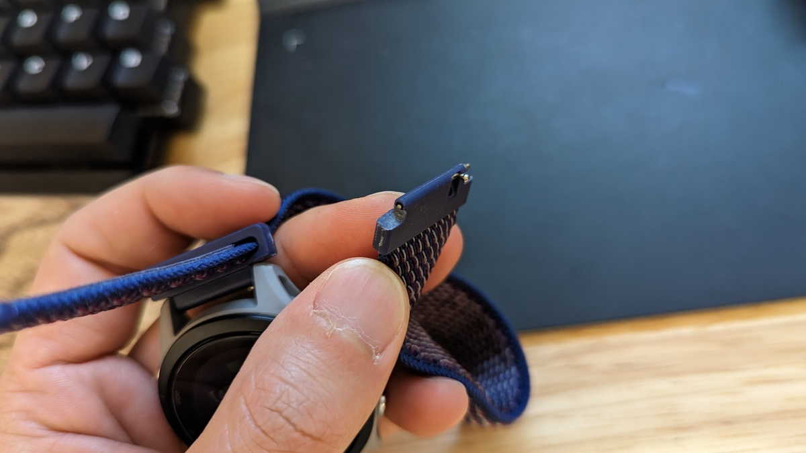

純正のシリコンバンドで穴の位置も不満なく、汗をかいても特にかぶれることも無かったので、交換の必然性は薄いのだが気分転換に[Forerunner 255S](https://amzn.to/3IMI0Ec)交換してみた。

[Forerunner 255S](https://amzn.to/3IMI0Ec)のバンドは18mmで、一般的なバネ棒による取り付けとなっているので、Amazonの安い商品を購入。

<LinkCard url="https://www.amazon.co.jp/gp/product/B09WT54C2B/" isAmazonLink />

マグネット固定の金属バンドや、別カラーのシリコンバンドも選択肢にあったが、ズレることなく蒸れもしないという点からベルクロ留めのナイロンバンドを選択。

## ポン付け不可という問題

参考にしたのはすくみずログのFenix用バンド交換生地。

<LinkCard url="https://skmzlog.com/garmin-fenix-7s-nylon-band/" />

Fenixなどと違い、一般的なバネ棒ということもあって取り付けは問題ないかと思っていたが、Forerunnerの取り付け部が厚くそのままでは取り付けができなかった。

バンド端が樹脂ではなく、バネ棒に対してループさせるタイプのバンドを買うことも考えたが、18mmバンドにはこうした取り付け方法の製品が見当たらなかった。やむなくバンド側を削ることに。

追加で0.2～0.3mmほどクリアランスを確保すればよさそうだったので、適当にガリガリ削っていく

## できあがり

あっという間に削り終わって作業完了。

シリコンバンドを固定した時に比べて、確かに**締め付け感は少ないし、汗をかいてもバンドの穴に溜まることもなく快適**。

問題は乾燥スピードだと思っていたのだが、汗も水もあっという間に乾いていく。予想以上に快適でいい買い物をした。

<LinkCard url="https://www.amazon.co.jp/gp/product/B09WT54C2B/" isAmazonLink />

<Amzn asin="B0B18M3381" />
