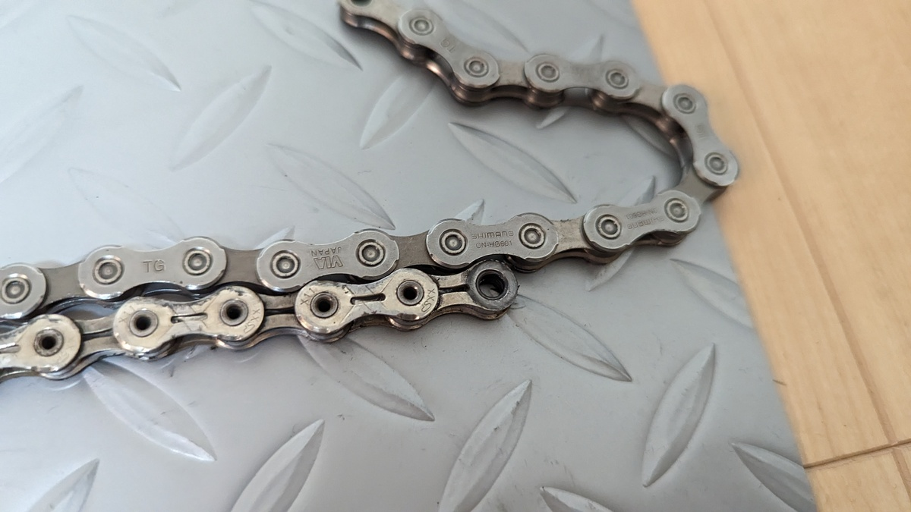

CXシーズンが終わって最初にやることはなんだろうか？

そう、車体のオーバーホールだ。パーツの消耗度をチェックして、交換し、ベアリング周りを綺麗にして、来シーズンに備える。

## チェーン交換だけでは片手落ち

通常、チェーンは毎シーズン交換するものだが、昨年は参戦レース数が少なかったこともありチェーンを交換しなかった。

**CXで使うチェーンはピン周りの摩耗による伸び以外にもダメージが多い**ため、基本はシーズンに1本使う。流石に2シーズン使うと[シマノのチェッカー](https://amzn.to/3k8t34w)で要交換になるほどガッツリ摩耗していた。

<Amzn asin="B00DT01OBC">

SHIMANOの謹製チェーンチェッカーである[TK-C42](https://amzn.to/3k8t34w)は、**コマの遊びを除いて正しいチェーンの伸び率を計測してくれる**正確なチェーンチェッカー。

2通りのチェッカーがあったり、余計なことを考えないで交換か否か判定できるので愛用している。詳しくは過去記事を参照してほしい。

<LinkCard url="https://blog.gensobunya.net/post/2021/11/shimano_chain_checker/" />

交換したチェーンは[CN-HG601-11](https://amzn.to/438VMuG)だ。なぜかAmazonだとチェーンピン仕様よりクイックリンク仕様の方が安かったので、クイックリンク付のものを購入した。

ミッシングリンクの取り外し、取り付けには[専用工具](https://amzn.to/3MszwpY)があると楽。素手でも可能であるが、正確に並行を出さないといけないので面倒だ。

<Amzn asin="B00CF8CXFK">

素手ならともかく、保護手袋をした状態で精密作業をするのは現実的ではないので、毎回工具で脱着している。装着時はペダルを蹴るのもいいが、取り付けが甘い状態でもパワーで嵌まってしまい取り外しが面倒になったりリンクが死んだりするのも嫌なので…

交換後に見比べると、かなり伸びていることがわかる。こんな状態で使い続けていると、当然噛み合っている側もただでは済まないわけで…

## チェーンリング交換と、シングルスピードチェーンリングボルトの闇

チェーン交換したはいいものの、オフシーズンの定位置であるスマートローラーにセットして使ったところ、 **「ゴロゴロ」という凄まじい駆動音**が。

チェーンが摩耗した状態で使い続けたため、チェーンリングか、スプロケのどちらか（もしくは両方）が死んでしまっているようだ。一度に両方交換してもよいのだが、ローラーの方が実走より短いであろうことと、比較的安価なチェーンリング側をまずは交換してみた。

交換元も、交換先も[アリエク産の怪しげなナローワイドチェーンリング](https://s.click.aliexpress.com/e/_DlKHA2H)。

5穴の110BCDチェーンリングはこういった怪しいパーツがたくさん転がっているのがメリットの1つだ。1枚2000円もあれば手に入るので、ウルフトゥースのDrop-stopが5枚買える。

一方で、耐摩耗性は悪いので1~2シーズンで交換を強いられる。

交換前と交換後のチェーンリングの差がこちら。

写真では分かりにくいが、新品には存在する刃先の形状加工が完全にすり減ってただの尖った三角形になってしまっている。

合わせて、チェーンリングボルトも今回交換した。

舐めるのが嫌で、スチール製のチェーンリングボルトを愛用している。

<Amzn asin="B0855CWFRP">

**フロントシングル用のチェーンリングボルト選びは意外と厄介**で、大半のチェーンリングボルトは4mm(or 4.5mm), 6mm(or 6.5mm)といったサイズがラインナップされており、**スパイダーアームの厚さとチェーンリングの厚さ**によって適合するサイズが違う。（主に関係があるのはナット側）

特にナローワイドチェーンリングはダブル用クランクにも装着することを想定しており、メーカーによって厚みの設計が違う。親切にダブル用のチェーンリングボルトで装着できるよう厚みを増やしていたり、何も考えていなかったり、自社のボルトとセットで使うことを想定していたり…

結果として、長めのものを買って**スペーサーで調節するか、サイズをいくつか在庫しておき現物合わせ**する必要がある。

<Amzn asin="B09DW8GLRW">

今回はたまたま在庫のチェーンリングボルトですんなり固定できて助かった。

## 交換結果

見事に固定方向を間違えてアームとリングのロゴ位置が合っていないが、とにかくヨシ！

ローラー時の異音も消えてくれたので、スプロケ交換はまた今度でよさそうだ。

チェーンの伸びを放置すると、チェーンリングやスプロケットも変に摩耗してしまうので伸びすぎる前の交換がおすすめ。

<Amzn asin="B00DT01OBC">
