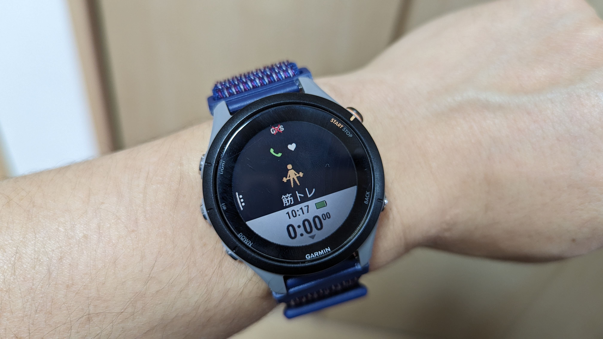

シクロクロスもオフシーズンになり、春夏はもっぱら体づくり。

ランニングをしたり、ジムで筋トレをしたりしているのだが、こういう局面でもGARMINウォッチ（[Forerunner 255S](https://amzn.to/3IMI0Ec)）が活躍してくれる。

<Amzn asin="B0B18M3381">

機種名の通り、ランニングのログは「ランニングパワー」などの興味深いデータも含め取得してくれるのだが、今回はそれらはおいておき、**あまり注目されない「筋トレ」アクティビティ**のログ機能を紹介したい。

サイクリングガジェットとしてのレビューは過去記事を参照。

<LinkCard url="https://blog.gensobunya.net/post/2022/07/fr255s_review/" />

## 筋トレのログ

筋力トレーニングでログを取るなら、最低限の内容として…

- 種目
- 回数
- 重量

この3点は記録したい。

このログを意味あるものにするためには、REP数ごとの限界重量も把握しておく必要があるが、それはあとから分析することもできるので後回し。

## ガーミンウォッチでの筋トレログ取得方法

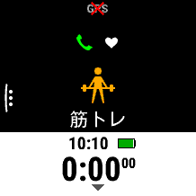

アクティビティのスタートについてはバイクやランとほぼ同じなのだが、**筋トレの「セット」「レスト」という概念**を記録するために、有酸素運動と違って細かくスマートウォッチを操作する必要がある。

まず、アクティビティ開始時は即1セット目がスタートする。

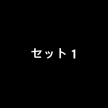

セット中は回数・心拍・経過時間・消費カロリーを表示。後述するがこの **「回数」は手首の動きから自動的にカウント** となる。

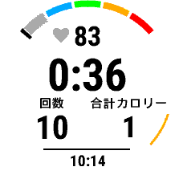

**Back/Lapボタンでレスト**に入るのだが、ここで終了したセットの情報を編集できる。

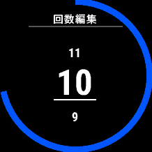

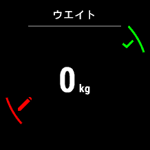

重量は1セット目は0kgだが、**2回目以降は前セットの重量を引き継ぐ**ため、ドロップセットを組んだりしない限りは種目が変わるまで編集は不要となる。

百の位は別項目扱いであることと、**長押しで5kgずつ上下**させられるため、腕メニューと脚メニューの間で大きく重量が変動する際もさして不便ではない。

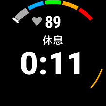

レスト中は心拍と時間が表示されるので、これを参考にレスト時間を過ごす。

この時点で前セットの修正を忘れてしまったとしても、レスト中にバックボタン長押しで修正をすることができる。

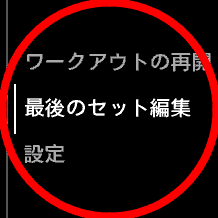

**筋トレ全体を終えるときはStart/stopボタンをレスト中に押す**と見慣れた保存・削除画面に遷移する。

トイレや長いレスト、一旦小休止をする時に元のウォッチフェイスを見たい場合は「後で再開」という機能もあるので、メニューは中断するがアクティビティは分けたくない場合はこの機能を使っている。

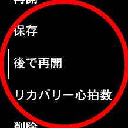

当然ではあるが、操作は基本的にセットの頭と最後・レスト中にしか行わない仕組みになっているし、重量や回数など忘れてしまいがちな数値はその場で記録できるようになっている。

つい連打して**重量や回数を補正せずレストに入ってしまっても、最後のセットはその後も編集可能**である点は非常に利用者目線に立っており、良い設計だ。

### 計測する項目

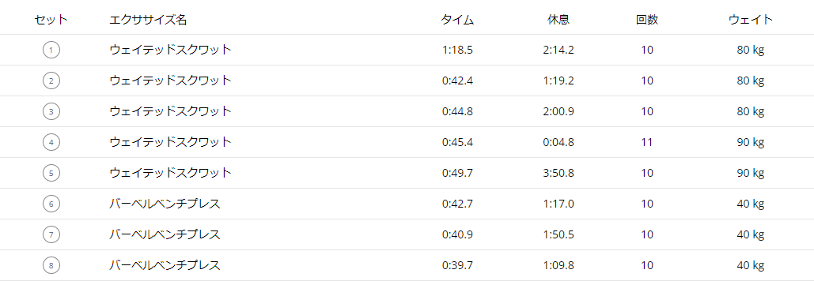

完了したログでは「種目」「回数」「重量」が確認できる。

心拍数や、有酸素ではお馴染みの「トレーニング効果」なども記録されているが筋トレではほぼ意味はないと考えていいだろう。

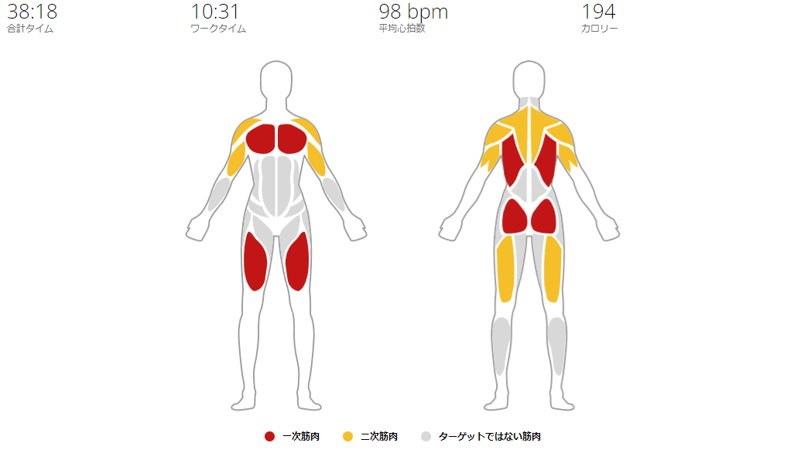

面白いポイントとして、GARMIN CONNECTでは認識した**種目をもとに、効いている筋肉を視覚化**してくれる。

筋トレにおいて重要なポイントである鍛える部位が分かるため、**フォームが崩れて別に筋肉に効いていないか**といった反省や、**ワークアウト後のストレッチ**の参考にできる。

筋トレmemoをはじめとする専用アプリのようなRM計算機能などは持ち合わせていないが、GARMINデバイスを持っている人がライトにワークアウトの記録を取るには最適だ。何より記録が半自動なのがよい。

### 自動認識と手動補正

上記3種類の項目を自動認識してはいるのだが、この**認識精度はメニューによって大きな差**がある。

回数認識では、自重で行うプッシュアップ（腕立て伏せ）やスクワットはかなり精度が良いが、当然レッグプレスのような**腕の動かないメニューはカウントされない**。

**BIG3以外のメニュー認識は完全にオマケ**程度に考えていた方がよい。メニュー修正はアクティビティ保存後なので、あとで見返すために修正しておく程度の気分だ。

あと、ニーリング・アブ・ホイール（いわゆる膝コロ）があるのに立ちコロ相当のメニューは存在しないなど、若干詰めが甘い…

## ライフログへの影響はあるか？

筋トレ中もランニングやサイクリングと同じように、心拍数ベースでの**無酸素エフォート・有酸素エフォートがカウントされる**。

同時に消費カロリーも記録されるが、一般的に**筋トレでは心拍数の高い状態を維持することは珍しく**、GARMIN的には非常に低強度のワークアウトとして記録される。

**一方で、筋肉には確実にダメージがきているはず**なので、筋トレ後にGARMIN CONNECTで表示される疲労度を元に有酸素ワークアウトの強度を上げるのは避けた方がよさそうだ。CONNECTで表示されるレディネスは**あくまで有酸素能力上の疲労度**であることを念頭に置く必要がある。

とはいえ、運動全てのログを一元的に管理できる心地よさがこの機能にはあるので、当面使い続けていくだろう。

<Amzn asin="B0BWF162WJ">
