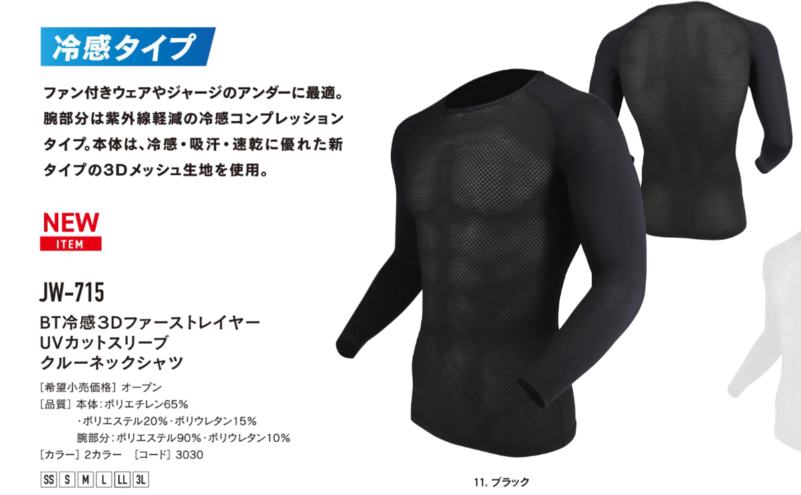
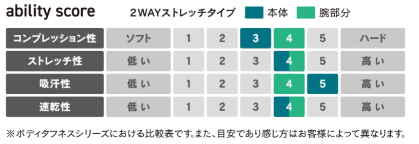

夏だからこそ長袖。

日焼けから腕を守り、トレイルでは草かぶれを防ぎ、素材が良ければ素肌より汗の乾きも速い。

特に、ロードバイクをはじめとする自転車では日焼け止めは超強力な[ワコーズ アグレッシブデザイン](https://amzn.to/3N2cVA4)のような**超強力なものを使うか、何度も塗り直しをしないと十分な効果は得られない。**

そんな記事を書いたのが6年前。

<LinkBox url="https://blog.gensobunya.net/post/2017/07/longsleeve/" />

現在では、素材の進化もあり**夏用の長袖サイクルジャージ**や、**[自転車向けに胴体と袖で素材を変えたアンダーシャツ](https://amzn.to/3BXzLCM)**が発売されるなど、時代が追いついてきた。

最近新しく買ったものとしては、[Bioracerの長袖ジャージ](https://bioracer.jp/bioracer_icon51470/)、[LAMEDAの長袖ジャージ](https://lameda.jp/products/phantasosgradelong)があり、ありがたく使わせていただいている。

一方で、**山のようにある手持ちの半袖ジャージを活かすためにはまだまだアンダーシャツが必要**。前回の記事を書いた時点では汎用スポーツのアンダーシャツを使っていたが、胴体部分も袖と同じ生地ということもあって胴体は暑めだった。

自転車の運動特性を考えると、**胴体はもっと放熱力を高めた3Dメッシュで袖はUVカットを重視してほしい**。上記でリンクしたパールイズミのインナーシャツはまさにそうした構造で理想的だ。

<LinkBox url="https://www.amazon.co.jp/dp/B0B7632Q5N/" isAmazonLink />

弱点はその価格、みんな大好きな[ドライナミックノースリーブシャツ](https://amzn.to/439Rjrr)が4000円台で買えることを考えると、少し躊躇する。

しかし…今は違う！おたふく手袋の2023年の春夏モデルで[JW-715](https://amzn.to/3MZYjBz)なる3Dメッシュ＋UVカット長袖＋冷感素材の全部入りインナーシャツが登場した。（非冷感の[JW-523](https://amzn.to/43chdL9)というものも昨年登場済み）

低コストに定評のあるおたふく手袋ということもあり、**Amazon.co.jpでの販売価格は2000円弱**。お試しにはぴったりということで、購入してみた。

<LinkBox url="https://www.amazon.co.jp/gp/product/B0BRZXP9M3/" isAmazonLink />

## スペック

正式名称は「[BT冷感3Dファーストレイヤー UVカットスリーブ クルーネックシャツ](https://amzn.to/3MZYjBz)」。

UVカットのロングスリーブ、冷感3Dメッシュの胴体部、おたふく手袋シリーズ比では胴体コンプレッション性は平均的数値となっている。

サイクリストとしては、**サイクルジャージに合わせやすくするためのコンプレッション性**と、ファーストレイヤーの主な役割である **「汗の吸い上げ」に関わる吸汗性**が気になるところ。ジャージに汗を移して体を乾いた状態に維持し、ジャージに当たった風で汗を乾かし気化熱で温度を下げることが重要。

[ドライナミックシャツ](https://amzn.to/439Rjrr)は特に後者が優れていて、その快適性を評価されている。

## インプレッション

サイズチャートには参考身長と胸囲が指標として記載されている。チャートによると、自分に合うのは胸囲に合わせたMサイズか、身長に合わせたSサイズ。

やや嫌な予感はするものの、パツパツよりはやや緩めのほうが活用方法は残るのでMサイズをチョイスしたところ、**袖は手首まで長く伸ばしても肘回りをはじめとして布が余り気味**だ。

一方で胸囲はピッタリで、着用感は悪くないのもあり、サイズ選びは悩ましくなりそう。

**初夏の気温低めの日（15度～25度）の日のグラベルライド**でテストを行った。

この日は日較差が大きく、肌寒さから暑さまでの対応が求められたが、**長袖ということもあり朝の冷たい風が直接あたることを防ぎ、昼過ぎの暑さにも対応できる**懐の広さを見せてくれた。

スペック表にある通り**コンプレッションはサイクリスト的には弱く**、バタつくほどではないが布は余り気味になるのは気になった。よく言えば自転車を降りたときに無理のない姿勢でいられるとも言える。

胴**体部分は期待通り、汗を体から吸い上げてくれ**ており、以前使っていたアンダーアーマーの袖まで全て同じ素材のインナーウェアとは天と地の差だ。

一方でジャージの前を開けてダウンヒルするような局面での涼しさははドライナミックより劣る。値段なりというよりは、これはメッシュ素材に厚みがあり、表面積を最大限稼ぐドライナミックと違って、おたふくJW-715がペラペラ系の素材である故だろう。

**超高性能とはいかないが、現代的な長袖インナーとして合格点の性能**を見せてくれているというのが総評だ。

### 使いどころ

こうした安価でそこそこのパフォーマンスのインナーは、**日々の練習・ツーリング・トレイル・グラベルのような楽さを重視したいシチュエーション**で活用していきたい。性能を考えると、**ロードレースならピッタリした長袖ジャージに高性能インナー**を着用した方がよさそうだ。

レギュレーションもあって、気持ち程度ではあるもののBioracerの長袖ジャージは袖に空力改善用と思しき溝も切られていて、エアロ効果と涼しさを同時に得られる。

高性能ウェアはどうしても薄かったり、丁寧な洗濯をしないと性能が落ちたりしがちなので多用はしたくないもの。一方で**快適性はどんなライドでも享受したいのが人の心**。そうしたときにこうしたコストパフォーマンスのよいウェアが役に立つだろう。

<LinkBox url="https://www.amazon.co.jp/gp/product/B0BRZXP9M3/" isAmazonLink />
