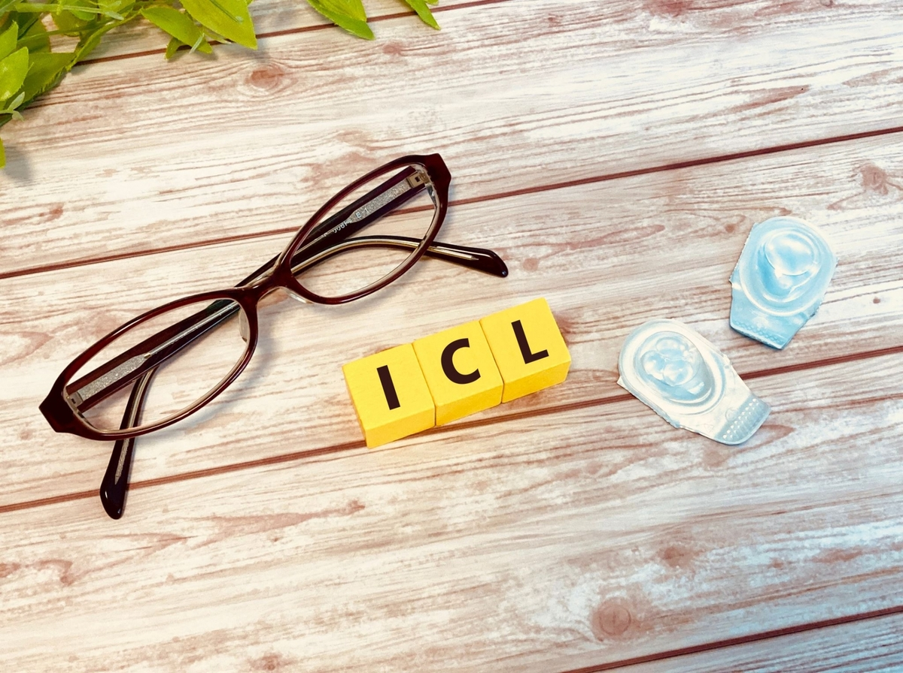
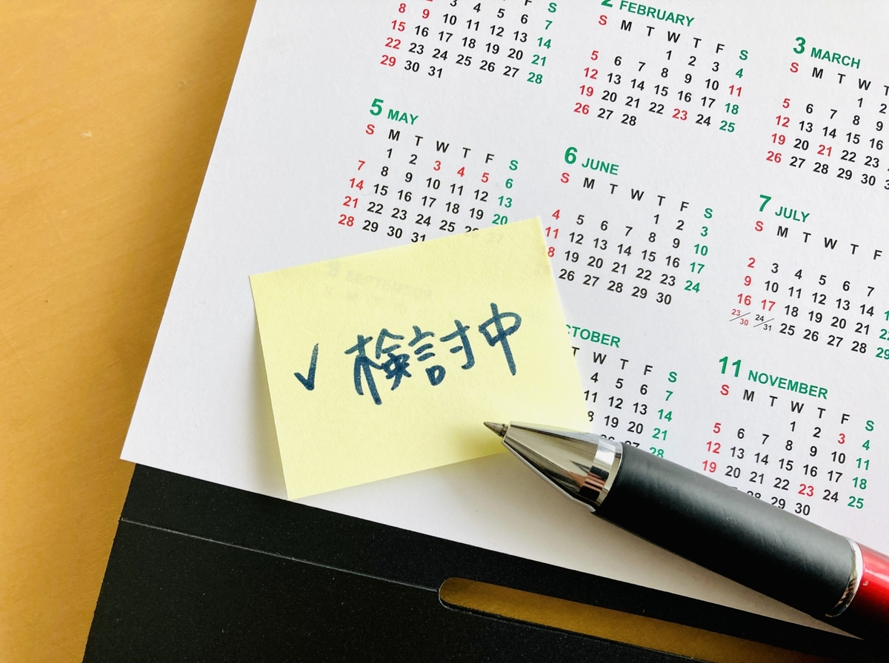
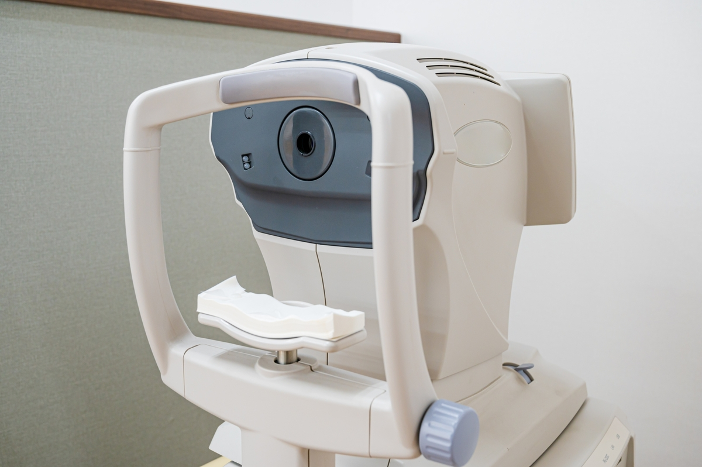
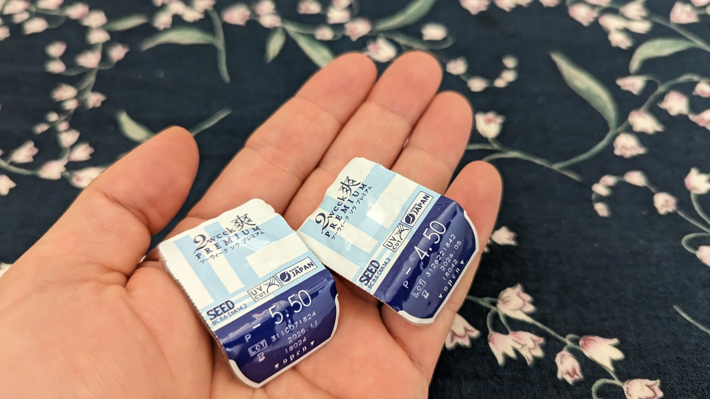

レーシックやICL(IOL)手術は日本でも認知度が上がっており、もはや近視の人では知らない人はいないかと思う。

自分の体を生業とするスポーツ選手でもレーシックをする人が増えてきたりと、体感ではあるが信頼度も向上してきたように見える。何よりもうウン万人も手術して根本的に問題があったら既に大問題になっているだろう。

とはいえ、眼にメス（実際にはレーザーだが）を入れて切開したり、運動制限や術後管理も必要になるので不安になる人も多いだろう。

（一応）ホビーレーサーのサイクリストである自分が、ICL手術を受けて高強度運動解禁になるまでの期間の計画やレポートをメモ形式で残しておく。

**基本的に検査数値の記録や、行動制限とそれに関する計画をメイン**に全2回の記事になる予定。どこそこの医院がいいとか、副作用がどうとかいう話はしないので予めご了承をば。

## 経緯

ICL手術の費用は医療費控除の対象になると知ったことがきっかけ。

レーシックが気になっていた時期もあり、ICLは費用が掛かる代わりに**可逆的なアプローチ**で将来的な眼の病気にも対応できる他、**夜間の視力問題も出にくい**ということは知っていた。

いつも使っている[2weekコンタクトレンズの費用](https://store.shopping.yahoo.co.jp/y-kojima/2915120002835.html)が両眼3カ月で5000円。1年で2万円、40年で80万円…

**既に手術費用より高い**。実際はケア用品や短期旅行用の1day、眼鏡更新などもあるのでもっとかかる。

それならば、一時の不便や出費があっても**毎日や遠征時の面倒が減らせる上に節税もできるほうがよいのでは**…という結論に至った。

矯正の手間は、こうした矯正具の購入だけでなく、**泊りの際に必ずケアセットを持ち歩かなければならない**という点が大きい。

<Amzn asin="B01H1DBZ8Y">

出張や遠征先・旅行先でコンビニに駆け込み[サクラプチケア](https://amzn.to/3oVnrzW)を慌てて買ったのは一度や二度ではない。コンタクトレンズが無かったら最低限の生活もできないのだ。

レースや出張もそれなりにある生活をしているので、こうした日々の悩み事が減るというのは非常に助かる。

## シクロクロスシーズンに合わせた手術計画

ICL手術はレーシックと違い、物理的なレンズが必要になるため検査から手術までリードタイムが発生する。

この生産配送の**リードタイムが1カ月半から2カ月**、**1カ月後からインターバル・高強度有酸素が可能**になる。

そのほか、下記の拘束時間が発生する。

- 適性検査から手術まで1～2カ月（生産次第で伸びる可能性あり）
- 手術翌日は仕事不可
- 手術3日後に検診
- 手術1週間後に検診**（術後1週間は洗髪洗顔不可）**
- 手術後1カ月は激しい運動が禁止
- 以後1カ月・3カ月・半年と定期健診

**適性検査からトレーニング開始まで3カ月**ほどの時間が必要。

シクロクロスシーズンが9月後半からと考えた際に、調子をあげるのに1カ月必要と考えた場合に**最低でも6月に適性検査と考えるがこれは罠。**

レーシック経験者から教えてもらったのだが、**眼の手術後は洗髪洗顔をできない期間が1週間あり、非常に不快（経験者談）**。これを最低限に抑えるためには涼しい時期に手術を受ける必要があるとのこと。

そう考えると、2月のシーズンアウトすぐに適性検査を受けて手術日を確定させるのが最適解だった。

ちなみに**適応検査は3日前からコンタクトを外して生活する必要がある上、散瞳も実施するので当日他の予定は入れられない**と思っておくべき。

## 適応検査、そして

最初に価格が安い某大型クリニックで適性検査を受けたが、**ICLはおろか、レーシックも非適応**という結果だった。

それぞれ角膜厚や前房深度が関連するのだが、このクリニックでは2点とも非適応とのこと（度数や乱視ではなく瞳や眼球の特徴で）

1週間ほど打ちひしがれていたが、適応範囲はクリニックによって若干変動するとのことで、同じく某大型クリニックで断られた知人が適応となった別のクリニックを紹介してもらい、適応検査を再度受けることにした。

## 適応検査その2

価格は1.5倍ほどだが、ICL手術の権威（らしい）人物のクリニックへ。

検査の結果、「たしかにギリギリだけどうちならできるよ」とのことで、**ICL適応！**

適応することがわかったらあとは**ドタバタとその日のうちに手術日・術限検査・術後検診の日程を確定させる**ことになる。

事前に向こう3カ月のスケジュールは明確にしておこう。

## 術前の過ごし方

日程は、適応検査後にもう1度視力検査をして、乱視や近視のコンディション（日によって違うらしい）をチェックした後、希望した日が確定となる。

自分は**若干だが乱視も入っていたので、その分レンズの代金が上乗せ**になった。控除されるとはいえなんだかんだ費用がかさんでいくが気にしない。

手術前**3日間は検査と同じくコンタクトレンズ禁止**になる他、感染症を防ぐため抗生物質や抗菌点眼薬などが大量に渡される。

眼の感染症など考えたくもないので、言われた通り日に3回以上の点眼や飲み薬の習慣をこなし、手術日を待った。

20年ぶりの裸眼生活、どのようなものか全く覚えていないが、コンタクトレンズのない生活を想像して心躍らせていた。

手術当日・術後管理編へ続く

<LinkCard url="https://blog.gensobunya.net/post/2023/06/cyclist_icl_note2/" />

<LinkCard
  url="https://store.shopping.yahoo.co.jp/y-kojima/2915120002835.html"
  linkUrl="http://dalr.valuecommerce.com/dck/d629d0938a?pid=886313738&sid=3171302&aid=2821580&mid=2201292&ub=ZIQDeQAIRK9qSUrDwKhumMCobjEInw%3D%3D&rid=ZIQGYgAHQ3xqSUrDCoICMAqCACoGzA&isec=64840662&vcurl=https%3A%2F%2Fstore.shopping.yahoo.co.jp%2Fy-kojima%2F2915120002835.html&ckref=http%3A%2F%2Flocalhost%3A8000%2Fpost%2F2023%2F06%2Fcyclist_icl_note1%2F&ih=MndlZWvjgrPjg7Pjgr_jgq_jg4jjg6zjg7Pjgrrjga7osrvnlKg&vo__ih=MndlZWvjgrPjg7Pjgr_jgq_jg4jjg6zjg7Pjgrrjga7osrvnlKg&vo__uri=https%3A%2F%2Fstore.shopping.yahoo.co.jp%2Fy-kojima%2F2915120002835.html"
/>
