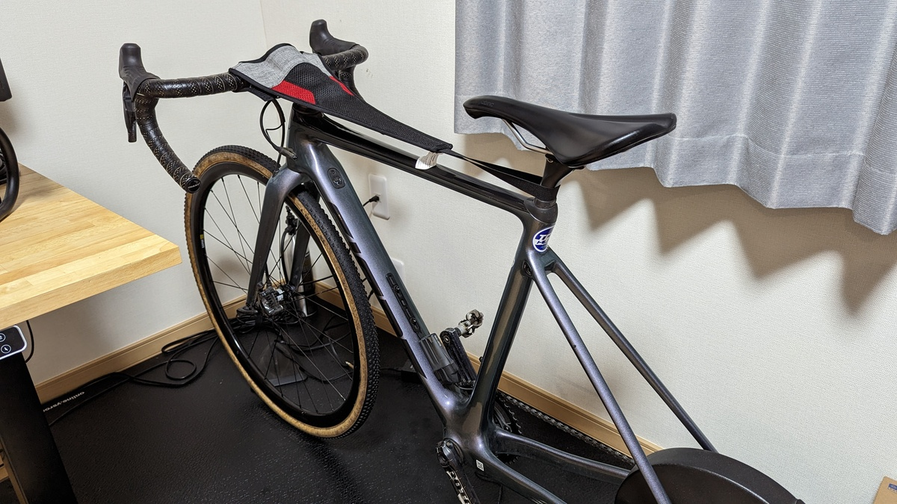

今回はICL手術当日と術後管理のメモ。

時系列で何が起きるかをメモしつつ、体力が落ちすぎないようにやっていたことを記載していく。

点眼頻度・期間や禁止事項については、クリニックによって説明が異なるため、全員に当てはまるものではなく一例として読んでほしい。

前回の記事はこちら。

<LinkBox url="https://blog.gensobunya.net/post/2023/06/cyclist_icl_note1/" />

## TL;DR

- 人によっては3日～1週間休みが必要（かも）
- 笑気麻酔は使っておけ
- 半年点眼とクリアな視界

## 手術当日

当日は朝から散瞳と抗生物質の点眼をしばらく行った後に手術室入り。

消毒液を術中ひたすら目に流すため、汚れてもよく色の濃いTシャツを着てくるようにとのことだった。岸田教団のライブTシャツが死ぬほど余っているのでこの点は問題ない…

笑気麻酔が有料オプションなので、実施するか確認される。**せっかくの機会なので眼をいじられる感じを覚えておこうと麻酔は断った**。この判断が

そうしたら、「ではこれを…」と差し出されたのだ**ゴムボール**

**「オペ中はどうしても力むと思うのでこれを握って気を紛らわせてください」** とのこと。あれ？もしかしてさっきの麻酔判断ミスした？

### 術中

白衣を着たらそのまま手術室にIN。

顔にカバーがかけられて、片目だけが見える状態にされ、麻酔を点眼。そして、瞬きができないように接着力のあるシールで瞼を固定。

手術での8**術野確保は鋏のような無理やり開く金属器具を使うもの**だと思っていたので拍子抜け。

「強制的に開ける金属器具みたいややつは使わないんだ～」と思っていたらそのあとシールの上から合わせて使われた。もう絶対に瞼を閉じられなくなってから追加の点眼麻酔と消毒をする。

瞼が閉じられない状態で延々と液体を目の上が流れていく。**眼を閉じずに液体が流れる様子なんて普段絶対に見られない光景なので、まぁお得かな**と思っていたが、苦しみはこの後から始まった。

散瞳した瞳に強烈な無影灯が当てられ、人生で一番まぶしい上に目を閉じることも許されない時間が始まる。

切開中、**確かに痛みは無い**のだがレンズ挿入から角度調整の間は眼に何かが触れている**圧迫感がものすごい**。痛みではないが痛く、貰ったゴムボールを必死で握る。

競技系サイクリストは痛みに強いというのが定説だが、それでも我慢はだいぶギリギリ。「上みてー」「右みてー」「注射しまーす」などに何とか対応するが、注射も液体が入ってくる圧迫感で鈍痛がする。おそらく笑気麻酔していたら遠めの意識で気にせずいられたのかもしれない。

恐らく同時期に手術した人の漫画レポを見つけたのだが、全く持ってこの通り（この人は麻酔ありなのでマシ）

<LinkBox url="https://daruko.blog.jp/archives/20677714.html" />

何か作業をするたびに生理食塩水？と消毒液（イソジンのような色）をドバドバと眼球にかけられる。スマートウォッチをしていたらストレス値100だったと思う。

とはいえ、**片目当たり15分ほどなので、シクロクロスのレースの半分くらいだ**。ボールを握りしめていたらいつのまにか終わっていた。

当日はそのあと2時間ほど安静にして経過観察の後に帰宅。

手術直後から、レンズの周りに**保護フードのある眼鏡が着用必須**となる。

<LinkBox url="https://www.amazon.co.jp/dp/B01FGRVV7C/" isAmazonLink />

花粉眼鏡や術後保護メガネという名前で売っている。瞳孔も開き気味だし、術後直後の視界はそこまで感動はない。

翌日になると充血もひきはじめ、視力もなじんでくるが、眼鏡の透明度は低く、像は歪んでいるので、何かを凝視しているのは辛い。ちゃんとしたアイウェアメーカーの保護メガネが欲しかった…

仕事は翌々日以降から許可。

## 翌日～1週間

翌日・3日後と検診だが、この間は**抗生物質や1日8回の点眼**などやることが多い。

最も面倒なのは寝る際。誤って目を触ったりしないようにサージカルテープで**プラ眼帯を貼り付けて寝る**。

眼圧で傷口が閉じるようにして、縫合が不要な切開法をしているため**術後1週間は傷口がふさがっておらず、眼の内部と外部がすぐに繋がる状態。**

そのため、感染症に気を付ける必要がある他に傷口が開くような行為はご法度。もし**傷口が開いたり眼に雑菌が混じったりしたら、傷口を通じて眼の内部に最近が入り感染症を起こすこともある**とのこと。

とにかく眼に一切の異物を入れないこと、**水道水や汗・眉毛も入らないようにするため洗顔や洗髪も不可。**

帰宅時に勝った水なしシャンプーで人権をわずかながら回復させて生活する。シャワーは肩下OKだが、入浴は血行が良くなりすぎるのでNG。

<LinkBox url="https://www.amazon.co.jp/dp/B019F1RGWY/" isAmazonLink />

3日目検診以降で問題がないことを確認したら、美容院などで上を向いたままシャンプーすることは許可された。

**この時のシャンプーほど人権を回復したと思ったことはない。**

美容師の方曰く、こういう生活面でのシャンプーのみオーダーは白内障手術後の人からたまにあるらしい。

### 視界

**手術翌日には両目とも1.2、3日後には両目とも1.5**まで視力が戻っている。

だが、最初の1週間では、これを実感できるタイミングは少ない。

裸眼の視界は寝起きの眼帯から眼鏡に切り替える時と、点眼時に眼鏡をはずす時しかない。それでも、徐々にクリアな視界を徐々に自覚できるようになる。

特に感動したのが、**満月の日の輪郭が真円にほぼ近く、重なりもなかったこと**。

これまでは乱視だったこともあってボヤっとした円だったのが、こんなにはっきりとした輪郭で見えるものなのかと1分ほど月を飽きずに眺めていたほど。

寝起きでの視界の明瞭さも感動だが、**未だに寝る前はコンタクトレンズが入っているような気分になる**ので習慣を完全に切り替えるにはもう少し時間がかかりそう。

夜間視界は確かに光円が見えることもあるが、乱視が補正されたこともあって**トータルではコンタクトレンズ矯正とそこまで変わらない視界**が保てていると思う。

レンズのつけ外し習慣が要らなくなることに加え、長時間のコンタクトレンズ装用による夜の不快感も減っているのが非常にGood。**今のところ良いことだらけだ。**

## 1週間後以降、徐々に運動解禁

基本的に1週間は安静にしたのち、診察後に運動OKとなった。**この時点で眼帯や保護メガネともおさらば。**

視界の邪魔かつ仕事中に眼精疲労をたんまりプレゼントしてくれた保護メガネはクリニック最寄りのコンビニで叩き捨てた。

ここから後は、大量にもらった点**眼薬を使い切るまで大体半年の間、日に4回の点眼を続けることになる。**

### リハビリメニュー計画

点眼以外は、日常生活に戻ることができるのだが、**さらに1週間は汗をかかない程度に抑えてくれとのこと。水泳等（表記そのまま）などの激しい運動は手術1カ月後か**ら。

これをいい感じに解釈した結果、 **「1週間はベースパワーまでの出力、それ以降はテンポからFTPまで、インターバルは1カ月後から」** とすることに。

1週間目はD.MariaやC.Cocoとのペースパートナーライドを高頻度で行い、体を慣らしてそれから徐々にパワーを上げていく計画を立てた。

### GARMINによるパフォーマンスデータ

運動解禁後の1週間は、低強度でも毎日動くことを意識したが、1週間も安静にしていると**最適な運動量もかなり下がっている**ことがわかる。

そもそもの運動量やVO2MAXが低いという点については、オフシーズンということでご愛嬌。

丁度**1週間過ぎたあたりで、HRVが極端に下がり**トレーニングステータスも「疲れています」と表示されるように。

そこからは、頻度を下げ強度を上げながら徐々に調子が上がるようにメニューを調整している。

## 高強度有酸素と筋トレ

前述の通り、**高強度運動ができるようになるのは1カ月後**から。この記事を書いている時点であと2週間ほどある。

それまでにベースとなる体を鍛え直しておくことに加えて、もう1つ普段行っている**ウェイトトレーニングの再開タイミングもこの時期**になる。

こちらも急に高重量を持ち上げるということはできないので、家での自重トレーニングや軽めのダンベルで徐々に体を戻しているところ。

<LinkBox url="https://www.amazon.co.jp/dp/B087F38CRM/" isAmazonLink />

追記：1か月経ってからRamp Testを実施してみたところ、ピークからFTP -4%で済んでいた。CXシーズンオフでなまっていることも考えるとあまり下がっていないようにも思える。（GARMINのサイクリングVo2maxは60→55）

## まとめ

ICL手術に関する記事はこれで終わりとなる。

保護メガネを外した後は、朝と夜のルーチンから解放され、昼も夜も安定した視力があるということに感動しっぱなしで、**今のところ後悔は微塵もない。**

10年後や20年後、老眼や白内障になったあとのことは分からないが、人生の脂の乗っている時期に快適な生活ができるという点で、かけた費用分のメリットはあると思う。
