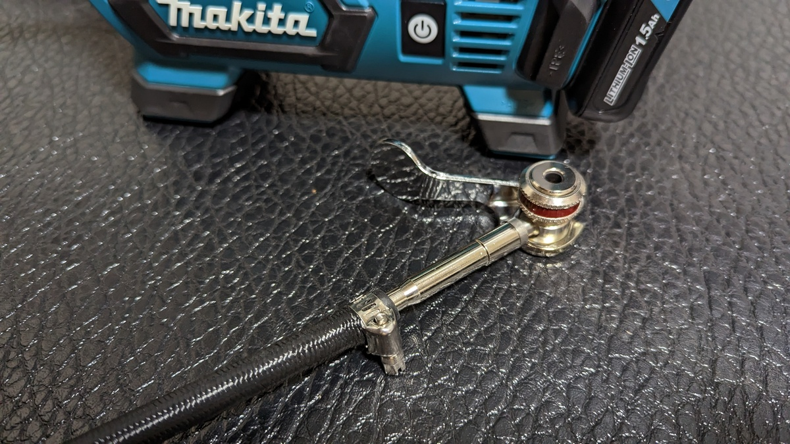
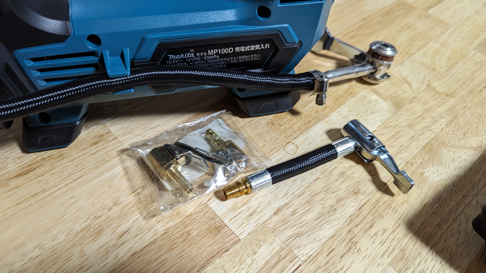
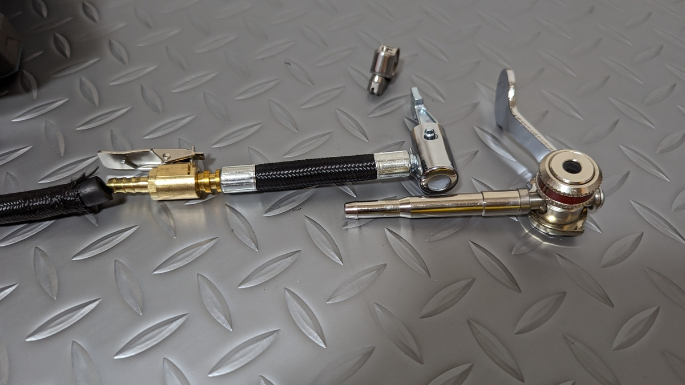
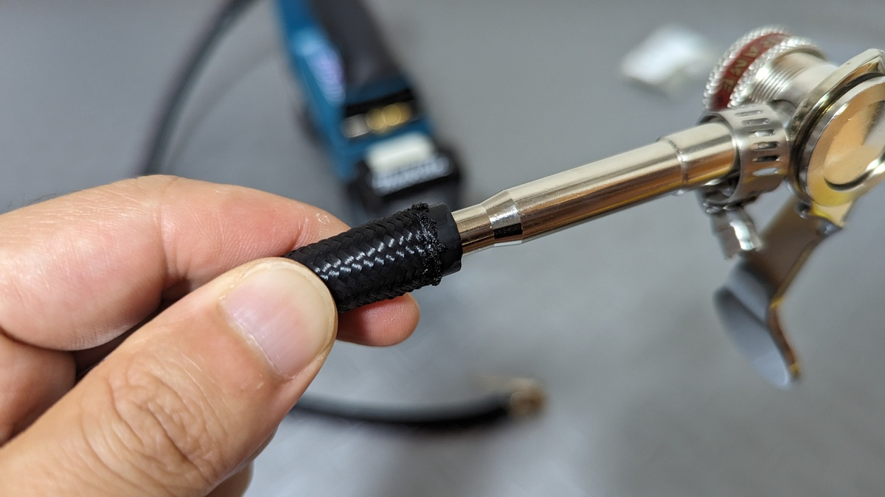
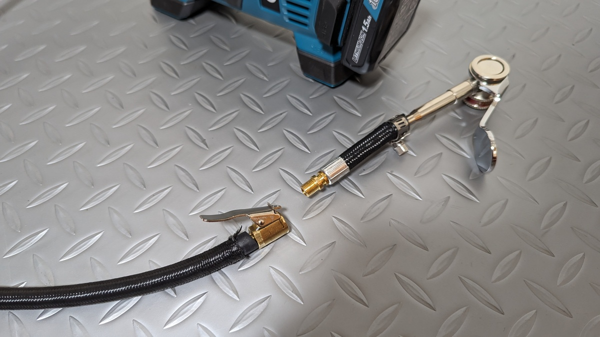

今年の初めに、マキタの電動ポンプを購入して[ヒラメの横カム](https://amzn.to/3KSJ9fE)を装着した。

<LinkBox url="https://blog.gensobunya.net/post/2023/01/makita_pump/" />

**厳密な空気圧管理を要求される**シクロクロスの現場で非常に役に立ち、[ヒラメ横カム](https://amzn.to/3KSJ9fE)を使うことで装着も簡単で実に運用しやすかった。

<LinkBox url="https://www.amazon.co.jp/dp/B09Y5NC795/" isAmazonLink />

ご存じ、調整もできてバルブを壊す心配も少ない優れものであることに間違いないのだが、ホースに直接ヒラメ横カムを装着しているので、**米式バルブへの互換性を失う**というデメリットが発生していた。

## 米式との共存

正確には、ヘッド内のパーツを入れ替えることで米式バルブにも対応できるのだが、時間がかかる上に細かい部品を扱うことになるので、簡単とはいい難い。

スポーツサイクルの大半の用途は仏式バルブで事足りるのだが、 ** 「チューブレスタンクへの注入」 **や ** 「ビード上げで大量のエアを送り込む場合」 **は米式バルブが必要になることが多い。

また、自転車とは離れるが**クルマのタイヤも米式バルブだ**。せっかく電動ポンプをもっているのだから、自分でメンテナンスできる部分は簡単に調整できるようにしておきたい。**クルマもタイヤの空気圧は大事**だ。

自分の場合、チューブレスタンクは注入側が仏式バルブの[Topeak Tubibooster X](https://amzn.to/3sgsX1o)を使っているので心配ないが、市場を見渡すと仏式入力のチューブレスタンクは少数派だ。

## 米式共存改造

ヒラメ横カムの恩恵は受けつつ、米式バルブにも使えるようにする…

いきなり結論になるが、**エアホースを途中で取り外し可能にし、ジョイント部を米式バルブチャックでつなげる**ことで、この条件を満たす構成とした。アイディアを教えてくれた[みどりさん](https://twitter.com/M1DoRe)に感謝。

実物を計測したところ、マキタの10Vバッテリーを使う[MP100DZ](https://amzn.to/3XasoR1)のエアホース内径は6mm程度だった。

このホースに適合する[米式バルブチャック](https://amzn.to/3OJe9A5)と、米式バルブに対応した[延長ホース](https://amzn.to/3qQiRnw)を購入して、取り付ける。そして**延長ホースの先端をぶった切ってヒラメ横カムを装着**すればよい。

今回はAmazonでとにかく安いものを調達した。

<LinkBox url="https://www.amazon.co.jp/gp/product/B09W5PNB6C/" isAmazonLink />

<LinkBox url="https://www.amazon.co.jp/gp/product/B07YX5HX79/" isAmazonLink />

## 作業まとめ

作業はなんてことはなく、数分で終了する。

注意点としては、空気漏れがないようにしっかりバンドを閉めたり、ほつれ防止に火で末端を炙ったりすることを忘れないようにすることだろうか。

動作確認では、**米式チャックをしっかり奥まで差し込まないと内部のピンを押せない**ということはわかったが、すぐに気が付く上に、米式バルブ側を使うこともあまりないのでこれでよしとした。

この改造自体は、各社の電動ポンプでも同様に実行できるし、なんなら電動ポンプは本来米式バルブに対応していることが多いので、延長ホースを買うだけでも良いかもしれない。

クルマと自転車、両方に役立つツールが作れて幸せだ。

<LinkBox url="https://www.amazon.co.jp/dp/B07LBVRSY1/" isAmazonLink />
