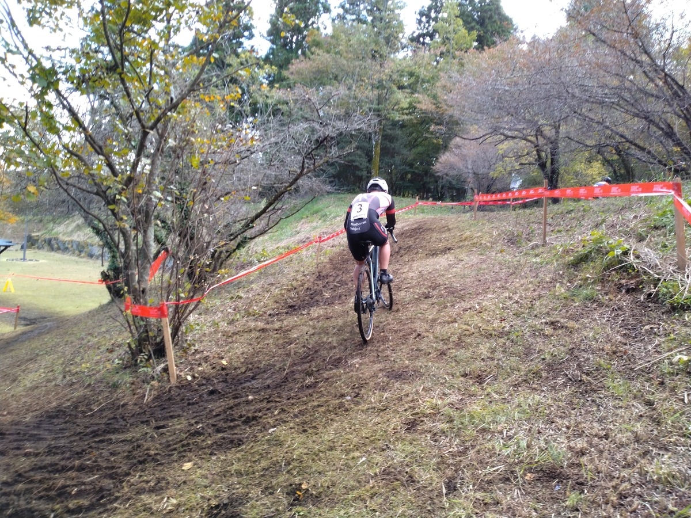

## Summary

自分にとっては2週連続、人によっては白樺湖から3週連続の雨は避けられたと誰もが思っていたが、ME1のレース中だけ大粒の雨が振り出すというCXの神に愛されたレースとなった。

土浦で課題として見えてきた高負荷時のバイクコントロールを解決すべく、Zwiftでのインターバルトレーニングを積んだこともあり、きっちり1時間踏み倒してシングルリザルトをゲット。

隣に謎のUCIポイント保持者が現れたときはどうなることかと思ったが、ローカルCXレースとして楽しめた。

## リザルト

7/23位（+3:45）

### 機材

- メインバイク
  - GIANT TCX ADVANCED PRO
  - Farsports CX TU + challenge Grifo TU (F: 1.65Bar, R: 1.65Bar)

### Grifo チューブラー投入

朝は御殿場周辺に雨が降るも、日中は曇りから晴れ予報。

ややぬかるみのある路面を想定して、今シーズン用に貼った[challenge Grifo](https://shopping.yahoo.co.jp/search/challenge+grifo/2514/)チューブラーを投入。

<LinkCard url="https://shopping.yahoo.co.jp/search/challenge+grifo/2514/" linkurl="https://ck.jp.ap.valuecommerce.com/servlet/referral?sid=3171302&pid=887657037&vc_url=https%3A%2F%2Fshopping.yahoo.co.jp%2Fsearch%2Fchallenge%2Bgrifo%2F2514%2F" />

特徴的なサイドの丸パターンで、サイドグリップが弱いと言われることもあるが、このコースではしっかり路面をつかんでくれた。

特に、砂利の浮いたようなコーナーでは、浮いた砂利をつかんでツルっと滑ってしまうスモールバードとは違い、**砂利を押し付けるようにグリップしてくれる感覚**があり安心できた。

デュガスのチューブラータイヤに比べ、**challengeのチューブラータイヤはかなり固く**、バンピーな路面ではちょっと腰に悪いようだ。

## レース

<iframe width="560" height="315" src="https://www.youtube.com/embed/DlNWLURPwJk?si=A-WnnErolsynmjJM" title="YouTube video player" frameborder="0" allow="accelerometer; autoplay; clipboard-write; encrypted-media; gyroscope; picture-in-picture; web-share" allowfullscreen></iframe>

ポイントだけはたくさん持っているので、ゼッケンは3番……なのだが、ローカルCXにもかかわらず、外国人のUCIポイント保持者が現れコール順は4番目。

とりあえず隣に陣取ったので、彼のスタートだけは動画へ収めることに成功。試走ペースは1周あたり8分半ほどだったので、レーススピードでは7分半を想定。全8周を予定している…はずだった。

先頭付近のパックで1周目を追えるも、コントロールライン直後の激坂登りで前走者のミスが発生しパック崩壊。ここから淡々と自分のペースで走ることになる。

**3周ほどしたところで、スタッフから「9周！」との声かけが**。なんだかいろいろ悪態をついた気もするが、頭は冷静に、ペースを若干落として9周回に対応する。

**コースはほぼ登りと下りしかないレイアウト、登りが長くても30s程度**で終わるし、**登った後に必ず下る**というコース。。

下りで休めばいいと割り切って、登りはZwiftで鍛えたメンタルを活かして踏み倒して押し切る。身体を小さく丸めてゴリゴリ踏んで、路面の荒さも相まって**腰にダメージが蓄積するが、ウェイトやアブローラーで鍛えているおかげで1時間耐えきることができた**

しかしここで問題が。晴れたと思った御殿場エリアに、**突如雨雲が発生し大粒の雨を降らせた。**

ぬかるんでいた注意ポイントが更に難しくなり、芝生の一部はより滑るように変貌。

山麓らしい天気でコンディションが急激に変化したが、土浦で転倒だらけのレースをメイクして十分に反省した結果、試走で最速と予備ラインチェックして丁寧に走ったおかげで大きなミスもなし。

ジワジワとラップタイムは遅くなるものの、機材トラブルも転倒もなく過ごしていると、後半ちょっとづつポジションが上がってくるのが1時間レース。

10位近辺から7位までポジションを上げ、[昨年の大洗CX](https://blog.gensobunya.net/post/2023/01/2023_oharai/)以来のシングルリザルトとなった。大洗もJCXの裏番組だった。

<LinkCard url="https://blog.gensobunya.net/post/2023/01/2023_oharai/" />

裏番組レースのご褒美として、JCXレース10位相当のAJOCCポイントを頂いて今年のME1残留もほぼ確定的。

翌週の幕張はまたラップアウト濃厚なので、しっかり休んでしっかり短時間でパワーを絞り出せるように準備する。

## 片付け

2週連続の泥レースとなった結果、片付けに[アイリスオーヤマの充電式ハンディウォッシャー](https://amzn.to/45UoX4V)が大活躍してくれた。

<Amzn asin="B08481Z7H1" />

10L程度のポリタンクと合わせてレース会場に持ち込めば、あらかたの泥は会場で落として帰ることができる。

本格的な泥レースでは、ウェアとバイクをこうした高圧洗浄機で軽く洗ってから持ち帰りたい。

持ち込みについてはシンデレラフィットのコンテナボックスもあるので、インプレ記事を参照してほしい。

<LinkCard url="https://blog.gensobunya.net/post/2021/11/highpressure_cleaner/" />
