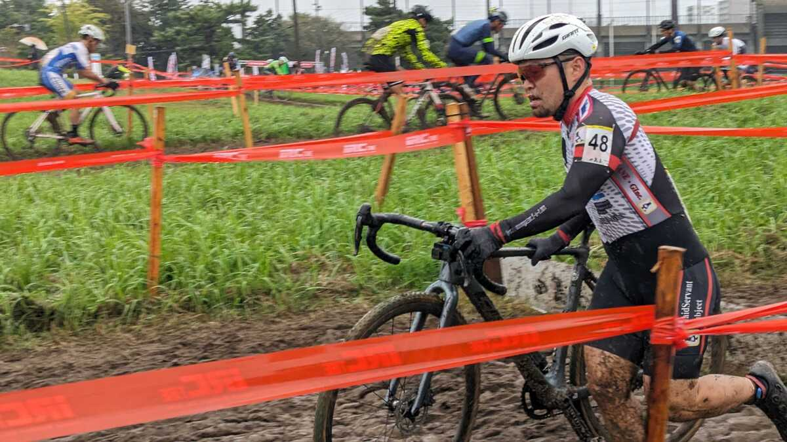

## Summary

シーズンインからいきなりの雨。

いきなりシクロクロス脳をトップギアにもってこなければならない環境で、何かの準備を忘れている気がし続けた。

レース序盤はそれなりにまとめたものの、中盤にかけて心拍がレッドゾーンに入った後からバイクコントロールが取り戻せなくなり、何度か転倒していつも通りの80%ルール適用。

## リザルト

55/77位（-4 lap）

### 機材

- メインバイク
  - GIANT TCX ADVANCED PRO
  - Farsports CX TU + Michelin Power CX MUD TU (F: ???bar, R: ???Bar)

## シクロクロス日和のシーズンイン

9月が終わっても30度を越える最高気温の中、暑熱適応を積み続けた2023年。CXシーズンイン数日前から突然の寒気が流れ込み、一気に天気は初冬のそれになってしまった。

挙句の果てに当日は結構な強さの雨が確定。貼り付けた新品のチューブラータイヤは押し入れの中にしまい込み、年季の入ったマッドタイヤを装着して臨んだ。

<blockquote class="twitter-tweet">
  

    明日は文句なくこいつの出番{" "}
    <a href="https://t.co/qDKh3dJMrs">pic.twitter.com/qDKh3dJMrs</a>
  

  &mdash; ゲン (@gen_sobunya) <a href="https://twitter.com/gen_sobunya/status/1710943399850000646?ref_src=twsrc%5Etfw">October 8, 2023</a>
</blockquote>

シーズン最初のレースは何かと忘れ物がないか心配だ。しかも雨となればなおさらだ。

[アイリスオーヤマのハンドウォッシャー](https://amzn.to/3ZLBBBX)にポリタンク入りの水、[マキタの電動ポンプ](https://amzn.to/3LQO55t)やレース後に差しておく[水置換チェーンオイル](https://amzn.to/48XWG0a)、着替えや何やらその他もろもろ…

<LinkCard url="https://www.amazon.co.jp/dp/B08481Z7H1" isAmazonLink />

とにかく思いつく限りの準備を車に乗せて出発。ポリタンクは捨てたのを忘れていたので、行きがけにジョイフル本田で調達した。

雨といっても、気温は20度近くあるのでなんとかなるだろうとワークマンには寄らずに会場入りしたが、後で泣きを見る羽目になる。

気温30度に耐えるための体はそう簡単に防寒仕様に切り替わっていなかった。

## レース

<iframe width="560" height="315" src="https://www.youtube.com/embed/UacFa2PGucM?si=V3IgkLNJkub79rqq" title="YouTube video player" frameborder="0" allow="accelerometer; autoplay; clipboard-write; encrypted-media; gyroscope; picture-in-picture; web-share" allowfullscreen></iframe>

ME1のスタートループでは、競技場の路面で滑ったり、道幅が狭くなる箇所でカラーコーンに激突するライダーが続出したりと、天気と同様荒々しいスタートとなった。

自分は安全第一で転がりが軽い路面を選んで我が道を我がペースで進んでいく。

[ミシュランのパワーCXマッド](https://amzn.to/48JQNDA)は、ノブが低いが泥はけが抜群に良く、土浦のようなシャバシャバした泥と相性が良い。

<LinkCard url="https://www.amazon.co.jp/dp/B07NQ17KLW" isAmazonLink />

少し高めの空気圧にすると、**泥の底にある固い路面**を簡単につかんでくれる。

一方で、**泥キャンバーにおけるグリップ力はかなり低くなる**ため注意が必要…だったのだが、一通り走って心拍が上がりきったのちにこの心得を忘れてしまい、リアのグリップが抜けたり、無理やり乗車した際に滑って時間を食ってしまう局面が多かった。

結果としてこれらのミスの積み重ねで番手を10ほど落としてしまったので、高い心拍数の環境下でも落ち着いて難セクションをこなす冷静さを取り戻さないといけなった。

とはいえ、そこまでペースが落ち切ってしまったわけでもない中、30分ちょっとで80％ルール適用となり、レースを終えることとなった。

カットされた直後にトップのシンゲンが次のラップに入るのが見えたため、かなりの独走劇であることがうかがえた。

レースが終わったらそそくさと洗車エリアにいき、カットされ組でお互いに体を洗ったり自転車を洗ったりして後始末。

出かけるときは**雨の中社外積載することに抵抗を覚えるほど**CXに頭が適合していなかったが、終わることには完全にシクロクロス脳に切り替わっていた。

シーズンの始まりはこんなのもいいかもしれない、とちょっと思ったが自宅で洗濯をして翌朝に筋肉痛で目覚めるころには「もうちょっと優しくしてほしい」なんて思っていた。
