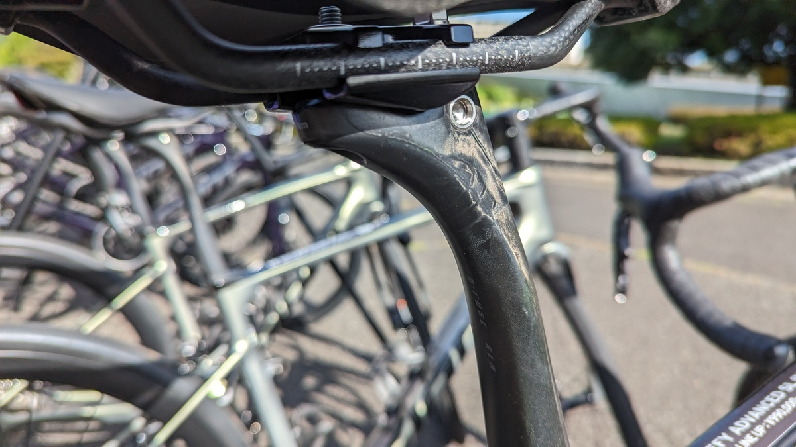

先週末は、稲城中央公園で行われたGIANTジャパンの「ハイエンドロードバイク試乗会」に参加した。

1台1500～2000円で40分間ほどの試乗時間が約束されており、GIANTのパフォーマンスロードバイクラインの**TCR, PROPEL, DEFYそれぞれで、ADVANCED SL/ADVANCED PROグレードの全サイズから選択**できるという、乗り比べとフィッティングの性質を兼ね備えた試乗会だ。

もちろん、ペダルは自分のものを持ち込みで利用できる。

<LinkCard url="https://www.giant.co.jp/news/event/9976" />

TCRは前世代を乗り込んでいたので、今回はPROPELとDEFYのADVANCED PROグレードを乗り比べた。

| No. | 試乗モデル                                  | 適応身長  | ホイール・備考               |
| :-- | :------------------------------------------ | :-------- | :--------------------------- |
| 8   | PROPEL ADVANCED PRO：FORCE ETAP（XSサイズ） | 155-170cm | GIANT SLR 1 50 DISC HOOKLESS |
| 14  | DEFY ADVANCED PRO：105 Di2（XSサイズ）      | 155-170cm | GIANT SLR 1 36 DISC HOOKLESS |

完成車と同じように、GIANTのフックレスホイールが装着されており、試乗表には記載されていないがPROPELは25cのCADEXタイヤ、DEFYは32cのGIANT製タイヤが装着されていた。

この記事では、今年の注目株である新型DEFYについてフォーカスしていく。

## 2024 GIANT DEFYシリーズ

2024年モデルでフルモデルチェンジしたエンデュランスロードのDEFY。モデルチェンジでは**軽量化と内装ケーブルシステム**にフォーカスされている。

> エンデュランスロード「ディファイ」がフルモデルチェンジ。前世代よりも軽量化したフレームとアドバンスドSLグレードのカーボンフォークがスムースなライドフィールを実現。フレア形状のハンドルと新型ステムによる内装ケーブルシステムが、クリーンな外観とメンテナンス性を両立。PRO 1はシマノ「105 Di2」電動12速コンポと軽量高剛性カーボンフックレスホイールシステム「SLR 1」を採用。

もちろん、太いタイヤに対応して38cまでのタイヤクリアランスを持っている。

### 普通のパーツでありながら快適性を向上

エンデュランスロードとして、より長い間サドルの上で過ごすことを追及しているが、DEFYは**他社のようにシートポストやヘッド周りに特殊な構造を入れずに、軽量性を手に入れている。**

それでいながら、快適性は新型DEFYに併せて開発されたD-Fuse SLRシートポストと、D型断面のハンドルによってしなりを与えることで付与している

D型シートポストはこれまでもGIANTのX-ROAD（シクロクロス・グラベル）を中心にクロスバイクでも採用されていたが、**DEFYのそれはこれまでのどれよりも薄くしなりやすい形状**となっている。もちろんその分軽量。

TCXやREVOLTには利用できず、新型DEFYシリーズ専用なのはちょっともったいない気もする。

ハンドルも同様にD型断面とすることで、上下方向のみに変形してそれ以外…つまりスプリントやダンシングの変形を抑えるというアプローチをとっている。

### ジオメトリ

エンデュランスロードといえばアップライトなポジションのためにヘッドチューブを長くすることが定石だったところを、**DEFYではヘッドチューブ長をレーシングロードであるTCRに近づけている**

2024モデルではMサイズ以上でさらにTCRにヘッドチューブ長が近づき、TCRとDEFYで同様のポジションを作りやすくなった。

| SIZE (mm) | 2024 DEFY(D)(mm) | TCR(D)(mm) | 2023 DEFY(D)(mm) | 適応身長 (cm) |
| :-------: | :--------------: | ---------- | ---------------- | :-----------: |
|    XS     |       120        | 120        | 120              |   155〜170    |
|     S     |       140        | 130        | 140              |   165〜175    |
|     M     |       150        | 145        | 160              |   170〜185    |
|    ML     |       175        | 165        | 185              |   180〜190    |

乗り込んでいるユーザーほど前傾姿勢は深くなるもの。エアロロードのスーパーバイク化が進む中、中上級者でもDEFYを選ぶにあたって移行障壁を下げているように見えなくもない。

### DEFYの立ち位置

私と同年代で同程度の経験を持つサイクリストなら、**最初のロードバイクがアルミのDEFYだったという人も少なくない**のではないだろうか。

今はアルミフレームのモデルはなくなってしまっているが、当時は最も安価なクラスのロードバイクとして、エントリー機の役割を担っていた印象が強い。

ダボ穴装備でキャリアに荷物を積んだツーリングができたり、ロングアーチのキャリパーブレーキで太いタイヤに対応していたり、1台目としての懐の深さと、のめりこんだあとの使い倒せるバイクとしての役割の両方をこなすことができていた。

時代の流れでカーボン化したものの、**軽量化を謳った今作でもフェンダーブリッジ用の穴は健在**で、「いつでも使える」性格はそのままだ。

前モデルから、エンデュランスロードとしての「レーサーではない人たち」向けロードバイクのモデルとして存在感があったが、今作では性格をそのままに性能をレーシングロードに近づけたように読める。

## インプレッション

コースは、多摩サイサイクリストがみんな大好きな尾根幹周辺。オンボード動画も撮影したので、そのうち[Youtubeチャンネル](https://www.youtube.com/channel/UCwNPD5TeaVKBhYrp_ODMCqg)にアップロードする。

ペダルもサドル高も調整済み、ハンドルだけは下げられないのでちょっと高い。

ここのところ、ロードバイクを所持せずグラベルロード（[REVOLT ADVANCED](https://www.giant.co.jp/giant23/bike_datail.php?p_id=00000048)）をメインバイクにしているので、運動性能に関してはやや甘めの採点になっている可能性がある。

その他、現在所持しているのは[TCX ADVANCED PRO](https://www.giant.co.jp/giant23/bike_select.php?c_code=CA02&f_code=FD01&s_code=SR12)、過去には前世代の[TCR ADVANCED PRO](https://blog.gensobunya.net/post/2021/10/single_road_longterm/)も所持していたので、根っからのGIANTユーザーであることは付け加えておく。

<LinkCard url="https://blog.gensobunya.net/post/2021/10/single_road_longterm/" />

### 軽量で反応のいい普通のロードバイク

乗り出してすぐわかるのがその反応の良さ、そして乗り心地の良さ。

32cタイヤを履いているので、運動性能はスポイルされるものと思い込んでいたが、見事にいい意味で裏切られた。ダンシングも軽快だし、発進も申し分ない。

「チェーンステーを長くした分反応が遅れがち…」といった、**かつてよく読んだようなエンデュランスロードのネガは全くない。**

GIANT特有の極めてニュートラルな『思った通りに動く』ハンドリングも健在で、昔もっていたTCRを彷彿とさせる反応の良さだ。32cなのに。

付属している[SLR1 36フックレスホイール](https://www.giant.co.jp/giant24/acc_datail.php?p_id=A0002880)は前後で1442gと、軽量なのが効いていそう。自分が持っていたTCRにも当時のSLR1カーボンホイールが付属していたが、1600gを越える重量だった。

車がいないところでダウンヒルをもがいてみたところ、**初期構成が50-34Tクランク**と低いギア比が設定されているので早めに脚が回りきってしまう。

激坂が突然現れても対応可能という点は20%程度の裏道を走ってありがたみを感じたので、エンデュランスロードならば最低ギア比を確保するという方針も間違ってはいない。

また、**グラベルロードとシクロクロスに慣れきっている自分でも舌を巻いた**のが乗り心地の良さ。

38cのグラベルキング、しなやかなシクロクロスタイヤで衝撃をいなしながら舗装路を走ってきたが、DEFYの乗り心地はまったく路面の固さを感じさせない。わざと荒れているところに突っ込んでも尻やハンドルは全然揺れないのが印象的。

特に**新型のD-fuseシートポストが効いているようで、とにかく快適なライド**が約束される。

後ほどPROPEL ADVANCED PROも試乗したのところ、**PROPELの最も強い平坦スピードの乗り具合以外はDEFYの方が軽々とした挙動**だった。

タイヤ幅が太いほど路面抵抗が減るのは今更論じるまでもないが、フックレスチューブレスによってさらに不自然な変形が減ったからか、**空走時の減速がPROPEL（25cチューブレス）よりもかなり少ない。**

ハイエンドロードバイクとしての**運動性能を残しながら、極限まで乗り心地にこだわったバイク**だという印象を受けた。

### 105 Di2とパッケージの不満

試乗したDEFY ADVANCED PRO1は105Di2完成車だ。

6770世代からDi2を使い続けた人間だが、今回ようやく105 Di2に触ることができた。変速速度は流石だが、エアロフォームの際などにつかうレバー先端のボタン（スイッチA）が無い。

正直、**スイッチAなどなくてもどうにかなると思っていたのだが、いざ乗ってみると数分後には押したくなっていた**。自分が買うならレバーだけでもアルテグラDi2にしたい。

さらに、フレームやシートポスト・ハンドルといった部分については上の通りで文句のない出来なのだが、完成車パッケージとして見た際に疑問符の付く箇所がある。

まず第一に、かつてXSサイズに付属していた**165mmクランクが廃止され、XS,Sサイズで170mmクランクに統一**されているところ。

クランク長は慣れの範囲とはいえ、ポジションにシビアな人であればサドル高やハンドル位置に5mm単位で影響を与えるのは間違いない部分。ここはこだわってサイズごとのラインナップをそろえてほしかった。

165mmクランクでそろえてある前提のサドル高を伝えたので、申告した長さだとちょっと高めのポジションとなった。

第二に、**パワーメーター付きのグレードが少ない**こと。

TCRはかなり広いグレードにGIANT謹製のパワーメーター Power PRO/HALOシリーズが付属しているのだが、**DEFYではADVANCED SLグレードにしかパワーメーター付きラインナップがない。**

レーサー以外でもパワーメーターが普及しており、ロングライダーであればペース管理にこれほど便利な存在はない…はずなのだが、ここも頑張ってほしかった部分。

ギア比の設定…は個人の好みが大きいところなので割愛するが、主にクランク周辺の完成車パッケージでもう少し魅力的にできたのではと思える。**コストに跳ね返る部分でもあるので最適を論じるのは難しいが、消費者目線だと後から交換するほうが高コスト。**

### グラベル性能

さて、現代のエンデュランスロードを**語る上で欠かせないのがオフロード性能**だ。

各社の売り文句を見ると、『〇〇mmまでのタイヤを装着でき、オールロード（グラベル）でも使用可能』という文言がほぼ間違いなく躍っている。**DEFYも38cまでのタイヤキャパシティがある**ので、細めのグラベルタイヤを履ける。

今回無邪気に「裏尾根幹とかオフロード行ってもいいですか？」という質問に「ガッツリしたオフロードでなければOKです」と快諾いただいたので、行ってみた。

**流石に32cでオンロード向け空気圧だと、ダートの登りでは若干空転**するものの、軽さを生かしたクライミングができた。（あまり行く人はいないと思われるが）ギア比の軽さはこういう未舗装路でも活きる。

下りでは振動吸収力が活きて、車体が安定する。**ドロップオフがないようなオフロード**であればDEFYにとっては道と考えてよさそう。特にシートポストはすごくいい仕事をしていて、サドルに座っていてもダウンヒルができるほどだ。

## まとめ『大半の人が本当に必要なロードバイク』

予想以上に「良いロードバイク」であり、**レーサー以外もレーサーも、これでよいのでは**と思わせる運動能力を見せてくれた。

エアロ効果についてはハンドルのケーブル内装ギミックである程度確保してある。ハンドルやフレームは振動吸収に振っているものの、**105 Di2グレードで7.7kg**と十分軽量だ。

フレームがセミエアロで軽量なTCR、ガチガチにエアロ効果を狙ったPROPELと、ロードバイクだけで性格が被り気味な3モデルだが、他人にまずお勧めするならDEFYだ。

**乗り心地は自転車に乗る時間で常に効いてくる項目**だし、重量では（今であれば）同グレード同コンポのTCRよりも100g軽い。

タイヤは32cともなると重さのネガが出ると思っていたのだが、登りでも小気味よく反応するし、PROPELとの同グレード対決ではDEFYのほうが走りやすかった。なお、ADVANCED SLグレードは別格の走りでフラッグシップの貫禄。

PROPEL ADVANCED SLを買えるレーサーであればもちろんそれでよいのだが、予算が足りないならTCRシリーズ、レーサーでなければDEFYシリーズを買うのをおすすめしたい。

距離にかかわらず身体の負担が軽く、下りも安心のタイヤ幅、ちょっとした計画ミスで荒れ道や予想外の激坂があってもバイクが助けてくれる。

走り終わったあとに辛さだけが残るようなことの少ない、ライド体験を提供してくれそうなバイクだ。
