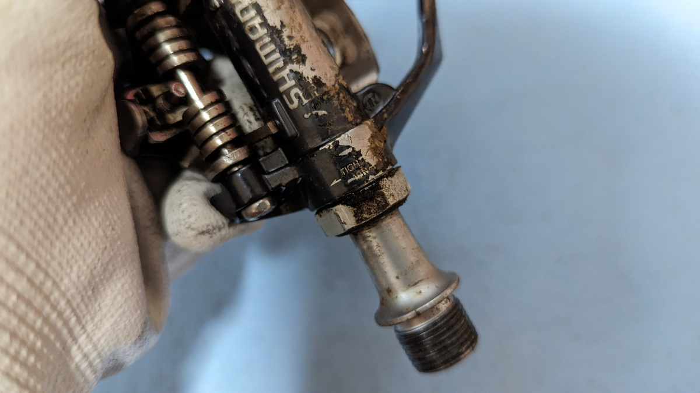
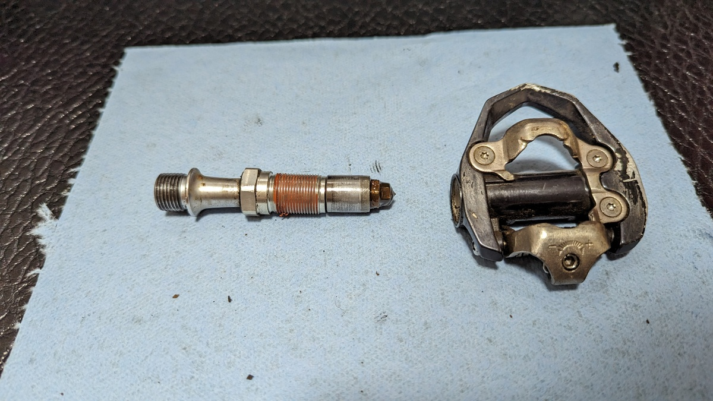
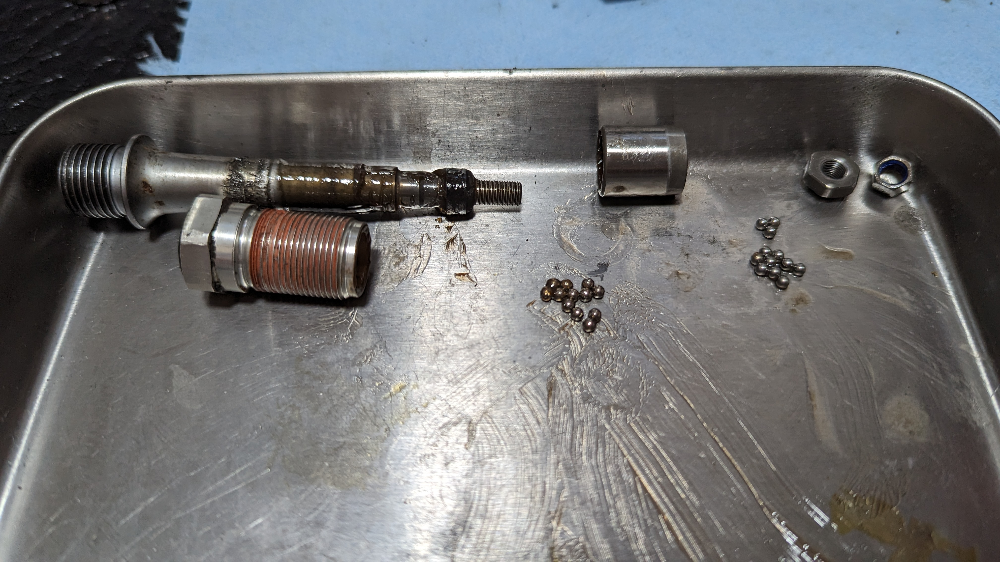
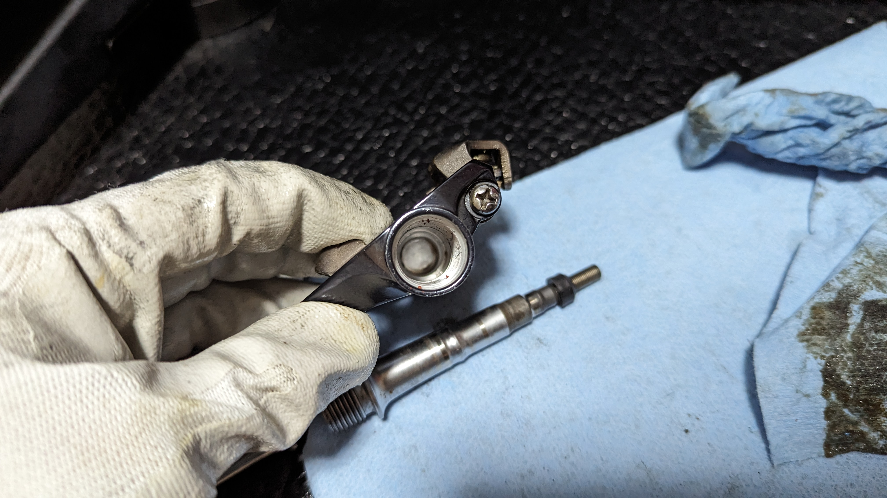
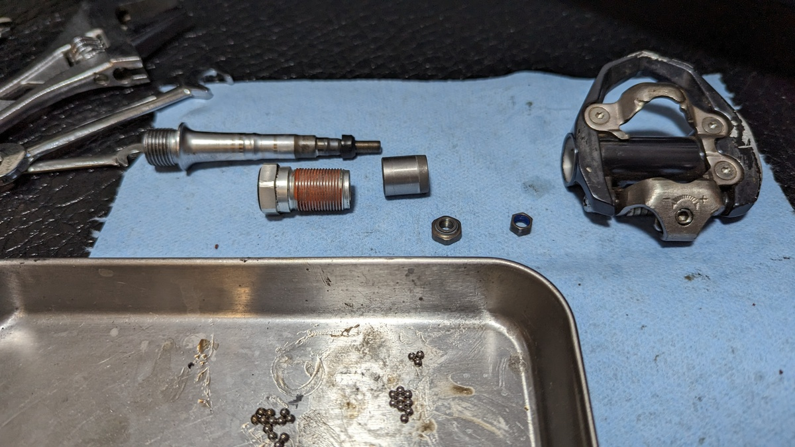
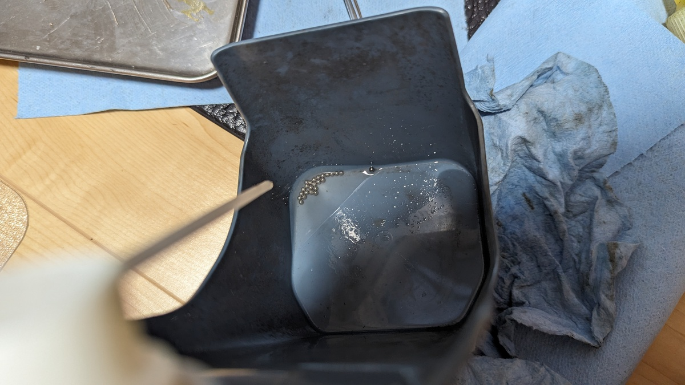
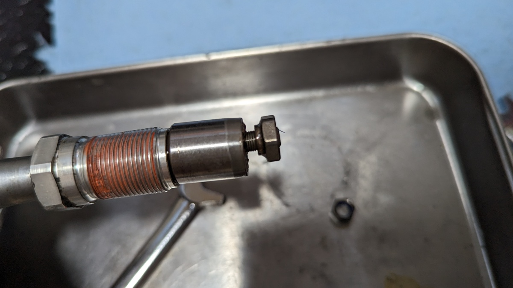

グラベルロード（REVOLT ADVANCED）がパワーをかけたペダリング時にギシギシという異音がなるようになり、原因がてら各所を増し締めしていたところ、[PD-ES600](https://amzn.to/3QusORA)の様子がおかしく、軸のガタが発見された。

こうした異音はBBから鳴っているようでBBが原因ではないことがほとんどだ。大抵はペダルのクランク装着部だったり、チェーンリングの緩みだったりするのだが、今回は運悪くペダルの回転部だった。

ショップに依頼してもいい部分だが、同じような音が鳴っていたTCXもチェックしたところ、こちらもペダルにガタがあった。もともと使い捨てのつもりM520だが、今となっては4000円を越えるペダルになってしまったので、もう少し働いてもらいたい。

全部をメンテナンスに出すとそれなりのお値段になってしまうので、勉強がてら自分で直してみることにした。

<Amzn asin="B07BWC3Y1N">

## 分解

まずはペダルボディからペダル軸を抜く。

下位の樹脂軸カバーモデル以外は17mmのスパナかモンキーレンチで外すことができる。理想は万力でボディを抑えながら外すのだが、手や床で抑えながらでもなんとかなった。

回転方向は左右で違うことに注意する必要がある。ボディ側に締め付け方向の記載（TIGHTEN→）があるので、確認して逆方向へ緩める。

[PD-M520](https://amzn.to/3Fwen9r)のような**樹脂キャップのあるモデルの場合、軸にレンチをかけられる部分はない**ので、[TL-PD40](https://amzn.to/3FtvUzc)という工具を用いて樹脂キャップの溝にはめる専用工具を用いる。

<Amzn asin="B002ZI6AU4">

余談だが、低グレードの樹脂タイプはペダル自体をクランクから外さないと作業できないものの、ES600など、中**級グレード以上のペダル軸はクランクから外さなくてもボディを分離**できる。

**玉当たり調整とグリスアップ（という名前のグリス追加）だけならクランクから外す必要はない**ので、今後はクランクから外さず作業する予定。

### 構造

軸を抜いた後、各パーツを外して方向に気を付けながら順番に並べておく。

一番右のパーツがロックナットと調整用ナットで、それぞれ10mmと7mm。玉当たり調整する際もこのサイズの六角レンチは必須となる。

残りは見ての通り、回転部のベアリングレースとベアリングボールだ。こういう**分解作業は展開図（公式のEV）だけではなく、写真を撮って記録しておくのが大事**。

### 洗浄

あとは、それぞれのパーツを洗浄していく。

洗浄しながら、各パーツの**消耗具合も確認**。とくにベアリングレースや、ベアリングボールの摩耗はよく見ておく。スマホカメラの拡大機能を使うと表面の傷もわかりやすい。

ベアリングボールは紛失しやすいので、AliExpressで見つけたバイク用のチェーンクリーナー受けを使ってドブ漬けと吹き飛び防止を兼ねて作業する。

<LinkBox url="https://vi.aliexpress.com/item/1005004596808221.html"  />

## 再組立て

洗浄が終わって乾燥させたら、グリスをこれでもかと詰め込んで組み立てなおしていく。

耐久性を最優先にしたいので、みんな大好きデュラグリスを使う。

<Amzn asin="B001XE15WO">

## 調整

組み立てが終わったら、玉押し調整。

ナットの締め付け具合が非常にシビアな他、ペダル**ボディに装着するまで実際の回転具合はわからない**ので、調整しては取り付けを繰り返すことになる。

10回ほどやり直して、ようやく納得のいく**ゴリがなくボディのガタもない**出来上がりになった。

## まとめ

必要な工具は以下の3点

- 17mmスパナ
- 10mmスパナ
- 7mmスパナ

グリスや洗浄などのケミカルがそろっていれば、自分でペダルの調子を回復させることができる。

円安で「安いパーツを使い捨て」という交換サイクルが難しくなってきたこともあり、手持ちのパーツ寿命を少しでも伸ばす方向のスキルは持っておいて損にはならない。
