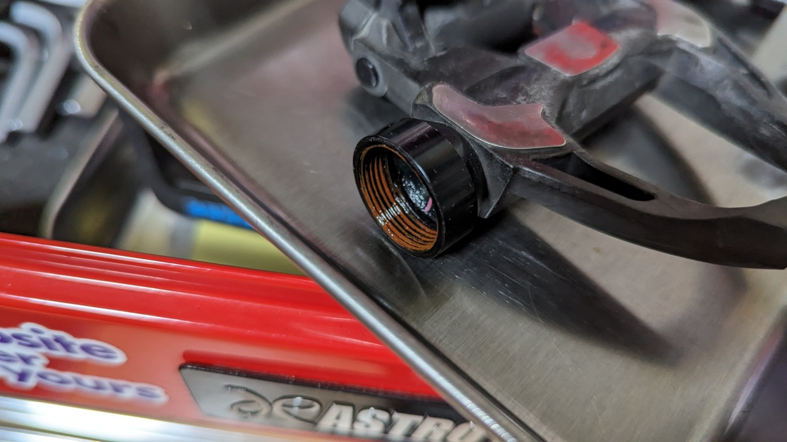
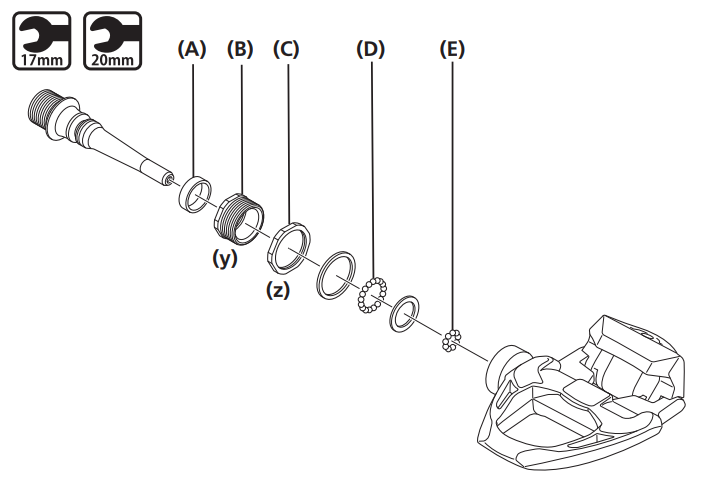
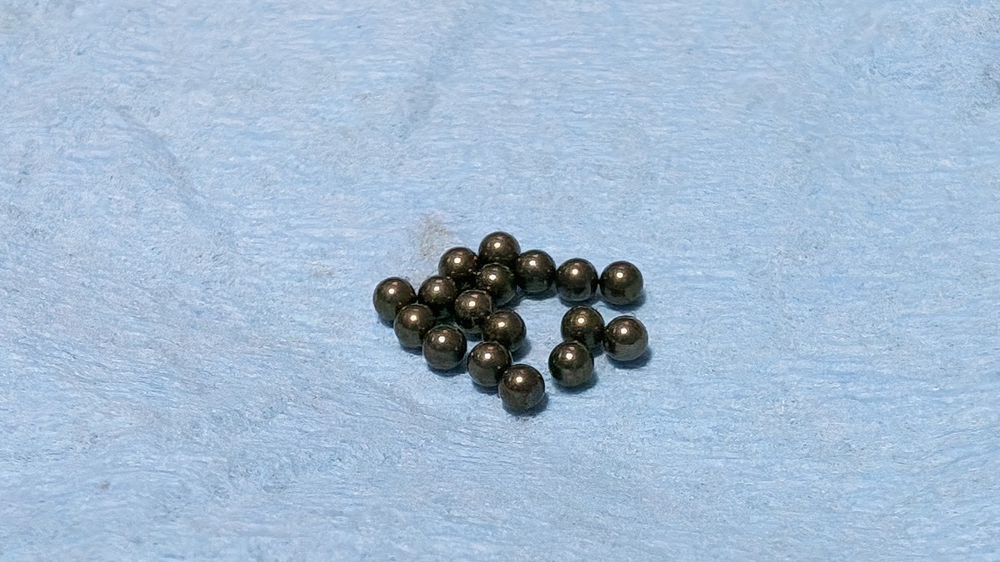
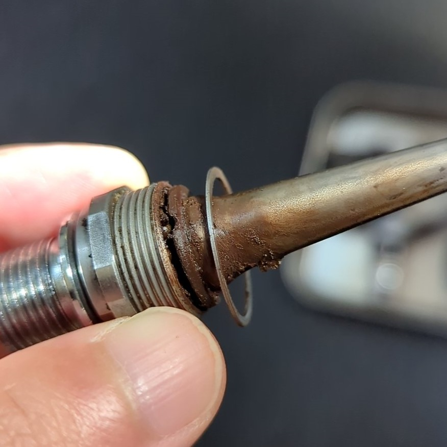
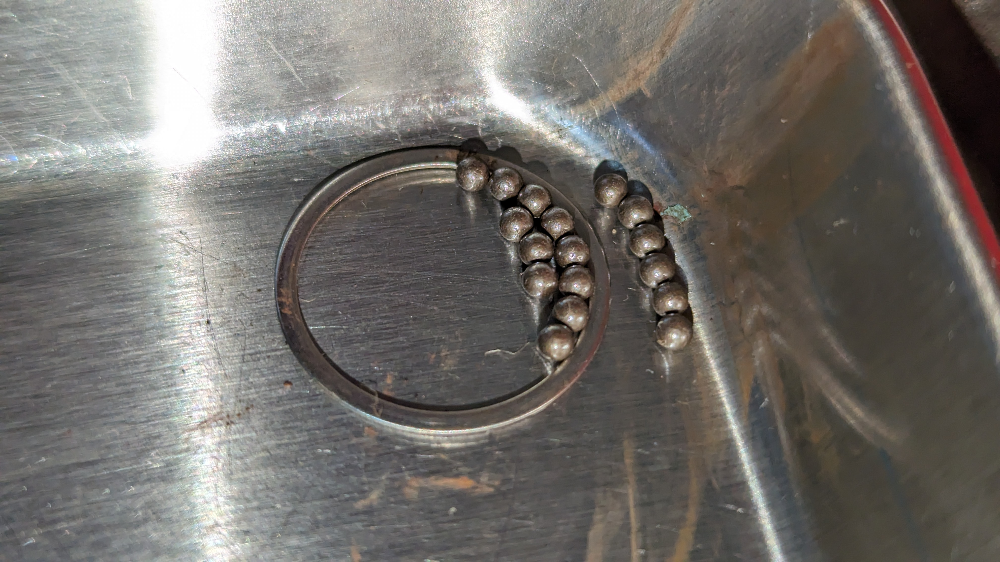
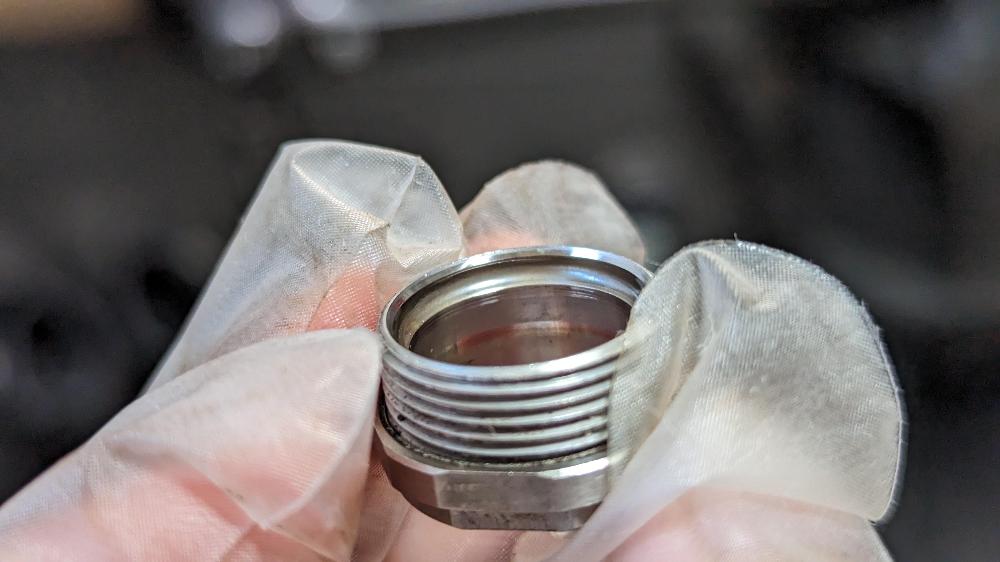
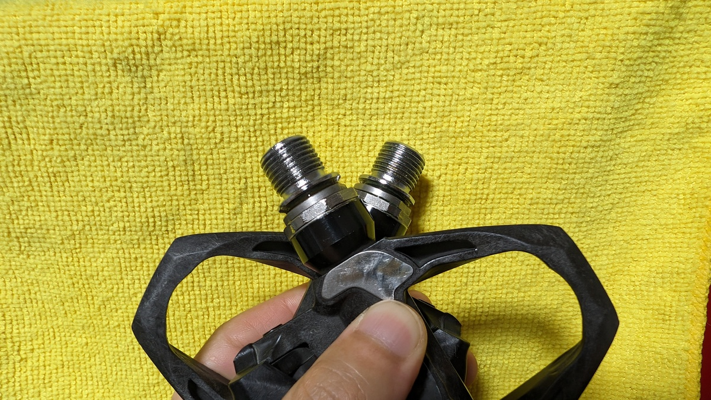

突発的に、中古パーツをオーバーホールしたくなったり怪しい中華パーツを使ってみたりしたくなる時がある。

完全に病気だと思うが、今回は[ペダルのグリスアップをしたばかり](https://blog.gensobunya.net/post/2023/10/pd-es800-overhaul/)ということで、ペダルに対して発症してしまった。

<LinkBox url="https://blog.gensobunya.net/post/2023/10/pd-es800-overhaul/" />

ハードオフでやたら安いPD-R9100を偶然見つけてしまったのがよくなかった。

## 現状確認

何はともあれ状態確認からスタート。

外見上はペダルボディに傷や削れがあるものの、**スプリングも錆びていないし小奇麗**に見えた。**ただし軸には派手なガタとゴリ**があるという状態。

まず左を開けてみると、グリスが明らかに**デュラグリスではない何者かに入れ替わっている**。茶色くてサラサラしたグリスで、旧オーナーは回転の軽さを狙って交換したのだろうか。

**奥側のグリスはデュラグリス**の変色した状態っぽいところを見ると、手が出しやすいところだけいじったようにも見える。

デュラエースのペダル軸構造はそれ以下のグレードと違い、軸パーツの中ではなくボディの奥にもベアリングが入る構造。

工具は[17mmレンチ](https://amzn.to/3tX4Khn)と[20mmのレンチ](https://amzn.to/4755q2I)が必要とあるが、実際には軸にスナップリングが入っているため、[**軸用**のスナップリングプライヤー](https://amzn.to/4755q2I)を使う必要がある。

展開図を見ると、R9000まで存在していたニードルベアリングが無くなっていることがわかる。

<Amzn asin="B002A5RRCW">

わざわざ軸用と強調したのは、孔用のプライヤーを購入してしまい二度手間になってしまった反省。

PARKTOOLの20mmレンチが安いので買おうと思ったところ、ペダルに使うと精度が悪くなめてしまうというレビューがあったため、おとなしく倍以上の価格がする[シマノ純正工具](https://amzn.to/3Sgsp6C)を買うことにした。

<Amzn asin="B00B708TUK">

ベアリングを取り出して洗浄したところ、まだ**輝きを失ってはいない**のでそのままグリスアップすれば使えそうだ。

グリスを取り替えたのに玉当たり調整はおかしく、ガタが出ているところを見ると、メカニックではなくライダーのDIYだろうか…と当たりをつける。ちなみに**右の方が軸の状態はおかしかった**ので、ここで覚悟を決めた。

### ちゃんと作業しようね

右側は軸を抜いた瞬間「ウッ」という声が出る程度にはひどかった。

左側と同じグリス使ったのだろうが、ガタが大きかったせいか異物が入ってジャリジャリだ。

ベアリングボールを取り出してみたところ、輝きを失ってくすんだボールが出てきた。

幸い、ベアリングボールは62個入1000円以下と、そんなに高いものでもないので、[純正品](https://amzn.to/3MivTBX)を注文する。

<Amzn asin="B006WF7THE">

市販の3/32インチ鋼球ならばもっと適切な数を半分以下の価格で手に入れることもできたが、入手性と発送の速さを考慮した。

**ボールにダメージがあるときはレースの削れも考慮しなければいけない**が、運良く大きなダメージはなかったようだ。グリスさえたっぷりあれば実用上は問題なさそうなレベル（だと信じた）

ペダルに軽いグリスを使って回転を軽くしても、こんな状態になってしまうようではまるで意味がない…というか、**10年間シクロクロスでしばいたSPDペダルより状態が悪くなってしまっている。**

チューンナップもいいが、純正と違い何かを犠牲にしていることを忘れないようにしたい。

## 組みなおし

軸パーツのうち、ベアリングレースはもちろんだが、**ゴムシールキャップやナットにも方向指定がある**ので、パーツの方向に気を付けながら、デュラグリスを最大限詰めながら組みなおす。

最後に、カップアンドコーンベアリングとほぼ同様の手順で玉当たりを調整し、ロックリングの締め付けをして作業完了。

**左側は新品同様のヌルヌルさ、ひどかった右もガタなくスムーズに回ると言える**程度まで調整した。

## まとめ

当たり前だが、**作業時間や新たに購入した工具・交換部品を含めれば、どう考えても赤字**である。同等レベルの中古品を買うか、新品を長く使ったほうがマシ。

とはいえ、**構造に関する知識や作業スキルはプライスレス**なので、これでいいのだ…と自分に言い聞かせる結果となった。

アルテグラグレードなら、手持ち工具だけで整備できたのになぁ…と切に感じたので、**新品購入時はEVやDMもよく確認する**という点が今後の教訓だろうか。

<Amzn asin="B01IQL2822">
