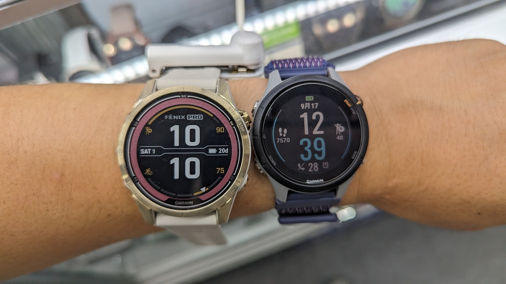

突然だが、私はスマートホーム製品が好きだ。

自宅のすべての部屋に[Nest Mini](https://store.google.com/jp/product/google_nest_mini?hl=ja)や[Echo dot](https://amzn.to/3QukbH0)をはじめとするスマートスピーカーが配置されている。

エアコン・TV・ライトなど、赤外線リモコン（一部Wifi）で操作できる家電はすべて[Switchbot](https://amzn.to/3FrsHAb)で音声操作できるようにセットアップして、**Zwiftのメニュー中でも音声でエアコンや音楽・サーキュレーターを操作**できるようにしてハンズフリー生活を満喫している。

そんな中で、最近のお気に入りはスマートロックの[セサミ5](https://amzn.to/472yasG)と、セットで利用している[セサミタッチ](https://amzn.to/3tLPnIQ)だ。

<Amzn asin="B0C22W4Y5H" />

合計1万円以下で、キーレス生活が手に入るお得セットだ。

戸建てや玄関直結の安アパートでしか使えないと思われるこのデバイスだが、実は**Suica機能のついたカードやデバイスでオートロックまで全て開錠できる可能性もある**（実際に前に借りていたアパートではそうしていた）。

## カギを探す生活からおさらば

今回のレビュー製品は「サイクリストネタから離れていないか？」と思うかもしれない。しかし、**ライドの時の持ち物を想像してほしい。**

簡単な工具のほか、**財布、スマートフォン、そして家の鍵は必ず持っている**はずだ。スマートロックは、この**持ち物の中から家の鍵という重量物を取り除いてくれる**。

かくいう自分はもう5年ほどスマートロックを愛用しており、自宅の鍵を手にもって外出した経験は数えるほどしかない。

カギをなくさずに持ち歩き、家に帰ったらカギを荷物から探して、出して、差して、回す。これら一連の手順がいかに煩わしかったか、今では実感している。

特に、**ロードバイクに乗って外出する際は、限りある背面ポケットやバッグの容量**をキーケースでとられずに済むし、普段のキーケースを**汗で劣化させたり、自転車用のキーケースを用意するというわずらわしさから解放される**。

### 指紋やFelicaキーで完全なノーストレス開錠

スマートロックの基本的な開錠手段は、BT接続したスマートフォンアプリからの手動操作や、GPS位置を用いた自動開錠だ。

GPS開錠もなかなか便利ではあるものの、**GPS誤差やスマートフォンのバッテリー持ちという課題を抱える**ため、実はそんなに実用的ではない。

代わりに、スマートロックでは外部デバイスによる指紋認証開錠や、暗証番号による開錠を追加できるデバイスが販売されている。

<LinkCard url="https://www.amazon.co.jp/dp/B0C22S76BC" isAmazonLink />

<Amzn asin="B09YYLQF7Y" />

これらを使えば、もはや**ポケットからスマートフォンを取り出すまでもなく、家の鍵を開けることが可能**となる。

### スマートウォッチのFelica機能で汗濡れやグローブ問題もバッチリ

さて、自分がスマートホーム製品の雄であるSwitchbotではなく、ロック専業のセサミを推しているには理由がある。

ロック解除自体の高速さもいい点であるものの、**Felica機能（つまりSuicaなど）のあるデバイスやカードで開錠できる**点が最も大きい理由。

Apple WatchやGARMINのスマートウォッチ製品に代表される、Suica決済機能の付いたデバイスがあればかざすだけでロック解除できるのだ。

<blockquote class="twitter-tweet">
ロードバイク乗ったあとは指紋認証通らないと嘆いているスマートロック民と、冬場は手袋してるんだよという人たちへ <a href="https://t.co/uno7FG8Tmm">pic.twitter.com/uno7FG8Tmm</a>
&mdash; ゲン (@gen_sobunya) <a href="https://twitter.com/gen_sobunya/status/1714908868340527186?ref_src=twsrc%5Etfw">October 19, 2023</a></blockquote>

実は、便利に思える**指紋認証は成功確率がそこまで高くない**。体感では5回に1回は失敗する。

また、冬場は自転車問わず、**手袋をしていると指紋認証は使えない**。だからと言って暗証番号は桁数的に不安が残る。そこで、Felicaキーというわけだ。

一定クラスのタワマンや、一部の先進的なオートロックを備えているアパート・マンションでは任意のSuica付きカードを鍵として登録できることもある。そうした住環境では**Suica一つで外から家まで入ることができる**。

サイクリストの視点で何よりうれしいのは、**バイクを片手に持ったままスマートウォッチをかざして自宅に入る**ことができる点。

ドアのまえであれやこれやとアタフタしたり、オートロックの制限時間と格闘するなどという無為な時間とはおさらばだ。

## 諸注意

今回紹介した後付け型の**スマートロックはバッテリー動作なので、バッテリー切れには十分注意**してほしい。

バッテリーの消費警告はアプリ側に通知されるので、即交換がおすすめだ。でないと自宅から締め出されるリスクを負うことになる。

トラブルは何もバッテリー切れに限らないため、本当にどうしようもなくなった時のための物理鍵バックアップ手段は用意しておこう。セキュリティのため詳細は省くが、自宅もスマートロックなしで開錠できる手段を準備している。
