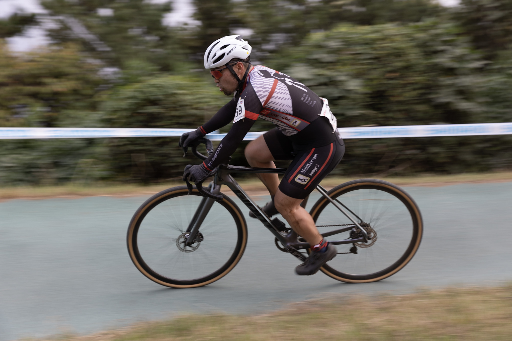
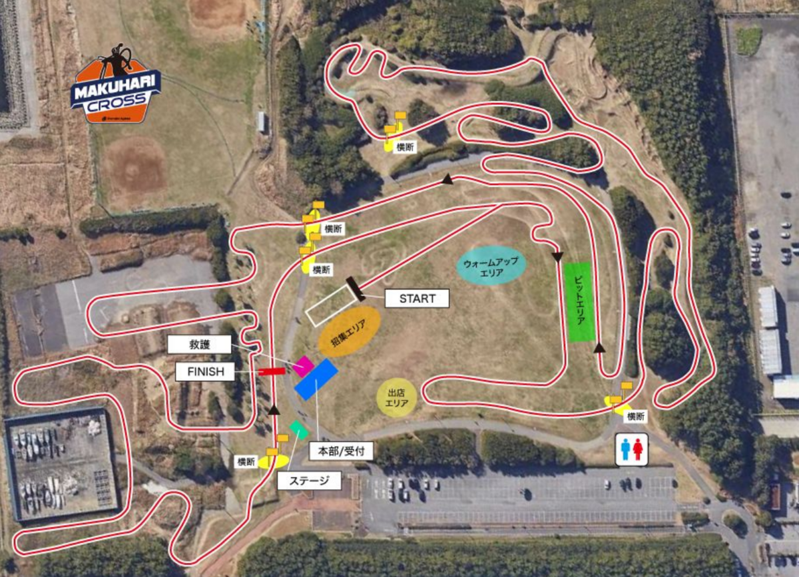
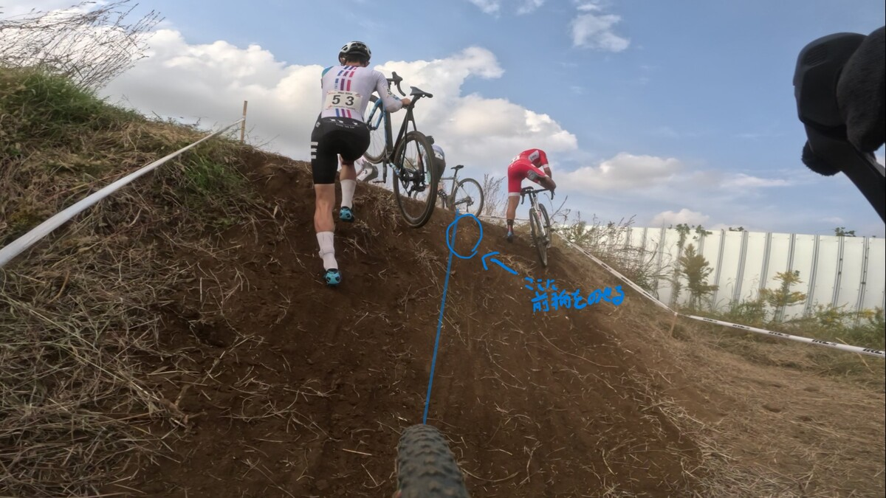

## リザルト

60/90位（-5 lap）

### 機材

- メインバイク
  - GIANT TCX ADVANCED PRO
  - Farsports CX TU + Challenge Grifo TU 33c (F: ???bar, R: ???Bar)

## コースプロファイル

今年は幕張名物のうち1つ **『盛り土テーブルトップ』が復活**。

コース図上部の忍者返し2回は健在だが、**ラインの作り方が良くなり、助走の余地が大きく増えた**。人が少なければほぼ誰でも乗っていけるレベルの難易度だ。

テーブルトップも同様で、ふかふかで難しいと思われる2回目の登りも、露出している岩に対し前輪を斜めに乗せるラインで簡単にクリアできる仕組み。

ヤシの木スラロームも少なくなり、**全体的に低速セクションが減り、高速化が図られた印象**だ。

なお、高速化したからといって難易度が低いわけではない**。上位カテゴリでは高速コーナーでのスリップダウンに気を付ける必要があったり、コーナーの処理でファストアウトできない場合のダッシュでじわじわと脚を削られたり**する。

こうした点から、**高速コースはむしろ、シクロクロス競技特有のスキルが活躍する**と自分は考えている。少ない低速セクションで差をつける代表例はシケインだ。

今回の幕張はパックレースになる可能性が非常に高いレイアウトなので、どこかで差をつける必要がある。登りシケインだったこともあり、**バニーホップでクリアできる人はそれだけで脚の消耗とスピードのロスを抑えられた**だろう。

## レース

今日のゼッケンは69番。

いろいろ考えても、**結局後ろスタートに人権などない**のだ。

<blockquote class="twitter-tweet">
幕張クロス 出来立てほやほやのME1スタート動画<a href="https://twitter.com/hashtag/cyclocross?src=hash&amp;ref_src=twsrc%5Etfw">#cyclocross</a> <a href="https://t.co/DPekmGPcGj">pic.twitter.com/DPekmGPcGj</a>
&mdash; ゲン (@gen_sobunya) <a href="https://twitter.com/gen_sobunya/status/1721095825944887343?ref_src=twsrc%5Etfw">November 5, 2023</a></blockquote>

スタートループ直後のセカンド・サードコーナーに加え、1回目の忍者返しと、**予想通りのところで予想通りに詰まる**。

<blockquote class="twitter-tweet">
Japanese Cyclocross is reminiscent of a daily commuter train...<a href="https://twitter.com/hashtag/CyclingOutOfContext?src=hash&amp;ref_src=twsrc%5Etfw">#CyclingOutOfContext</a> <a href="https://twitter.com/hashtag/cyclocross?src=hash&amp;ref_src=twsrc%5Etfw">#cyclocross</a> <a href="https://t.co/Vu6jJous3b">pic.twitter.com/Vu6jJous3b</a>
&mdash; ゲン (@gen_sobunya) <a href="https://twitter.com/gen_sobunya/status/1721096345564655888?ref_src=twsrc%5Etfw">November 5, 2023</a></blockquote>

詰まるところまでは仕方ないので、**ストレートのダッシュをさぼらない・オーバーテイクは後回しにしない・スキルで有利が取れる相手は頭を抑える**、という基本的なレースしぐさを愚直にやるだけだ。

どうせ30分ほどしか走れないので、脚が無くなっても特に問題はないと、ペーシングした御殿場とは逆の思考で踏みどころを全部踏んでいく作戦。

シケインが低かったのでバニーホップをやりたかったが、今年は練習していないため、おとなしく降車後のフットワークでアドバンテージを稼いだ。

5周目に入ったところですぐ後ろが80%カットとなり、追い込みをかけた脚でもうワンプッシュはできなさそうだったので早々に勢いを緩めた。

緩めたつもりだったが、なぜかテクニカル区間でおいついてしまったので何人か抜いて、60位フィニッシュ。ゼッケンよりは前でよかった。

### 今後のスケジュール

今年はしばらくお休みして、11月末の前橋でレース再開。それまでは、休息と筋トレで身体づくりをする予定。
