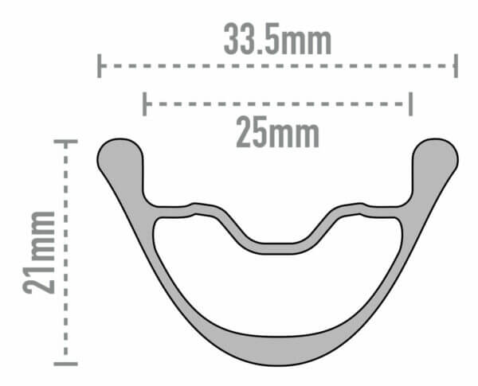

魔が差したとしか言いようがないシチュエーションにつき、ENVE AG25を購入してしまった。

<LinkBox url="https://www.enve.com/product/ag25/" />

かつてEDGE COMPONENTSとしてキワモノ軽量リムを売りまくっていた頃から長年かけ、ブランド名変更を経て構築したハイブランドとしてのポジション確立。

機会があれば欲しいと思っている人は多いと思うし、自分もその一人だったのだが、縁あって[FOUNDATION COLLECTION AG25](https://www.enve.com/product/ag25/)を手に入れることとなった。

## ENVE FOUNDATION AG25

グラベル用ということで、**トラブル回避・衝撃吸収を強化しながら軽量性を併せ持った**ホイール。

**推奨タイヤ幅36mm～50mm**というグラベル専用設計のフックレスリム（内幅25mm）は、独自の構造で従来型のリムに対してリム打ちパンクの確率を最大60%改善するとしている。

**リムの内幅と外幅に大きな差が出るほど厚くしたフック部**がその工夫。これによってリムがタイヤを突き破ることを防ぎつつ、衝撃吸収性も強化されるそうだ。

リムハイトは21mmと、カーボンホイールにしては非常に低い。**シングルトラックも想定した耐久性と衝撃吸収性**を備えて、なおかつ軽量性を追及した…と公式Youtubeチャンネルの動画で話されている。

<iframe width="560" height="315" src="https://www.youtube.com/embed/FWigCOOQ56w?si=Xj7wjOVYNI-lMiX8" title="YouTube video player" frameborder="0" allow="accelerometer; autoplay; clipboard-write; encrypted-media; gyroscope; picture-in-picture; web-share" allowfullscreen></iframe>

AG25は細いタイヤに対応しており、AG28にくらべてレース志向というのがアメリカらしい表現。FOUNDATION COLLECTIONは入門用という位置づけだが、**ENVEの特徴である成形スポークホールで作られている**。

ハブ構造は面ラチェット式 **（MAVICのID360）を採用しつつ、NTNの接触シールベアリング**を用いている。ラチェットノッチは40T。

構造はシンプルで、回転式の工具無し（スナップリングを外すだけ）で分解することが可能。

スナップリングとウェーブワッシャーによるベアリングプリロードで、**玉当たりを調整する必要がないPerfecet Preload™という構造**になっている。

### 手厚い補償プログラム

<LinkBox url="https://www.cog.inc/enve/incidental-damage-protection" />

**構造上の欠陥については5年間の保証**、そして特徴的なINCIDENTAL DAMAGE PROTECTION（いわゆるクラッシュワランティ）では**購入後3年未満であればリムが破損しても無償交換**。以後も希望小売価格から割引でリムを購入できるプログラム。

工賃や送料はかかるものの3年以内なら壊し放題システム。**オフロードで使うホイールにとっては非常に頼もしい**が、トレイルで一緒に人体を破損させないように気を付けたいところだ。

## 取り付け

今回はZIPP303Sのフロントに取り付けていた[Panaracer Gravelking SS(38c)](https://amzn.to/3G43Pil)をリアにローテーションし、フロントには新たに[Gravelking SK(43c)](https://amzn.to/47jkQ3C)を取り付けた。

<LinkBox url="https://www.amazon.co.jp/dp/B08DCKS1HZ/" isAmazonLink />

<LinkBox url="https://www.amazon.co.jp/dp/B076KPP2S2/" isAmazonLink />

ENVEホイールは説明書で**リムテープは2重巻きしないこと**と厳命されているため、劣化したタイヤを使うためにリムテープを追加で巻くといった小細工ができない。

比較のためには全く同じタイヤを使いたかったが、ビードが上がらなければどうしようもないので別タイヤでの比較とする。

バルブナットは特殊な構造で、**テープの施工ミスなどでリム内に空気が入った際にエアを逃がせる**ようになっている。

シーラントは各種テストで性能トップと名高い[Muc-offのシーラント](https://amzn.to/49pg1Y7)を利用した。

<LinkBox url="https://www.amazon.co.jp/dp/B07T224RZB/" isAmazonLink />

バルブ**コアを取りはずして、チューブレスタンクを使ってエアを注入するだけで難なくビード上げ完了**。AGILEST TLR + ZIPP303Sには及ばないが、なかなか簡単にビードが上がる部類の組み合わせだった。タイヤが新品ならフロアポンプだけでもよさそうだ。

### メンテナンス

耐久性と保証・ブランド力では追随を許さないENVEだが、その代わりにと言うべきか、ENVEの説明書にはやたらとメンテナンスに関する注文が多い。

- バルブナット
- フリーハブ
- チューブレステープ

## インプレッション

## まとめ
