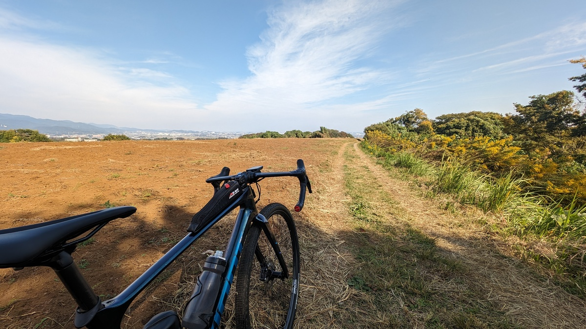

魔が差したとしか言いようがないシチュエーションにつき、ENVE AG25を購入してしまった。

<LinkCard url="https://enve.com/collections/gravel-wheels/products/ag25" />

かつてEDGE COMPONENTSとしてキワモノ軽量リムを売りまくっていた頃から長年かけ、ブランド名変更を経て構築したハイブランドとしてのポジション確立。

機会があれば欲しいと思っている人は多いと思うし、自分もその一人だったのだが、縁あって[FOUNDATION COLLECTION AG25](https://www.enve.com/product/ag25/)を手に入れることとなった。

## TL;DR

<PositiveBox>

- グラベルに特化したアンチパンク・耐衝撃の軽量リムで、アプローチもトレイルも満足の走り
- 充実した保証と補償

</PositiveBox>

<NegativeBox>

- 価格
- ID360のメンテナンス頻度

</NegativeBox>

## ENVE FOUNDATION AG25

グラベル用ということで、**トラブル回避・衝撃吸収を強化しながら軽量性を併せ持った**ホイール。

**推奨タイヤ幅36mm～50mm**というグラベル専用設計のフックレスリム（内幅25mm）は、独自の構造で従来型のリムに対してリム打ちパンクの確率を最大60%改善するとしている。

**リムの内幅と外幅に大きな差が出るほど厚くしたフック部**がその工夫。これによってリムがタイヤを突き破ることを防ぎつつ、衝撃吸収性も強化されるそうだ。

**リム重量360g, セット重量1480g**となっており、リムプロファイルからは考えられないほど軽量。

リムハイトは21mmと、カーボンホイールにしては非常に低い。**シングルトラックも想定した耐久性と衝撃吸収性**を備えて、なおかつ軽量性を追及した…と公式Youtubeチャンネルの動画で話されている。

<iframe width="560" height="315" src="https://www.youtube.com/embed/FWigCOOQ56w?si=Xj7wjOVYNI-lMiX8" title="YouTube video player" frameborder="0" allow="accelerometer; autoplay; clipboard-write; encrypted-media; gyroscope; picture-in-picture; web-share" allowfullscreen></iframe>

AG25は細いタイヤに対応しており、AG28にくらべてレース志向というのがアメリカらしい表現。FOUNDATION COLLECTIONは入門用という位置づけだが、**ENVEの特徴である成形スポークホールで作られている**。

ハブ構造は面ラチェット式 **（MAVICのID360）を採用しつつ、NTNの接触シールベアリング**を用いている。ラチェットノッチは40T。

構造はシンプルで、回転式の工具無し（スナップリングを外すだけ）で分解することが可能。

スナップリングとウェーブワッシャーによるベアリングプリロードで、**玉当たりを調整する必要がないPerfecet Preload™という構造**になっている。

### 手厚い補償プログラム

<LinkCard url="https://www.cog.inc/enve/incidental-damage-protection" />

**構造上の欠陥については5年間の保証**、そして特徴的なINCIDENTAL DAMAGE PROTECTION（いわゆるクラッシュワランティ）では**購入後3年未満であればリムが破損しても無償交換**。以後も希望小売価格から割引でリムを購入できるプログラム。

工賃や送料はかかるものの3年以内なら壊し放題システム。**オフロードで使うホイールにとっては非常に頼もしい**が、トレイルで一緒に人体を破損させないように気を付けたいところだ。

## 取り付け

今回はZIPP303Sのフロントに取り付けていた[Panaracer Gravelking SS(38c)](https://amzn.to/3G43Pil)をリアにローテーションし、フロントには新たに[Gravelking SK(43c)](https://amzn.to/47jkQ3C)を取り付けた。

<Amzn asin="B08DCKS1HZ">

<Amzn asin="B076KPP2S2">

ENVEホイールは説明書で**リムテープは2重巻きしないこと**と厳命されているため、劣化したタイヤを使うためにリムテープを追加で巻くといった小細工ができない。

比較のためには全く同じタイヤを使いたかったが、ビードが上がらなければどうしようもないので別タイヤでの比較とする。

バルブナットは特殊な構造で、**テープの施工ミスなどでリム内に空気が入った際にエアを逃がせる**ようになっている。

シーラントは各種テストで性能トップと名高い[Muc-offのシーラント](https://amzn.to/49pg1Y7)を利用した。

<Amzn asin="B07T224RZB">

バルブ**コアを取りはずして、チューブレスタンクを使ってエアを注入するだけで難なくビード上げ完了**。AGILEST TLR + ZIPP303Sには及ばないが、なかなか簡単にビードが上がる部類の組み合わせだった。タイヤが新品ならフロアポンプだけでもよさそうだ。

## インプレッション

インプレッション用のコースはホームトレイルとして使っているいつもの場所を選択。比較対象はみんな大好き[ZIPP 303S](https://store.shopping.yahoo.co.jp/qbei/pc-810594.html)（45mmハイト・内幅23mmフックレス）。

<LinkCard url="https://store.shopping.yahoo.co.jp/qbei/pc-810594.html" linkurl="https://ck.jp.ap.valuecommerce.com/servlet/referral?sid=3171302&pid=887657043&vc_url=https%3A%2F%2Fstore.shopping.yahoo.co.jp%2Fqbei%2Fpc-810594.html" />

**1.6kmのオンロードクライム**を経て、ゴルフコース脇の**グラベルを少し登り、シングルトラックと丘のグラベルを1kmほど下る**というコースプロファイル。

空気圧はSRAMの[Air Pressure Tool](https://axs.sram.com/guides/tire/pressure)をもとに設定した。

25mmのフックレスリムに43mmタイヤを履かせると、**推奨空気圧は1気圧台**に突入。

リアタイヤは38cということもあって驚くほどの低圧ではないが、流石に2気圧を割ってくると、頭では平坦での転がりが心配になってくる。

### トレイルアプローチ

アプローチの登り口までは、海岸線の平坦な幹線道路。

防風林で左右からの風が遮られているので、車の作り出す気流に乗ってしまえば、ロードバイクで軽々40km/h巡行できる環境だ。

ずっとリムハイトの高いホイールを使っていたので、入れ替え時の変化が大きく**かなりの抵抗感になるかと覚悟していたが、意外にも転がりは良い**。

ディープリム特有の向かい風に対する楽さは無いが、30km/hから35km/h程度で心地よく走ることができた。

家からすぐ近くにトレイルがない場合、**アプローチでの走りやすさは地味に重要なファクターとなる**。20km程度離れた場所だが、軽々走れそうなのでありがたい限り。

登り始めてからは軽さが活きる。

セットで1530gの[ZIPP 303S](https://store.shopping.yahoo.co.jp/qbei/pc-810594.html)からたった100g程度の軽量化だが、明らかに良く回ってくれる。

TTをするわけではないが、下る分登らなければいけないグラベルライドでは体力の節約につながる。

また、**横剛性がZIPP303S比でかなり向上している**のがわかる。ダンシングでの捻じれの小ささや安定性がかなり高い。

### オフロード

最初はグラベルを登るのだが、**オフロードのクライムでは軽量性に加えてトラクションが重要**となる。

リアはこれまでと同じ38cタイヤではあるが、内幅が大きくなった分空気圧を下げられるため、ペダリングパワーが良く伝わる。そしてホイールが軽い分良く進む。

下り始めると、路面への追従性が高まっていることがわかる。リムハイトの高いホイールでは縦剛性が高くなりがちなので、根っこにはじかれる感触が強くなってしまう。

AG25では小さな根っこ・ドロップオフ・倒木を乗り越えるといった、**大きな衝撃のかかるシチュエーションで身体への負担が少ない**。

流石、価格が高い商品だけのことはあると舌を巻くが、AG25はENVEとしては入門用の商品。グラベルのラインナップには同じく内幅25mmの[SES3.4](https://www.cog.inc/enve/product/ses3-4new)や少し古い設計だが[G23](https://www.cog.inc/enve/product/g23-700c)などが控えている。

これまで、グラベルロードでの**シングルトラックは弾かれる車体を制御することに意識が行っていたが、よりトレイルを楽しむことができそう**。

## メンテナンス

耐久性と保証・ブランド力では追随を許さないENVEだが、その代わりにと言うべきか、ENVE（代理店）の説明書にはやたらとメンテナンスに関する注文が多い。

ご丁寧なことに、**使わないと保証が切れると脅してくる**。目についたのは以下の通り。

- 必ず純正バルブナットを使うこと
- 必ず純正リムテープを使うこと（2重巻き厳禁）
- リムテープ交換の際は洗浄と乾燥を徹底すること
- リアハブ(ID360)メンテは1000kmごと

2重巻き厳禁だと、タイヤの誤差を吸収できない上に、29mmの純正リムテープは7000円もする…

1000kmごとのID360グリスアップも**ハブメンテナンスの頻度としてはかなり高い**感覚だ。ベアリングは高耐久を謳っているにもかかわらず、なぜフリーシステムにID360を採用したのか…

ちなみにDTの**スターラチェットシステムなら1年に1回**という公式ガイド。ID360の1000km毎メンテナンスだと、たいていの人は年に何回もメンテナンスする羽目になる…

## まとめ

グラベルホイールとして、**走行性能に対して文句のつけようがない**。

パンク耐性や衝撃吸収性については、後者しか評価できていないが、**オフロード用のホイールとしてしっかり味付け**がされており、幅広ロードホイールを**グラベルに転用した乗り心地とは一線を画していた**。

一方で、メンテナンス頻度が高そうなのはネック。

**全てID360の印象が悪い**だけのような気もするが、グラベル走行をした場合のメンテナンス頻度はオンロードの1000kmより短いことが想定される。また、ID360はよく錆びるということで、[対策シールキット](https://px.a8.net/svt/ejp?a8mat=3N3PXW+IGGJ6+4JDO+BW8O2&a8ejpredirect=https%3A%2F%2Fonline.ysroad.co.jp%2Fshop%2Fg%2Fg3701380909989%2F)が発売されたのも印象の悪さに拍車をかける。

ENVEハブでは結構分厚いダストシールを使っているように見えるが、対策シールキットに交換すると防水性を高めたりできるのだろうか？代理店の中の人に会うことがあれば聞いてみたい。
