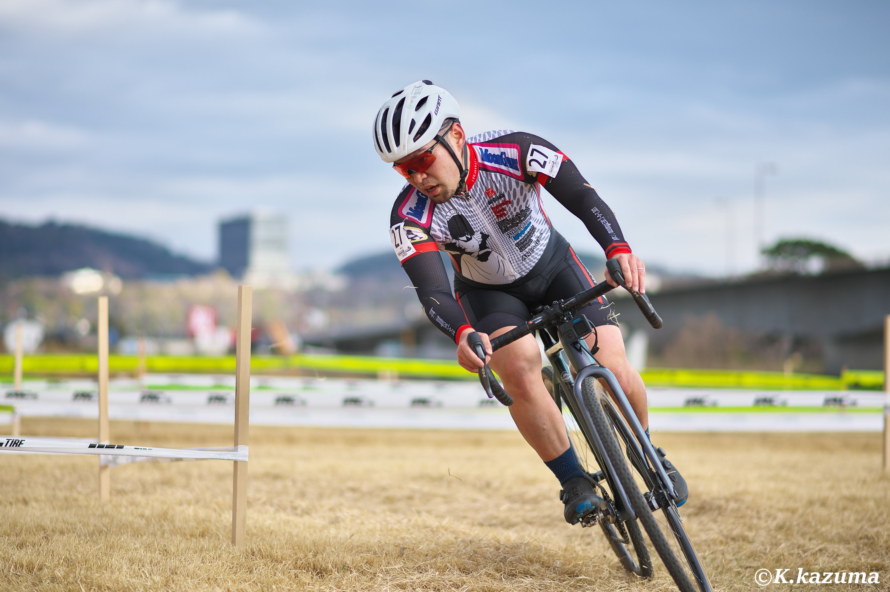
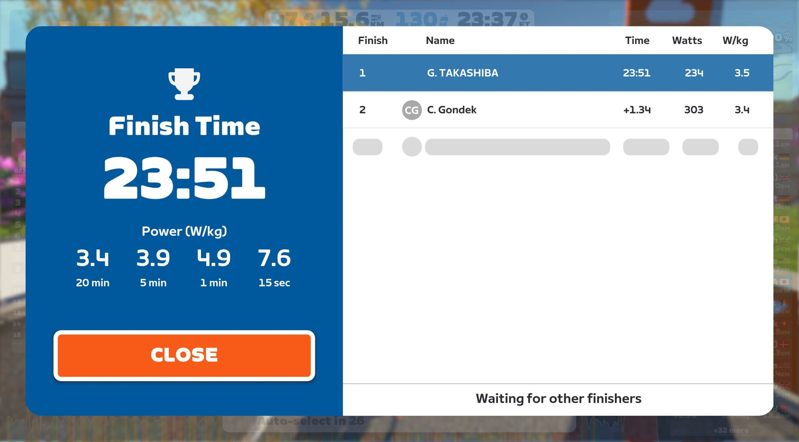

## リザルト

28/44位（+5:27）

### 機材

- メインバイク
  - GIANT TCX ADVANCED PRO
  - Farsports CX TU + Challenge Grifo TU 33c (F: 1.70Bar, R: 1.70Bar)

## ハイシーズンだったはずの秋口

[前回のレースレポート](/post/2023/11/23_makuhari)で、前回は前橋と書いていたものの、家庭の都合で前橋は欠席。

その後、12/10には[松伏CX](https://matsucross.com/)へ参戦していたが、1か月ほど乗り込めず軽いZwiftライドでお茶を濁していたことが祟って、試走ペースで疲労困憊し、レースでは登りで踏み込めなくなりDNFという醜態を晒した。

対外的には元気にしていたものの、メンタルは落ち込み、**ブログやYoutubeからは無かったことにした**ほど。

普段から練習量の多いほうではないが、60分走れないというのは未経験の弱体化。徐々にではあるが、週末の時間もライドへ充てられるようになったため、年末の冬コミへ向けた執筆作業の傍ら、ベーストレーニングに勤しんだ。

シクロクロスに特化したインターバルトレーニングをする段階には進めていないが、気晴らしに参加するZwiftクリテではCクラス（いつの間にかBからクラス落ちしていた）で上位に食い込んだり優勝したりできる程度には回復。ここまで3週間程度。

その後、ホームグラベルを乗り込み、強度を上げて登りも攻められるようにし、湘南シクロクロスに向けて準備した。

GARMINの推定VO2MAXはレースできる程度までには戻ってきたものの、シクロクロスの実戦はなく、いまいち自分の調子をつかめないままのレース当日となった。

## コースプロファイル
