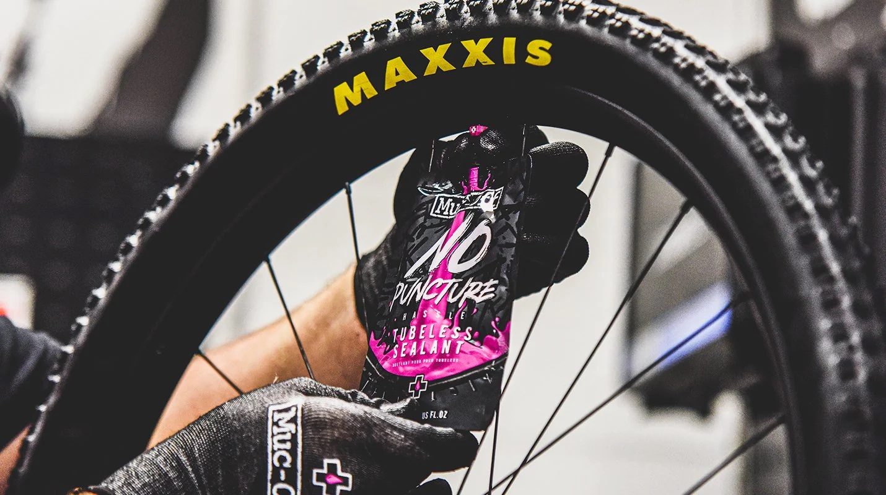
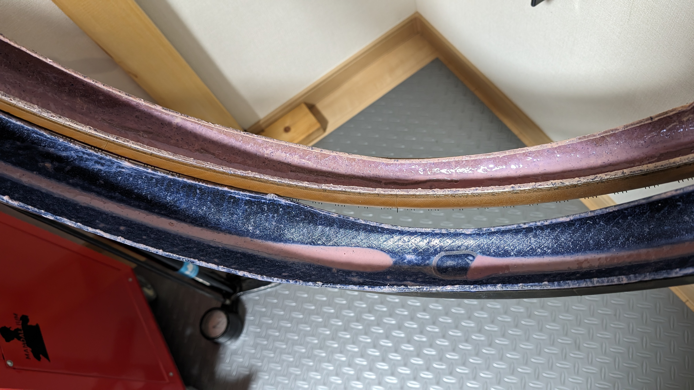
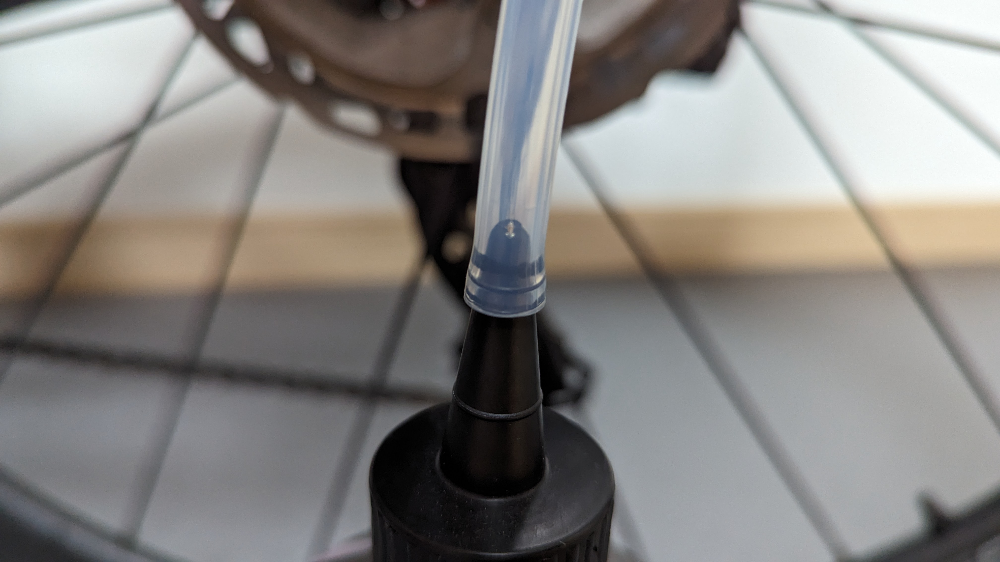
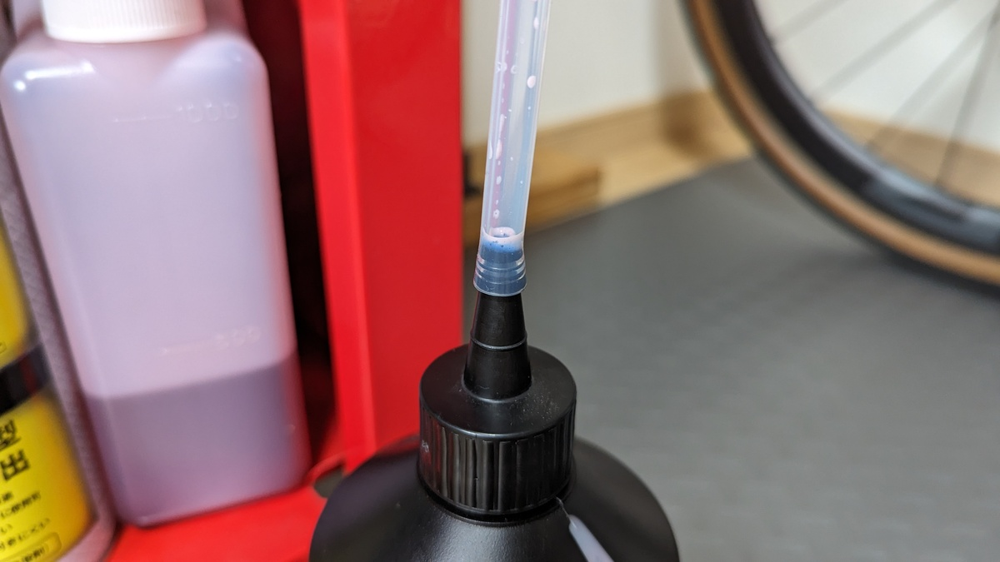
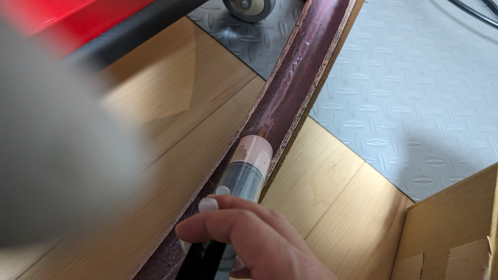
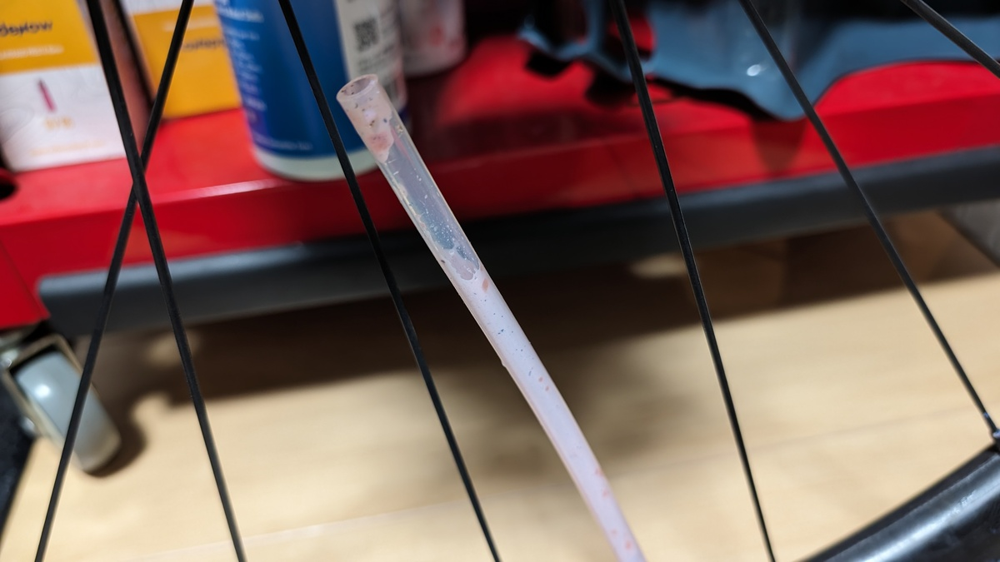
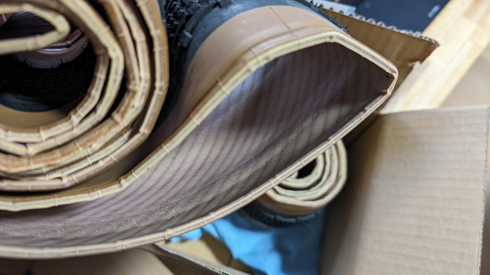

Wiggle/CRCグループの国際配送撤退は、パーツ・アクセサリー・消耗品類の調達に大きな影響を与えた。

特に、MTBと兼用できるものについては海外通販の存在感は大きかった。日本国内での流通が強くないメーカー品でも簡単かつ安価に手に入る便利な存在だった。だが今は違う！（ｷﾞｭｯ）

チューブレスタイヤユーザーにおいては、シーラントがこの影響を大きく受けた。国内流通だけでは特に製品バリエーションが少ない。

愛用していたOrangeSealのシーラントも、例に漏れず国内では簡単に手に入らない。

<LinkBox url="https://blog.gensobunya.net/post/2021/01/orangeseal/" />

後任が必要となったため、安定的に調達でき、なおかつ性能もいいと評判のMuc-offのシーラントに乗り換えてみた。

1年ほど利用してみて、評価も定まってきたためレビュー記事として投下しておく。

## Muc-off NO PUNCTURE HASSLE SEALANT

<LinkBox url="https://www.amazon.co.jp/dp/B07T1YV83F/" isAmazonLink />

[Muc-off NO PUNCTURE HASSLE SEALANT](https://amzn.to/3TYaOBg)はアンモニアフリーのラテックス系シーラント。

マイクロファイバー分子や穴をふさぐための粒子を混入させているが、**バルブコアからの注入には対応**している。対応温度が-20度からとなっており、**CO2ボンベでエアを注入しても特性が変わらない点**をアピールしている。

Muc-off製品特有の、甘い香りときついピンクカラーも特徴的。140ml使い切りパックが1600円前後、1Lで6000円というお値段。

使い切りパウチは直接バルブコアに接続できて追加工具なしに注入でき、ボトルにも注入用のホースがついてくる。

140mlなら、**ロードバイクなら少な目に使って2本×2回**は利用できる。MTBやグラベルなら前後1回分と計算したほうがいいだろう。

## 所感

<PositiveBox>

- 空気漏れを抑える能力がトップクラス
- 注入時の手間を省くパッケージや付属品

</PositiveBox>

<NegativeBox>

- 値段

</NegativeBox>

1年にわたり、3回タイヤを交換しながら使用。

一言でいうと、**お値段は張るもののシーラントのストレスになる不具合は一切ない**、値段なりの効果があるシーラント液だ。

特筆すべきは、**取り付け時のエア漏れを最小限にしてくれる**こと。[カフェラテックス](https://store.shopping.yahoo.co.jp/worldcycle/efe-h-caffelate250.html)や[OrangeSeal](https://blog.gensobunya.net/post/2021/01/orangeseal/)のシーラントを使っていた時は、ラテックスチューブのようなエア抜けがあって、ライドの度に空気を入れる必要があった。

利用後の写真を見てもらえばわかるように、タイヤ内側にべっとりとシーラントが行き渡り、どこか1カ所で滞留するということがない。

このシーラントを使っていると、**ブチルチューブ並みの空気抜けになり、1週間程度では再充填は不要**。空気圧の影響が大きいグラベルやトレイルでは調整することもあるだろうが、空気圧にシビアでないサイクリングであれば、そのまま乗り出せる。

後述する、**付属ホースによるバルブコアからの充填がとても施工しやすい**点も長期運用にはプラスポイント。バルブコア経由の充填ができないシーラントだと、継ぎ足しが面倒だ。

通常、シーラントの寿命は2～3か月でそのあと継ぎ足し運用をする必要がある。これはほとんどの人で**タイヤの寿命よりもシーラントの寿命のほうが短い**と思われるため、大抵の人はタイヤを使い切るまでに1～3回は継ぎ足しをすることになるだろう。

この時にタイヤを外していると、チューブレスタイヤのビード上げを何度もやる羽目になる。そして、その面倒さからシーラントの補充をサボり、パンクしたときにタイヤ内部はカラカラでシーラントが役に立たない…ということが起きがち。面倒でないということはそれだけで大事だ。

幸か不幸か、パンクは一度もなかった（検知できなかった）ため、パンクへの対応力は不明。後ほどで海外メディアによるテスト結果を考察してみる。

### 地味なヒーローである付属ホース

他のシーラント製品になく、[NO PUNCTUREシーラント](https://amzn.to/3ShXUwY)にあるもの…それが**優秀な付属ホース**だ。

このホース、**太く肉厚でありながら、適度な柔軟性**があってバルブコアとボトルに**密着し、ちょっとやそっとでは外れない強固な接続**を提供する。粒子がありながらバルブコア経由で注入できる点も優秀なのだが、このホースのおかげで**シーラントぶちまけ事故の発生確率**を大きく下げられる。

しかも、**ホースの素材とシーラント自体の相性か、ホースにシーラントの液体は付着しない**。あたかも高級コーティングされた上を滑る水のように、シーラントが1滴も残らずにボトルへ戻っていくのだ。

思わずケチってしまいたくなる程度には高価なシーラントだが、この特性のおかげで無駄なく使うことができる。

### 再利用には不向き

シーラントをケチる手段として、ホース内やシリンジに余った分を戻すほか、タイヤ交換時に生きているシーラントを回収するという手段もある。量を踏まえると、こちらが本命だろう。（もちろんメーカーはこんなことを推奨していない）

このNO PUNCTUREシーラントは、タイヤにべったりと張り付くため、タイヤを交換するときに余っている分をシリンジで吸って回収…という方法は難しい。回収量が少なすぎてうまみがあまり無い。

自分の場合は、無理矢理に吸い上げてホース経由で新しいタイヤへ注入したところ、中途半端に固まったシーラントが優秀なホースの中に残ってしまった。

**10mlも回収できないうえにツールを劣化させてしまうという悲しい結果**だったので、やろうとしている人がいたら止めておいたほうがよいと言っておく。

なお、コンディションによってタイヤを使い分けるような運用においては、**タイヤの内側についたシーラントを水で簡単に洗い流せる**という特性が効いてくる。もともと使っていたタイヤを丸めて保管するシチュエーションで実に役に立った。

### ブラックライト反応

Muc-offのチェーンオイル製品と同じく、こちらもブラックライトで発光する特性を持っている。

<LinkBox url="https://blog.gensobunya.net/post/2021/12/c3_ceramic_dry/" />

チェーンオイルでは、時間が経つと表面では発光しなくなるためにそこまで使いどころのない機能だったが、シーラントでは**小さなパンクやエア漏れを検知する**という利用価値？
がある。

貫通パンクやエア漏れにシーラントが働いてくれたか確認できることに、どれくらいの価値があるのかと言われると言葉に詰まるが、シーラントの働きを後から確認しやすいと、ありがたみが増すと思われる。

## 海外メディアによるパンクテスト結果をメタレビュー

シーラントのレビューというやつはとにかく難しい。装着して数日は、初期エア漏れ対応力くらいしか分からない上に、パンク対策としては実際に穴をあけないことには把握できない。

しかも、**パンクの対応力を見ようとすると、実際にタイヤに穴をあける必要もある**。タイヤを傷物にしたうえ、修復できなくなる可能性があり、比較の際にまたチューブレスタイヤを装着すると考えると、個人レベルではなかなか躊躇する。

MTBのマーケットが大きい欧米のWEBメディアでは、ことあるごとにシーラント剤のレビュー記事が公開されている。ざっと2023年の記事の中で、[Muc-off NO PUNCTURE](https://amzn.to/3ShXUwY)が含まれるものを探してきた。

<LinkBox url="https://www.mbr.co.uk/buyers_guide/best-tubeless-sealant-378703" />

<LinkBox url="https://www.cyclingweekly.com/group-tests/best-tubeless-sealant-448797" />

<LinkBox url="https://off.road.cc/content/buying/best-tubeless-sealant-2024-tyre-sealant-for-mtb-gravel-and-road-12107" />

公開日時は、mbrの記事が2023/10、CyclingWeeklyの記事が2023/11、off-road.ccの記事が2023/4だ。イギリス系のメディアに偏ってしまったが、アメリカ系メディアでも単体テストはされている。アメリカ系メディアでシーラントランキングに出てこないのは、Muc-offがイギリスオリジンのブランドであることが影響していそう。

さて、重要なパンク修理力のほうは、各記事を総合すると**公称通り6mmに対して、5~6mmまでの穴を塞ぎ、再度ポンピングに耐える能力は持っている**ことが実証されている。

また、[offroad.ccの記事](https://off.road.cc/content/review/accessories-misc/muc-off-tubeless-sealant-review-11991)によると、5mmの穴をふさいだ時のエア漏れ量もテスト中過去最少だったとのこと。

大抵のシーラントはエアを再注入…つまり、再度圧力がかかっさ際にシーラントが再噴出してしまうこともあるが、そういったこともない。CO2ボンベによる**低温で能力を失わないことと合わせて、外出時にも頼れそう**だ。

いずれの比較でも、**最もオールラウンドに優れているシーラント**としての評価を得ている。テストでは[SILCAのシーラント](https://amzn.to/47zEnfF)のほうが大きな穴をふさぐことができたり、[Peaty'sのシーラント](https://store.shopping.yahoo.co.jp/hobbyride/peatys-1014.html)がより長期間持つことも示されているが、これらは高価になるため、Muc-offに軍配が上がるようだ。

コストについては国によって事情が異なる面も大きいが、日本では**Amazon.co.jpで販売されているほか、期間限定セールの常連でもある**ことから手に取りやすい環境は整っていると言える。

## まとめ

性能が良いことはもちろん、シーラントを使う上でのストレスを作業者の立場に立って軽減してくれていることが印象的なプロダクト。

決して安くはないが、安いシーラントを買って乾きやエア漏れに悩まされることを考ると、価格なり、いや価格以上の価値を提供してくれている。

相性問題やシーラントの特性といった**細かいことに気を取られず、走りに集中したい**ユーザーにはお勧めの一品だ。

<LinkBox url="https://www.amazon.co.jp/dp/B07T1YV83F/" isAmazonLink />
