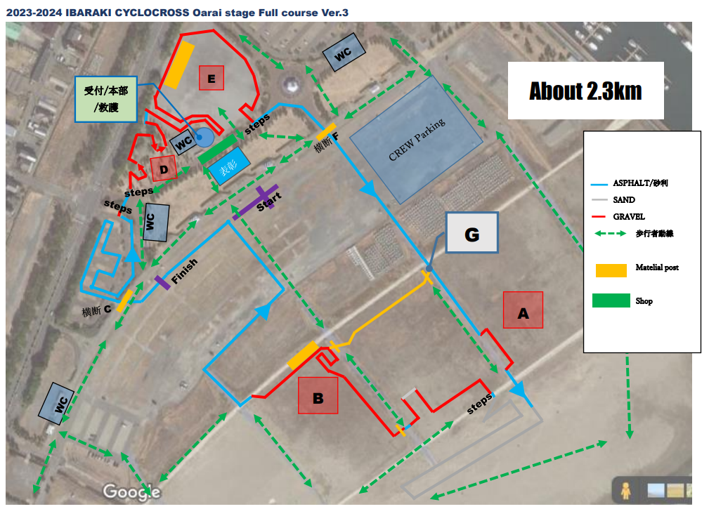
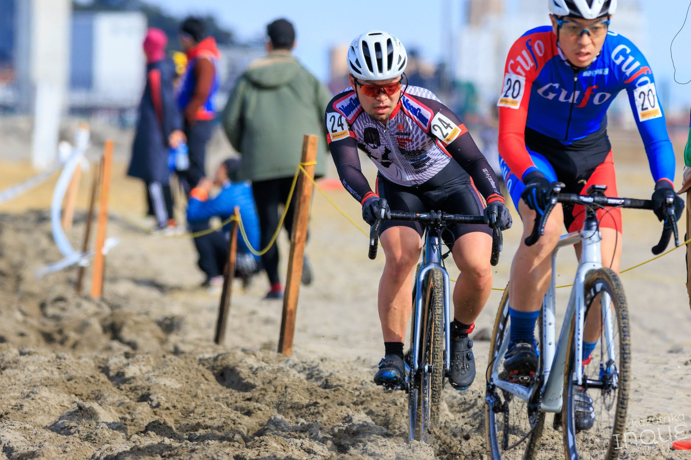
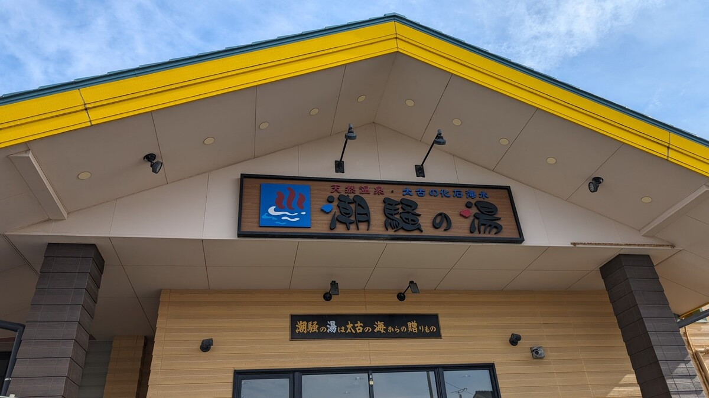
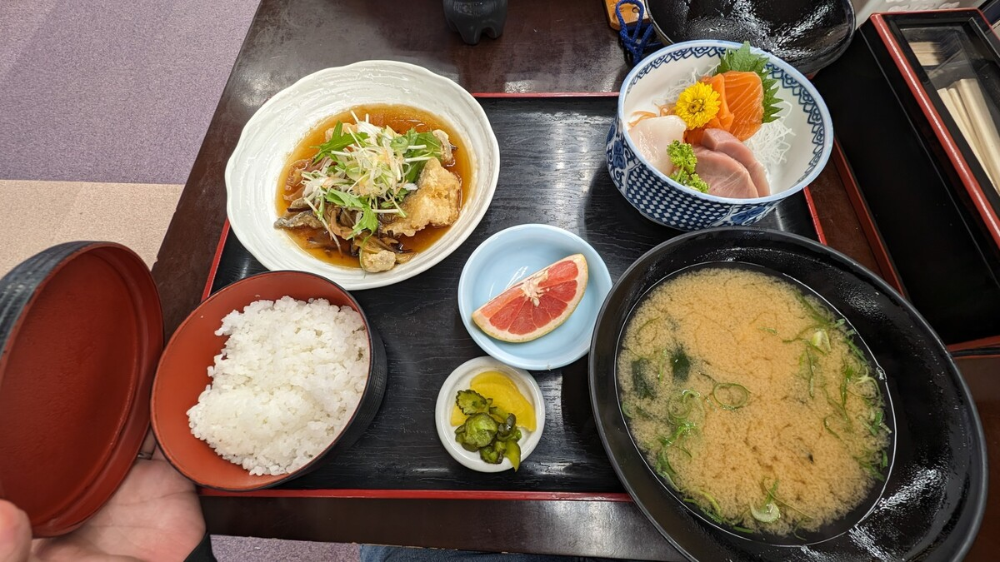

## Summary

家からは遠いものの、グルメに温泉にとレース外の楽しみも多い大洗。

チェーン落ちにパンクと、トラブルに泣かされるも、パンクしたおかげで逆に砂が走りやすくなったこともあって沈み切ることなく耐えた。

## リザルト

24/34位（-1 lap）

### 機材

- メインバイク
  - GIANT TCX ADVANCED PRO
  - Farsports CX TU + Challenge Grifo TU(F:1.5Bar, R:1.55Bar)

## コース

ガレたグラベルロードと、公園の林間部を活用した若干だが角度のあるアップダウン、そして長い海浜の砂が特徴。

昨年は（JCXの裏とはいえ）[3位争いパックで敗れ惜しくも6位](https://blog.gensobunya.net/post/2023/01/2023_oharai/)となった相性のいいコース。

昨年より砂エリアが増量され、勝負どころとしての比重が高まっている。

砂とはいえ、この日はコース大半の場所が湿り気を帯びており、乗りやすい部類。ところどころ硬いところもあってリマウントも可能だし、コーナーも乗っていけそう。

1カ所だけサラサラで乗りこなせないエリアがある以外、砂を得意とするレーサーには稼ぎどころだ。

過去はコンクリの段差がそのままになっており、下位カテゴリでは降車する人も多かったが、今年は土嚢が積まれたために、リムやタイヤを破壊する心配の少ないコースになった。シケインはないので全乗車も可能。

## レース

（GoPro忘れで動画なし）

今年は他の大きなレースとかぶっていないこともあり、それなりに実力者がそろっている。

スタートは3列目から、外側にラインを取ったおかげでスムーズに前に出ることができた。砂を得意としているので、是非ともゼッケン（24番）よりは前でゴールしたい。

林間を抜け、砂エリアに入る前でポジションを上げようとアグレッシブに走っていると、舗装路に降りる段差でチェーンを落としてしまう。レース中のチェーン落ちは珍しいな…と思いながら止まってクランクを見ると、**クランクアームとチェーンリングの間で複雑にジャム**っている絶望的な絵を発見。

「今日はグローブを着けていてよかった…」などと思いながら力任せに引き出し、復旧するとそこはほぼ最後尾。1周目なので当然だ…

得意な砂エリアは順位リカバリーのための場所となった。柔らかいところ以外を乗車でこなしてコントロールラインまで踏み倒すと、22位まで順位が回復（ラップチャート調べ）。コントロールライン付近では、心拍数がめちゃくちゃに高くなっているが、林間でかなり落ち着くので、砂とそのあとの未舗装路は踏み倒せると判断。

その後も順調に前のライダーをキャッチし、7/9周で13位まで順位を上げ続ける。同じく序盤に番手を落とした浦選手のペースがちょうどよく、背中を前にしたり遠ざかったりしながら前のパックを食い続けることができた。

「最初のチェーンさえなければシングルリザルトを取れたかも」と思いながら、8周回目に入ったところ、舗装路のコーナーで急にグリップが高まり、タイヤがコントロール不能に陥る。みるみるうちに空気がすべて抜け、パンク…

しかも、この日は予備ホイールを持ちこみを怠っていた。法則が発動してしまった。チューブラータイヤなので、その後も走り続けることはできたが、当然に遅いし急なコーナーは降りざるを得ない。唯一、**砂エリアだけは通常時よりも楽しく走ることができた**のはラッキーだった。0気圧は砂向き！

砂が終わったところで、「1位まだいないよ！」と言われて絶望したが、コントロールライン付近でちょうど加藤健悟選手にラップしてもらうことができ、最低限のパンク走行で終了できた。砂のおかげで意外と順位も失わず、結果的にゼッケン通りの24番。

過去のレースレポートを見ると、チューブラータイヤをレース中にパンクさせたのはこれが初めてだ（なお、チューブレスでは数えられないほど経験済み）。丸4年で80レースほど使ってこれなので、かなり珍しい。もしくはchallengeタイヤのパンク耐性が低いか…

また、今年は2回ほどチェーン落ちが発生しており、普段のレースシーズンに比べて有意に多い（通常、落車時以外でチェーン落ちはほぼ発生しない）。今年は[SNAIL](https://s.click.aliexpress.com/e/_DFggbt7)という中華ブランドのチェーンリングを使っているが、あまりよくなさそうだ。来年はDECKASやSTONESのリングに交換しようと思う。

## おまけ

レース後は潮騒の湯に初訪問。

塩辛い泉質で海のそばの温泉らしい泉質を楽しめる。湯舟は少なく、ちょっと狭いが露天風呂から海は見えるし、水風呂でレース後の体を冷ませるのはうれしい。

この日の日替わり定食は、地魚ぽい白身の南蛮揚げ煮と、刺身三種。刺身はサーモン・ビンチョウ・イカとあまり地元感がないものだったが、揚げ煮がおいしかったのと、アラ出汁の味噌汁が絶品だった。

レース後は守谷SAで[志ち乃](https://www.shichino.jp/)のどらやきをお土産にするのが茨城シクロクロスのルーティン。家庭平和！

## Cover Photo

ぷらんちゃ
