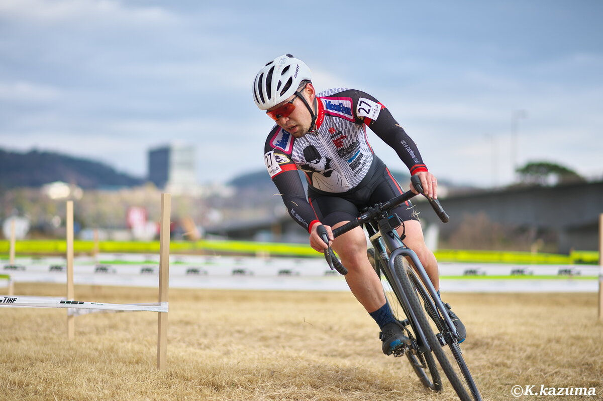
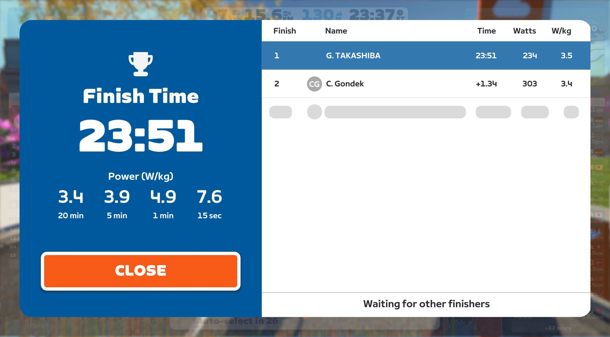
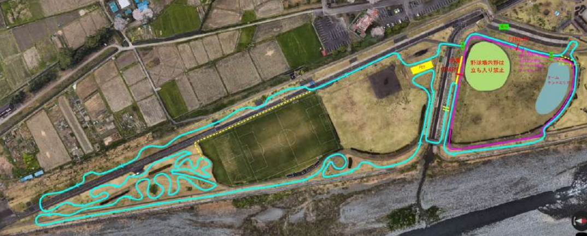

## リザルト

28/44位（+5:27）

### 機材

- メインバイク
  - GIANT TCX ADVANCED PRO
  - Farsports CX TU + Challenge Grifo TU 33c (F: 1.70Bar, R: 1.70Bar)

## ハイシーズンだったはずの秋口

[前回のレースレポート](/post/2023/11/23_makuhari)で、前回は前橋と書いていたものの、家庭の都合で前橋は欠席。

その後、12/10には[松伏CX](https://matsucross.com/)へ参戦していたが、1か月ほど乗り込めず軽いZwiftライドでお茶を濁していたことが祟って、試走ペースで疲労困憊し、レースでは登りで踏み込めなくなりDNFという醜態を晒した。

対外的には元気にしていたものの、メンタルは落ち込み、**ブログやYoutubeからは無かったことにした**ほど。

普段から練習量の多いほうではないが、60分走れないというのは未経験の弱体化。徐々にではあるが、週末の時間もライドへ充てられるようになったため、年末の冬コミへ向けた執筆作業の傍ら、ベーストレーニングに勤しんだ。

シクロクロスに特化したインターバルトレーニングをする段階には進めていないが、気晴らしに参加するZwiftクリテではCクラス（いつの間にかBからクラス落ちしていた）で上位に食い込んだり優勝したりできる程度には回復。ここまで3週間程度。

その後、ホームグラベルを乗り込み、強度を上げて登りも攻められるようにし、湘南シクロクロスに向けて準備した。

GARMINの推定VO2MAXはレースできる程度までには戻ってきたものの、シクロクロスの実戦はなく、いまいち自分の調子をつかめないままのレース当日となった。

## コースプロファイル

コースは「ド」が3つ付くレベルのド平坦。フィニッシュ前のキャンバー上り下りと、階段上り、堤防斜面にありがちな岩付きコンクリ激下りの計3カ所が分かりやすいポイント。

ただ、このコースにおける真の敵は、**刈りたてにもかかわらず長めの芝**と、刈りカスの芝が浮いたコーナーと、わずかな逆キャンバーコーナーのエリア。平坦を踏み倒すパワーも必要だが、コーナーはかなり神経質だ。

## レース

<iframe width="560" height="315" src="https://www.youtube.com/embed/Fw7wREj4QpI?si=K52UWxeQ-9BjuoqG&amp;controls=0" title="YouTube video player" frameborder="0" allow="accelerometer; autoplay; clipboard-write; encrypted-media; gyroscope; picture-in-picture; web-share" allowfullscreen></iframe>

GP佐宗のイベント待ちが長く、体を冷やさないように注意しながらゼッケン27番の中ほど後方よりスタート。

スタートループでは意外にもポジションを若干上げることに成功。内側の渋滞を皆警戒していたのかぽっかり空いていたスペースに飛び込み、その後の階段・キャンバーセクションでもそこそこの位置キープに成功する。

それから数周回はマイペースで淡々と走る。芝コーナーの滑りやすさ、急な段差が多いこともあって、スリップダウンやマシントラブルに見舞われた人を多く見かけた。自分も、激下り後の浮いた芝にタイヤを取られて派手にスリップダウンしたものの、幸いマシントラブルは無かった。

この序盤、SNELのJonさんは、何度か追いつき追い越されを繰り返したが、最終的に長いバックストレートでパワーに追従できず、離れてしまった。

20分ほど走ったあたりで苦しさが出てきて、「まだ高強度ができないのか…？」と心が折れかけた。冷静に体の異常を確認すると、**腰の痛みも出ていないし、太腿の筋肉痛も無い、呼吸はつらいが横隔膜が痛むほどではない**ということに気が付き、まだまだペースを保てると自分を鼓舞。

30分あたりで、後ろから走ってきた轍屋 片岡さんをはじめとするパックに吸収され、この後最後まで同パックで走ることとなる。ここで2度目のスリップダウン。（動画[32:25](https://youtu.be/Fw7wREj4QpI?si=4d19g73UMS0fZVJp&t=1940)あたり）いったんパックから千切れるも、ストレートで踏み倒し、得意の乗降車でタイムを稼いでパック復帰。

ここまで走ってようやく、**空気圧がコースに対して高すぎる**ことに気が付く。パックの中でバックストレートに強く、コーナーは遅くて追いつかれる。普段は逆の立場なので、どう立ち回れば自分に有利なのかが分からなくなった。しかも、このパックに追いつきつつある選手（GIANT 高橋さん）がいる。

数秒考え、自分のコンディションを見るためにも、争わずに最速ペースをメイクする方針に決定。バックストレートを牽きつつ、要所で前に出てくる片岡さんとローテしながらペースメイク。

スピードを維持したことが幸いしたのか、フルラップ完走を確実にしたのは良いが、結局GIANTのほうの高橋さんは引き離せず、最終周回を前にして合流を許してしまう。パックのその他のメンツの最終アタックに反応する力はなく、5人パックの4番目、総合28位でフィニッシュ。

前回のDNFからすれば、完全復帰と言ってもよいフルラップ完走。無事、TCX友の会完走写真に入ることもできた。

<blockquote class="twitter-tweet">
<a href="https://twitter.com/hashtag/TCX%E5%8F%8B%E3%81%AE%E4%BC%9A?src=hash&amp;ref_src=twsrc%5Etfw">#TCX友の会</a>  湘南CX開成GP佐宗ME1🏁Ver. ME1 TCX使用率: 24%(10/出走42) 🥰  🥇加藤健悟選手🎉  📸 <a href="https://twitter.com/Yamamovic?ref_src=twsrc%5Etfw">@Yamamovic</a> <a href="https://twitter.com/hashtag/TCXsquad?src=hash&amp;ref_src=twsrc%5Etfw">#TCXsquad</a> <a href="https://t.co/KddlHSRiVi">pic.twitter.com/KddlHSRiVi</a>
&mdash; G3110 (@3110mo) <a href="https://twitter.com/3110mo/status/1744129151152591213?ref_src=twsrc%5Etfw">January 7, 2024</a></blockquote>

あとはインターバル力を鍛えて、小さなギャップを素早く無くしたり、最後のペースアップに備える力を戻せば、例年の走りに近づくだろう。

全日本選手権と千葉CXは見送り、2週の間をあけて大洗CXに参加予定。前回表彰台をギリギリ逃した大会だが、今回はどうなるか…
