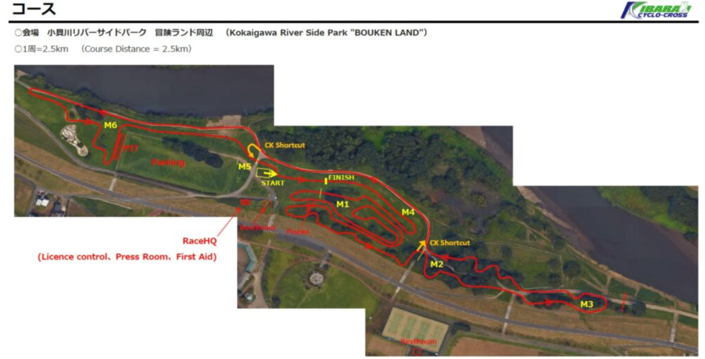

## リザルト

34/56位(-5:24)

## 機材

- メインバイク
  - GIANT TCX ADVANCED PRO
  - Farsports CX TU + F: Michelin Power CX Mud TU 33c, R: Challenge Grifo TU 33c (**F: 1.50Bar, R: 1.50Bar**)

## コース

関東のクロッサーには定番の練習場所である、小貝川冒険ランドのコースを拡張しているのが取手ステージの特徴。

今年の変化は2点、例年全くコーナーのないレイアウトのバックストレートに1カ所変化を持たせている点に加え、練習コースエリアのレイアウトが大きく変わっている。なおWEBのコース図には反映されていない…

取手のコースはバックストレートの印象が強く、パワーコースと評されがちだが、その実**コーナーの処理でもかなり差が出る**。

コーナーを速く抜けられれば、その分再加速に要するエネルギーが減り、バックストレートで踏める。高さのある立体的なコーナー・スラロームコーナー・180度コーナーに加え、進入スピードの異なる多くのコーナーがあり、**毎周回節約した加速エネルギーは複利で後半効いてくる**。

特に自分のような、ロードレースやロングライドをしなくなったライダーは地脚が乏しく、**単純な踏み合いや平均パワー勝負では絶対に勝てない**。ましてや風邪から復帰途中なのでフィジカル勝負は絶望的。

割り切って前後1.5Barのコーナー特化セッティングで勝負した。もちろん試走ではタイム差の出やすいコーナーで複数ラインを試し、最速ラインとセカンドラインを準備しておく。

試走で分かったのだが、轍＝最速ラインではないところが散見された。こういうところはギャップを詰める絶好のチャンス。また、ライン取りの利を活かすには車間を開けておき、**脱出速度で差をつける事前準備**も必要になる。

<blockquote class="twitter-tweet">
今日の取手、轍が複合コーナーだけど実はまっすぐ走ると速い場所シリーズその1 <a href="https://t.co/7SocRJ0OH7">pic.twitter.com/7SocRJ0OH7</a>
&mdash; ゲン (@gen_sobunya) <a href="https://twitter.com/gen_sobunya/status/1759168720432414853?ref_src=twsrc%5Etfw">February 18, 2024</a></blockquote>

ツイートのような嘘コーナーを上手く処理するだけで10m程度の車間は一瞬で詰められる。レース動画をフルでアップロードするので、ぜひ見てもらいたい。

## レース

<iframe width="560" height="315" src="https://www.youtube.com/embed/PowhOBb6HeY?si=oeaXLb17NIOpUOnI" title="YouTube video player" frameborder="0" allow="accelerometer; autoplay; clipboard-write; encrypted-media; gyroscope; picture-in-picture; web-share" allowfullscreen></iframe>

スタートは中盤。高速コースで多人数という、集団でのレース展開が確実な状況なので、コース内で唯一狭いエリアまでにポジションを上げておきたいところ。

1コーナーは大外から回って出遅れないスピードを保つが、その後の渋滞は結局避けられず降車バトルに身を投げる。半分本気、半分ネタで練習していた「占有体積を使わずに自転車を上に避ける練習」が役に立った。

バームやスラロームで追いつける自身のあるセッティングなので、無理して僅かな車間を詰めずに脚を使わないことに専念。それでも1周目のバックストレートはきついので、死ぬ気で踏んでついていく。

友人の野田さんがこれまでと違い、早々にポジションを上げてきたことに若干驚きつつ着いていく。あと、イナーメ吉岡さんがトラブルからあっという間に復帰してきて置いて行かれた。さすがロードレーサー。そのあとも何度かトラブルで落ちてきたけどその度にすさまじい踏み方で上がっていく。

2周目からは、ストレートでなるべく張り付くことだけ意識して淡々とレースを処理していく。たまにローテーション要求されるが、明らかに遅いのは申し訳なかった…

3周時点で残り8周の表記を見たときは絶望したが、走っていると時間が経つのは速いもの（気絶ともいう）。いつの間にか安定したパックでコーナーは自分が、ストレートは他人に任せてペーシングしていると前のパックが見えてくるが捕まりそうで捕まらない。

そうこうしているうちに自分のスタミナが切れてゲームセット。完走はできるが、踏むべきところで踏めなくなりラップタイムが一気に10秒以上悪化。パックの仲間を見送って一人ゴールとなった。

今シーズンのレースはこれにて終了。序盤は雨続きで機材が消耗したので、来年に向けてオーバーホールとタイヤ交換でリフレッシュしたいと思う。
