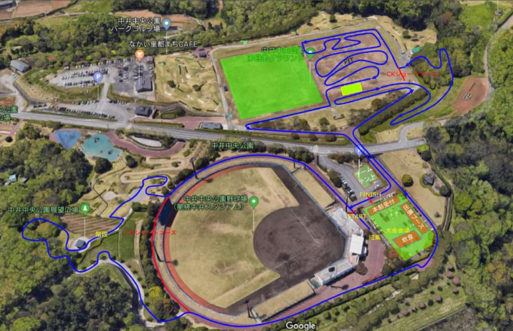

## リザルト

21/24位（-1 lap）

### 機材

- メインバイク
  - GIANT TCX ADVANCED PRO
  - Farsports CX TU + F: Michelin Power CX Mud TU 33c, R: Challenge Grifo TU 33c (F: 1.70Bar, R: 1.70Bar)
- サブバイク
  - GIANT TCX SLR SS
  - F: XT M785 + [IRC SERAC CX TLR](https://amzn.to/3wkRgND), R: PAX AL 30mm + [IRC SERAC CX TLR](https://amzn.to/3wkRgND)

## 不調からの復旧作業再び

乗り込めずに醜態をさらした松伏シクロクロスから湘南CX開成・茨城CX大洗と調子を上げてきたが、中井の前週末に風邪をひいてしまい、熱は落ち着いたものの呼吸器が完調とはいかない状態。

とはいえ、**悪い時は悪いなりにレースを走っておかないと現状把握ができない**。気は重いが、やることをやって自分がどんな状態なのか、何ができて何ができないのか理解しておく必要がある。

## コース

コースはおなじみの中井中央公園を使った高低差のあるコース。

登りは階段か斜面をよじ登る降車区間、下りはダイナミックなドロップオフを含む林間で、自転車のスキルやフィジカルに加えて階段ランニング能力も必要になるコース。

階段自体はそこまで長くないのだが、そこに至るまでに「コントロールラインまでの平坦登り」「野球場周りの平坦路」「芝生の急坂」をクリアする必要があり、**プッシュしていると心拍が上がりきった状態で階段へ突入する**ことになる。

階段さえ終わればあとは下り…でもなく、林間を下ったあと登り返しも降車する必要がある。それからようやく長い下り坂で休める仕組み。

下った後も登山のような斜面の登りと、林間ドロップオフをこなし、グラウンドに入る。**グラウンドも曲者**で、コーナーのアウト側でスピードを抑えるレイアウトになっており、**全く気持ちよく曲がれない**。イン側でブレーキさせる設計にすればいいものを…

土の路面も締まっていて非常に細かい砂利とも土ともいえないものが浮いており、ナーバスだ。

差が詰まるのは、乗車降車でこなす登り区間がメイン。ただ、グラウンドも全体で見ると、スキルによって数秒差つくことが観戦していてわかる。登り一辺倒に見えて総合力（ただしスピード能力は除く）の勝負になる。

### レース外の魅力

レースコースは（一部のマニアックな方以外を除き）あまり評判がよくないが、コース外での楽しみは多いし、駐車場もトイレも豊富という会場としての良さがある。

会場である中井町の地元野菜を売っている施設があるほか、併設されているカフェやピザ窯、公園の遊具でキッズが遊べる点も家族連れにはうれしい。

何より、200食限定ではあるが、ピザが1切れ無料でふるまわれる点が非常にうれしい。**地元の野菜を使う他、オリーブオイルも町内生産**というから驚き。

天気がいい時間帯は富士山もきれいに見えるので、おおよそ許される。

## レース

<blockquote class="twitter-tweet" data-media-max-width="560">
シクロクロスは危険がいっぱい <a href="https://t.co/1K1WfM9JqD">pic.twitter.com/1K1WfM9JqD</a>
&mdash; ゲン (@gen_sobunya) <a href="https://twitter.com/gen_sobunya/status/1756643939288055872?ref_src=twsrc%5Etfw">February 11, 2024</a></blockquote>

スタートは2列目。左右どちらかの端を選択することになったが、最終的な階段前砂利コーナーのインを取りたかったので左側をチョイス。

ギア選択が重く、やや出遅れたのだが、スタート3秒後に同列隣でスタートした選手がチェーン切れで左側に吹っ飛んできた。

とっさにブレーキしてやり過ごすが、最後尾まで落ちてしまう。ギアを重くしていなかったら直撃していたので、幸運に感謝。

**階段の入り口が人間1人分の幅しかない**ため、後ろで入るとかなり遅れてしまう。コーナーワークでうまく前にスルスルと登り、中盤で階段へ入ることに成功した。

ここからグラウンドまでがこの日のハイライトで、舗装路の登坂と野球場周りで全くパワーが出ずに追い抜かれていく。なぜかランニングはそこそこのスピードが出せたので、階段や登山でなんとか中盤の位置で耐えるも、3周で限界に達して大きくペースダウン。

1周だけ9分/周のスローペースで走行したのちに、8分前後のペースに復活するも、6/9周目の最高地点で**脚攣りで4分ほど**動けないまま倒れていた。

脚攣りから復帰したものの、フルラップは絶望的。使う筋肉を変えるためにサブバイクのTCX SSを久しぶりに起動。

GRXレバーとティアグラレバーの差に困惑したり、Michelin MUD TUより[SERAC CX TLR](https://amzn.to/3wkRgND)がしなやかで走りやすかったりと、いろいろな発見をしながら何とか2周走ってゴール。

最下位だが、AJOCCポイントはそれなりにゲットできたのが幸運。

## シーズン終盤の難しさ

**シーズン終盤は、機材トラブルが多くなる**時期。

特に今年の東日本は悪天候レースが多く、チェーン含む駆動系やブレーキパッドに加え、タイヤ・ハブあたりの消耗が大きいはず。

意識しづらいが、チェーンリングやスプロケも消耗している。特に**フロントシングルの人はチェーンリングの摩耗に気を配りたい**。

大洗で珍しくチェーン落ちしたので中華チェーンリングを確認したところ、ナローワイドのワイド側で、歯の加工が丸まっていたので今回に合わせて交換した。**万全なら前転してもチェーンは落ちない**。

15レース以上するなら、チェーンは毎年、チェーンリングとスプロケは多くとも2年で交換したいところだ。

<LinkBox url="https://www.amazon.co.jp/dp/B01D8CPR0E/" isAmazonLink />
