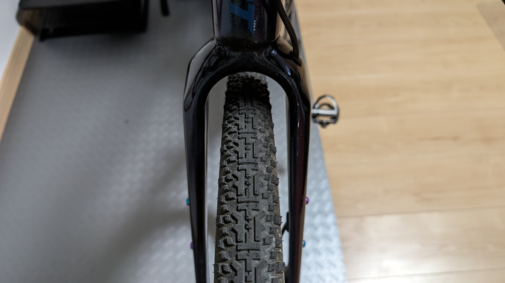
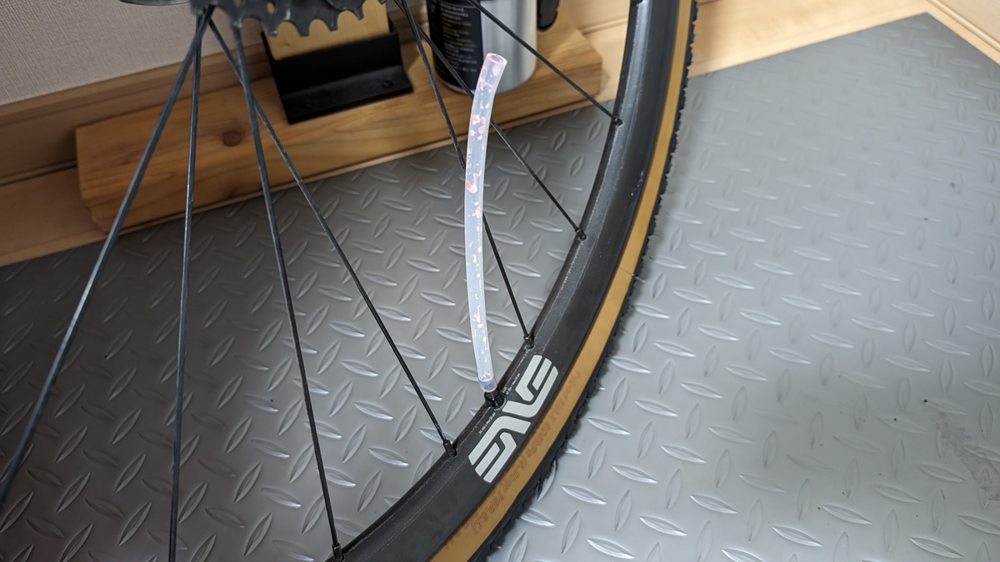
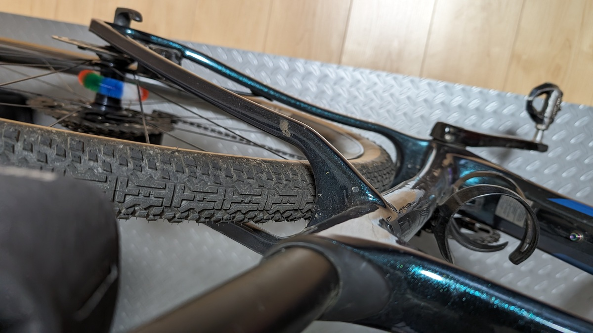

## 前置き

Panaracer様から販売前テスト用に提供されたタイヤをもとに、グラベル・シングルトラック、そして舗装路での使い心地をレビューしていく。

ロゴがないこと以外は市販品と同様であることは確認済み、製品提供とフィードバックはあったものの、本記事についてはPanaracer様からの依頼**外**であることは明らかにしておく。何の資料も配布されていないので、事前のカタログ情報も無い中インプレッションを行った。

## スペック・取り付け

グラベルキングシリーズすべてのタイヤがリニューアルされ、X1モデルが追加されたほかに**軽量グレードの「R」が追加、ビードの上がりやすさ改善、ケーシングの刷新**が行われた。

今回提供してもらい、レポートしたテストタイヤは、本記事の主役である[グラベルキングX1 40c](https://amzn.to/48DB8ob)だけでなく、グラベルキングSK 40cもテストした。本記事では特に言及がなければリニューアル後の2モデル間で比較していき、リニューアル前のモデルに言及する際は「旧SK」「旧SS」と言った表記を用いる。

<LinkBox url="https://www.amazon.co.jp/dp/B0CWKCZKSP/" isAmazonLink />

### 開封・計量

それぞれ1セット2本づつのテストで、**X1 40cの実測重量は483gと486g**。

対して**SK 40cの実測重量は481gと485g**だった。カタログ重量は同じで、パターンのみ異なるタイヤだ。

X1のパターンを見た際に抱いた**最大の期待は、「舗装路を走ってオフロードに行くライドの最適パターンっぽい！」というもの**。果たしてどうだったかは後半のインプレをお楽しみに。

### 40cという幅とSKの限界

これまで、グラベルキングシリーズのタイヤ幅のボリュームゾーンは**35c-38c-43c-45c**という刻み。これが **35c-40c-45c-50c(SKのみ)** にアップデートされた。

現代的なグラベルロードであれば、いずれのタイヤ幅も利用できるかとは思うが、**少し前までのレース系グラベルロードではMAX 42c**といったスペックも散見された。

43cは公式には入らないが、38cではアグレッシブなライドに出づらい…新しく発売された40cはそんな要望に応えるサイズだ。ただ、38cがキャパシティのエンデュランスロードを持っている人には最大幅のタイヤサイズが無くなってしまう、酷な変更だったかもしれない。

<LinkBox url="https://blog.gensobunya.net/post/2022/04/revolot_adv22_review/" />

かくいう自分のREVOLT ADVANCEDもフリップチップがショートの状態では公称のリアタイヤクリアランスは42c。

もちろん、実際は43cでも問題なく走行できるし、グラベルを思いっきり楽しみたいニセコグラベルでは[43cの旧グラベルキングSK](https://amzn.to/3U2z4ji)を履いて出場していた。

**細いタイヤの方は転がり抵抗が良いと思われがち**だが、オフロード・オンロード関わらずそこまでの差はない。むしろ**太いタイヤのほうが跳ねないため、勾配に関わらず転がりが良い**…というのが定説だ。もちろん、オフロードでこの傾向は顕著になる。

一方で、**太いタイヤは登りで重量のハンデを負う**。ここはコースの獲得標高とにらめっこして自分のタイヤ幅を決めることになるが、グラベルライドの本番はオフロードの下りにあると信じて疑わない自分にとって、その楽しみをスポイルするという選択肢はない。

<LinkBox url="https://blog.gensobunya.net/post/2022/09/nisekogravel22_3/" />

[43cの旧グラベルキングSK](https://amzn.to/3U2z4ji)は下りでは文句の無い安定感を提供し、ニセコグラベルでは存分のそのロケーションとコースを楽しむことができた。

しかし、それは**イベントのような「走り始めて早々にグラベルがスタート」という環境**だからこそのメリット。

普段のライドではグラベルフィールドまでは時間がかかるし、舗装路の登りだってある。それでいて、**関東のグラベルはニセコで走ったそれのように緩やかな気持ちい下りではない**。

アプローチの舗装路や登坂は軽々とこなしつつ、グリップはより必要。SKではノブが変形して登りや舗装路でロスするし、かと言ってSSでは楽しむべきオフロードを楽しみ切れない…

そんな事情もあって、SSでもSKでもないオールラウンドなパターンは（個人的に）待望の存在だった。

### 「グラベルキングは緩い」を払拭。ビード上げの苦労は普通レベルへ

かつて、**グラベルキングはビードの緩いタイヤ代表**で、リムとの相性次第ではビード外れを起こすことも有名だった。（特に独自チューブレス規格だったNotubesリムとの相性が良くなかった）

グラベルロードブーム前から存在しており、ブームに乗ってタイヤパターンと太さのバリエーションが増えても、長らくマイナーチェンジにとどまり大きな変化はなかったが、今回ついにリニューアルして、ビード径が改善されたようだ。

今回は短期間でX1 40cを前後で合計2本のほか、同じくテスト提供されたSK 40cも併せて合計4本装着した。ホイールはENVE G25。

<LinkBox url="https://blog.gensobunya.net/post/2023/11/enve-ag25-review/" />

作業環境として準備しているのは、フロアポンプとTOPEAKのTubibooster X。

装着もテストのうちなので、[作業用手袋](https://amzn.to/4bYCX1F)だけをした状態で、フロアポンプでの取り付けを試し、その後ビードが上がらなければコンプレッサーを用いるという手順をとる。

タイヤ単体の力を見たいので、**シーラントはビード上げ後にバルブコアから注入する**段取りとした。石鹸水やビードワックスも使用しない。

<LinkBox url="https://www.amazon.co.jp/dp/B007OYQXQ0/" isAmazonLink />

シーラントはマックオフの[HASSLE TUBELESS SEALANT](https://amzn.to/3Tewk48)を使う。本来であればパナレーサー製品である[シールスマート](https://amzn.to/49u2Q7W)を使うべきかもしれないが、バルブコアから注入できるタイプではないので仕方ないね！

結果は以下の通り。ともにコンプレッサーさえあればビード上げに成功した。**相性次第でX1はフロアポンプでもビード上げOK**。

- [GRAVELKING X1 40c](https://amzn.to/48DB8ob)
  - フロント：手袋で装着可、コンプレッサーでビード上げ可（バルブコアあり）
  - リア：手袋で装着可、フロアポンプでビード上げ可
- GRAVELKING SK 40c
  - フロント：手袋で装着可（固い）、コンプレッサーでビード上げ可（バルブコアあり）
  - リア：手袋で装着可（固い）、コンプレッサーでビード上げ可（バルブコアあり）

これまで使ってきたグラベルキングと同じように素手でリムに嵌まる範囲ではあるものの、ゆるゆるという感じはしない。かといってレバーが無ければどうにもならないというビード径でもない**実にいい塩梅**になっている。

このあたりは[アジリストTLR](https://amzn.to/3wCesHC)で培った知見ゆえだろうか。

<LinkBox url="https://blog.gensobunya.net/post/2022/04/agilest_tlr/"  />

アジリストTLRは、手で簡単に嵌まってフロアポンプでビード上げが楽々済むという新ETRTO規格の大切さを教えてくれたタイヤだった。

## ライドインプレッション

テストライドは自分のホームコースである西湘エリア某所と、相模川の河川敷グラベル。空気圧は**フロントを2.00気圧、リアを2.10気圧にセット**した。

砂利道の平坦グラベル、シングルトラックの土路面、下りのダブルトラック農道グラベルに加え、適度にシングルトラックのクライムを織り交ぜられており、一通りの挙動を試すことができた。**比較対象は同じく40cのグラベルキングSK**。

**舗装路の走り出しがSK比で明らかに軽い**ことがわかる。観測こそできないものの、SKは正方形のノブが縦方向に変形してしまうのに対し、X1は中央部分のノブが詰まっていて縦長。縦方向に動きづらいX1のパターンが、ロスを少なくしていそう。センターが詰まっている分、**舗装路では転がり抵抗も低く感じた**。追い風巡航で40km/hオーバーでも、常に加速させ続けなければいけない感覚はなくよく転がってくれている。

(新旧)グラベルキングSK、SSで共通していた特徴として、ノブパターンが進行方向に対して垂直の部分と並行の部分を主として設計されており、その割合がサイドとセンターで切り替わるようになっていた。オフロードでは倒しこんだ時にグリップを確保できる設計なのだが、舗装路では切り替わりの瞬間に挙動が変わるため、なれるまで違和感が出てしまっていた。

X1のパターンは、センターとサイドでノブの形こそ変われど、この境界で前作2つほど落差がないため、舗装路でのコーナー時にもサイドノブ接触時に突然挙動が変わることはない。**総じて舗装路での感触がとてもよくなっているグラベルタイヤだと感じた**。

肝心のオフロードでは、登りトラクションが特筆すべきポイント。SKでは丁寧に踏まないと空転する柔らかい路面で急坂を登っても、パターンが路面をガッシリ捉えて楽々登ることができた。

ここまでしっかりグリップするのであれば、SKは不要なのではと思わせる。

### 適正空気圧

空気圧は、**同サイズのSKよりも0.1気圧ほど落としたところがスイートスポット**。同じくらいだとトレイルの根や段差にはじかれる。グラベル下り（最高速度45k/hほど）ではグリップが不安になることはない。

土やグラベルでは感触が良かったが、海岸沿いの砂路面では空転や曲がりづらさが強く、タイヤのしなやかさに頼るような乗り方はそこまで感触が良くない。

SKは、[SRAMの空気圧ツール](https://axs.sram.com/guides/tire/pressure)で設定した空気圧より若干下げて乗るのがちょうどよかったので、**X1ではそれより更に低めの空気圧（SRAM推奨-10%ほど）** で乗っていることになる。

リニューアルに伴い、よりしなやかなケーシングを採用しているとのことだったが、シクロクロスのチューブラータイヤで乗り込んでいる時期と重なってしまったせいか、あまり柔らかくは感じなかった。

この点に関しては、新しく追加された軽量ケーシングモデルの「R」モデルに乗って比較してみたいところ。価格も無印モデルより上がっており、軽量・しなやかなタイヤになっていることを期待したい。

## 重量と商品性

今回計測したX1の重量だが、実はこれまでラインナップしていた**旧グラベルキングSK 43cのカタログ値とほぼ変わりない**。

モデルチェンジ後のグラベルキングシリーズも、**他社グラベルタイヤに対して重量アドバンテージは変わらず大きい**が、特に無印グラベルキングで見られたようなロードタイヤとも戦えるほどの軽量性は無くなったと言ってよい。

旧SK 43cをまさにニセコグラベルで使っていたわけだが、その他に取り得た選択肢は「より速く登るために重量を重視しタイヤを細くする」か、「舗装路の転がりとグリップを重視してパターンを変更する」という2つ。

グラベルキングX1は、後者を選ぶ層を想定していると思われる。パターンはいかにも走りそうで良いが、舗装路を重視したにもかかわらず、ちょっと太いタイヤと重量が変わらないというのはモヤっとする。

リニューアルしたグラベルキングシリーズには軽量ケーシングモデルが存在しているので、登りもガンガン行く人はそちらをチョイスするのがベターか。

## X1まとめ：舗装路の走行性能とオフロードのトラクション性能を両立

実は、グラベルロードでのグリップというものは、トレッドパターンとあまり関係なく、グリップはタイヤの太さ・しなやかさと相関することが示唆されている。

<LinkBox url="https://www.renehersecycles.com/the-scientific-guide-to-choosing-gravel-tires/" />

硬めのタイヤと感じたにも関わらず**高速のグラベルダウンヒルで安心感があった理由はおそらくタイヤ幅に起因**するもの。

一方で、リアルワールドの路面は細かい砂利のグラベルだけではない。湿った土を走ることもあれば、砂っぽい土地もあるし、日本における現実では大半を舗装路で走ることになる。アプローチではガッツリ登坂ということも多い。

延々とグラベルを走る局面ではより良いタイヤがありそうだが、日々のライドで様々な路面を走る際に、**ほとんどの局面で安心して走れるオールラウンダーとして有用な「迷ったらこれ」という性格のタイヤ**。

舗装路・イージーなトレイル・河川敷・ダブルトラックグラベルと、多様な路面で頼れるパターンは、マルチパーパスなオールロードやグラベルロードにぴったり。よりスピーディーに走りたい人はRモデルも用意されている。

<LinkBox url="https://www.amazon.co.jp/dp/B0CWKCZKSP/" isAmazonLink />
