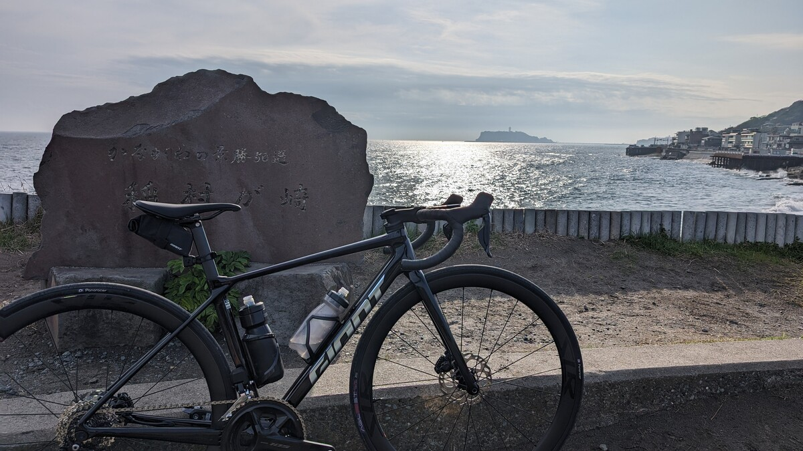

2025年モデルのTCRがモデルチェンジして、第10世代となった。

ケーブル内装・空力改善・さらなる軽量化という正統進化。GIANTに多大なる信頼を寄せつつ、ちょうどロードバイクが欲しくなり、TCRのモデルチェンジを待っていた身。3月第1週の発表週末に注文し、年度内にやってきてくれた1台を早速レビューしていく。

## ロードバイク、1台は家に欲しい

数年間、ロードバイクを持たないサイクルライフを続けてきたが、2023年ごろから「ロードバイクが1台は必要だな」という思いが強くなり購入を決意。

レースはシクロクロス、MTBでトレイルも行ったし、グラベルロードは舗装路も未舗装路もどこでも走れる。サイクルイベントも最近はオフロード・グラベル系が自分にとっての楽しみになっている。

それでも、日々 **「より速く距離を稼ぐ」という目的ではロードバイクが欲しい**。家庭を持ち、仕事の責任も増え、1日にいくつも予定を詰め込む必要があるとき…グラベルロードで急ぐよりもロードバイクのほうが行動範囲を多く取ることができることは間違いない。

3時間で帰ってくるという要求に対して、最も多いパターンのルートを引けるだろう。今風に言うとタイムパフォーマンスが最も濃い。ライド体験という面でも、トレーニング強度という面でも同様。

## 完成車パッケージ

完成車からパーツを交換たりフレームから組んんだりして、お気に入りの1台を仕上げるというのも馴染みあるスタイルなのだが、ここ5年ほどのミドルグレード以上のモデルはそのままレースに持ち込んでも不満が出ないような本来の意味での「完成車」になっている。

**かつて、ロードバイクは「ブレーキキャリパーは変えろ」「ホイールは交換前提」** という格言があり、最低限のカスタムが暗黙の了解になっていた。今ではディスクブレーキになり、エントリーモデルでも最低限の制動力が確保され、ハイエンド完成車にはカーボンホイールにハイエンドタイヤがセットされて出荷される、実に財布に優しい時代だ。

エアロで、軽量で、ケーブル類内装という**現時点の標準的なロードバイク**を持つとともに、何台も家に自転車がある以上、手間のかからない1台が欲しい。完成車仕様でそこそこ満足でき、購入コストも許容できる、そんな要求にTCR ADVANCED PRO1がぴったりだった。

前に所持していたロードバイクはディスクブレーキが初採用された、TCR ADVANCED PRO DISC(2017)。

<LinkBox url="https://blog.gensobunya.net/post/2016/10/tcr-advanced-pro-disc/" />

**当時としては先進的なディスクブレーキ最適化設計で、既にフレームは28c前提**となっており、ディスクロードとしてのフレーム剛性や衝撃吸収性も十分なレベルに達していた。

一方でホイールの完成度はそこまで高くなく、結局ZIPP 303Sと新ETRTOのチューブレスレディタイヤ(30c)で軽々とした走りを手に入れただけに、今回の第10世代ではちゃんとしたホイールが最初からついているという点でコスパにそこまで差はないと思える。

### 2024年にタイヤ幅25c？

さて、TCRと言えば、発表された時期の **"THE ROAD BIKE"とでも言うべきベンチマークになるモデル** で、奇をてらわないベーシックなバイクでありながら、トレンドも抑えている。その走りは道具として優秀で、いい意味で存在感を出さずに意のままに曲がって、加速する…ということが期待されるモデル。

その中で、完成車のフルスペックを見ると「おや？」と思うのがタイヤ。25cのGIANT GAVIA COURSE 0が装着されている。ホイールは新しく発売されたGIANT SLR1 40フックレスホイールで、その名の通り40mmハイト。**リム幅は内22.4mm, 外28mm**となっており、数字だけを受け取ると、**タイヤ幅がリム外幅より内側に入ってしまうように思える。**

実物を測ってみると、**タイヤは装着した状態で29~30mm幅まで太っている**。おそらく、このタイヤは旧ETRTO基準で設計されており、新ETRTO基準の22.4mm内幅リムに装着した場合、表記より大きく広がっているのだろう。

リム外幅とタイヤが**ツライチになると、空力的な最適解に近づく**が、そういった意図がタイヤチョイスにあるのかもしれない。日本以外の国では同タイヤの28cが装着されているが、まだ太いタイヤが浸透しきっておらず、路面もよい日本マーケットに合わせた仕様ということだろう。

**ちなみにこのGIANT製タイヤ、カタログ上は片側315gある**。幅の意図はわかったものの、重量がちょっとよろしくないので納車時に[PanaracerのAGILEST TLR(30c)](https://amzn.to/3vwJkca)に交換してもらった。これだけで片側35gの軽量化である。早速完成車仕様から外れたが、タイヤは消耗品なのでノーカン。28cオーバーのタイヤにおけるメリットは今更論ずるまでもないだけに、後述の重量問題もあってPRO0以上のモデルに装着されているCADEXタイヤを、このモデルにも装着してほしかった気持ちがある。

<LinkBox url="https://www.amazon.co.jp/dp/B0B5Q9PSZ2" isAmazonLink />

ちなみにAGILESTの場合、22.4mm内幅リムに装着した場合28cで29-30mm, 30cでは30-31mmになるという公式説明があったが、今回は30mmを下回る実測幅となった。

**25cタイヤより30cタイヤの方が実際は細い**、直感に反する計測結果となったが、規格の過渡期ならではの事象だろう。ワイドタイヤの良さを知っている身として、太いほうが良いのか？とも思うが、以前使っていた際も[AGILEST TLR](https://amzn.to/3vwJkca)は優等生の働きをしてくれていたので、今回も継続して使っていく。

インプレ上も、タイヤがそろっている方が比較しやすいという都合も大きい。

<LinkBox url="https://blog.gensobunya.net/post/2022/04/agilest_tlr/" />

## 内装システム・空力形状

ケーブル内装の仕組みは現行のPROPEL, DEFYで実績のある **「ハンドル内からステム下を這わせ、ヘッドからフレーム内に入っていく」** システム。コラムはOVERDRIVE AEROという専用のD型規格となる。

ショップの話では、2cmまでならケーブルを詰めずにステム高を上げ下げする余裕はあるらしい。慣れたライダーならそこまで大きくポジションが変わることは珍しいし、フル？内装ながら調整の余地は大きい。

フォークやシートチューブ後部も、Cannondale Supersixで見るようなカムテール形状が強調されている。

**ヘッド部分は、若干中央がへこんでおり**空気の流れを調整しているように見える。ダウンチューブはPROPELのようなエアロチューブではないが、最初に空気が当たるヘッドやハンドル部分を改善するのはTarmacでも見た手法だ。

## 重量・他グレードとの比較

完成車の**カタログ重量は7.4kg(ペダル抜)と、かなり優秀**。前述のタイヤに加えて、付属ローターやスプロケットをアルテグラに交換しても100g程度の重量が簡単に削れる。上位モデルと違って、付属のハンドルステムがアルミ製なので、躊躇なく交換可能という点はアップグレードを視野に入れると逆にメリットにすらなりうる。EXSやFarsports（これらは自己責任）, CADEXの一体型カーボンにしてしまえば…と夢が膨らむ。

上位モデルのTCR **ADVANCED PRO0はアルテグラDi2へのアップグレードに加え、ホイールのグレードが上がってカーボンスポークモデルとなり、ハンドルもカーボン製**になってカタログ7.0kg（+16万円）。どちらを買うべきかかなり悩んだが、ファストサイクリング用のロードバイクという自分の使い方を考慮してPRO1を注文した。

PRO1は変な気が起きなければパーツ交換せずに使い倒せるスペックなのは間違いない。少なくともホイールとコンポーネント・フレームは長く使える。

## ライドインプレッション

シェイクダウンコースには、アップダウンと平坦がほどよくミックスされている三浦半島一周コースをチョイス。

しかし、なんというか、100kmも走ったのに、**インプレッションを書くのが（良い意味で）非常に難しい。**

反応は良い、ホイールもフレームも軽量で、登りでトルクの抜けるタイミングですら失速せず進んでいるようだ、乗り心地も30cタイヤと相まって、多少の路面の荒れはものともしない。砂利や砂が浮いていようがお構いなしだ。空力も多分前作より良い（測れないのでカタログを信じるしかない）

ただ、**これらの要素は全て新型TCRの期待値そのもの**だ。予想していた良い点が期待通り良い、なんなら新型に乗っていることを忘れるくらい、 **「いつも通りTCRはいいロードバイクでした」** という感想だ。

無色透明・無味無臭、毎日飽きずに使える、「何かが特別ではないが全てにおいて優秀」なモデルという立ち位置は今作に至るまで変わらない。もちろん、SLグレードに乗ればそれぞれの要素はもっとよくなる。しかしPROグレードも余りに優等生過ぎて書くことが無い…

第8世代のTCRには[ZIPP 303S](https://store.shopping.yahoo.co.jp/qbei/pc-810594.html)に[AGILEST TLR 30c](https://amzn.to/3vwJkca)を履かせており、重量以外のリム幅やリムハイトのスペックはほぼ変わらない（リム幅23mm→22.4mm, リムハイト45mm→40mm, 重量1530g→1443g）。ここまで前の自転車を思い起こして、ようやく「そういえば登りは軽快だったな」と思えるかという程度だ。

ちなみに、特段ハイペースで走っていたわけではないのに、ログを見ると下り区間はPR連発していた。**ハンドルの違いから、自然に乗った時のポジションが大きく変わる**ので、純粋なフレームのみの空力以外にも要素があるだろう。特筆すべきはハンドルだ。

### 秀逸な幅狭フレアハンドル

第10世代TCRの特徴として、完成車に付属しているハンドルがすべて**エアロポジションを意識したフレアハンドル**であることだ。

**肘乗せフォームやスーパータックといった特殊なエアロ追及ポジションがUCIによって禁止**されたことに端を発して、幅の狭いハンドルが流行り始めた。

幅の狭いハンドルは前面投影面積を小さくすることに寄与して、人間の空気抵抗を低減させる。そして、デメリットとしてスプリントのようなトルクを掛けたい局面では扱いづらい。

エアロと大パワーを両立するため、それまでの**標準的な幅を下ハンドルではそのままに、ブラケット間の幅を狭するようなフレアハンドルがどんどん登場している**。第10世代TCRに搭載しているハンドルもその流れを受けたものと考えていいだろう。

グラベルロードでもフレアハンドルが標準装備されているが、これは急勾配のオフロードダウンヒルでもハンドリングを安定させるため、さほど前傾せずブレーキは掛けやすく、スタンスは広く…とアプローチした結果なので導入の狙いがロードバイクとは異なる。

自分の場合、グラベルロードではあまりフレアハンドルは好まなかったのだが、この**上370mmのフレアロードハンドルは、驚くほど体に馴染んだ**。（以前は420mmハンドルを使っていたにも関わらず、だ）

そもそも、人間の手首はまっすぐ前を向いた状態のブラケットを握ると不自然な角度になる。なのでレバーを若干内側に入れることで対応することが多かったが、**エアロ追及のためにこのレバー角度がどんどん過激化し、こちらもUCIによる規制の対象になってしまった**。

**フレアハンドルはこの規制にも相性が良く**、ルールに抵触せずレバーを内側に傾けられる。

そして、（自分の場合だが）幅が狭く、手首が楽に維持できるようになった結果、**同じステム長でもブラケットが近くなって肘に余裕ができ、体をたたみやすくなった。**

巡行の際に**頑張って作っていたエアロフォームが、このハンドルではいとも簡単に維持できる**。最初からこのハンドル幅ポジションが自然だと思えるほどだ。（低身長でフレームが大きかっただけかもしれないが）

このバイクで唯一交換の余地があるパーツはアルミ製のハンドルステムだが、将来的に一体型に交換する場合でもサイズやフレア量を参考にしたい。CADEXは責任もって完成車と同じスペックのものを作ってほしい。

### 105 Di2はサイクリングコンポーネント

さて、バイクとホイールの性能は述べた通り、バランスの取れた優等生といったTCRに期待している通りの性格だった。

コンポーネントの105 Di2（というか12s Di2シリーズ）をじっくり乗り込むのは自分にとって初めての経験だ。

結論から言うと、**105 Di2は最高級のサイクリングコンポーネント**だという印象を受けた。メンテナンスフリーで、バッテリー持ちの良い、**手のかからないコンポで電動変速・油圧ディスクブレーキ**の恩恵をリーズナブルな価格で得られる。

とはいえ、**フロントの変速スピードはかつての6770系Di2を彷彿とさせる**。有り体に言って、フロント変速が遅い。

試乗車やローラー体験程度ではあるが、R9200, R8100のフロントディレイラーはリアと間違えるほどのスピードだったはず。Aボタン（ブラケット頂点のボタン）や、拡張ポートが無い点を踏まえると、**機能・性能共にレースユースには物足りないだろう。**

登りアタックに反応するためアウターへ入れたり、登り返しをハイスピードでこなすといった展開でストレスになることが容易に予想できる。

（日本語での）サイクリング用途であれば、そこまでシビアな変速作業は求められないので、ボタン電池を倍の個数積むことができ、**バッテリーライフの長い105Di2レバーはむしろ利点が大きい。**

毎年何レースも走るようなコアなロードレーサーを除いた、週末サイクリストには十分な性能を持っているし、第10世代TCRのように、完成車にカーボンホイールがあてがわれるだけの格もあり、**総合的にはお財布にやさしい。**

## まとめ

TCRというキャラクターに求められる、 **「オールラウンドで機材をいい意味で意識せずに使える」という特色を維持したまま、ライダーとバイクの空力というトレンドに配慮**したモデル。

フレームやセットのパーツの性能は必要十分で、尖った特性も無く、特殊なギミックも無く、道具として使いやすい。レースでガンガン使うならばアルテグラDi2以上のグレードが搭載されたモデルを選びたいところだ。

<LinkBox url="https://www.giant.co.jp/giant24/bike_datail.php?p_id=00000106" />
