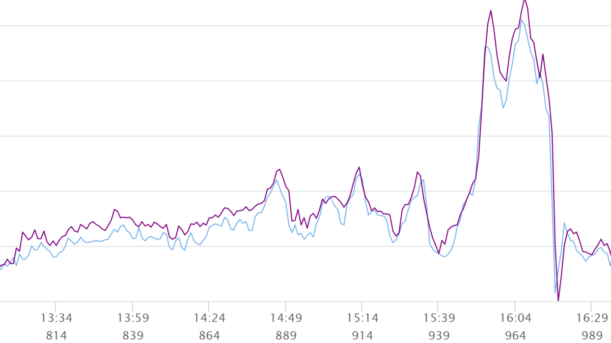
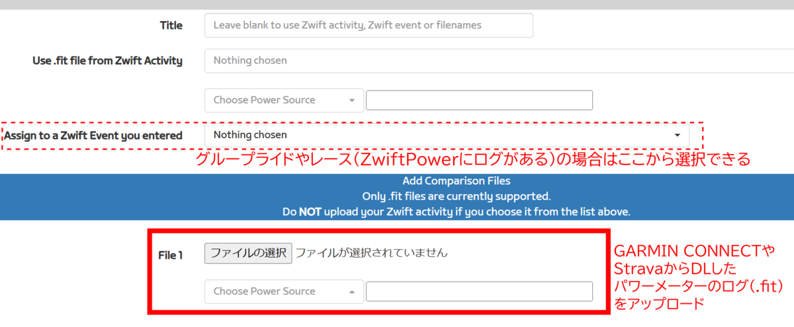
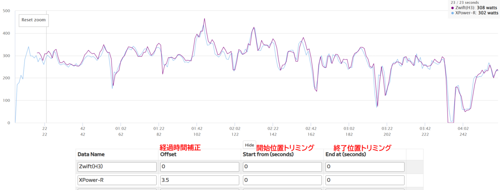
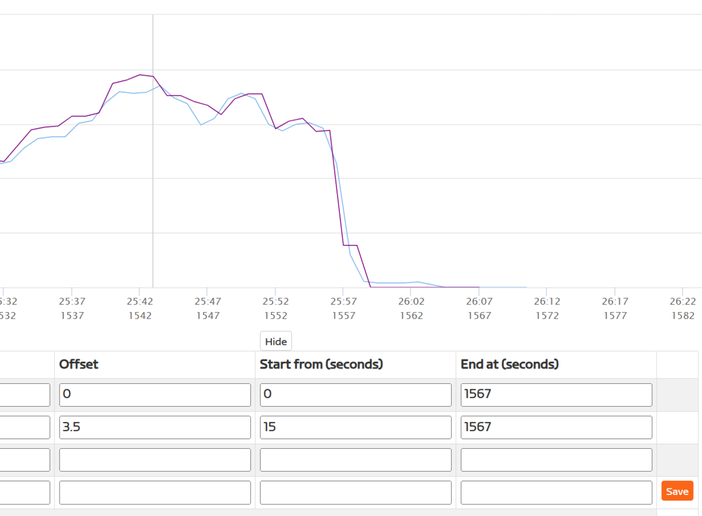
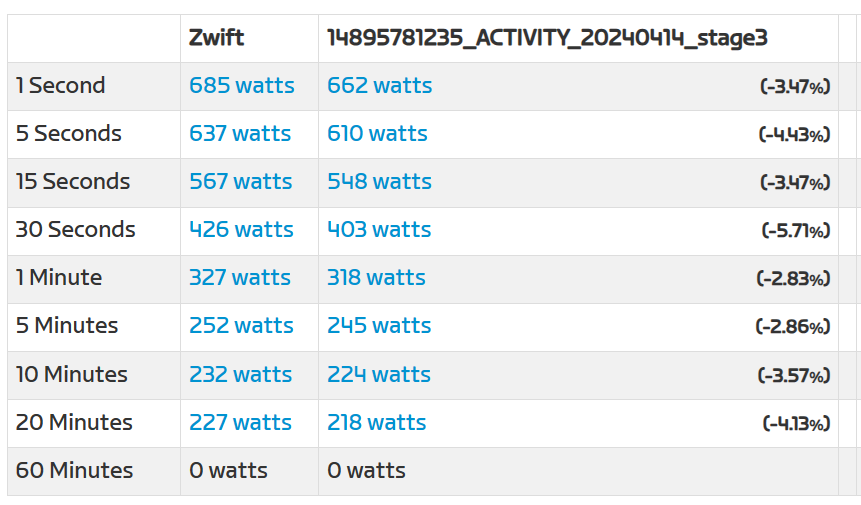

パワーメーターのコモディディ化が進んで久しい。

ハイエンドモデルのコンポーネントに、パワーメーター付きモデルがラインナップされることは当然となり、ミドルグレード以上のロードバイク完成車にも、パワーメーターが標準装備されていることが珍しくなくなった。

ログ機能付きサイクルコンピューターを購入したあと、ログの残らないライドが味気なくなったのと同様に、パワーメーターを**一度使ってしまうと全てのライドでパワーを計測したくなるのが人の性**。

それほどまでに、「自分の力の可視化」は甘美な機能である。ドラゴンボールでスカウターが現れた前後のように、一度計測を始めると、やめられない。

そんな欲求に従って、すべてのバイクにパワーメーターを装着したときに**問題となってくるのが、パワーメータの個体差**だ。

1台だけであれば、一定の計測精度を保ってくれていることが重要で、数字そのものは他者と違っても構わない。ただ、同じ出力で踏んでいるにもかかわらず、2台のうち片方が200W、もう片方が250Wを指すようでは困ってしまう。

パワートレーニングはローラーだけ、どれか1台でしかやらないと決めていても、他のバイクに乗った時にはTSSやTSBのような管理指標、ひいてはGARMINが示してくれるような推定VO2Max, リカバリータイムといったものの狂いにつながる。

端的に言うと、**複数パワーメーターの出す数字がブレるとデータを基にした判断が信用できない**ものになってしまうのだ。

しかし、**個人でパワーメーターの『精度』を計測することは困難**だ。パワーは雑に表現すると「トルク×ケイデンス」で計算されるが、トルクを測るためのセンサーの0N状態しか校正できない。実際のパワー値はパワーメーターごとの内部ロジックで算出されるため、そもそも基準となる数値が存在しないのだ。

よって、（個人レベルにおいては）パワーメーターは、同じ入力に対する複数台の計測値で相対的に評価するしかない。様々なパワーバンドやケイデンスで安定していることを評価するためには最低3台必要だ。もしくは、AssiomaやSRMのような世間で評価の高いパワーメーターを基準にするのも現実的な解決策だ。

## パワーメーターの校正と個体差と精度

複数のパワーメーター間で厳密な比較をするためには、時系列の生データ、理想的には全く同じタイミングでスタート・ストップした複数のパワー値ログが欲しいところ。

様々な局面での特性を見るために、ノンストップでの一定パワーパターン、スプリントのようなパワーが瞬間的に上がるパターン、エンデュランス・FTP・VO2Max各ゾーンでの走行を組み合わせたようなログがあると一発で様々な傾向を確認できるだろう。

複数のパワーメーターをペアリングしてローラー上でログを取れば、いとも簡単にグラフ化して比較できそうであるが、**一般的なサイコンはパワーメーターを1台しかペアリングできない**。

この課題を解決するために、世界中のPMオタクが計測に使っている[IpWatts](http://www.iforpowell.com/cms/index.php?page=ipwatts)なるAndroidアプリが存在する。[IpWatts](http://www.iforpowell.com/cms/index.php?page=ipwatts)はログをCSVとして吐き出す機能も持っており、**生ログをもとにスプレッドシートで分析するのが定番**の流れだ。

だが、残念ながら現在Playストアからこのアプリはダウンロードできなくなっている。

何らかのツールでこれらの作業を再現するためには、複数のロガーで同時に別のパワーメーターで毎秒ログを取り、fitファイルをCSVに変換して可視化・調整すればよい。だが、この方法では同時にスタート・ストップされたことが保証されず、ロガーの時刻にもズレがあるので**ログの時間をオフセットさせたり、平均を厳密に比較するためにスタート・ストップ付近のデータをトリミングする必要**があったりと手間がかかる。

この記事では、**手っ取り早く2台のパワーメーターの誤差傾向（個体差）を知りたい場合**のため、ZwiftPowerのAnalyticsを使ってパワーメーターの個体差を簡易的に測定する。測定結果をもとに、スケーリング機能などを使って複数台パワーメーター間のズレを補正する根拠を出すことが目的だ。

## ZwiftPowerとは

[ZwiftPower](https://zwiftpower.com/)は、Zwiftのイベントの結果管理と、レースカテゴリの決定を担っているWebサイト。

<LinkCard url="https://zwiftpower.com/" />

> Zwifterにパフォーマンスのより詳細なビューを提供し、すべてのZwiftイベントの結果を表示するWebサイトです。また、イベント主催者はZwiftPower内でイベントに独自のルールを作成し、一連のイベントの全体的な結果を提供することもできます。

主な用途は、自らのレースカテゴリやランキングといったプロフィール機能と、過去のレースデータの記録機能だ。レースシリーズの総合成績なども管理しているはずだ（自分は使ったことがない）。

今回使うのは、ZwiftPowerに備わっているAnalysis機能。自分のプロファイルページのメニュー右端からアクセスできる。

**自分の比較結果をインターネット上に共有できる**点も、この機能の魅力だ。データが公開されることで、第三者による再検証やフィードバックを受けることも可能になるので、他者との議論やデータの蓄積にも役立つだろう。

## 計測環境

まずは、パワーメーター間で数値比較するためのログを準備しなければいけない。

- Zwift環境
- パワー測定機能付きローラー（Zwift接続用）
- パワーメーターの装着された自転車
- サイクルコンピューター（パワーメーターロギング用）

トレーナーはPC(Zwift)と、パワーメーターはサイクルコンピューターとペアリングする。

まずは10分、パワーメーターとトレーナーの暖気を行い、その後に**必ず両者の校正（ゼロオフセット）を行う**。この時、ANT+でPCとトレーナーを接続しておくと、[Zwiftのペアリング画面でそのまま校正ができて楽](https://skmzlog.com/saris-h3-calibration-on-zwift/)。

<LinkCard url="https://skmzlog.com/saris-h3-calibration-on-zwift/" />

この記事の最後に未校正で比較した際のデータを記載するが、校正前と校正後のトレーナーは思った以上にズレがあった。温度調整機能を過信して購入後ほぼ放置していたのもあるが、この数字を見ると定期的な校正の重要性を実感できる。

校正が終わったら、走行中に**サイクルコンピューターでログを二重取りしながら、Zwiftでフリーライドなりレースなりをする。**20分平均パワーは最低でも欲しいので、ログストップ時の誤差をみて**走行時間は脚を止めずに21分以上が目安**。

ライド終了時は、「END RIDE」のボタンをクリックするのと同時にサイクルコンピューターのロギングを止めるとちょうどいい。

## 画面操作

まずは"**Create New Data Set**"から新しい比較データを作成する。

### ログの選択

まずは比較のためのログデータをアップロードする。

Zwift側のログと、サイコンで取得したパワーメーターのログを比較するのだが、前者は**グループライドやレースであればZwiftPowerの画面から選択**するだけでよい。

フリーライドやサイコン側のログはGARMIN CONNECTやStravaから「オリジナルをエクスポート」でダウンロードできるfitファイルを保存しておき、改めてZwiftPowerにアップロードする。

取得したログをすべてアップロードしたら「**Create Data Set**」をクリックするとビジュアライズ画面に移動する。

### オフセット値・トリミング設定

別々に取得したログは、大抵**開始位置や時刻が秒単位でずれている**ので、これを補正する。

機械的に同時計測していない以上、厳密な一致は望むべくもないので、**見た目でグラフの形が一致するように補正する**。グラフ内をドラッグすると選択範囲をズームできるので、この状態で作業するのが楽。

グラフ下部の「**Time Shift and Crop**」をクリックすると、Offset, Start From, End Atの3項目を修正するフォームが出てくるので、数値を入力して**グラフの波形がおおまかに一致する場所を探す**。

あとはパワーカーブのN秒区間抽出で計測区間が同じになるよう、開始時間と終了時間を揃えれば準備完了。0Wの区間を少し残しつつ、なるべく小さくなるようにするとよい。

10秒程度はログを削ることになるため、**20分間ちょうどのログでは20分平均が取れなくなる**点に注意。

ここまで実行すると、おなじみのパワーカーブグラフが抽出した区間で作成されるので、それを基にパワーメーター間の差を確認する。

## XCADEY-RとSaris H3の比較

上記手順に従って、REVOLT ADVANCEDに装着しているXCADEY-R(FC-R7100)と[Saris H3](https://amzn.to/3xU4r9k)のパワー傾向を比較した。サイクルコンピューターは[Edge840 solor](https://amzn.to/3Uvo5Bf)だ。

ちなみにXPOWER-Rはすでに廃盤モデルとなっており、[XCADEY](https://xcadey.com/shop/)はもうスパイダー型のパワーメーター([XPOWER-Sシリーズ](https://s.click.aliexpress.com/e/_Dn5d2I7))しか製造していないようだ。

<Amzn asin="B07WP6JTN4" />

| Time       | Saris H3  | XPOWER-R  | % Difference |
| ---------- | --------- | --------- | ------------ |
| 1 Second   | 500 watts | 494 watts | (-1.21%)     |
| 5 Seconds  | 428 watts | 408 watts | (-4.9%)      |
| 15 Seconds | 370 watts | 357 watts | (-3.64%)     |
| 30 Seconds | 341 watts | 334 watts | (-2.1%)      |
| 1 Minute   | 335 watts | 327 watts | (-2.45%)     |
| 5 Minutes  | 266 watts | 263 watts | (-1.14%)     |
| 10 Minutes | 249 watts | 247 watts | (-0.81%)     |
| 20 Minutes | 222 watts | 221 watts | (-0.45%)     |
| 60 Minutes | 0 watts   | 0 watts   | (0%)         |

表に直した通り、時間が長くなるほどPM間の差は小さくなっており、10分以上の平均パワーでは1％以下の差となっている。この差をもとにして、必要な場合はパワーメーターのスケーリング（単純なX倍調整）を行う。

自分の場合、グラベルロードに装着しているパワーメーターはライド全体の負荷や疲労を管理するものなので、その目的に照らし合わせれば**長時間のライドで平均パワーがH3と大きく異なることはない**、つまりこの表から考える限りではスケーリングは不要となる。

10分未満での誤差の原因は、**パワーの絶対値・ケイデンス・出している（トレーナー上の）スピード、などが考えられる**。原因を追い込むにはこれだけでは情報が足りない。

また、**[Saris H3](https://amzn.to/3UzivOn)にはERGモードでパワーが上振れする**という報告も複数ある。（今回の検証はグループライドのログを使ったのでERGモードはオフ）

<blockquote class="twitter-tweet">
これH3はERGですか？うちのKICKRv5はERGのとき「だけ」明らかに上振れします。<a href="https://t.co/k6lw7YKuQb">https://t.co/k6lw7YKuQb</a>
&mdash; Masanori (@miwamoto0203) <a href="https://twitter.com/miwamoto0203/status/1782981812350038509?ref_src=twsrc%5Etfw">April 24, 2024</a></blockquote>

この[Saris H3](https://amzn.to/3UzivOn)の特徴を考慮すると、Ramp TestでERGモードを使い計測したときのパワーに比べて、今回のH3で計測したパワーそのものが低い可能性もある。

パワーデータを活用する場合、**FTP計測時の数値が最も大切な基準となる**ため、改めて、XPOWER-RとSaris H3(ERGオン)で計測値を比較して修正していく。

2台以上の自転車にパワーメーターを装着している場合、このテストを繰り返し、**スケーリング機能で基準となる「FTP計測環境でのパワーメーター」に値を合わせる**ことで、精度の高いデータ管理が行えるようになるはずだ。

### 余談：キャリブレーションの重要性

毎回テスト前にキャリブレーションを行うのは、特にスマートローラー側で面倒かもしれない。

キャリブレーションの有無が結果にどれほど影響を与えるのか知るために、XPOWER-Rと[Saris H3](https://amzn.to/3UzivOn)**両方で未校正のパターン**と、**XPOWER-Rのみ校正したパターン**のログを取ってみた。

いかがだろうか、同じグループライドコースを走ったものだが、比較したときのパワー値は**両方を校正した場合と比べて、誤差の大きさ・傾向共に全く異なっている**ことが分かると思う。

正直、この結果を見たときにPMの校正をサボり続けたことを後悔したほどだ。

## まとめ

厳密な比較や、様々な角度からPMの個体差を分岐しようとすると、準備や後処理がそれなりに手間だ。個体差は、データ管理の精度を落とし、結果的に**GARMINからのアドバイスや、総TSSやTSBの数字が狂う**ことつながる。

ZwiftPowerを活用することで、簡易的にパワーメーター間の計測値のズレを計測して、計測値を大まかにそろえれば、こうしたことをある程度防ぐことができるはずだ。
