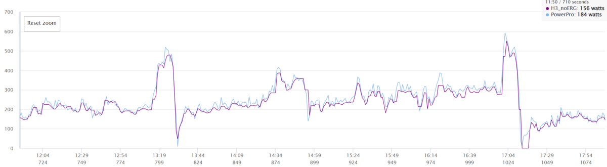

第10世代のTCR ADVANCED PRO購入の大きな決め手のうちの1つだった付属パワーメーター。

**もちろん**所持しているバイクのすべてにパワーメーターを装着しているが、実は両側パワーメーターを使うのは、最初に買って今は手放しているPioneerペダリングモニター以来だ。

久しぶりに試す左右バランスなどの機能を改めて確認しつつ、自分にとってのパワートレーニング基準である[Saris H3](https://amzn.to/3UzivOn)とのパワー計測値を比較していく。

## GIANT POWER PRO(FC-R7100)

GIANT製のパワーメーター、POWER PROはシマノ製クランクセットに付属するクランク接着タイプのパワーメーター。

> クランク一体型デュアルタイプのパワーメーター「POWER PRO」は、ペダリング出力を測定して正確なデータを送信することで、ライダーのパフォーマンスを分析し向上をサポート。提供する情報は、パワー（W）、ペダルバランス、フォースアングル、ケイデンスなどで、GIANT NEOS TRACKを代表するANT+ヘッドユニットを通じてデータを表示。

ペダリングバランスやフォースアングルにも対応しており、なかなか高機能だ。

取り付けされるクランクは様々だが、[説明書PDFを参照](https://www.giant.co.jp/pdf_manual/MY20_Power_meter_user_manual_JP-v3.pdf)する限り、現行販売されているのは2020年モデルからの継続モデルのようだ。

余談だが、SRAMモデルにはGIANT製のチェーンリングパワーメーターが対応しており、こちらは**POWER HALO**という商品名になっている。両者とも、単体販売は行っておらず完成車付属品のみ流通している。

<LinkBox url="https://www.giant.co.jp/giant24/showcase/giant-original-spec/" />

| 項目               | 仕様                                       |
| ------------------ | ------------------------------------------ |
| ワイヤレス伝送     | 2.4GHz, ANT+™/Bluetooth® Smart (BLE 4.0) |
| 精度               | 測定パワー出力値の±2%                      |
| 重量               | 左側:約16g/右側:約16g                      |
| パワー出力測定範囲 | 0-3000 Watts                               |
| ケイデンス範囲     | 20-180 RPM                                 |
| 耐水性レベル       | IPX7                                       |
| 動作環境温度範囲   | -10℃ ~ 50℃ / 14°F ~ 122°F                  |

出力測定範囲は上限3000Wと常人なら問題ないレベル、測定精度は±2%とややブレが大きい。（Saris H3が±2%、9200Pは±1.5%、SIGEYI AXO, 4iiii, Assiomaは±1%）

その他は常識的なクランク型PMとして期待されている値だろう。充電ケーブルは、よくあるマグネット接続の接点が2つあるタイプだが、**両側を同時に充電するための二股のケーブル**が付属する。

とはいえ、公称の測定精度はアテにならないし、パワーメーターを複数台持つ場合に**重要なものは、「正しさ」ではなく「一貫性」**だ。

Saris H3と同時にZwiftで走行し、実際の測定パワーを見ていく。

### POWER PROとSaris H3のパワー測定値比較

計測方法は、先日の記事と同様に計測前にウォームアップを行ってから、パワーメーターとトレーナー両側をキャリブレーションして測定をスタートする。

- POWER PROとSaris H3（通常モード）
- POWER PROとSaris H3（ERGモード）

なお、コースやメニューが異なるためパワーカーブや平均パワーに違いが出ている点はご愛敬。結果は以下の通りだ。

スパイクの影響を受けやすい短時間平均の部分を除けば、ほぼ**全ての時間平均で5%ほど、POWER PROが高い値**を出した。

測定精度は両者とも±2%を謳っている割には、かなり安定した結果となった。

今回利用した比較プロトコルでは、特定のパワーバンドでの差が計測できないため、この点は未知。また、Saris H3で**ERGモード時にパワーが上振れするという事象は、今回発生しなかった**。(H3ファームウェアバージョンはx.xx)

FTP110％程度が上限のメニューだったこともあるかもしれないが、ERGモードの問題再現はまた別の機会に回す。

POWER PROはSaris H3比で常に安定して計測値を出しているという結果となり、**POWER PROの測定安定性（造語）は非常に良好と言えそうだ**。スケーリングで-5%の補正ができれば、FTP値を基にして、ライド負荷の計測を高精度で行えることになるが…

### グラフ比較

ZwiftPowerでの比較グラフは、手動でタイミングを合わせているため**あくまで参考情報ではある**ものの、興味深い傾向もうかがえる。

上のグラフはフリーライドでの比較グラフだが、**全体を通して、紫色のSaris H3のパワー変動に比べて、POWER PROのパワー値は細かく変動している**。また、スプリント後に脚を緩めた最後のピーク後、Saris **H3が0Wの区間でもPOWER PROは僅かながらパワー値を出力**していることがわかる。

これは（事実上）リアハブでパワーを測定しているダイレクトマウント型トレーナーとクランク型PMの**測定場所の違いに起因しているのではないかという仮説**が立つ。ダイレクト型マウントトレーナーはチェーンテンションが無ければトルクを検知できない。

そして、ERGモードのグラフはもっと興味深い。

Saris H3は以前のレビュー時に、「ERGモードの調整力が高く、これまで使っていたトレーナでのメニューがマイクロインターバルに思えるほど負荷が安定する」という表現をしていた。

<LinkBox url="https://blog.gensobunya.net/post/2022/01/saris_h3/" />

しかし、今回クランク型PMであるPOWER PROとの比較グラフを見ると、**作為的にデータを丸めているのでは**と思いたくなるほど、パワーのスパイクが小さい。

疑ってみると、**スマートトレーナーのケイデンス測定は反応が遅かったり数字が怪しかったりする**ので、細かくトルクを調整したところで狙ったパワーを維持できるのは不自然だ。ターゲットパワーに収まるよう、データを加工しているのではと思いたくなる。

しかし、それを15秒や30秒といったERGモードの苦手な**短時間インターバルでも、POWER PROとSaris H3の間で測定精度が大幅にズレてはいない**。トータルではうまく収めているともいえる。

ペダル型PMなどを使って、スマートトレーナーと合わせて3カ所で測定すればもっと何かわかるかもしれないが、現状ではあくまで疑いだ。

## 管理アプリ

UIがひどい

スケーリング機能がない（論外）

## まとめ

<PositiveBox>

- 安定した測定値を出力
- フル機能の両側PMが完成車付属というお得感

</PositiveBox>

<NegativeBox>

- 管理アプリの出来が悪い
- スケーリング機能がなく、複数台運用に困る

</NegativeBox>
