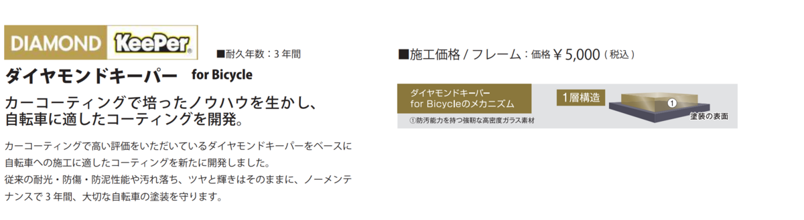
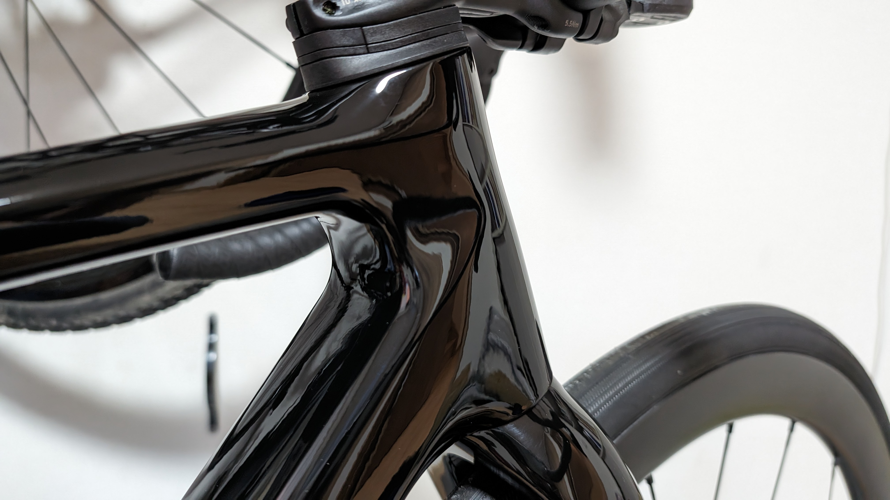
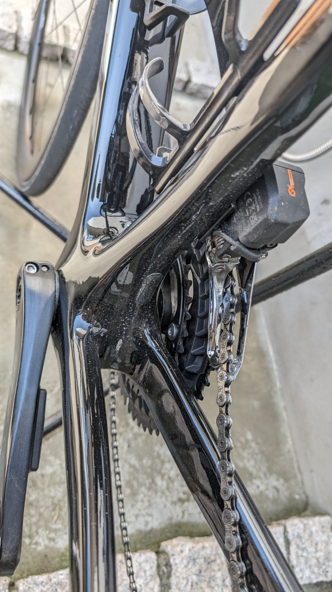
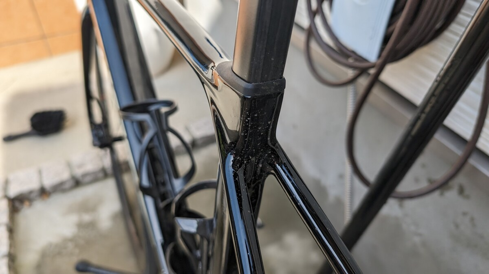
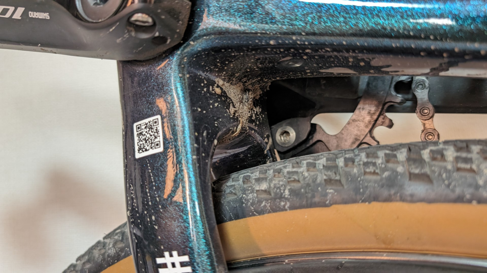
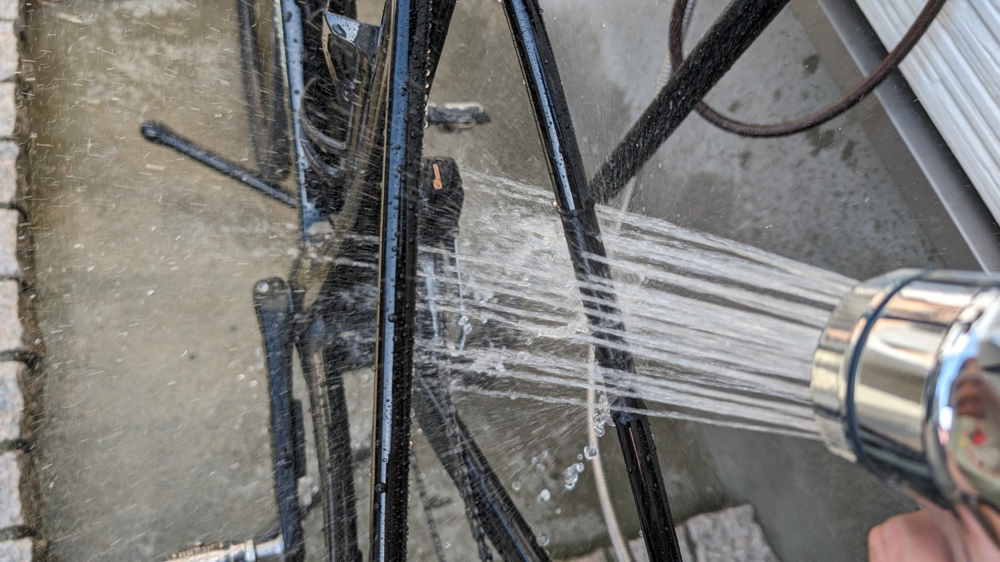
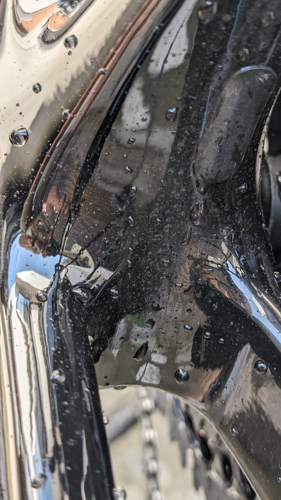
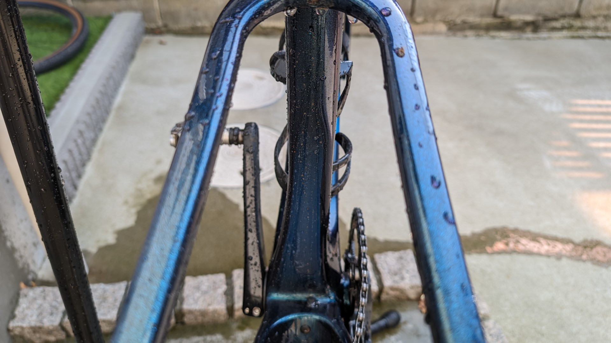
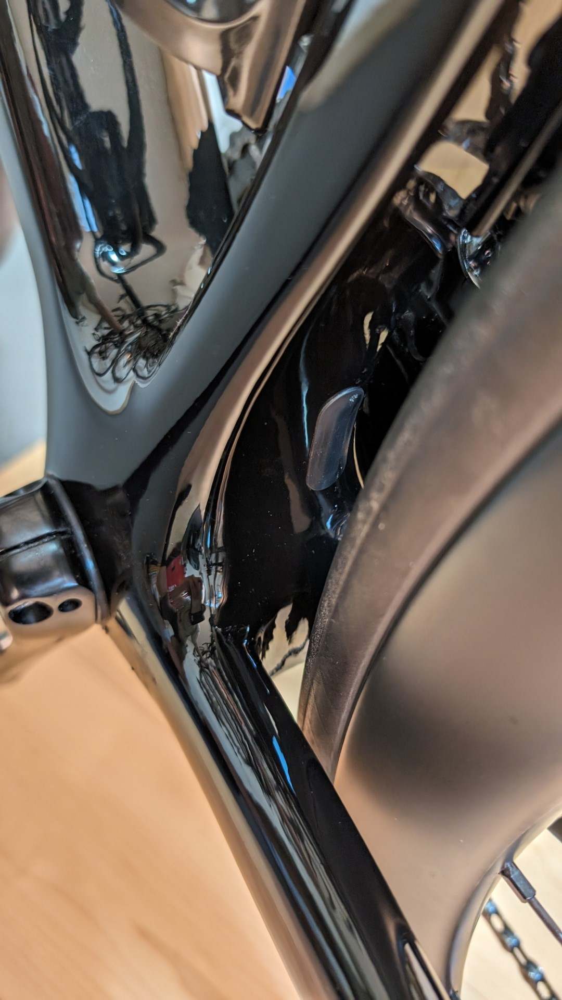

TCR ADVANCED PRO1は、購入時にKeePerコーティングを施工してもらった。

ロードバイクはグラベルロードやシクロクロスほど高頻度で洗車しないので、汚れがフレーム塗装にこびりついたり、簡易コーティングを貫通して汚れが付着することがある。

洗車頻度が低いと、トラブルの発覚も遅い。そうした問題を解決するための施工だが、果たして洗車後に行っているワックスや簡易コーティングに効果はあるのか、比較してみた。

<LinkBox url="https://blog.gensobunya.net/post/2024/04/25-tcr-advanced-pro-105-di2/" />

## KeePerコーティングラインナップ

KeePerコーティングを自動車のコーティングブランドとして知っている人は多いだろう。塗装を守り、汚れが付きにくくなり、水洗いだけでも汚れが綺麗に落ちて艶が戻ってくる。コーティング層そのものを硬化させるプロセスがあるため、DIYで行うワックスがけや簡易コーティング剤と耐久度が段違いだ。

自転車向けのコーティングサービスは、長らく[クレストヨンド](https://4-crest.com/)のサービスが有名で、KeePerブランドは市場に存在しなかった。

しかし、2023年にKeePerブランドから自転車向けのコーティングサービスが登場した。グレードは「EX KeePer」「ECOプラスダイヤモンドキーパー」「ダイヤモンドキーパー」の3種類だ。

**特徴は、圧倒的な低コスト**。フレーム単体への施工価格は、**EX KeePerが¥20,000、ECOプラスダイヤモンドキーパーが¥10,000、ダイヤモンドキーパーが¥5,000**となっている。取り扱いは東商会。

<LinkBox url="https://www.cyclesports.jp/news/new-product/91565/attachment/91567/" />

最低グレードのダイヤモンドキーパーでも、ガラス素材が使われており、これまで市場に存在したサービスからは考えられない低価格だ。なお、**同名称となっているが、自動車向けのダイヤモンドキーパーとは異なる製品であり、被膜の数や構造は異なる。**

例えば、自動車向けのダイヤモンドキーパーは、被膜が2層構造で、上層の被膜はガラスでなくレジン。一方、自転車向けのダイヤモンドキーパーは、ガラス被膜の単層構造だ。

自動車よりも圧倒的に小さい自転車だが、**形状が複雑な自転車のフレームにコーティングを施すのは、手間がかかる**。そうした面で自転車向けコーティングは高くても仕方がないと思っていただけに、KeePerの低価格は驚きだ。

## 施工について

取扱店は、東商会のサイトが最新化されていないので各サイクルショップの発信をチェックする必要がある。ジャイアントストア・トレックストア・ワイズロードなどの大手チェーン店も取り扱っているが、一部店舗では新規購入時のみのサービスとなっている場合があるので注意。

今回は、某ジャイアントストアにてECOプラスダイヤモンドキーパーを施工してもらった。新品時のヌルテカ具合は感動もので、グロス仕上げの醍醐味を堪能できる。**フレームの細かな凹凸が分かりやすくなった**おかげで、ヘッド周りの空力加工がわかりやすい。

しかし、新品時はどんな自転車でもきれいなものだ。コーティングの真価を確かめるべく、納車時にコーティング済みのTCRと、洗車時に毎回[ゼロフィニッシュ](https://amzn.to/4bkwxca)で拭き上げをしているREVOLTの汚れ落ちを比較してみた。

<LinkBox url="https://www.amazon.co.jp/dp/B07J24VKF1" isAmazonLink />

## 洗車テスト

知りたいのは、**水洗車だけでの汚れ落ち**具合だ。

ECOプラスダイヤモンドキーパーのうたい文句では、『特殊なコーティング表面の分子構造の効果で、ファンデルワールススカ(分子間力)による、”汚れ ”の密着を防ぐ独特な防泥能力を持ち、ホコリが降り積もっても塗装表面には密着せず**水をかければ元々持っている撥水力ではじかれた水滴と一緒にホコリなどの汚れが流れ落ち**、洗車の回数がぐんと減ります。』とある。

通常であれば、濡れた路面から飛び上がる泥や路面上の汚れ、ブレーキダスト等がフレームに付着する。これを水洗車だけで落とそうとすると、完璧には落ち切らず、綺麗にしたと思っても乾燥させた後に汚れが残っていることがある。

通常であれば、こうした汚れ残りを防ぐために**Muc-off バイククリーナー**などを使って汚れを浮かせたうえで洗車するわけだが、ECOプラスダイヤモンドキーパーは水洗車だけで汚れが落ちるという触れ込みだ。

### 洗車前の状態

TCRの汚れ具合は、ロードバイクだけあってグラベルロードのREVOLTと比べると、汚れが目立たない。しかし、納車以降濡れた路面をそれなりに走っていたのでシートチューブ裏やBB周りには汚れが付着している。

REVOLTはまぁ汚い。オフロードを走っているので、当然ではあるが、砂や泥がフレームにがっつり付着している。同程度の汚れで試したかったが、ちょっとだけ汚すというのも難しかったので、勘弁してもらう。

### 洗車後の状態

洗車は、前後輪を外して、シャワーで水をかけるだけ。まずは拭き上げをせず、水だけで汚れが落ちるか観察してみた。

大まかな汚れは落ちたものの、薄く汚れの跡が残っている。**特にBB周りの汚れは、水だけでは落ちていない**。

うーん、ECOプラスダイヤモンドキーパーの触れ込み通り、水だけで汚れが落ちるとはいかないようだ。元々の文面もホコリを水で流すという表現で、泥や油汚れには対応していないのかもしれない。

REVOLTも、当然ながら水だけで洗っても汚れが残っている。泥の色が残っているのがわかるし、泥の粒子が見た目にもついている。コーティングがあるなしに関わらず、水だけで汚れが落ちることはないが、コーティング済みの方が落ちやすい、といった程度で**期待していたような、水だけでピカピカ！というわけではない**のが残念。

とはいえ、水道水に含まれるミネラル成分がフレームに付着することで、汚れが残ることもあるので、どちらにせよ拭き上げは必要だ。

### 拭き上げ後

**コーティングの効果は初回の拭き上げ後**に現れた。

通常の洗車だと、清潔なウエスで拭いても簡易コーティング剤で仕上げるまではくすんだままだが、ECOプラスダイヤモンドキーパーは、**拭き上げた瞬間から光沢が復活**した。

これはちょっと感動もので、**コーティングの効果が実感できる瞬間**だ。シャンプーなし水洗車と拭き上げのみで仕上がるのはメリット大。

## まとめ

ECOプラスダイヤモンドキーパーの謳い文句通り、水だけで汚れの大半を落としきるとはいかなかった。走行後の汚れについては、拭き上げをして初めてコーティングによる美観が復活する。

とはいえ、**洗車のたびに行っていた「シャンプーの塗布と時間待ち」「拭き上げ後の簡易コーティング施工」という2ステップが省略されるのは大きい。**

自動車と違い、**雨ざらしにすることのないスポーツバイクについては、ECOプラスダイヤモンドキーパーではなくダイヤモンドキーパーで十分**なのではないだろうか。**雨で自動的に汚れが落ちる…といった効果はロードバイクには必要無い**だろう。

実は、自分のMazda3のコーティング更新がそろそろなので、今回の比較はECOプラスダイヤモンドキーパーの試験も兼ねていた。価格差ほどの効果が得られなかったので、自動車にはダイヤモンドキーパーを施工しようと思う。

そして、**5000円でガラス層のコーティングができるのは、はっきり言って格安**である（持ち込み時の洗車料金は別途であるとはいえ、だ）。車と違って、自転車はフレームの形状が複雑で、コーティングの施工が難しい。

自転車向けのコーティングサービスは、（使っていれば必ず傷がつくのにも拘わらず）フレームの美観を守るために、**一握りの物好きが利用するサービスだった。それが、洗車の手間を削減する目的で一般ユーザーにも広まる**ポテンシャルを持ったサービスがKeePerから出てきたことはありがたい。

ケミカルや手間は無料ではないので、5000円から10000円の投資で日々のメンテナンスが楽になるのであれば、ロードバイクを楽しむ上でのコストパフォーマンスが高いと言えるだろう。
