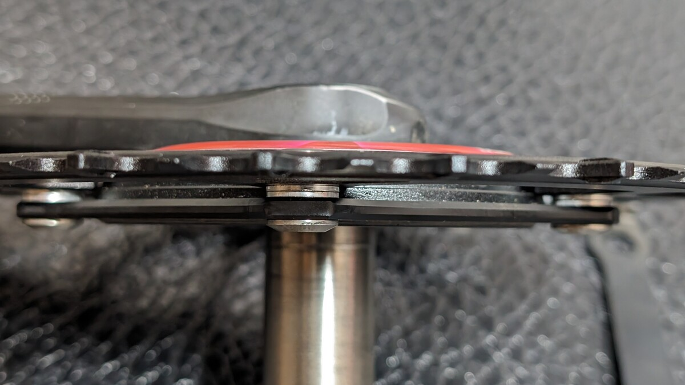

## SENICX PR3 Crank Review

SENICX PR3クランクは、新興コンポーネントメーカーであるSENSAHの関連ブランドによる、24mm軸のクランクセット。

[SENICX単体のウェブサイト](https://senicxtech.com/)が公開されているが、AliExpressの[SENSAH公式ストア](https://ja.aliexpress.com/store/5888062)で購入可能なあたり、SENSAHの関連ブランドであることがわかる。

なお、Amazonでも[SENSAHの公式ストア](https://amzn.to/45s0CF9)らしきものが確認できる。

シングル仕様であれば、[AliExpressの安いセラーから50ドル程度](https://s.click.aliexpress.com/e/_DeOWqfZ)で購入できる、非常に手ごろなお値段だ。

SENSAHのコンポーネントは、変速系についてはトライスポーツが輸入代理店として国内販売しているが、クランクについては未だ国内での販売が行われていない。

SENICX PR3クランクはその名の通り3代目で、PR1/2はDUB規格のクランクであったが、**PR3以上のナンバリングはシマノ24mm軸のクランク**となっており、日本のロードバイクユーザーにとって導入しやすい規格になっている。

グラベル向けにGRというシリーズも展開されているが、寸法仕様を見る限り、PR3もGR3も同じものと思われる。

### 仕様

- Compatibility ：12S / 11S / 10S
- Crank Material ： Forged AL-6061-T6
- Crank Length ：165mm,170mm,175mm
- Chainring Material ：AL-7075-T6
- Chainring ：44T,42T,40T
- B.C.D ： Direct Mount
- Q-Factor ：151mm
- Chainline ：49.7mm

重量は、165㎜の42T仕様を計測したところ691gだった。

仕様の中で特に**注目するべきは、Qファクターとチェーンライン**。151㎜と49.7㎜という数値は、シマノの**GRXクランク（シングルギア）と完全に一致する**。

PR3はフロントダブル仕様もあり、ロードバイク向けの歯数も取り揃えているが、ロードバイク向けというよりは、グラベルロード向けのクランクと言える。

世界的に見ればグラベルロードは大きなマーケットで、なおかつまだまだ成熟していないため、シェアを取りやすい市場だ。そのため、新興メーカーがグラベルロード向けの製品をリリースしつつ、ロードバイク向けに転用して販売するのも已む無しと言えるだろう。

グラベルロードは、太いタイヤを装着するためにチェーンステーが外側に出ていることが多い。そのため、ロードバイク用のクランクを使うと、チェーンステーとギアが干渉してしまうことがある。

自分も、REVOLT ADVANCEDにROTOR 3Dクランクを使っているのだが、アウター側にチェーンリングをセットしても、チェーンステーと干渉してしまう。

そこで、チェーンリングボルトにスペーサーを入れることで、なんとか凌いでいるという状況だ。チェーンラインが48㎜を越えてくると、チェーンステーとの干渉が無くなり、グラベルロードにポン付け可能な製品となる。

価格を考えれば仕方ないが、チェーンリングの歯の仕上げはそんなに手が込んでいないように見える。一応ナローワイド形状ではあるが、泥の排出やチェーンの保持性能に対して、工夫は見られない。

#### パワーメーターも可

ダイレクトマウント規格は、SRAM 3ボルト規格。そのため、**Power2MaxやSIGEYIといったチェーンリング型パワーメーターも取り付け可能**だ。

パワーメーターを介して、110BCDの5穴・4穴規格のチェーンリングを取り付けることも可能になるので、最悪メーカーが倒産しても延命可能。

実は、**グラベルロードにおけるパワーメーターは悩みどころ**で、フレームとのクリアランスが千差万別であるほか、GRXクランクも最上位のRX800シリーズにしか4iiiiのラインナップがないという問題がある。

RX800は165㎜クランクが無いので、ショートクランク利用者には選択肢がない。スパイダー型パワーメーターは、前述の通りチェーンラインがグラベルロードに最適化されてある必要があるため、装着元のクランクを探すのが一苦労だった。~~SRAM？BBが高いからちょっと~~

現実として、Assiomaのような信頼性の高いペダル型PMが現実解となるが、そこへSENICX PR3が颯爽と登場してくれたおかげで、スパイダー型のPMも選択肢へ加えられるようになった。

## まとめ

散々、グラベルロード向けと言っておきながら、自分は街乗りCXに取り付けてしまった。

SENICX PR3は、**シマノ24mm軸のクランク**ということもあり、取り付けは非常に簡単だ。自分の場合、ROTOR 3Dクランクからの換装だったが、BBも同じ24mm軸なので、そのまま取り付けることができた。

「自転車はパワーメーターがついて完成！」という気持ちもあったが、実際には**街乗り車にパワーメーターを装着しても1kmの買い物ライドでログを取る気持ちになれなかった**ので、余ったパワーメーター付きクランクは売却して、コストダウンしたという経緯。

街乗りごときでクランクの性能を云々言うつもりはないが、**取り付けに難があるということは無かった**。少なくとも精度は信用できそうだ。

**とにかく安くてシングルスピードのクランクが欲しい！** という場合には、SENICX PR3は非常におすすめできる。24mmのBBはシマノの最低ラインのものでも十分使えるので、コストパフォーマンスは非常に高い。

<LinkBox url="https://www.aliexpress.com/item/1005004208584244.html" linkurl="https://s.click.aliexpress.com/e/_Dc6TXTH" />
