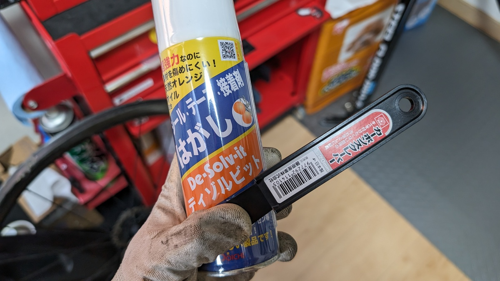
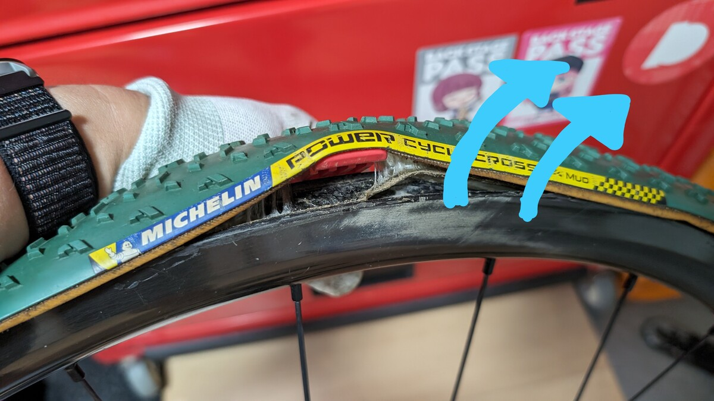
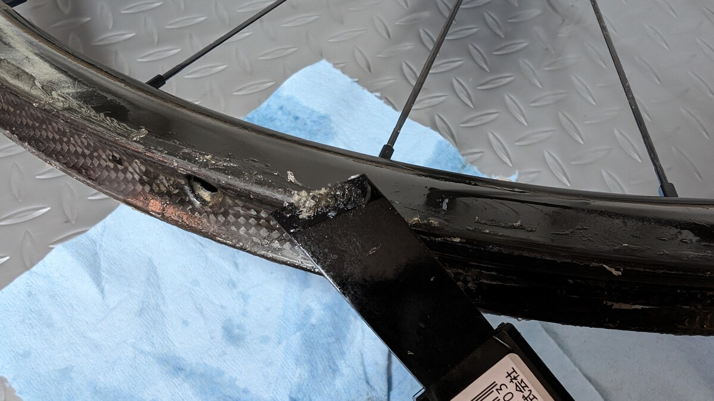
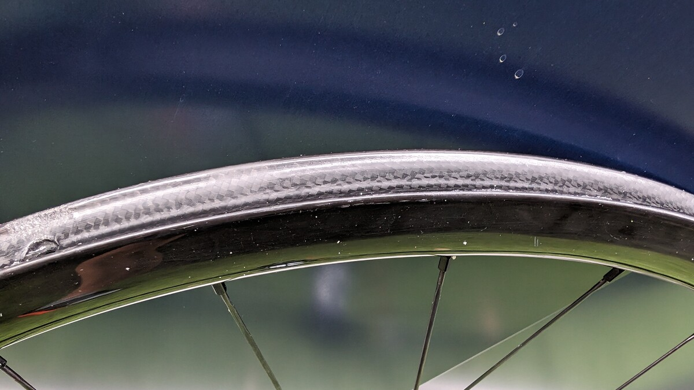
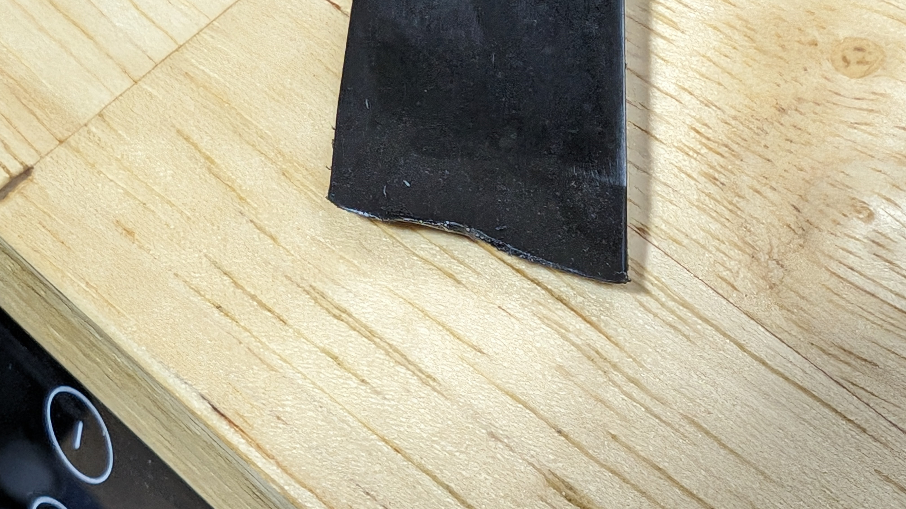

自分がシクロクロスで使うカーボンチューブラーホイールでは、Effeto Mariposaの[Carognaチューブラーテープ](https://amzn.to/3TF9jal)（以下マリポサテープ）でタイヤ接着し、建材のシリコンコーキングでリムとタイヤの隙間を埋めるのが標準作業手順となっている。

<Amzn asin="B0168TBGR2" />

これは、シクロクロスにおいて最上のタイヤシステムであるチューブラータイヤを、可能な限り簡単に取り扱うための手段として、知人の知見をかき集めて導入したものだ。

『**性能の代わりに運用の手間がかかる**』というのが、チューブラータイヤの定説だったが、リムセメントを使わないことで、取り付け・交換の手間を大幅に削減しつつ、作業者のスキルによるばらつきも小さくなる。

チューブレスのような手軽さはないが、**チューブラータイヤの恩恵を受けるための手間を最小限に抑える**という意味で、自分にとっては最適なシステムだ。**レース中にビードが外れる心配をしなくてよい**のも、大きな安心材料。

<LinkCard url="https://blog.gensobunya.net/post/2019/01/tublar_ope/" />

そんな運用しやすいシステムを自負しているが、[マリポサテープ](https://amzn.to/3TF9jal)は剥がしやすいが、シリコンコーキングはタイヤの交換のたび、ホイール側にどうしても残ってしまう

特に、装着時に横着してマスキングをサボったこともあって、ホイールサイド部にシリコンが付着してしまっていた。そして、レース中に砂ぼこりがシリコンに付着して、ホイールの見た目はどんどん汚くなる。

来シーズンから心機一転すべてのホイールで新しいタイヤを使う予定なので、これを機に物理的にもクリーンな状態にしておくべく、重い腰を上げてクリーニング作業を行うことにした。

## 用意するもの

- シリコンコーキング除去剤（[ディゾルビット](https://amzn.to/3ZxVHS3)）
- [カーボンスクレーパー](https://amzn.to/3zbU29q)

<Amzn asin="B0036WL87I" />

<Amzn asin="B0053AXAPO" />

シリコンコーキングは、単純にスクレーパーをあてるだけでは中々取れない。カッターナイフの背や刃で削ぐという方法もあるが、よほど丁寧に作業をしない限りはカーボンホイールに傷をつける可能性が高い。

ホイール表面に**傷を付けないためには、表面硬度が低く、削りとるために剛性のある**ものを使いたい…ということで、カーボンスクレーパーを使うことにした。普通の樹脂製スクレーパーだとふにゃふにゃして使いにくそうなので。

ディゾルビットを使って、**シリコンを柔らかくすれば、スクレーパーで削るだけで簡単に取れるのではという算段**。ついでにシールはがしにも使えるので、マリポサテープの残りも取れるかもしれない。

シリコン剥がしの溶剤は他にもいくつかあるが、扱いが易しく入手性も高い中で、シリコンコーキング対応を謳っているものは[ディゾルビット](https://amzn.to/3ZxVHS3)しか見当たらなかった。

[ディゾルビット](https://amzn.to/3ZxVHS3)はオレンジオイルが主成分なので、**人体に優しく、下水に流しても問題ないという安全性**に加え、**換気扇などの家庭の汚れにも転用可能**という意味で非常に助かった。

無刺激・非腐食性ということで、カーボンホイールのレジンにも安心して使えるであろうという期待を込めて、購入した。

### ディゾルビット（オレンジオイル）利用時の注意

上でも触れたとおり、ディゾルビットはオレンジオイルを主成分としている。そしてエアゾールタイプなので、周囲に飛び散る。

オイルが付着しないよう、**ディスクローターはあらかじめ取り外しておく**他、ブリーディング作業と同様に、**可能な限り屋外で作業したい**ところ。

最終的にオイルを中性洗剤などで洗い落とす必要もあるので、屋外で作業すると都合がが良い。

## タイヤを剥がす

まずはタイヤを取り外す必要があるのだが、テープ接着といえどもシクロクロスに対応したマリポサテープは横向きに捩じっても中々剥がれない。

自分はいつも、**IRCのチューブレス対応レバーを差し込んで剥がすきっかけを作っている**。これがないと、指で剥がすのはかなり困難。

一部が剥がれたら、残りは作業用手袋をして**画像のように外周方向へ引っ張ると、拍子抜けするぐらい簡単に剝がれていく**。

## シリコンコーキングを弛めて、剥がす

あとは地道に張り付いたシリコンと糊を除去していく作業。

ディゾルビットをスプレーして、数分放置し、柔らかくなったところをスクレーパーで削っていく。ボロボロと**シリコンカスが剥がれ落ちていくので、下にゴミ回収用のシートを敷いておくと良い**。オイル染みの対策にもなる。

一通りスクレーパーで落としたあとは、最後に作業用手袋やテムレスの**指の腹部分を使って、残りのシリコンをこそぎ取る**と、ほぼ綺麗になった。

オイルが残るとテープの接着が悪くなるので、**最後に中性洗剤で洗い流して乾燥させれば完成**。

## まとめ

すっかり新品…とはいかないまでも、ホイールが**新しいタイヤを貼るにふさわしい見た目と状態**を取り戻した。

接着面に残った古いテープの残りやコーキングカスは、新しいタイヤを貼る際に**接着力を損なう原因になる**ので、なるべく除去するのが良いのだが、**シーズン中の短い作業時間ではそこまで完璧を目指せないので、オフシーズンに時間をかけてやる**のが良い。

スクレーパーの方はホイール2セット分の除去作業をしたら先が完全に削れていた。

**スクレーパー側が削れるということは、ホイール側よりは柔らかい素材だった**ということで、傷をつけずに作業するには適切な硬度だったと思われる。実際に、ホイール側もレース中についたと思しき傷以外は新しいものが見当たらない。

機材を酷使するシクロクロス、オフシーズンに体はともかく、機材はいたわってあげたいものだ。

<Amzn asin="B0036WL87I" />

<Amzn asin="B0053AXAPO" />
