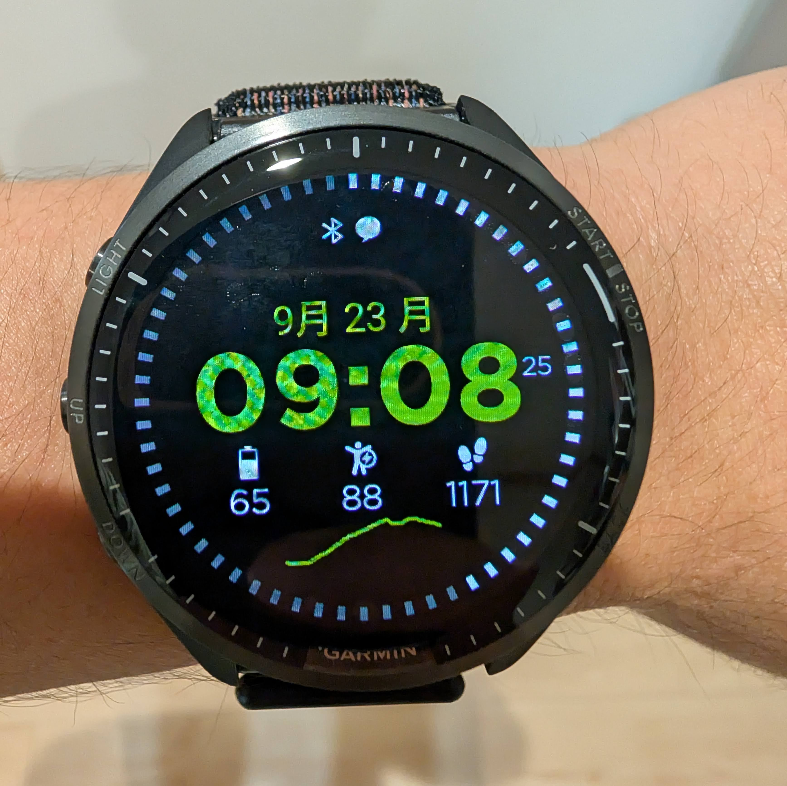

## 何故今965を買ったか

### 975が高くなりそう

2024年には、GARMINのフラッグシップスマートウォッチであるFenixシリーズの新作、Fenix8が発売された。

音声アシスタント機能を搭載し、第5世代光学心拍系を搭載しており、有機EL（AMOLED）とMIP液晶のソーラーモデルに加え、各3サイズが用意されており、機能やラインナップ面で死角がない。

一方で、ベーシックなAMOLEDモデルの定価は178000円と、**大幅に値上がりしている**。Fenix7シリーズは10万円前後で購入できたので、絶対値も割合も凄まじく値上がりしている。円安だけの影響ではなく、ドルベースでの価格も上昇（100～300ドル）していることがポイント。

## Forerunner 965のファーストインプレッション

下馬評通り、AMOLEDディスプレイは明るく見やすい。カラー表示がMIP液晶から格段に見やすくなったことで、表現力が格段に向上している。

## これまで利用していた255シリーズとの違い

### トレーニングレディネス

### 単体での音楽再生

### プロファイルの追加

### サイクリング能力

悪い冗談としか思えない機能。

FTP Watt/kgくらいは考慮してもらえれば良かったのに。

## ハイエンドスマートウォッチはサイクルコンピューターの代替になるか
