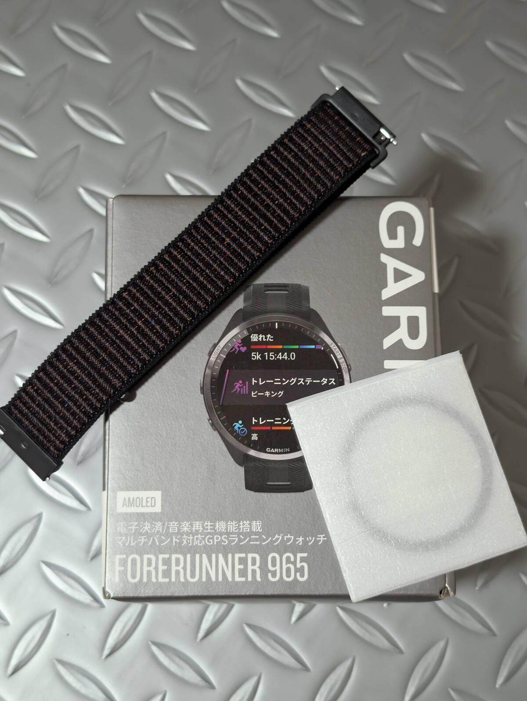

## 何故今965を買ったか

### 975が高くなりそう

2024年には、GARMINのフラッグシップスマートウォッチであるFenixシリーズの新作、[Fenix8](https://amzn.to/3MXMrza)が発売された。

<Amzn asin="B0DDCM1WHJ" />

音声アシスタント機能を搭載し、第5世代光学心拍系を搭載しており、有機EL（AMOLED）とMIP液晶のソーラーモデルに加え、各3サイズが用意されており、機能やラインナップ面で死角がない。

一方で、ベーシックなAMOLEDモデルの定価は178000円と、**大幅に値上がりしている**。Fenix7シリーズは10万円前後で購入できたので、絶対値も割合も凄まじく値上がりしている。円安だけの影響ではなく、ドルベースでの価格も上昇（100～300ドル）していることがポイント。

**[Forerunner965](https://amzn.to/3MZW4xc)の発売は2023/4**で、1年半経ち上位モデルの更新も始まったというところで、次世代である975（仮）の価格が大幅に上昇しそうというところを踏まえ、Amazonセールを狙って購入したという経緯。

<Amzn asin="B0BWF4MQ8X" />

### スマートウォッチの価格を稼働時間で考えると実質無料

「値上がりに耐えられなさそう」と書くだけでかなりの行数を費やしたにも関わらず、矛盾したことを言うが、スマートウォッチは**デジタルガジェットの中では最も投資効果が高い部類**に入る。

なんせ**24時間常に身に着けている、生活における稼働率はほぼ100%であり、時間単位の価格なんてほぼゼロだ**。

ForeAthlete55, Forerunner255Sと乗り換えてきた身だが、次はフラッグシップと決めていた。

機能面・資産面でのメリットもあるが、**GARMINの場合、フラッグシップモデルは数世代にわたり新機能アップデートを享受できる**ことが大きい。

乗り換え前に使っていたForerunner255Sは、この世代で登場したトレーニングレディネスやサイクリング能力といった新機能が反映されず、当時のフラッグシップたるForerunner955でのみ利用できた。これらは、新しい計測値を基にせず、既存の計測値を元にしたインサイト機能だが、**対応機種を買わなければGARMIN CONNECT上で解禁されない**。

新世代で現れる新機能も、前世代のモデルで利用できるのはフラッグシップのみという事例もGARMINでは多い。なるべく長く満足して使えるためにも、スマートウォッチはフラッグシップを選ぶのが良い。

## Forerunner 965のファーストインプレッション

これまでのGARMINウォッチ利用経験から、[フィルム](https://amzn.to/3XG5S4s)と[ナイロンバンド](https://amzn.to/3Bgr9dz)は最初から装着して運用する。

なお、画面が曲面ガラスになっている都合上、ガラスフィルムでは快適に利用できないのでPET複合材のフィルムを利用することとなる。（リンク先はガラスフィルムと表記されているがこれは間違い）

下馬評通り、AMOLEDディスプレイは明るく見やすい。カラー表示がMIP液晶から格段に見やすくなったことで、表現力が格段に向上している。

1年半前に登場した製品について細かくレビューするのは意味がないので、すくみずログの下記記事を参考にしてほしい。

<LinkCard url="https://skmzlog.com/garmin-forerunner-965/" />

追加で言いたい事としては、消灯している箇所に応じて電力消費が変わるはずなのに、AMOLEDの表現力を無駄遣いするためだけのデフォルトウォッチフェイスが多数存在することくらいだろうか。

結局、ConnectIQストアからシンプルな表示のウォッチフェイスをダウンロードして利用している。

## これまで利用していた255シリーズとの違い

### トレーニングレディネス

実態は、**下位モデルでも計測できているデータを総合的に判断してインサイト提供しているだけ**だ。

GARMINデバイスを長年使っていれば、なんとなく頭でわかっていた「今日練習がどれくらいの強度でできるか、もしくは休むべきか」といったことを、数値化して表示してくれる。

事実、これまで頭の中で疲労判定をする際に使っていた**睡眠・HRV・短期負荷**といった項目がメインの要素となっている。意外だったのはリカバリータイムが0でなくとも、トレーニングレディネス的には準備完了と判定される点くらいか。

確かに、**リカバリータイムが残っていてもおすすめワークアウトには軽いメニューが表示**されていたので、残り時間が0になってから練習するものではないと薄々気が付いていた。

いくつかある、計測値を基にGARMINとして提示している各指標がどんな性質なのか、もっと詳しいドキュメントにしてほしいところだ。

### 単体での音楽再生

サブスクサービスの連携ではSpotifyだけでなく、**Youtube Musicとの連携が2024年からスタート**。

CDからリッピングするしかなかった、手元の同人音楽ライブラリもYoutube Music Premium経由で楽しめるようになった。その気になればイヤホンとスマートウォッチだけでランニングや筋トレ中に音楽を楽しめるのは大きい。

### プロファイルの追加

Forerunner255Sでは、自転車系のアクティビティは「バイク」と「屋内バイク」の2種類だったが、**965ではEdgeシリーズと同じようにロード・CX・MTB・グラベルと車種に沿ったプロファイルが用意されている。**

プロファイルそのものは、ページを細かく設定するサイクルコンピューターと違い、スマートウォッチでは運動中の使い勝手にはそれほど影響しない。

プロファイルの真価はStrava連携の時に発揮される。**CXやMTBのアクティビティをロードとしてアップロードすると、Strava上で自転車の種類が正しく表示され、車種ごとの走行距離をギアで管理できる**。

<LinkCard url="https://blog.gensobunya.net/post/2023/06/strava-default-sports/" />

方法は、あらかじめギア（バイク）を「デフォルトスポーツ」で設定するだけだ。これだけで、ログがアップロードされたとき、プロファイルに応じたギア（自転車）がアクティビティに紐付けられる。

### サイクリング能力

悪い冗談としか思えない機能。

FTP Watt/kgくらいは考慮してもらえれば良かったのに。

## ハイエンドスマートウォッチはサイクルコンピューターの代替になるか
