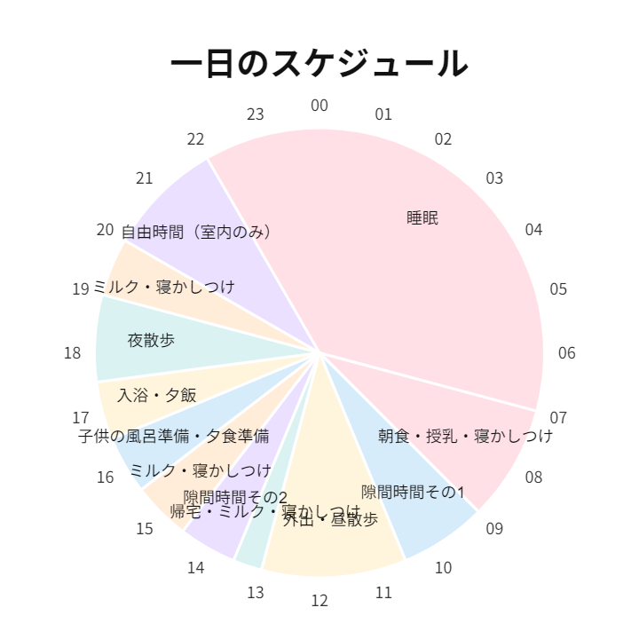

ブログの更新が3か月ほど空いてしまった。

というのも、子供が生まれ、人生の優先度が大きく変化したためだ。自分の時間が激減することはわかっていたが、それでも予想以上に時間が取れない。

それでもシクロクロスシーズンはやってくる。**ME1カテゴリは、シーズン前のトレーニング無しに戦えるほど甘くはない**。普段から乗り込み量の多くない（年間4000km程度）自分にとっては猶更だ。

今年は参加レースも数をかなり絞るつもりだが、それでも**最低限カテゴリ残留したい**。もう1度昇格するのは大変だ。

そこで、完全にシクロクロスレースのみをターゲットにしたトレーニングを子育ての合間を縫って行うことにした。

## トレーニングの方針

- ME1カテゴリのシクロクロスレースに必要なフィジカル・スキル**のみ**フォーカスする
- 基本的に1時間以下、30分前後の隙間時間で即座に実行可能なトレーニングをメインにする
- ～2時間の短時間で実行可能なトレーニングをオプションで設定する

1日のスケジュールは後々書くが、まず新生児～幼児の面倒を交代で見ながら、**計画的にトレーニングスケジュールを組むことは不可能**だ。そのため、偶然に発生する30分前後の隙間時間を使ってトレーニングすることになる。

本来であれば、長距離を乗り込んでベースの体力を作り、その上に積み上げるように高強度・無酸素領域のフィジカルを積み上げるのが理想だが、当然不可能だ。ME1カテゴリのシクロクロスレース……つまり、**1時間程度の高強度有酸素にフォーカス**し、70分を超えるスタミナは完全に捨てた。

当然だが、家を離れないためにローラートレーニングが主となる。

<Amzn asin="B0921JDFDS" />

## トレーニングメニュー

### 1. タバタトレーニング(20s-10s)

短時間で効果的なトレーニングとして有名なタバタ。論文通りの強度であれば、8分（ウォームアップ除く）で無酸素能力と有酸素能力両方を刺激できる。

ウォームアップ・クールダウンとその後のシャワーを含めて**40分以内には育児に復帰できるため、子育てと大変相性がいい**。

時間の都合だけでなく、強度としてもシクロクロスの競技特性に非常に近いため、普段のシーズン前トレーニングとして取り入れていた実績がある。

週末にロングライドを楽しむのであれば、週に1～2回をシーズン前の月に実施していれば効果があった。

しかし今の自分にそんな悠長なロングライドをする機会はない。レースのために、**隙あらばタバタを実施**する。

<Amzn asin="B0BDZ7MZPD" />

### 2. エンデュランス走

子育て初期は不可能だったが、最近は2時間程度の自由時間を得られることも増えてきた。また、体調的にタバタをするのが難しい日もある。

そんな日はL2～L3領域パワーで最大2時間程度のエンデュランス走を行う。トレーニング効果は少ないが、タバタだけではペダリング運動の習慣を失いかねないため、**体にペダリングを覚えさせ、カロリー消費もしておくために休息がてら実施**する。

外出予定次第では、トレーニング時間を取れない日も出てくるので、**フルレストは意図的に取らず、自然発生に任せる**。

眠いときでも、10分でもいいのでとにかく体を動かす。自分は昼寝すると夜の睡眠で質を大きく損なうことも分かってきたので、眠くてもやる。

### 3. ウェイトトレーニング

「俺はスクワット100kgだけど？」という心の奥底にしまっておく自信を維持しつつ、レース中に必要な筋力を維持するために、ウェイトトレーニングを適宜行う。近所に24h営業のジムがあって助かる。

サイクリングに全く関係がないが、胸を追い込んだ後の抱っこは絶対にギブアップできない背水の陣。

<Amzn asin="B00189LO84" />

### 4. シクロクロス練習

適当に8の字を行って機材とタイヤに慣れておく。主に早朝に行う。

## 実際にやってみた

<blockquote class="twitter-tweet">
メンタルがこの生活に慣れてきた <a href="https://t.co/F8kwagE13w">pic.twitter.com/F8kwagE13w</a>
&mdash; ゲン (@gen_sobunya) <a href="https://twitter.com/gen_sobunya/status/1830068728727552162?ref_src=twsrc%5Etfw">September 1, 2024</a></blockquote>

上記の心構えで暮らしていた結果のGARMIN CONNECT運動負荷画面がこちら（紫が無酸素運動＝タバタ）

週2～3回のタバタに落ち着いているが、昨年までに比べて**タバタを始める際の心理的抵抗が低い**ことは意外だった。

これしかやれることがないので、モチベーションもクソもなく、**やるしかない**という気持ちが強いのかもしれない。

## 一日のスケジュール

1日のスケジュールはこんな感じ。子供の生活リズムに合わせて、自分のトレーニングを組み込むが、今の段階だと**午前と午後にタバタをやるチャンスが1回ずつある**程度。

もちろん夫婦でお互いに自由時間を作る日もあるので、そういう日は例外として外で数時間走ることもできる。

### 早朝という隙間時間

子供の生活リズムに合わせて、早寝早起きリズムが作りやすい。

円グラフでいえば、**5時～7時は理論上睡眠も足りているし、自由時間にできる**。

2年ほど前、父親になった友人が、早朝サイクリングで多摩川を走っていたが、今となってはその理由が痛いほどわかる。我が家の場合、寝室に音が届いてしまう場所に自転車を置いているので、ローラートレーニングはできない。おなじくこの時間帯に外を走ることになるだろう。

シクロクロス車もオーバーホールから返ってきたし、タイヤも新調したので、8の字もこの時間に取り入れていく。

## まとめ

やれることをやるしかないメンタルで、子育てとシクロクロスの両立を目指す。

タイムパフォーマンス（タイパ）はあまり好きな言葉ではないが、**タイパのいいトレーニング**に魅力を感じ、自転車がトレーニング効果の数値を稼ぐ手段に見えてくることもある。

あまりタイパに拘りすぎると精神を病む気もするので、レース参戦に理解がある家族に感謝しながら、乗ること自体を楽しむ精神は忘れないようにしたい。
