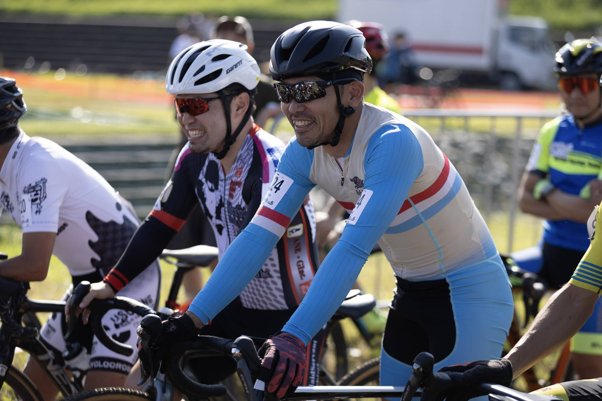

## リザルト

20/28位（-1 lap）

### 機材

- メインバイク
  - GIANT TCX ADVANCED PRO
  - Farsports CX TU + A.Dugast Typhoon 33c (F: 1.75 Bar, R: 1.75 Bar)

※今年から[CYCPLYS AS2 PRO](https://amzn.to/3XXh90k)の空気圧設定を基準に計測しているため、0.1Bar未満は推定

## コース・タイヤセッティング

レイアウトは、ほぼいつも通りの開成コース。河川敷の芝生と斜面を使ったほぼ平坦なコースに、シケインが1カ所に階段が1カ所。

例年より芝の生命力が強く、長く残ったため走りが重い。

その分、タイヤのグリップが良く効くので空気圧を高めにしてもコーナーはスイスイとクリアできた。1.8Barでもグリップに不安はなかったが、試走中はやや跳ねて腰が痛んだために若干空気圧を落として前後推定1.75Barに設定。

**コンクリート斜面の下りがあるので、前も空気圧高め**にしておくのがこのコースの鉄則。

### レースキットの縮小

息子の誕生に伴い、レースカー上に連れてくる場合はベビーカーやその他荷物の積載が必須になったため、いくつかの装備を積み込み対象外にせざるを得なくなった。

積み込みで地味に邪魔となるフロアポンプは[CYCPLYS AS2 PRO](https://amzn.to/3XXh90k)に変更。エアボリュームも少なく空気圧も低い**CXなら目標空気圧まで10秒もあれば設定できる**ので、CXにはぴったりの携帯電動ポンプだ。これまでの[マキタポンプ](https://amzn.to/3BTTrKT)は車用兼自宅用として引き続き活用。

<Amzn asin="B0CNPDJQYT" />

愛用していた[アイリスオーヤマのハンディウォッシャー](https://amzn.to/4f2pwhV)と水タンクのセットは体積を取るので、真っ先にリストラ。代わりのコンパクトな洗浄機は当面持たずに、AZの水置換オイルを持ち込んで臨時注油で対応する方針に。

<LinkCard url="https://blog.gensobunya.net/post/2021/11/highpressure_cleaner/" />

積載に余裕があるなら、洗浄機は会場に是非とも持ち込みたいモノの1つ。

泥レースでは試走後にいったんバイクを綺麗にできるし、自転車も車内積みの人にとっては車の中を綺麗に保つためのマストアイテム。

コンパクトなバッテリー式洗浄機は新興メーカーでいくつか見かけており、多少値段が張っても代替品を手に入れたいところ。とはいえ、高圧洗浄に必要なバッテリーの容量出力は共に大きく、安易に新興メーカーを選択するのは怖いので踏み出せずにいる。

### 厳しい残暑

関東は既にCXシーズンインして1か月ほど経っている。9月のレースは酷暑の中実施されており、自宅から「大変だなぁ」と他人事に思っていたが、まさか10月半ばに当事者となってしまうとは。

この日の**最高気温は26度**、あまりの暑さに**特別規則として「ピットで停止しての水分補給可」が追加**された。外で走る機会が早朝メインの自分にとって、暑熱適応はとっくに無くなっている。

ピットに飲み物の準備は当然として、バイクにも補給ジェルをセット。

<blockquote class="twitter-tweet">
補給手段を検討した結果 <a href="https://t.co/xdzclTYbpj">pic.twitter.com/xdzclTYbpj</a>
&mdash; ゲン (@gen_sobunya) <a href="https://twitter.com/gen_sobunya/status/1844922446463262968?ref_src=twsrc%5Etfw">October 12, 2024</a></blockquote>

計画としては、序盤の動きが落ち着いた時点でジェルを食べて回復。さらに、終盤にどうしようもなくなりそうだったらピットインして順位を落としてでも飲み物を飲むことにした。

ビニールテープ固定の補給ジェルはグラベル世界選手権のCO2ボンベ固定手段をリスペクト。念のため試走で固定が外れないかチェックしたうえで本番投入した。

ポケットのあるスキンスーツなら問題なく持ち込めたのだが、ビオレーサーのスーツはポケットがないので断念。ごみは背中側のスーツ内に入れておけば投棄せずに済む。後から気が付いたがそもそもこの暑さなら半袖チームジャージを着ればよかった。ポケットあるし…

それに加えて、試走からレースの間に時間を空けて[Mag-onのジェル](https://amzn.to/4074eLV)を2個摂取。脚攣り防止も万全の体制。

<Amzn asin="B07BV5Q8Q7" />

## レース

1か月分のポイントが無く、ほぼ最後尾からスタートなので、お気楽モード。関西ライダーの田口さんと談笑しながら待機。

今年は残留が大きな目的なのだが、育児で長時間…というか1時間以上の高強度をかけるトレーニングができていない。

<LinkCard url="https://blog.gensobunya.net/post/2024/09/patanity-cyclist-time-performance/" />

タバタで高強度自体は体に覚えこませているが、1時間となると全くの未知エリア。タバタトレーニングは、**適切に行えば無酸素能力と有酸素能力の両方を伸ばせるとされている**が、どの程度の有酸素能力を想定しているかイマイチ把握しないままやっているフシがあるので、ここでついに**1時間のトレーニングをせずに1時間レースできるのか**という命題に答えが出る。

スタートはボチボチと思ったら、スタートポジションを維持したままだった。

最初の2周はいい具合にペースアップでき、15位ほどで安定。ステムに貼り付けていたアミノバイタルを補給しつつ、強風を耐えるためのパック形成に入った。ところが、後ろの人にローテしてもらえず思わず心の中で涙（後に千切れていたので責める気はないです）

ローテの計画が崩れたことで「いっそのこと牽き倒して、どこまで走れるか試してみよう」という気持ちになり、**先頭を譲らず走り続けてみた**。

想定通りというか意外にもと言うべきか、得意のキャンバー区間やテクニカル区間で稼いだマージンを、わずかなタイム差として最大限活用できるので、かなりの時間パックの先頭で耐えることができた。

結果的に漢気で5周ほど1人牽引！あとから聞くと数人振り落とせていたようで、中々強く走ることができたようでニンマリ。

先頭の宇賀選手はとんでもなく速いので、残り2周の時点でラップされる。

この頃には、自分の脚も限界に近づき、口の中もネバつきというか**唾液がほぼ出なくなってクリーム状の何か**になっていたので、特別規則を使ってピット停止・補給。牽き続けたパックからは当然脱落。その後は力の入らなくなった脚で完走して20/28位でフィニッシュとなった。

タバタをやり込んだおかげか、パック脱落時もまだ心肺には余裕があり、田口さんと話せるほどだったが、脚には力が入らずという状況。残り2周と少しなので、おおよそ45分くらいの時点だろうか。**レース時間に近いインターバルやハイパワー練習をやっていないという弱みは、あと15分の持久力として露呈した**形だ。

不足がわかっても、練習時間には限りがある身なので、今シーズンできることをやっていく。とりあえずAJOCCポイント20pts奪取。

40分ならむしろJCXのほうが切られるまでの時間にメリットがありそうだが、年々厚くなる選手層でポイント圏内の60位というのはなかなかの難易度になっている。ローカルレースに気合を入れる方が残留には効くが、近場のローカルレースがそんなにないという現実と戦わねばならなくなりそうだ。

## Photo

Photo by [@hiroyo_oo](https://twitter.com/hiroyo_oo)
