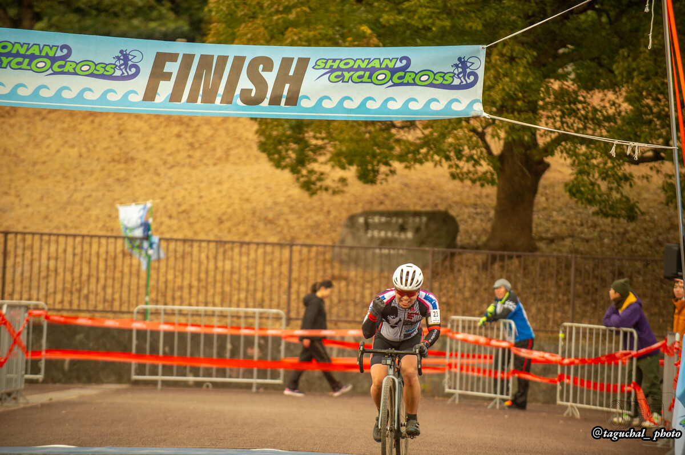

## リザルト

18/23位 (+8:05)

### 機材

- メインバイク
  - GIANT TCX ADVANCED PRO
  - Farsports CX TU + A.Dugast Typhoon 33c (F: 1.60 Bar, R: 1.60 Bar)

※今年から[CYCPLYS AS2 PRO](https://amzn.to/3XXh90k)の空気圧設定を基準に計測しているため、0.1Bar未満は推定

## コース・タイヤセッティング

長い階段と、急斜面の降車登山、そしてカラっとドライの土グラウンドのスラローム。

タイムを稼げるのは階段と登山の降車エリアに加えて、グラウンドのセクション。舗装路の登りと平坦もあるが、滞在時間と平均速度を考えると、グラウンドのセクションが乗車中…つまりタイヤセッティングで最もラップタイムに差が出る。

固い土の路面は、グラベル路面と似ていて、ノブが噛まないのでパターンによるグリップ差はあまり出ず、タイヤ幅と空気圧を落とすのが主な対策。

当然、シクロクロスではタイヤ幅を広げられないので、タイヤ空気圧を落とすことになる。砂レースだったCX千葉とほぼ変わらない空気圧で挑んだ。下りの安心感も得られるので、大きなトラブルを呼びにくいという副次的メリットもある。

## レース展開

<iframe width="560" height="315" src="https://www.youtube.com/embed/0LBBNWLRRKM?si=ed2dOgVPFWPuyWot" title="YouTube video player" frameborder="0" allow="accelerometer; autoplay; clipboard-write; encrypted-media; gyroscope; picture-in-picture; web-share" referrerpolicy="strict-origin-when-cross-origin" allowfullscreen></iframe>

名前の割に人気の少ない湘南シクロクロス。ME1は通例20名～30名の間だが、今回も例にもれず26人のエントリーで23人出走。AJOCCポイント的には大変おいしいレースだ。

昨年、階段後の乗車登りで最高地点に戻るポイントで見事に脚を攣って1分ほどストップしてしまった反省から、1時間走りきるべく階段ではランに切り替えず大股歩きで1段飛ばしを厳守。

代わりに登山の入り口では落とした空気圧を存分に使い、なるべく長く乗車してタイムを稼ぐ。そのままシングルトラックとグラウンドでタイヤセッティングの利を活かして行く作戦。

動画を見てもらえると分かるが、序盤はそこそこ機能したこの作戦、徐々に地脚の無さでペースが落ちていく。リズムは崩れなかったものの、結局はドベ争い。しかし、今日はドベでも20pt近く稼げるので、フルラップを目標に淡々と走る。

最終ラップ前で、タイム差を確認してフルラップを確信、思わずガッツポーズしてしまった。リザルトは振るわないが、育休後はじめてME1でのフルラップ。

ラストはコースクリアを遅らせないよう、トラブルなく終わることを意識。DNFが3名いたので、ブービーでも着順は18位。まだまだ降格ラインより下だがランキングはアップ。

残りはお台場と取手の2レース。正直、残留はかなり厳しいが、得意の砂浜かつJCXポイントテーブルのお台場を勝負の場と定めて、トレーニングしていく。

## Photo

Photo by [たぐちゃるフォト](https://x.com/Taguchal_photo)
